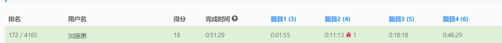

> 原文链接: https://leetcode-cn.com/problems/find-all-people-with-secret


## 英文原文
<div><p>You are given an integer <code>n</code> indicating there are <code>n</code> people numbered from <code>0</code> to <code>n - 1</code>. You are also given a <strong>0-indexed</strong> 2D integer array <code>meetings</code> where <code>meetings[i] = [x<sub>i</sub>, y<sub>i</sub>, time<sub>i</sub>]</code> indicates that person <code>x<sub>i</sub></code> and person <code>y<sub>i</sub></code> have a meeting at <code>time<sub>i</sub></code>. A person may attend <strong>multiple meetings</strong> at the same time. Finally, you are given an integer <code>firstPerson</code>.</p>

<p>Person <code>0</code> has a <strong>secret</strong> and initially shares the secret with a person <code>firstPerson</code> at time <code>0</code>. This secret is then shared every time a meeting takes place with a person that has the secret. More formally, for every meeting, if a person <code>x<sub>i</sub></code> has the secret at <code>time<sub>i</sub></code>, then they will share the secret with person <code>y<sub>i</sub></code>, and vice versa.</p>

<p>The secrets are shared <strong>instantaneously</strong>. That is, a person may receive the secret and share it with people in other meetings within the same time frame.</p>

<p>Return <em>a list of all the people that have the secret after all the meetings have taken place. </em>You may return the answer in <strong>any order</strong>.</p>

<p>&nbsp;</p>
<p><strong>Example 1:</strong></p>

<pre>
<strong>Input:</strong> n = 6, meetings = [[1,2,5],[2,3,8],[1,5,10]], firstPerson = 1
<strong>Output:</strong> [0,1,2,3,5]
<strong>Explanation:
</strong>At time 0, person 0 shares the secret with person 1.
At time 5, person 1 shares the secret with person 2.
At time 8, person 2 shares the secret with person 3.
At time 10, person 1 shares the secret with person 5.​​​​
Thus, people 0, 1, 2, 3, and 5 know the secret after all the meetings.
</pre>

<p><strong>Example 2:</strong></p>

<pre>
<strong>Input:</strong> n = 4, meetings = [[3,1,3],[1,2,2],[0,3,3]], firstPerson = 3
<strong>Output:</strong> [0,1,3]
<strong>Explanation:</strong>
At time 0, person 0 shares the secret with person 3.
At time 2, neither person 1 nor person 2 know the secret.
At time 3, person 3 shares the secret with person 0 and person 1.
Thus, people 0, 1, and 3 know the secret after all the meetings.
</pre>

<p><strong>Example 3:</strong></p>

<pre>
<strong>Input:</strong> n = 5, meetings = [[3,4,2],[1,2,1],[2,3,1]], firstPerson = 1
<strong>Output:</strong> [0,1,2,3,4]
<strong>Explanation:</strong>
At time 0, person 0 shares the secret with person 1.
At time 1, person 1 shares the secret with person 2, and person 2 shares the secret with person 3.
Note that person 2 can share the secret at the same time as receiving it.
At time 2, person 3 shares the secret with person 4.
Thus, people 0, 1, 2, 3, and 4 know the secret after all the meetings.
</pre>

<p><strong>Example 4:</strong></p>

<pre>
<strong>Input:</strong> n = 6, meetings = [[0,2,1],[1,3,1],[4,5,1]], firstPerson = 1
<strong>Output:</strong> [0,1,2,3]
<strong>Explanation:</strong>
At time 0, person 0 shares the secret with person 1.
At time 1, person 0 shares the secret with person 2, and person 1 shares the secret with person 3.
Thus, people 0, 1, 2, and 3 know the secret after all the meetings.
</pre>

<p>&nbsp;</p>
<p><strong>Constraints:</strong></p>

<ul>
	<li><code>2 &lt;= n &lt;= 10<sup>5</sup></code></li>
	<li><code>1 &lt;= meetings.length &lt;= 10<sup>5</sup></code></li>
	<li><code>meetings[i].length == 3</code></li>
	<li><code>0 &lt;= x<sub>i</sub>, y<sub>i </sub>&lt;= n - 1</code></li>
	<li><code>x<sub>i</sub> != y<sub>i</sub></code></li>
	<li><code>1 &lt;= time<sub>i</sub> &lt;= 10<sup>5</sup></code></li>
	<li><code>1 &lt;= firstPerson &lt;= n - 1</code></li>
</ul>
</div>

## 中文题目
<div><p>给你一个整数 <code>n</code> ，表示有 <code>n</code> 个专家从 <code>0</code> 到 <code>n - 1</code> 编号。另外给你一个下标从 0 开始的二维整数数组 <code>meetings</code> ，其中 <code>meetings[i] = [x<sub>i</sub>, y<sub>i</sub>, time<sub>i</sub>]</code> 表示专家 <code>x<sub>i</sub></code> 和专家 <code>y<sub>i</sub></code> 在时间 <code>time<sub>i</sub></code> 要开一场会。一个专家可以同时参加 <strong>多场会议</strong> 。最后，给你一个整数 <code>firstPerson</code> 。</p>

<p>专家 <code>0</code> 有一个 <strong>秘密</strong> ，最初，他在时间&nbsp;<code>0</code> 将这个秘密分享给了专家 <code>firstPerson</code> 。接着，这个秘密会在每次有知晓这个秘密的专家参加会议时进行传播。更正式的表达是，每次会议，如果专家 <code>x<sub>i</sub></code> 在时间 <code>time<sub>i</sub></code> 时知晓这个秘密，那么他将会与专家 <code>y<sub>i</sub></code> 分享这个秘密，反之亦然。</p>

<p>秘密共享是 <strong>瞬时发生</strong> 的。也就是说，在同一时间，一个专家不光可以接收到秘密，还能在其他会议上与其他专家分享。</p>

<p>在所有会议都结束之后，返回所有知晓这个秘密的专家列表。你可以按 <strong>任何顺序</strong> 返回答案。</p>

<p>&nbsp;</p>

<p><strong>示例 1：</strong></p>

<pre>
<strong>输入：</strong>n = 6, meetings = [[1,2,5],[2,3,8],[1,5,10]], firstPerson = 1
<strong>输出：</strong>[0,1,2,3,5]
<strong>解释：
</strong>时间 0 ，专家 0 将秘密与专家 1 共享。
时间 5 ，专家 1 将秘密与专家 2 共享。
时间 8 ，专家 2 将秘密与专家 3 共享。
时间 10 ，专家 1 将秘密与专家 5 共享。
因此，在所有会议结束后，专家 0、1、2、3 和 5 都将知晓这个秘密。
</pre>

<p><strong>示例 2：</strong></p>

<pre>
<strong>输入：</strong>n = 4, meetings = [[3,1,3],[1,2,2],[0,3,3]], firstPerson = 3
<strong>输出：</strong>[0,1,3]
<strong>解释：</strong>
时间 0 ，专家 0 将秘密与专家 3 共享。
时间 2 ，专家 1 与专家 2 都不知晓这个秘密。
时间 3 ，专家 3 将秘密与专家 0 和专家 1 共享。
因此，在所有会议结束后，专家 0、1 和 3 都将知晓这个秘密。
</pre>

<p><strong>示例 3：</strong></p>

<pre>
<strong>输入：</strong>n = 5, meetings = [[3,4,2],[1,2,1],[2,3,1]], firstPerson = 1
<strong>输出：</strong>[0,1,2,3,4]
<strong>解释：</strong>
时间 0 ，专家 0 将秘密与专家 1 共享。
时间 1 ，专家 1 将秘密与专家 2 共享，专家 2 将秘密与专家 3 共享。
注意，专家 2 可以在收到秘密的同一时间分享此秘密。
时间 2 ，专家 3 将秘密与专家 4 共享。
因此，在所有会议结束后，专家 0、1、2、3 和 4 都将知晓这个秘密。</pre>

<p><strong>示例 4：</strong></p>

<pre>
<strong>输入：</strong>n = 6, meetings = [[0,2,1],[1,3,1],[4,5,1]], firstPerson = 1
<strong>输出：</strong>[0,1,2,3]
<strong>解释：</strong>
时间 0 ，专家 0 将秘密与专家 1 共享。
时间 1 ，专家 0 将秘密与专家 2 共享，专家 1 将秘密与专家 3 共享。
因此，在所有会议结束后，专家 0、1、2 和 3 都将知晓这个秘密。
</pre>

<p>&nbsp;</p>

<p><strong>提示：</strong></p>

<ul>
	<li><code>2 &lt;= n &lt;= 10<sup>5</sup></code></li>
	<li><code>1 &lt;= meetings.length &lt;= 10<sup>5</sup></code></li>
	<li><code>meetings[i].length == 3</code></li>
	<li><code>0 &lt;= x<sub>i</sub>, y<sub>i </sub>&lt;= n - 1</code></li>
	<li><code>x<sub>i</sub> != y<sub>i</sub></code></li>
	<li><code>1 &lt;= time<sub>i</sub> &lt;= 10<sup>5</sup></code></li>
	<li><code>1 &lt;= firstPerson &lt;= n - 1</code></li>
</ul>
</div>

## 通过代码
<RecoDemo>
</RecoDemo>


## 高赞题解
### 解题思路
只要一看到`0`到`n-1`，连通性等关键字，直接识别为**并查集模板题**。
如果你不熟悉并查集，也没关系，因为你只要会用就行，本质上用起来就三步
1. `初始化`，时间复杂度$O(n)$，对应模板中的构造函数`UnionFind`
2. `连接两个点`，均摊时间复杂度$O(logn)$，对应模板中的`unite`
3. `判断两个点是否相连`，均摊时间复杂度$O(logn)$，对应模板中的`connected`
本题特殊一点，需要额外用到一步
4. `孤立一个点`，时间复杂度$O(1)$，对应模板中的`isolate`

本题关键在于，**相同时间开会**的情形如何处理，解决方法就是**两两连接同一时间开会的专家，会开完之后，孤立所有没知道秘密的专家**
并查集板子大体上用的零神的，稍微改了点，引入isolate操作之后统计量`size`和`setCount`可能有点小瑕疵

### 代码

```cpp
// 并查集模板
class UnionFind {
public:
    vector<int> parent;
    vector<int> size;
    int n;
    // 当前连通分量数目
    int setCount;

public:
    UnionFind(int _n): n(_n), setCount(_n), parent(_n), size(_n, 1) {
        iota(parent.begin(), parent.end(), 0);
    }

    int findset(int x) {
        return parent[x] == x ? x : parent[x] = findset(parent[x]);
    }

    bool unite(int x, int y) {
        x = findset(x);
        y = findset(y);
        if (x == y) {
            return false;
        }
        if (size[x] < size[y]) {
            swap(x, y);
        }
        parent[y] = x;
        size[x] += size[y];
        --setCount;
        return true;
    }

    bool connected(int x, int y) {
        x = findset(x);
        y = findset(y);
        return x == y;
    }
    void isolate(int x) {
        if(x != parent[x]){
            parent[x] = x;
            size[x] = 1;
            ++setCount;
        }
    }
};

bool cmp(const vector<int>& a, const vector<int>& b){
    return a[2]<b[2];
}

class Solution {
public:
    vector<int> findAllPeople(int n, vector<vector<int>>& ms, int fp) {
        sort(ms.begin(), ms.end(), cmp);
        int m = ms.size();
        UnionFind uf(n);
        uf.unite(fp, 0);
        for(int i=0;i<m;i++){
            int j = i+1;
            while(j < m)
                if(ms[i][2] != ms[j][2]){
                    break;
                }
            }
            for(int k=i;k<j;k++){
                uf.unite(ms[k][0], ms[k][1]);
            }
            for(int k=i;k<j;k++){
                if(!uf.connected(ms[k][0], 0)){
                    uf.isolate(ms[k][0]);
                    uf.isolate(ms[k][1]);
                }
            }
            i=j-1;
        }
        vector<int>ans;
        for(int i=0;i<n;i++){
            if(uf.connected(i, 0)){
                ans.push_back(i);
            }
        }
        return ans;
    }
};
```
- 前两百美滋滋



## 统计信息
| 通过次数 | 提交次数 | AC比率 |
| :------: | :------: | :------: |
|    3260    |    13022    |   25.0%   |

## 提交历史
| 提交时间 | 提交结果 | 执行时间 |  内存消耗  | 语言 |
| :------: | :------: | :------: | :--------: | :--------: |
