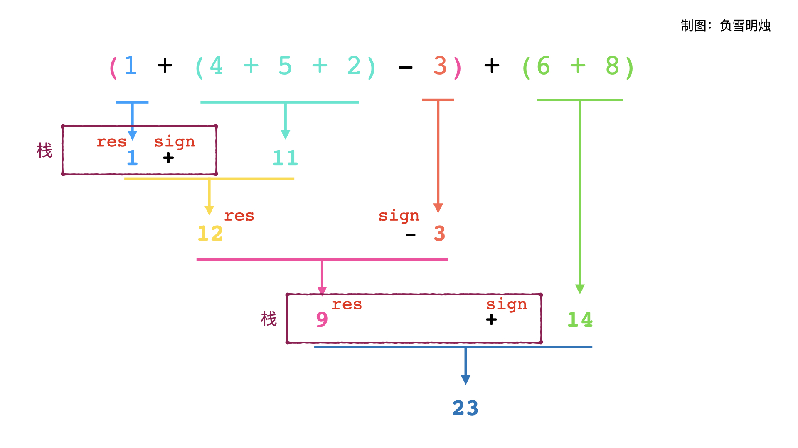

> 原文链接: https://leetcode-cn.com/problems/basic-calculator


## 英文原文
<div><p>Given a string <code>s</code> representing a valid expression, implement a basic calculator to evaluate it, and return <em>the result of the evaluation</em>.</p>

<p><strong>Note:</strong> You are <strong>not</strong> allowed to use any built-in function which evaluates strings as mathematical expressions, such as <code>eval()</code>.</p>

<p>&nbsp;</p>
<p><strong>Example 1:</strong></p>

<pre>
<strong>Input:</strong> s = &quot;1 + 1&quot;
<strong>Output:</strong> 2
</pre>

<p><strong>Example 2:</strong></p>

<pre>
<strong>Input:</strong> s = &quot; 2-1 + 2 &quot;
<strong>Output:</strong> 3
</pre>

<p><strong>Example 3:</strong></p>

<pre>
<strong>Input:</strong> s = &quot;(1+(4+5+2)-3)+(6+8)&quot;
<strong>Output:</strong> 23
</pre>

<p>&nbsp;</p>
<p><strong>Constraints:</strong></p>

<ul>
	<li><code>1 &lt;= s.length &lt;= 3 * 10<sup>5</sup></code></li>
	<li><code>s</code> consists of digits, <code>&#39;+&#39;</code>, <code>&#39;-&#39;</code>, <code>&#39;(&#39;</code>, <code>&#39;)&#39;</code>, and <code>&#39; &#39;</code>.</li>
	<li><code>s</code> represents a valid expression.</li>
	<li><code>&#39;+&#39;</code> is <strong>not</strong> used as a unary operation (i.e., <code>&quot;+1&quot;</code> and <code>&quot;+(2 + 3)&quot;</code> is invalid).</li>
	<li><code>&#39;-&#39;</code> could be used as a unary operation (i.e., <code>&quot;-1&quot;</code> and <code>&quot;-(2 + 3)&quot;</code> is valid).</li>
	<li>There will be no two consecutive operators in the input.</li>
	<li>Every number and running calculation will fit in a signed 32-bit integer.</li>
</ul>
</div>

## 中文题目
<div><p>给你一个字符串表达式 <code>s</code> ，请你实现一个基本计算器来计算并返回它的值。</p>

<p> </p>

<p><strong>示例 1：</strong></p>

<pre>
<strong>输入：</strong>s = "1 + 1"
<strong>输出：</strong>2
</pre>

<p><strong>示例 2：</strong></p>

<pre>
<strong>输入：</strong>s = " 2-1 + 2 "
<strong>输出：</strong>3
</pre>

<p><strong>示例 3：</strong></p>

<pre>
<strong>输入：</strong>s = "(1+(4+5+2)-3)+(6+8)"
<strong>输出：</strong>23
</pre>

<p> </p>

<p><strong>提示：</strong></p>

<ul>
	<li><code>1 <= s.length <= 3 * 10<sup>5</sup></code></li>
	<li><code>s</code> 由数字、<code>'+'</code>、<code>'-'</code>、<code>'('</code>、<code>')'</code>、和 <code>' '</code> 组成</li>
	<li><code>s</code> 表示一个有效的表达式</li>
</ul>
</div>

## 通过代码
<RecoDemo>
</RecoDemo>


## 高赞题解
各位题友大家好！ 今天是 **[@负雪明烛](/u/fuxuemingzhu/)** 坚持日更的第 **45** 天。今天力扣上的每日一题是「[224. 基本计算器](https://leetcode-cn.com/problems/basic-calculator/)」。

# 解题思路


重点：

- 本题目只有 `"+"`, `"-"` 运算，没有 `"*"` , `"/"` 运算，因此少了不同运算符优先级的比较；
- 遇到小括号，应该**先算括号里面的表达式**；


# 递归


一个表达式分为三部分：


$$左边表达式①，运算符③， 右边表达式②$$


本题中，左边和右边的表达式可以是一个数字，也可以是一个括号包起来的表达式；运算符可以是加减。


小学数学告诉我们，一个只包含加减和括号的表达式，我们可以从左到右计算，遇到括号就先算括号里面的。具体来说就是先计算左边的表达式，再计算右边表达式，最后根据运算符，计算 `①和②的运算` 。


用题目示例 `"(1+(4+5+2)-3)+(6+8)"` 来说明运算符计算的顺序：


根据上面的分析可知，当我们在计算一个表达式的时候，需要先计算左边表达式①，然后需要把①的结果和运算符③**保存**起来，再需要计算右边表达式②，最后计算①和②的运算。这个操作就是**递归！！**


## 栈


递归的程序可以用「栈」来模拟：栈为了保存左边表达式①的计算结果和运算符③，在计算右边表达式③的结果之后，从栈中取出运算符③和①的结果，再进行计算整个表达式的结果。


肯定有朋友想问了，用栈保存左边表达式结果的话，当遇到嵌套的括号怎么办？比如 `(1 + (2 + (3 + 4)))`。答案是：栈顶保留的是最里层嵌套的运算，弹出栈的时候，正好先算的是最里面括号的，再算外边括号的。这种情况时，栈里面保存的是 ["1", "+", "2", "+", "3", "+"]，然后遇到 4，此时计算的是 3 + 4，然后算 7 + 2，再算 9 + 1。可以通过**递归**来帮助理解。


# 代码


代码里面:

- res 表示左边表达式除去栈内保存元素的计算结果；
- sign 表示运算符；
- num 表示当前遇到的数字，会更新到 res 中；
- 用栈保存遇到左括号时前面计算好了的结果和运算符。


操作的步骤是：


- 如果当前是数字，那么更新计算当前数字；
- 如果当前是操作符+或者-，那么需要更新计算当前计算的结果 res，并把当前数字 num 设为 0，sign 设为正负，重新开始；
- 如果当前是 `(` ，那么说明遇到了右边的表达式，而后面的小括号里的内容需要优先计算，所以要把 res，sign 进栈，更新 res 和 sign 为新的开始；
- 如果当前是 `)` ，那么说明右边的表达式结束，即当前括号里的内容已经计算完毕，所以要把之前的结果出栈，然后计算整个式子的结果；
- 最后，当所有数字结束的时候，需要把最后的一个 num 也更新到 res 中。




```Python []
class Solution(object):
    def calculate(self, s):
        res, num, sign = 0, 0, 1
        stack = []
        for c in s:
            if c.isdigit():
                num = 10 * num + int(c)
            elif c == "+" or c == "-":
                res += sign * num
                num = 0
                sign = 1 if c == "+" else -1
            elif c == "(":
                stack.append(res)
                stack.append(sign)
                res = 0
                sign = 1
            elif c == ")":
                res += sign * num
                num = 0
                res *= stack.pop()
                res += stack.pop()
        res += sign * num
        return res
```


- 时间复杂度：$O(N)$
- 空间复杂度：$O(N)$


# 刷题心得


今天的题目其实不难，主要是思路要理清楚。


参考资料：

1. [GrandYang](https://www.cnblogs.com/grandyang/p/4570699.html)
1. [负雪明烛](https://blog.csdn.net/fuxuemingzhu/article/details/84133441)

-----


OK，以上就是 [@负雪明烛](https://leetcode-cn.com/u/fuxuemingzhu/) 写的今天题解的全部内容了，如果你觉得有帮助的话，**求赞、求关注、求收藏**。如果有疑问的话，请在下面评论，我会及时解答。


**关注我**，你将不会错过我的精彩动画题解、面试题分享、组队刷题活动，进入主页 [@负雪明烛](https://leetcode-cn.com/u/fuxuemingzhu/) 右侧有刷题组织，从此刷题不再孤单。


祝大家牛年大吉！AC 多多，Offer 多多！我们明天再见！

## 统计信息
| 通过次数 | 提交次数 | AC比率 |
| :------: | :------: | :------: |
|    75118    |    179920    |   41.8%   |

## 提交历史
| 提交时间 | 提交结果 | 执行时间 |  内存消耗  | 语言 |
| :------: | :------: | :------: | :--------: | :--------: |


## 相似题目
|                             题目                             | 难度 |
| :----------------------------------------------------------: | :---------: |
| [逆波兰表达式求值](https://leetcode-cn.com/problems/evaluate-reverse-polish-notation/) | 中等|
| [基本计算器 II](https://leetcode-cn.com/problems/basic-calculator-ii/) | 中等|
| [为运算表达式设计优先级](https://leetcode-cn.com/problems/different-ways-to-add-parentheses/) | 中等|
| [给表达式添加运算符](https://leetcode-cn.com/problems/expression-add-operators/) | 困难|
| [基本计算器 III](https://leetcode-cn.com/problems/basic-calculator-iii/) | 困难|
