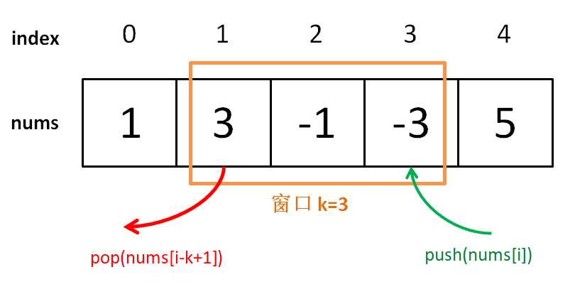

> 原文链接: https://leetcode-cn.com/problems/sliding-window-maximum


## 英文原文
<div><p>You are given an array of integers&nbsp;<code>nums</code>, there is a sliding window of size <code>k</code> which is moving from the very left of the array to the very right. You can only see the <code>k</code> numbers in the window. Each time the sliding window moves right by one position.</p>

<p>Return <em>the max sliding window</em>.</p>

<p>&nbsp;</p>
<p><strong>Example 1:</strong></p>

<pre>
<strong>Input:</strong> nums = [1,3,-1,-3,5,3,6,7], k = 3
<strong>Output:</strong> [3,3,5,5,6,7]
<strong>Explanation:</strong> 
Window position                Max
---------------               -----
[1  3  -1] -3  5  3  6  7       <strong>3</strong>
 1 [3  -1  -3] 5  3  6  7       <strong>3</strong>
 1  3 [-1  -3  5] 3  6  7      <strong> 5</strong>
 1  3  -1 [-3  5  3] 6  7       <strong>5</strong>
 1  3  -1  -3 [5  3  6] 7       <strong>6</strong>
 1  3  -1  -3  5 [3  6  7]      <strong>7</strong>
</pre>

<p><strong>Example 2:</strong></p>

<pre>
<strong>Input:</strong> nums = [1], k = 1
<strong>Output:</strong> [1]
</pre>

<p><strong>Example 3:</strong></p>

<pre>
<strong>Input:</strong> nums = [1,-1], k = 1
<strong>Output:</strong> [1,-1]
</pre>

<p><strong>Example 4:</strong></p>

<pre>
<strong>Input:</strong> nums = [9,11], k = 2
<strong>Output:</strong> [11]
</pre>

<p><strong>Example 5:</strong></p>

<pre>
<strong>Input:</strong> nums = [4,-2], k = 2
<strong>Output:</strong> [4]
</pre>

<p>&nbsp;</p>
<p><strong>Constraints:</strong></p>

<ul>
	<li><code>1 &lt;= nums.length &lt;= 10<sup>5</sup></code></li>
	<li><code>-10<sup>4</sup> &lt;= nums[i] &lt;= 10<sup>4</sup></code></li>
	<li><code>1 &lt;= k &lt;= nums.length</code></li>
</ul>
</div>

## 中文题目
<div><p>给你一个整数数组 <code>nums</code>，有一个大小为 <code>k</code><em> </em>的滑动窗口从数组的最左侧移动到数组的最右侧。你只可以看到在滑动窗口内的 <code>k</code> 个数字。滑动窗口每次只向右移动一位。</p>

<p>返回滑动窗口中的最大值。</p>

<p> </p>

<p><strong>示例 1：</strong></p>

<pre>
<b>输入：</b>nums = [1,3,-1,-3,5,3,6,7], k = 3
<b>输出：</b>[3,3,5,5,6,7]
<b>解释：</b>
滑动窗口的位置                最大值
---------------               -----
[1  3  -1] -3  5  3  6  7       <strong>3</strong>
 1 [3  -1  -3] 5  3  6  7       <strong>3</strong>
 1  3 [-1  -3  5] 3  6  7      <strong> 5</strong>
 1  3  -1 [-3  5  3] 6  7       <strong>5</strong>
 1  3  -1  -3 [5  3  6] 7       <strong>6</strong>
 1  3  -1  -3  5 [3  6  7]      <strong>7</strong>
</pre>

<p><strong>示例 2：</strong></p>

<pre>
<b>输入：</b>nums = [1], k = 1
<b>输出：</b>[1]
</pre>

<p><strong>示例 3：</strong></p>

<pre>
<b>输入：</b>nums = [1,-1], k = 1
<b>输出：</b>[1,-1]
</pre>

<p><strong>示例 4：</strong></p>

<pre>
<b>输入：</b>nums = [9,11], k = 2
<b>输出：</b>[11]
</pre>

<p><strong>示例 5：</strong></p>

<pre>
<b>输入：</b>nums = [4,-2], k = 2
<b>输出：</b>[4]</pre>

<p> </p>

<p><b>提示：</b></p>

<ul>
	<li><code>1 <= nums.length <= 10<sup>5</sup></code></li>
	<li><code>-10<sup>4</sup> <= nums[i] <= 10<sup>4</sup></code></li>
	<li><code>1 <= k <= nums.length</code></li>
</ul>
</div>

## 通过代码
<RecoDemo>
</RecoDemo>


## 高赞题解

### 一、搭建解题框架

这道题不复杂，难点在于如何在 $O(1)$ 时间算出每个「窗口」中的最大值，使得整个算法在线性时间完成。在之前的文章【[一个通用思想解决股票问题](https://leetcode-cn.com/problems/best-time-to-buy-and-sell-stock-iii/solution/yi-ge-tong-yong-fang-fa-tuan-mie-6-dao-gu-piao-wen/)】中我们探讨过类似的场景，得到一个结论：


在一堆数字中，已知最值，如果给这堆数添加一个数，那么比较一下就可以很快算出最值；但如果减少一个数，就不一定能很快得到最值了，而要遍历所有数重新找最值。

回到这道题的场景，每个窗口前进的时候，要添加一个数同时减少一个数，所以想在 $O(1)$ 的时间得出新的最值，就需要「单调队列」这种特殊的数据结构来辅助了。

一个普通的队列一定有这两个操作：

```C++ []
class Queue {
    void push(int n);
    // 或 enqueue，在队尾加入元素 n
    void pop();
    // 或 dequeue，删除队头元素
}
```


一个「单调队列」的操作也差不多：

```C++ []
class MonotonicQueue {
    // 在队尾添加元素 n
    void push(int n);
    // 返回当前队列中的最大值
    int max();
    // 队头元素如果是 n，删除它
    void pop(int n);
}
```

当然，这几个 API 的实现方法肯定跟一般的 Queue 不一样，不过我们暂且不管，而且认为这几个操作的时间复杂度都是 $O(1)$，先把这道「滑动窗口」问题的解答框架搭出来：

```C++ []
vector<int> maxSlidingWindow(vector<int>& nums, int k) {
    MonotonicQueue window;
    vector<int> res;
    for (int i = 0; i < nums.size(); i++) {
        if (i < k - 1) { //先把窗口的前 k - 1 填满
            window.push(nums[i]);
        } else { // 窗口开始向前滑动
            window.push(nums[i]);
            res.push_back(window.max());
            window.pop(nums[i - k + 1]);
            // nums[i - k + 1] 就是窗口最后的元素
        }
    }
    return res;
}
```

{:width="400"}
{:align=center}

这个思路很简单，能理解吧？下面我们开始重头戏，单调队列的实现。

### 二、实现单调队列数据结构

首先我们要认识另一种数据结构：deque，即双端队列。很简单：

```C++ []
class deque {
    // 在队头插入元素 n
    void push_front(int n);
    // 在队尾插入元素 n
    void push_back(int n);
    // 在队头删除元素
    void pop_front();
    // 在队尾删除元素
    void pop_back();
    // 返回队头元素
    int front();
    // 返回队尾元素
    int back();
}
```

而且，这些操作的复杂度都是 O(1)。这其实不是啥稀奇的数据结构，用链表作为底层结构的话，很容易实现这些功能。

「单调队列」的核心思路和「单调栈」类似。单调队列的 push 方法依然在队尾添加元素，但是要把前面比新元素小的元素都删掉：

```C++ []
class MonotonicQueue {
private:
    deque<int> data;
public:
    void push(int n) {
        while (!data.empty() && data.back() < n) 
            data.pop_back();
        data.push_back(n);
    }
};
```

你可以想象，加入数字的大小代表人的体重，把前面体重不足的都压扁了，直到遇到更大的量级才停住。

{:width="400"}
{:align=center}

如果每个元素被加入时都这样操作，最终单调队列中的元素大小就会保持一个单调递减的顺序，因此我们的 max() API 可以可以这样写：

```C++ []
int max() {
    return data.front();
}
```

pop() API 在队头删除元素 n，也很好写：

```C++ []
void pop(int n) {
    if (!data.empty() && data.front() == n)
        data.pop_front();
}
```

之所以要判断 `data.front() == n`，是因为我们想删除的队头元素 n 可能已经被「压扁」了，这时候就不用删除了：

{:width="400"}
{:align=center}

至此，单调队列设计完毕，看下完整的解题代码：

```C++ []
class MonotonicQueue {
private:
    deque<int> data;
public:
    void push(int n) {
        while (!data.empty() && data.back() < n) 
            data.pop_back();
        data.push_back(n);
    }
    
    int max() { return data.front(); }
    
    void pop(int n) {
        if (!data.empty() && data.front() == n)
            data.pop_front();
    }
};

vector<int> maxSlidingWindow(vector<int>& nums, int k) {
    MonotonicQueue window;
    vector<int> res;
    for (int i = 0; i < nums.size(); i++) {
        if (i < k - 1) { //先填满窗口的前 k - 1
            window.push(nums[i]);
        } else { // 窗口向前滑动
            window.push(nums[i]);
            res.push_back(window.max());
            window.pop(nums[i - k + 1]);
        }
    }
    return res;
}
```

### 三、算法复杂度分析

读者可能疑惑，push 操作中含有 while 循环，时间复杂度不是 $O(1)$ 呀，那么本算法的时间复杂度应该不是线性时间吧？

单独看 push 操作的复杂度确实不是 $O(1)$，但是算法整体的复杂度依然是 $O(N)$ 线性时间。要这样想，nums 中的每个元素最多被 push_back 和 pop_back 一次，没有任何多余操作，所以整体的复杂度还是 $O(N)$。

空间复杂度就很简单了，就是窗口的大小 $O(k)$。

### 四、最后总结

有的读者可能觉得「单调队列」和「优先级队列」比较像，实际上差别很大的。

单调队列在添加元素的时候靠删除元素保持队列的单调性，相当于抽取出某个函数中单调递增（或递减）的部分；而优先级队列（二叉堆）相当于自动排序，差别大了去了。

如果本文对你有帮助，欢迎关注我，致力于把算法问题讲清楚~


## 统计信息
| 通过次数 | 提交次数 | AC比率 |
| :------: | :------: | :------: |
|    211488    |    425890    |   49.7%   |

## 提交历史
| 提交时间 | 提交结果 | 执行时间 |  内存消耗  | 语言 |
| :------: | :------: | :------: | :--------: | :--------: |


## 相似题目
|                             题目                             | 难度 |
| :----------------------------------------------------------: | :---------: |
| [最小覆盖子串](https://leetcode-cn.com/problems/minimum-window-substring/) | 困难|
| [最小栈](https://leetcode-cn.com/problems/min-stack/) | 简单|
| [至多包含两个不同字符的最长子串](https://leetcode-cn.com/problems/longest-substring-with-at-most-two-distinct-characters/) | 中等|
| [粉刷房子 II](https://leetcode-cn.com/problems/paint-house-ii/) | 困难|
