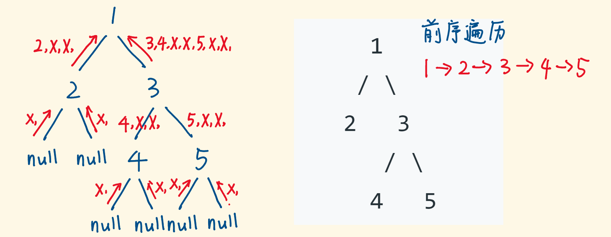
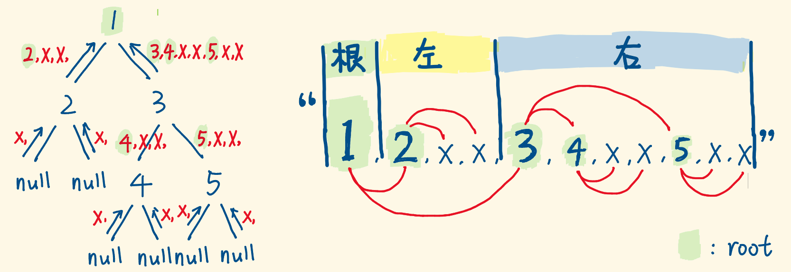
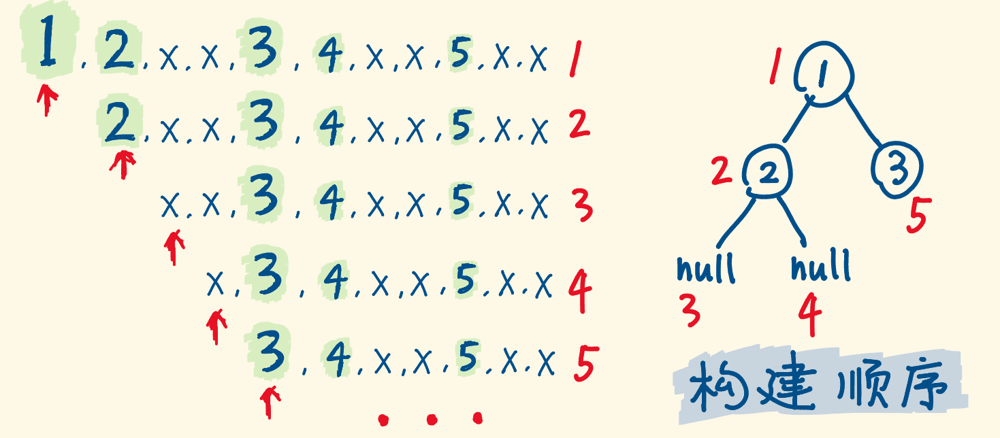
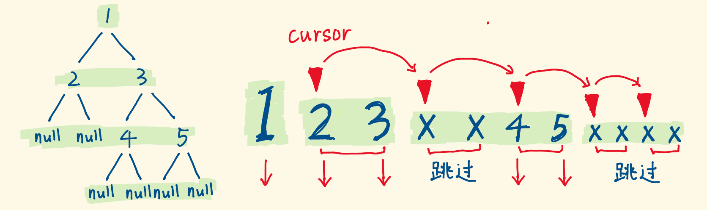
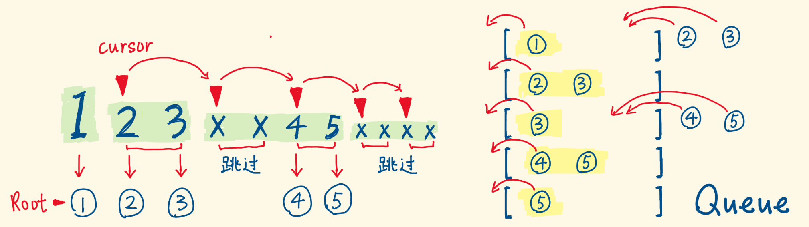

> 原文链接: https://leetcode-cn.com/problems/serialize-and-deserialize-binary-tree


## 英文原文
<div><p>Serialization is the process of converting a data structure or object into a sequence of bits so that it can be stored in a file or memory buffer, or transmitted across a network connection link to be reconstructed later in the same or another computer environment.</p>

<p>Design an algorithm to serialize and deserialize a binary tree. There is no restriction on how your serialization/deserialization algorithm should work. You just need to ensure that a binary tree can be serialized to a string and this string can be deserialized to the original tree structure.</p>

<p><strong>Clarification:</strong> The input/output format is the same as <a href="/faq/#binary-tree">how LeetCode serializes a binary tree</a>. You do not necessarily need to follow this format, so please be creative and come up with different approaches yourself.</p>

<p>&nbsp;</p>
<p><strong>Example 1:</strong></p>

<pre>
<strong>Input:</strong> root = [1,2,3,null,null,4,5]
<strong>Output:</strong> [1,2,3,null,null,4,5]
</pre>

<p><strong>Example 2:</strong></p>

<pre>
<strong>Input:</strong> root = []
<strong>Output:</strong> []
</pre>

<p><strong>Example 3:</strong></p>

<pre>
<strong>Input:</strong> root = [1]
<strong>Output:</strong> [1]
</pre>

<p><strong>Example 4:</strong></p>

<pre>
<strong>Input:</strong> root = [1,2]
<strong>Output:</strong> [1,2]
</pre>

<p>&nbsp;</p>
<p><strong>Constraints:</strong></p>

<ul>
	<li>The number of nodes in the tree is in the range <code>[0, 10<sup>4</sup>]</code>.</li>
	<li><code>-1000 &lt;= Node.val &lt;= 1000</code></li>
</ul>
</div>

## 中文题目
<div><p>序列化是将一个数据结构或者对象转换为连续的比特位的操作，进而可以将转换后的数据存储在一个文件或者内存中，同时也可以通过网络传输到另一个计算机环境，采取相反方式重构得到原数据。</p>

<p>请设计一个算法来实现二叉树的序列化与反序列化。这里不限定你的序列 / 反序列化算法执行逻辑，你只需要保证一个二叉树可以被序列化为一个字符串并且将这个字符串反序列化为原始的树结构。</p>

<p><strong>提示: </strong>输入输出格式与 LeetCode 目前使用的方式一致，详情请参阅 <a href="/faq/#binary-tree">LeetCode 序列化二叉树的格式</a>。你并非必须采取这种方式，你也可以采用其他的方法解决这个问题。</p>

<p> </p>

<p><strong>示例 1：</strong></p>

<pre>
<strong>输入：</strong>root = [1,2,3,null,null,4,5]
<strong>输出：</strong>[1,2,3,null,null,4,5]
</pre>

<p><strong>示例 2：</strong></p>

<pre>
<strong>输入：</strong>root = []
<strong>输出：</strong>[]
</pre>

<p><strong>示例 3：</strong></p>

<pre>
<strong>输入：</strong>root = [1]
<strong>输出：</strong>[1]
</pre>

<p><strong>示例 4：</strong></p>

<pre>
<strong>输入：</strong>root = [1,2]
<strong>输出：</strong>[1,2]
</pre>

<p> </p>

<p><strong>提示：</strong></p>

<ul>
	<li>树中结点数在范围 <code>[0, 10<sup>4</sup>]</code> 内</li>
	<li><code>-1000 <= Node.val <= 1000</code></li>
</ul>
</div>

## 通过代码
<RecoDemo>
</RecoDemo>


## 高赞题解
早安，我们一起啃下这道经典的题目。

### DFS（递归）

- 递归遍历一棵树，重点关注当前节点，它的子树的遍历交给递归完成：

  **“serialize函数，请帮我分别序列化我的左右子树，我等你返回的结果，再拼接一下。”**

- 选择前序遍历，是因为 $根|左|右$ 的打印顺序，在反序列化时更容易定位出根节点的值。

- 遇到 null 节点也要翻译成特定符号，反序列化时才知道这里是 null。





### 序列化的代码

```js []

const serialize = (root) => {

  if (root == null) {                  // 遍历到 null 节点

    return 'X';

  }

  const left = serialize(root.left);   // 左子树的序列化结果

  const right = serialize(root.right); // 右子树的序列化结果

  return root.val + ',' + left + ','+ right; // 按  根,左,右  拼接字符串

};

```

```go []

func (this *Codec) serialize(root *TreeNode) string {

	if root == nil {

		return "X"

	}

	return strconv.Itoa(root.Val) + "," + this.serialize(root.Left) + "," + this.serialize(root.Right)

}

```


### 反序列化——也是递归

- 前序遍历的序列化字符串，就像下图右一：



- 定义函数 buildTree 用于还原二叉树，传入由序列化字符串转成的 list 数组。

- 逐个 pop 出 list 的首项，构建当前子树的根节点，顺着 list，构建顺序是根节点，左子树，右子树。

    - 如果弹出的字符为 "X"，则返回 null 节点。

    - 如果弹出的字符是数值，则创建root节点，并递归构建root的左右子树，最后返回root。




### 反序列化的代码

```js []

const deserialize = (data) => {

  const list = data.split(',');   // split成数组


  const buildTree = (list) => {   // 基于list构建当前子树

    const rootVal = list.shift(); // 弹出首项，获取它的“数据”

    if (rootVal == "X") {         // 是X，返回null节点

      return null;

    }

    const root = new TreeNode(rootVal); // 不是X，则创建节点

    root.left = buildTree(list);        // 递归构建左子树

    root.right = buildTree(list);       // 递归构建右子树

    return root;                        // 返回当前构建好的root

  };


  return buildTree(list); // 构建的入口

};

```


```go []

func buildTree(list *[]string) *TreeNode {

	rootVal := (*list)[0]

	*list = (*list)[1:]

	if rootVal == "X" {

		return nil

	}

	Val, _ := strconv.Atoi(rootVal)

	root := &TreeNode{Val: Val}

	root.Left = buildTree(list)

	root.Right = buildTree(list)

	return root

}


func (this *Codec) deserialize(data string) *TreeNode {

	list := strings.Split(data, ",")

	return buildTree(&list)

}

```


### BFS 解法

### 序列化——很典型的 BFS 

- 维护一个队列，初始让根节点入列，考察出列节点：

  - 如果出列的节点是 null，将符号 'X' 推入 res 数组。

  - 如果出列的节点是数值，将节点值推入数组 res，并将它的左右子节点入列。

    - 子节点 null 也要入列，它对应 "X"，要被记录，只是它没有子节点可入列。

- 入列、出列…直到队列为空，就遍历完所有节点，res构建完毕，转成字符串就好。

### 序列化的代码

```js []

const serialize = (root) => {

  const queue = [root];

  let res = [];

  while (queue.length) {

    const node = queue.shift(); // 考察出列的节点

    if (node) {                 // 是真实节点，带出子节点入列

      res.push(node.val);       // 节点值推入res

      queue.push(node.left);    // 子节点入列，不管是不是null节点都入列

      queue.push(node.right);    

    } else {                    // 是null节点，没有子节点入列

      res.push('X');            // X 推入res

    }

  }

  return res.join(',');  // 转成字符串

}

```

```go []

func (this *Codec) serialize(root *TreeNode) string {

	q := []*TreeNode{root}

	res := []string{}

	for len(q) != 0 {

		node := q[0]

		q = q[1:]

		if node != nil {

			res = append(res, strconv.Itoa(node.Val))

			q = append(q, node.Left)

			q = append(q, node.Right)

		} else {

			res = append(res, "X")

		}

	}

	return strings.Join(res, ",")

}

```


### 反序列化——也是BFS

下图是BFS得到的序列化字符串，和DFS得到的不同，它是一层层的。除了第一个是根节点的值，其他节点值都是成对的，对应左右子节点。





- 依然先转成`list`数组，用一个指针 cursor 从第二项开始扫描。

- 起初，用`list[0]`构建根节点，并让根节点入列。

- 节点出列，此时 cursor 指向它的左子节点值，cursor+1 指向它的右子节点值。

  - 如果子节点值是数值，则创建节点，并**认**出列的父亲，同时自己也是父亲，入列。

  - 如果子节点值为 'X'，什么都不用做，因为出列的父亲的 left 和 right 本来就是 null

- 可见，所有的真实节点都会在队列里走一遍，出列就带出儿子入列





### 反序列化 代码

```js []

const deserialize = (data) => {

  if (data == 'X') return null;


  const list = data.split(',');  // 序列化字符串split成数组


  const root = new TreeNode(list[0]); // 获取首项，构建根节点

  const queue = [root];          // 根节点推入队列

  let cursor = 1;                // 初始指向list第二项


  while (cursor < list.length) { // 指针越界，即扫完了序列化字符串

    const node = queue.shift();  // 考察出列的节点


    const leftVal = list[cursor];      // 它的左儿子的值

    const rightVal = list[cursor + 1]; // 它的右儿子的值


    if (leftVal != 'X') {              // 是真实节点

      const leftNode = new TreeNode(leftVal); // 创建左儿子节点

      node.left = leftNode;                   // 认父亲

      queue.push(leftNode);                   // 自己也是父亲，入列

    }

    if (rightVal != 'X') {

      const rightNode = new TreeNode(rightVal);

      node.right = rightNode;

      queue.push(rightNode);

    }

    cursor += 2; // 一次考察一对儿子，指针加2

  }

  return root;  // BFS结束，构建结束，返回根节点

};

```

```go []

func (this *Codec) deserialize(data string) *TreeNode {

	if data == "X" {

		return nil

	}

	list := strings.Split(data, ",")

	Val, _ := strconv.Atoi(list[0])

	root := &TreeNode{Val: Val}

	q := []*TreeNode{root}

	cursor := 1


	for cursor < len(list) {

		node := q[0]

		q = q[1:]

		leftVal := list[cursor]

		rightVal := list[cursor+1]

		if leftVal != "X" {

			v, _ := strconv.Atoi(leftVal)

			leftNode := &TreeNode{Val: v}

			node.Left = leftNode

			q = append(q, leftNode)

		}

		if rightVal != "X" {

			v, _ := strconv.Atoi(rightVal)

			rightNode := &TreeNode{Val: v}

			node.Right = rightNode

			q = append(q, rightNode)

		}

		cursor += 2

	}

	return root

}

```


#### 这篇反复润色几十遍，力求准确清晰。这道题很好，有很多细节值得掌握。谢谢收看。


## 统计信息
| 通过次数 | 提交次数 | AC比率 |
| :------: | :------: | :------: |
|    114253    |    203087    |   56.3%   |

## 提交历史
| 提交时间 | 提交结果 | 执行时间 |  内存消耗  | 语言 |
| :------: | :------: | :------: | :--------: | :--------: |


## 相似题目
|                             题目                             | 难度 |
| :----------------------------------------------------------: | :---------: |
| [字符串的编码与解码](https://leetcode-cn.com/problems/encode-and-decode-strings/) | 中等|
| [序列化和反序列化二叉搜索树](https://leetcode-cn.com/problems/serialize-and-deserialize-bst/) | 中等|
| [寻找重复的子树](https://leetcode-cn.com/problems/find-duplicate-subtrees/) | 中等|
| [序列化和反序列化 N 叉树](https://leetcode-cn.com/problems/serialize-and-deserialize-n-ary-tree/) | 困难|
