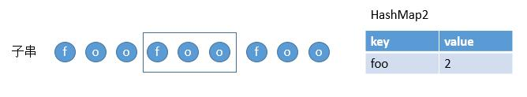
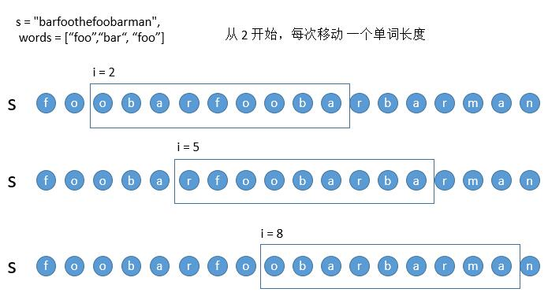

> 原文链接: https://leetcode-cn.com/problems/substring-with-concatenation-of-all-words


## 英文原文
<div><p>You are given a string <code>s</code> and an array of strings <code>words</code> of <strong>the same length</strong>. Return&nbsp;all starting indices of substring(s) in <code>s</code>&nbsp;that is a concatenation of each word in <code>words</code> <strong>exactly once</strong>, <strong>in any order</strong>,&nbsp;and <strong>without any intervening characters</strong>.</p>

<p>You can return the answer in <strong>any order</strong>.</p>

<p>&nbsp;</p>
<p><strong>Example 1:</strong></p>

<pre>
<strong>Input:</strong> s = &quot;barfoothefoobarman&quot;, words = [&quot;foo&quot;,&quot;bar&quot;]
<strong>Output:</strong> [0,9]
<strong>Explanation:</strong> Substrings starting at index 0 and 9 are &quot;barfoo&quot; and &quot;foobar&quot; respectively.
The output order does not matter, returning [9,0] is fine too.
</pre>

<p><strong>Example 2:</strong></p>

<pre>
<strong>Input:</strong> s = &quot;wordgoodgoodgoodbestword&quot;, words = [&quot;word&quot;,&quot;good&quot;,&quot;best&quot;,&quot;word&quot;]
<strong>Output:</strong> []
</pre>

<p><strong>Example 3:</strong></p>

<pre>
<strong>Input:</strong> s = &quot;barfoofoobarthefoobarman&quot;, words = [&quot;bar&quot;,&quot;foo&quot;,&quot;the&quot;]
<strong>Output:</strong> [6,9,12]
</pre>

<p>&nbsp;</p>
<p><strong>Constraints:</strong></p>

<ul>
	<li><code>1 &lt;= s.length &lt;= 10<sup>4</sup></code></li>
	<li><code>s</code> consists of lower-case English letters.</li>
	<li><code>1 &lt;= words.length &lt;= 5000</code></li>
	<li><code>1 &lt;= words[i].length &lt;= 30</code></li>
	<li><code>words[i]</code>&nbsp;consists of lower-case English letters.</li>
</ul>
</div>

## 中文题目
<div><p>给定一个字符串 <code>s</code><strong> </strong>和一些 <strong>长度相同</strong> 的单词 <code>words</code><strong> 。</strong>找出 <code>s</code><strong> </strong>中恰好可以由 <code>words</code><strong> </strong>中所有单词串联形成的子串的起始位置。</p>

<p>注意子串要与 <code>words</code><strong> </strong>中的单词完全匹配，<strong>中间不能有其他字符 </strong>，但不需要考虑 <code>words</code><strong> </strong>中单词串联的顺序。</p>

<p> </p>

<p><strong>示例 1：</strong></p>

<pre>
<strong>输入：</strong>s = "barfoothefoobarman", words = ["foo","bar"]
<strong>输出：</strong><code>[0,9]</code>
<strong>解释：</strong>
从索引 0 和 9 开始的子串分别是 "barfoo" 和 "foobar" 。
输出的顺序不重要, [9,0] 也是有效答案。
</pre>

<p><strong>示例 2：</strong></p>

<pre>
<strong>输入：</strong>s = "wordgoodgoodgoodbestword", words = ["word","good","best","word"]
<code><strong>输出：</strong>[]</code>
</pre>

<p><strong>示例 3：</strong></p>

<pre>
<strong>输入：</strong>s = "barfoofoobarthefoobarman", words = ["bar","foo","the"]
<strong>输出：</strong>[6,9,12]
</pre>

<p> </p>

<p><strong>提示：</strong></p>

<ul>
	<li><code>1 <= s.length <= 10<sup>4</sup></code></li>
	<li><code>s</code> 由小写英文字母组成</li>
	<li><code>1 <= words.length <= 5000</code></li>
	<li><code>1 <= words[i].length <= 30</code></li>
	<li><code>words[i]</code> 由小写英文字母组成</li>
</ul>
</div>

## 通过代码
<RecoDemo>
</RecoDemo>


## 高赞题解
# 解法一


首先，最直接的思路，判断每个子串是否符合，符合就把下标保存起来，最后返回即可。


如上图，利用循环变量 i ，依次后移，判断每个子串是否符合即可。

怎么判断子串是否符合？这也是这个题的难点了，由于子串包含的单词顺序并不需要固定，如果是两个单词 A，B，我们只需要判断子串是否是 AB 或者 BA 即可。如果是三个单词 A，B，C 也还好，只需要判断子串是否是 ABC，或者 ACB，BAC，BCA，CAB，CBA 就可以了，但如果更多单词呢？那就崩溃了。

用两个 HashMap 来解决。首先，我们把所有的单词存到 HashMap 里，key 直接存单词，value 存单词出现的个数（因为给出的单词可能会有重复的，所以可能是 1 或 2 或者其他）。然后扫描子串的单词，如果当前扫描的单词在之前的 HashMap 中，就把该单词存到新的 HashMap 中，并判断新的 HashMap 中该单词的 value 是不是大于之前的 HashMap 该单词的 value ，如果大了，就代表该子串不是我们要找的，接着判断下一个子串就可以了。如果不大于，那么我们接着判断下一个单词的情况。子串扫描结束，如果子串的全部单词都符合，那么该子串就是我们找的其中一个。看下具体的例子。

看下图，我们把 words 存到一个 HashMap 中。


然后遍历子串的每个单词。


第一个单词在 HashMap1 中，然后我们把 foo 存到 HashMap2 中。并且比较此时 foo 的 value 和 HashMap1 中      foo 的 value，1 <  2，所以我们继续扫描。



第二个单词也在 HashMap1 中，然后把 foo 存到 HashMap2 中，因为之前已经存过了，所以更新它的 value 为 2  ，然后继续比较此时 foo 的 value 和 HashMap1 中 foo 的 value，2 <= 2，所以继续扫描下一个单词。


第三个单词也在 HashMap1 中，然后把 foo 存到 HashMap2 中，因为之前已经存过了，所以更新它的 value 为 3，然后继续比较此时 foo 的 value 和 HashMap1 中 foo 的 value，3 > 2，所以表明该字符串不符合。然后判断下个子串就好了。

当然上边的情况都是单词在 HashMap1 中，如果不在的话就更好说了，不在就表明当前子串肯定不符合了，直接判断下个子串就好了。

看一下代码吧

```java
public List<Integer> findSubstring(String s, String[] words) {
    List<Integer> res = new ArrayList<Integer>();
    int wordNum = words.length;
    if (wordNum == 0) {
        return res;
    }
    int wordLen = words[0].length();
    //HashMap1 存所有单词
    HashMap<String, Integer> allWords = new HashMap<String, Integer>();
    for (String w : words) {
        int value = allWords.getOrDefault(w, 0);
        allWords.put(w, value + 1);
    }
    //遍历所有子串
    for (int i = 0; i < s.length() - wordNum * wordLen + 1; i++) {
        //HashMap2 存当前扫描的字符串含有的单词
        HashMap<String, Integer> hasWords = new HashMap<String, Integer>();
        int num = 0;
        //判断该子串是否符合
        while (num < wordNum) {
            String word = s.substring(i + num * wordLen, i + (num + 1) * wordLen);
            //判断该单词在 HashMap1 中
            if (allWords.containsKey(word)) {
                int value = hasWords.getOrDefault(word, 0);
                hasWords.put(word, value + 1);
                //判断当前单词的 value 和 HashMap1 中该单词的 value
                if (hasWords.get(word) > allWords.get(word)) {
                    break;
                }
            } else {
                break;
            }
            num++;
        }
        //判断是不是所有的单词都符合条件
        if (num == wordNum) {
            res.add(i);
        }
    }
    return res;
}
```

时间复杂度：假设 s 的长度是 n，words 里有 m 个单词，那么时间复杂度就是 O（n * m）。

空间复杂度：两个 HashMap，假设 words 里有 m 个单词，就是 O（m）。

# 解法二

我们在解法一中，每次移动一个字符。


现在为了方便讨论，我们每次移动一个单词的长度，也就是 3 个字符，这样所有的移动被分成了三类。




以上三类我们以第一类从 0 开始移动为例，讲一下如何对算法进行优化，有三种需要优化的情况。

* 情况一：当子串完全匹配，移动到下一个子串的时候。


  在解法一中，对于 i = 3 的子串，我们肯定是从第一个 foo 开始判断。但其实前两个 foo 都不用判断了 ，因为在判断上一个 i = 0 的子串的时候我们已经判断过了。所以解法一中的 HashMap2 每次并不需要清空从 0 开始，而是可以只移除之前 i = 0 子串的第一个单词 bar 即可，然后直接从箭头所指的 foo 开始就可以了。

* 情况二：当判断过程中，出现不符合的单词。


  但判断 i = 0 的子串的时候，出现了 the ，并不在所给的单词中。所以此时 i = 3，i = 6 的子串，我们其实并不需要判断了。我们直接判断 i = 9 的情况就可以了。

* 情况三：判断过程中，出现的是符合的单词，但是次数超了。


  对于 i = 0 的子串，此时判断的 bar 其实是在 words 中的，但是之前已经出现了一次 bar，所以 i = 0 的子串是不符合要求的。此时我们只需要往后移动窗口，i = 3 的子串将 foo 移除，此时子串中一定还是有两个 bar，所以该子串也一定不符合。接着往后移动，当之前的 bar 被移除后，此时 i = 6 的子串，就可以接着按正常的方法判断了。

  所以对于出现 i = 0 的子串的情况，我们可以直接从 HashMap2 中依次移除单词，当移除了之前次数超的单词的时候，我们就可以正常判断了，直接从移除了超出了次数的单词后，也就是 i = 6 开始判断就可以了。

  看一下代码吧。

  ```java
  public List<Integer> findSubstring(String s, String[] words) {
      List<Integer> res = new ArrayList<Integer>();
      int wordNum = words.length;
      if (wordNum == 0) {
          return res;
      }
      int wordLen = words[0].length();
      HashMap<String, Integer> allWords = new HashMap<String, Integer>();
      for (String w : words) {
          int value = allWords.getOrDefault(w, 0);
          allWords.put(w, value + 1);
      }
      //将所有移动分成 wordLen 类情况
      for (int j = 0; j < wordLen; j++) {
          HashMap<String, Integer> hasWords = new HashMap<String, Integer>();
          int num = 0; //记录当前 HashMap2（这里的 hasWords 变量）中有多少个单词
  		//每次移动一个单词长度
          for (int i = j; i < s.length() - wordNum * wordLen + 1; i = i + wordLen) {
              boolean hasRemoved = false; //防止情况三移除后，情况一继续移除
              while (num < wordNum) {
                  String word = s.substring(i + num * wordLen, i + (num + 1) * wordLen);
                  if (allWords.containsKey(word)) {
                      int value = hasWords.getOrDefault(word, 0);
                      hasWords.put(word, value + 1);
                      //出现情况三，遇到了符合的单词，但是次数超了
                      if (hasWords.get(word) > allWords.get(word)) {
                          // hasWords.put(word, value);
                          hasRemoved = true;
                          int removeNum = 0;
                          //一直移除单词，直到次数符合了
                          while (hasWords.get(word) > allWords.get(word)) {
                              String firstWord = s.substring(i + removeNum * wordLen, i + (removeNum + 1) * wordLen);
                              int v = hasWords.get(firstWord);
                              hasWords.put(firstWord, v - 1);
                              removeNum++;
                          }
                          num = num - removeNum + 1; //加 1 是因为我们把当前单词加入到了 HashMap 2 中
                          i = i + (removeNum - 1) * wordLen; //这里依旧是考虑到了最外层的 for 循环，看情况二的解释
                          break;
                      }
                  //出现情况二，遇到了不匹配的单词，直接将 i 移动到该单词的后边（但其实这里
                  //只是移动到了出现问题单词的地方，因为最外层有 for 循环， i 还会移动一个单词
                  //然后刚好就移动到了单词后边）
                  } else {
                      hasWords.clear();
                      i = i + num * wordLen;
                      num = 0;
                      break;
                  }
                  num++;
              }
              if (num == wordNum) {
                  res.add(i);
  
              }
              //出现情况一，子串完全匹配，我们将上一个子串的第一个单词从 HashMap2 中移除
              if (num > 0 && !hasRemoved) {
                  String firstWord = s.substring(i, i + wordLen);
                  int v = hasWords.get(firstWord);
                  hasWords.put(firstWord, v - 1);
                  num = num - 1;
              }
  
          }
  
      }
      return res;
  }
  
  ```

  时间复杂度：算法中外层的两个for 循环的次数肯定是所有的子串，假设是 n。考虑一下，最极端的情况，每个子串的判断都进了 while 循环，wordNum 等于 m。对于解法一，因为每次都是从头判断，所以 while 循环循环了 m 次。但这里我们由于没有清空，所以每次只判断新加入的单词就可以了，只需判断一次，所以时间复杂度是 O（n）。

  或者换一种理解方式，判断子串是否符合，本质上也就是判断每个单词符不符合，假设 s 的长度是 n，那么就会大约有 n 个子串，也就是会有 n 个单词。而对于每个单词，我们只有刚开始判断符不符合的时候访问一次，还有就是把它移除的时候访问一次，所以每个单词最多访问 2 次，所以时间复杂度是 O（n）。

  空间复杂度：没有变化，依旧是两个 HashMap, 假设 words 里有 m 个单词，就是 O（m）。

  # 总

  这道题最大的亮点就是应用了 HashMap 了吧，使得我们不再纠结于子串包含单词的顺序。然后对于算法的优化上，还是老思路，去分析哪些判断是不必要的，然后把它除之。

之前自己在博客总结的，更多题解可以在原地址 [https://leetcode.wang](https://leetcode.wang)。

## 统计信息
| 通过次数 | 提交次数 | AC比率 |
| :------: | :------: | :------: |
|    85892    |    237746    |   36.1%   |

## 提交历史
| 提交时间 | 提交结果 | 执行时间 |  内存消耗  | 语言 |
| :------: | :------: | :------: | :--------: | :--------: |


## 相似题目
|                             题目                             | 难度 |
| :----------------------------------------------------------: | :---------: |
| [最小覆盖子串](https://leetcode-cn.com/problems/minimum-window-substring/) | 困难|
