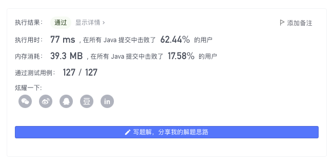

> 原文链接: https://leetcode-cn.com/problems/remove-invalid-parentheses


## 英文原文
<div><p>Given a string <code>s</code> that contains parentheses and letters, remove the minimum number of invalid parentheses to make the input string valid.</p>

<p>Return <em>all the possible results</em>. You may return the answer in <strong>any order</strong>.</p>

<p>&nbsp;</p>
<p><strong>Example 1:</strong></p>

<pre>
<strong>Input:</strong> s = &quot;()())()&quot;
<strong>Output:</strong> [&quot;(())()&quot;,&quot;()()()&quot;]
</pre>

<p><strong>Example 2:</strong></p>

<pre>
<strong>Input:</strong> s = &quot;(a)())()&quot;
<strong>Output:</strong> [&quot;(a())()&quot;,&quot;(a)()()&quot;]
</pre>

<p><strong>Example 3:</strong></p>

<pre>
<strong>Input:</strong> s = &quot;)(&quot;
<strong>Output:</strong> [&quot;&quot;]
</pre>

<p>&nbsp;</p>
<p><strong>Constraints:</strong></p>

<ul>
	<li><code>1 &lt;= s.length &lt;= 25</code></li>
	<li><code>s</code> consists of lowercase English letters and parentheses <code>&#39;(&#39;</code> and <code>&#39;)&#39;</code>.</li>
	<li>There will be at most <code>20</code> parentheses in <code>s</code>.</li>
</ul>
</div>

## 中文题目
<div><p>给你一个由若干括号和字母组成的字符串 <code>s</code> ，删除最小数量的无效括号，使得输入的字符串有效。</p>

<p>返回所有可能的结果。答案可以按 <strong>任意顺序</strong> 返回。</p>

<p> </p>

<p><strong>示例 1：</strong></p>

<pre>
<strong>输入：</strong>s = "()())()"
<strong>输出：</strong>["(())()","()()()"]
</pre>

<p><strong>示例 2：</strong></p>

<pre>
<strong>输入：</strong>s = "(a)())()"
<strong>输出：</strong>["(a())()","(a)()()"]
</pre>

<p><strong>示例 3：</strong></p>

<pre>
<strong>输入：</strong>s = ")("
<strong>输出：</strong>[""]
</pre>

<p> </p>

<p><strong>提示：</strong></p>

<ul>
	<li><code>1 <= s.length <= 25</code></li>
	<li><code>s</code> 由小写英文字母以及括号 <code>'('</code> 和 <code>')'</code> 组成</li>
	<li><code>s</code> 中至多含 <code>20</code> 个括号</li>
</ul>
</div>

## 通过代码
<RecoDemo>
</RecoDemo>


## 高赞题解
## 前言

原始版题解在 [这里](https://leetcode-cn.com/problems/remove-invalid-parentheses/solution/yi-fen-zhong-nei-kan-dong-jiang-gua-hao-aya6k/)，本次仅进行简单的文字修缮与补充。

---

## 搜索 + 剪枝

由于题目要求我们将所有（最长）合法方案输出，因此不可能有别的优化，只能进行「爆搜」。

我们可以使用 `DFS` 实现回溯搜索。

基本思路：

我们知道所有的合法方案，必然有左括号的数量与右括号数量相等。

首先我们令左括号的得分为 $1$；右括号的得分为 $-1$。则会有如下性质：

1. 对于一个合法的方案而言，必然有最终得分为 $0$；
2. 搜索过程中不会出现得分值为 **负数** 的情况（当且仅当子串中某个前缀中「右括号的数量」大于「左括号的数量」时，会出现负数，此时不是合法方案）。

同时我们可以预处理出「爆搜」过程的最大得分： `max = min(左括号的数量, 右括号的数量)`

**PS.「爆搜」过程的最大得分必然是：合法左括号先全部出现在左边，之后使用最多的合法右括号进行匹配。**

枚举过程中出现字符分三种情况：

* 左括号：如果增加当前 `(` 后，仍为合法子串（即 $score + 1 <= max$) 时，我们可以选择添加该左括号，也能选择不添加；
* 右括号：如果增加当前 `)` 后，仍为合法子串（即 $score - 1 >= 0$) 时，我们可以选择添加该右括号，也能选择不添加；
* 普通字符：直接添加。

使用 `Set` 进行方案去重，$len$ 记录「爆搜」过程中的最大子串，然后只保留长度等于 $len$ 的子串。



代码：
```Java []
class Solution {
    Set<String> set = new HashSet<>();
    int n, max, len;
    String s;
    public List<String> removeInvalidParentheses(String _s) {
        s = _s;
        n = s.length();
        int l = 0, r = 0;
        for (char c : s.toCharArray()) {
            if (c == '(') l++;
            else if (c == ')') r++;
        }
        max = Math.min(l, r);
        dfs(0, "", 0);
        return new ArrayList<>(set);
    }
    void dfs(int u, String cur, int score) {
        if (score < 0 || score > max) return ;
        if (u == n) {
            if (score == 0 && cur.length() >= len) {
                if (cur.length() > len) set.clear();
                len = cur.length();
                set.add(cur);
            }
            return ;
        }
        char c = s.charAt(u);
        if (c == '(') {
            dfs(u + 1, cur + String.valueOf(c), score + 1);
            dfs(u + 1, cur, score);
        } else if (c == ')') {
            dfs(u + 1, cur + String.valueOf(c), score - 1);
            dfs(u + 1, cur, score);
        } else {
            dfs(u + 1, cur + String.valueOf(c), score);
        }
    }
}
```
* 时间复杂度：预处理 $max$ 的复杂度为 $O(n)$；不考虑 $score$ 带来的剪枝效果，最坏情况下，每个位置都有两种选择，搜索所有方案的复杂度为 $O(2^n)$；同时搜索过程中会产生的新字符串（最终递归树中叶子节点的字符串长度最大为 $n$，使用 `StringBuilder` 也是同理），复杂度为 $O(n)$。整体复杂度为 $O(n * 2^n)$
* 空间复杂度：最大合法方案数与字符串长度呈线性关系。复杂度为 $O(n)$

---

## 搜索 + 剪枝

在解法一，我们是在搜索过程中去更新最后的 $len$。

但事实上，我们可以通过预处理，得到最后的「应该删除的左括号数量」和「应该删掉的右括号数量」，来直接得到最终的 $len$。

因此在此基础上，我们可以考虑多增加一层剪枝。


代码：
```Java []
class Solution {
    Set<String> set = new HashSet<>();
    int n, max, len;
    String s;
    public List<String> removeInvalidParentheses(String _s) {
        s = _s;
        n = s.length();

        int l = 0, r = 0;
        for (char c : s.toCharArray()) {
            if (c == '(') {
                l++;
            } else if (c == ')') {
                if (l != 0) l--;
                else r++;
            }
        }
        len = n - l - r;
        
        int c1 = 0, c2 = 0;
        for (char c : s.toCharArray()) {
            if (c == '(') c1++;
            else if (c == ')') c2++;
        }
        max = Math.min(c1, c2);

        dfs(0, "", l, r, 0);
        return new ArrayList<>(set);
    }
    void dfs(int u, String cur, int l, int r, int score) {
        if (l < 0 || r < 0 || score < 0 || score > max) return ;
        if (l == 0 && r == 0) {
            if (cur.length() == len) set.add(cur);
        }
        if (u == n) return ;
        char c = s.charAt(u);
        if (c == '(') {
            dfs(u + 1, cur + String.valueOf(c), l, r, score + 1);
            dfs(u + 1, cur, l - 1, r, score);
        } else if (c == ')') {
            dfs(u + 1, cur + String.valueOf(c), l, r, score - 1);
            dfs(u + 1, cur, l, r - 1, score);
        } else {
            dfs(u + 1, cur + String.valueOf(c), l, r, score);
        }
    }
}
```
* 时间复杂度：预处理 $max$ 和 $len$ 的复杂度为 $O(n)$；不考虑 $score$ 带来的剪枝效果，最坏情况下，每个位置都有两种选择，搜索所有方案的复杂度为 $O(2^n)$；同时搜索过程中会产生的新字符串（最终递归树中叶子节点的字符串长度最大为 $n$，使用 `StringBuilder` 也是同理），复杂度为 $O(n)$。整体复杂度为 $O(n * 2^n)$
* 空间复杂度：最大合法方案数与字符串长度呈线性关系。复杂度为 $O(n)$

---

## 最后

**如果有帮助到你，请给题解点个赞和收藏，让更多的人看到 ~ ("▔□▔)/**

也欢迎你 [关注我](https://oscimg.oschina.net/oscnet/up-19688dc1af05cf8bdea43b2a863038ab9e5.png)（公主号后台回复「送书」即可参与长期看题解学算法送实体书活动）或 加入[「组队打卡」](https://leetcode-cn.com/u/ac_oier/)小群 ，提供写「证明」&「思路」的高质量题解。

所有题解已经加入 [刷题指南](https://github.com/SharingSource/LogicStack-LeetCode/wiki)，欢迎 star 哦 ~ 

## 统计信息
| 通过次数 | 提交次数 | AC比率 |
| :------: | :------: | :------: |
|    53952    |    98638    |   54.7%   |

## 提交历史
| 提交时间 | 提交结果 | 执行时间 |  内存消耗  | 语言 |
| :------: | :------: | :------: | :--------: | :--------: |


## 相似题目
|                             题目                             | 难度 |
| :----------------------------------------------------------: | :---------: |
| [有效的括号](https://leetcode-cn.com/problems/valid-parentheses/) | 简单|
