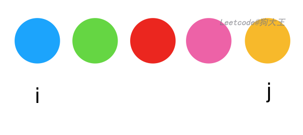
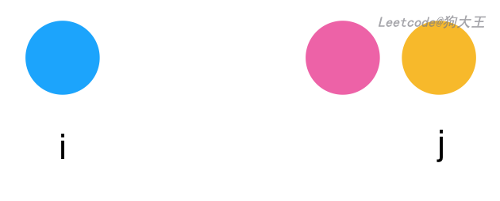

> 原文链接: https://leetcode-cn.com/problems/burst-balloons


## 英文原文
<div><p>You are given <code>n</code> balloons, indexed from <code>0</code> to <code>n - 1</code>. Each balloon is painted with a number on it represented by an array <code>nums</code>. You are asked to burst all the balloons.</p>

<p>If you burst the <code>i<sup>th</sup></code> balloon, you will get <code>nums[i - 1] * nums[i] * nums[i + 1]</code> coins. If <code>i - 1</code> or <code>i + 1</code> goes out of bounds of the array, then treat it as if there is a balloon with a <code>1</code> painted on it.</p>

<p>Return <em>the maximum coins you can collect by bursting the balloons wisely</em>.</p>

<p>&nbsp;</p>
<p><strong>Example 1:</strong></p>

<pre>
<strong>Input:</strong> nums = [3,1,5,8]
<strong>Output:</strong> 167
<strong>Explanation:</strong>
nums = [3,1,5,8] --&gt; [3,5,8] --&gt; [3,8] --&gt; [8] --&gt; []
coins =  3*1*5    +   3*5*8   +  1*3*8  + 1*8*1 = 167</pre>

<p><strong>Example 2:</strong></p>

<pre>
<strong>Input:</strong> nums = [1,5]
<strong>Output:</strong> 10
</pre>

<p>&nbsp;</p>
<p><strong>Constraints:</strong></p>

<ul>
	<li><code>n == nums.length</code></li>
	<li><code>1 &lt;= n &lt;= 500</code></li>
	<li><code>0 &lt;= nums[i] &lt;= 100</code></li>
</ul>
</div>

## 中文题目
<div><p>有 <code>n</code> 个气球，编号为<code>0</code> 到 <code>n - 1</code>，每个气球上都标有一个数字，这些数字存在数组 <code>nums</code> 中。</p>

<p>现在要求你戳破所有的气球。戳破第 <code>i</code> 个气球，你可以获得 <code>nums[i - 1] * nums[i] * nums[i + 1]</code> 枚硬币。 这里的 <code>i - 1</code> 和 <code>i + 1</code> 代表和 <code>i</code> 相邻的两个气球的序号。如果 <code>i - 1</code>或 <code>i + 1</code> 超出了数组的边界，那么就当它是一个数字为 <code>1</code> 的气球。</p>

<p>求所能获得硬币的最大数量。</p>

<p> </p>
<strong>示例 1：</strong>

<pre>
<strong>输入：</strong>nums = [3,1,5,8]
<strong>输出：</strong>167
<strong>解释：</strong>
nums = [3,1,5,8] --> [3,5,8] --> [3,8] --> [8] --> []
coins =  3*1*5    +   3*5*8   +  1*3*8  + 1*8*1 = 167</pre>

<p><strong>示例 2：</strong></p>

<pre>
<strong>输入：</strong>nums = [1,5]
<strong>输出：</strong>10
</pre>

<p> </p>

<p><strong>提示：</strong></p>

<ul>
	<li><code>n == nums.length</code></li>
	<li><code>1 <= n <= 500</code></li>
	<li><code>0 <= nums[i] <= 100</code></li>
</ul>
</div>

## 通过代码
<RecoDemo>
</RecoDemo>


## 高赞题解
### 解题思路
我们来看一个区间，这个区间的气球长这样

&ensp;
{:width=300}
{:align=center}

假设这个区间是个开区间，最左边索引 `i`，最右边索引 `j`
我这里说 “开区间” 的意思是，我们只能戳爆 `i` 和 `j` 之间的气球，`i` 和 `j` 不要戳
&ensp;
DP思路是这样的，就先别管前面是怎么戳的，你只要管这个区间最后一个被戳破的是哪个气球
这最后一个被戳爆的气球就是 `k`
&ensp;
注意！！！！！
k是这个区间 &ensp; ***最后一个*** &ensp; 被戳爆的气球！！！！！
k是这个区间 &ensp; ***最后一个*** &ensp; 被戳爆的气球！！！！！
&ensp;
假设最后一个被戳爆的气球是粉色的，`k` 就是粉色气球的索引
&ensp;
然后由于 `k` 是最后一个被戳爆的，所以它被戳爆之前的场景是什么亚子？
&ensp;

{:width=300}
{:align=center}

&ensp;
是这样子的朋友们！因为是最后一个被戳爆的，所以它周边没有球了！没有球了！只有这个开区间首尾的 `i`  和 `j` 了！！
这就是为什么DP的状态转移方程是只和 `i` 和 `j` 位置的数字有关
&ensp;
假设 `dp[i][j]` 表示开区间 `(i,j)` 内你能拿到的最多金币
&ensp;
那么这个情况下
&ensp;
你在 `(i,j)` 开区间得到的金币可以由 `dp[i][k]` 和 `dp[k][j]` 进行转移
&ensp;
如果你此刻选择戳爆气球 `k`，那么你得到的金币数量就是：
&ensp;
`total`
`=`
`dp[i][k]`
`+`
`val[i] * val[k] * val[j]`
`+`
`dp[k][j]`
&ensp;
注：`val[i]` 表示 `i` 位置气球的数字
然后 `(i,k)` 和 `(k,j)` 也都是开区间
&ensp;
那你可能又想问了，戳爆粉色气球我能获得 `val[i]*val[k]*val[j]` 这么多金币我能理解(因为戳爆 `k` 的时候只剩下这三个气球了)，
但为什么前后只要加上 `dp[i][k]` 和 `dp[k][j]` 的值就行了呀？
&ensp;
因为 `k` 是最后一个被戳爆的，所以 `(i,j)` 区间中 `k` 两边的东西必然是先各自被戳爆了的，
左右两边互不干扰，大家可以细品一下
这就是为什么我们 DP 时要看 “最后一个被戳爆的” 气球，这就是为了让左右两边互不干扰，这大概就是一种分治的思想叭
&ensp;
所以你把  `(i,k)` 开区间所有气球戳爆，然后把戳爆这些气球的所有金币都收入囊中，金币数量记录在 `dp[i][k]`
同理，`(k,j)` 开区间你也已经都戳爆了，钱也拿了，记录在 `dp[k][j]`
所以你把这些之前已经拿到的钱 `dp[i][k]+dp[k][j]` 收着，
再加上新赚的钱 `val[i]*val[k]*val[j]` 不就得到你现在戳爆气球 `k` 一共手上能拿多少钱了吗
&ensp;
而你在 `(i,j)` 开区间可以选的 `k` 是有多个的，见一开头的图，除了粉色之外，你还可以戳绿色和红色
所以你枚举一下这几个 `k`，从中选择使得 `total` 值最大的即可用来更新 `dp[i][j]`
&ensp;
然后呢，你就从 `(i,j)` 开区间只有三个数字的时候开始计算，储存每个小区间可以得到金币的最大值
然后慢慢扩展到更大的区间，利用小区间里已经算好的数字来算更大的区间
就可以啦！撒花✿✿ヽ(^▽^)ノ✿！
&ensp;
&ensp;
### 附 Python 代码

```Python []
class Solution:
    def maxCoins(self, nums: List[int]) -> int:

        #nums首尾添加1，方便处理边界情况
        nums.insert(0,1)
        nums.insert(len(nums),1)

        store = [[0]*(len(nums)) for i in range(len(nums))]

        def range_best(i,j):
            m = 0 
            #k是(i,j)区间内最后一个被戳的气球
            for k in range(i+1,j): #k取值在(i,j)开区间中
                #以下都是开区间(i,k), (k,j)
                left = store[i][k]
                right = store[k][j]
                a = left + nums[i]*nums[k]*nums[j] + right
                if a > m:
                    m = a
            store[i][j] = m

        #对每一个区间长度进行循环
        for n in range(2,len(nums)): #区间长度 #长度从3开始，n从2开始
            #开区间长度会从3一直到len(nums)
            #因为这里取的是range，所以最后一个数字是len(nums)-1

            #对于每一个区间长度，循环区间开头的i
            for i in range(0,len(nums)-n): #i+n = len(nums)-1

                #计算这个区间的最多金币
                range_best(i,i+n)

        return store[0][len(nums)-1]

```


## 统计信息
| 通过次数 | 提交次数 | AC比率 |
| :------: | :------: | :------: |
|    59531    |    87037    |   68.4%   |

## 提交历史
| 提交时间 | 提交结果 | 执行时间 |  内存消耗  | 语言 |
| :------: | :------: | :------: | :--------: | :--------: |


## 相似题目
|                             题目                             | 难度 |
| :----------------------------------------------------------: | :---------: |
| [合并石头的最低成本](https://leetcode-cn.com/problems/minimum-cost-to-merge-stones/) | 困难|
