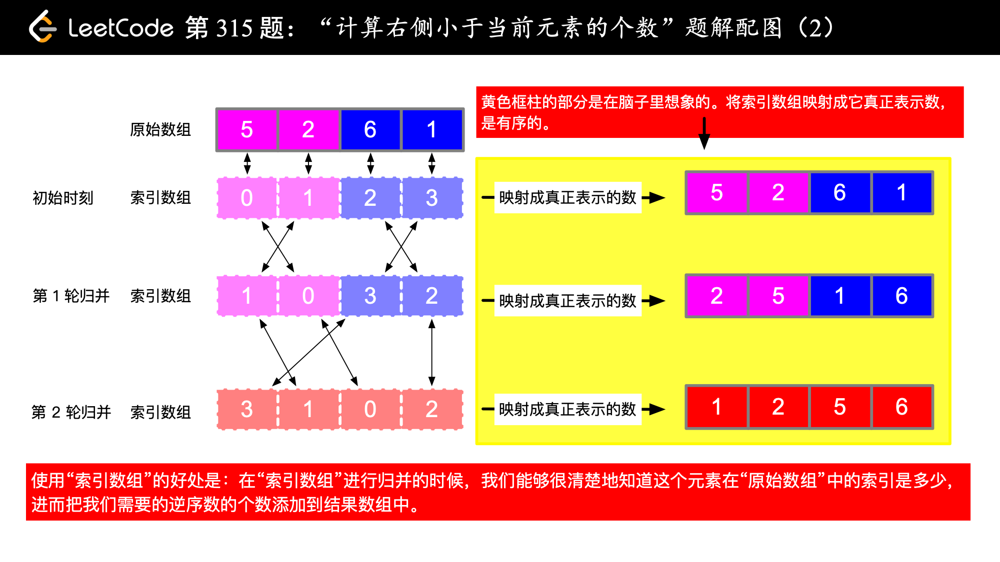
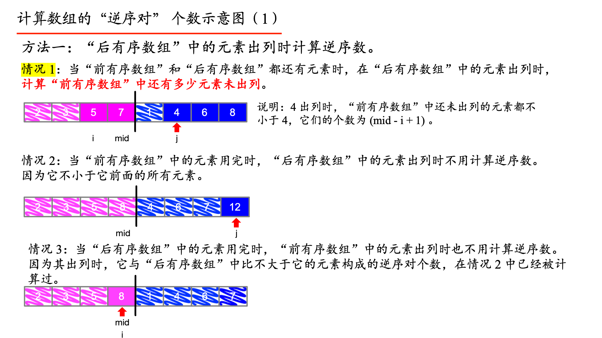
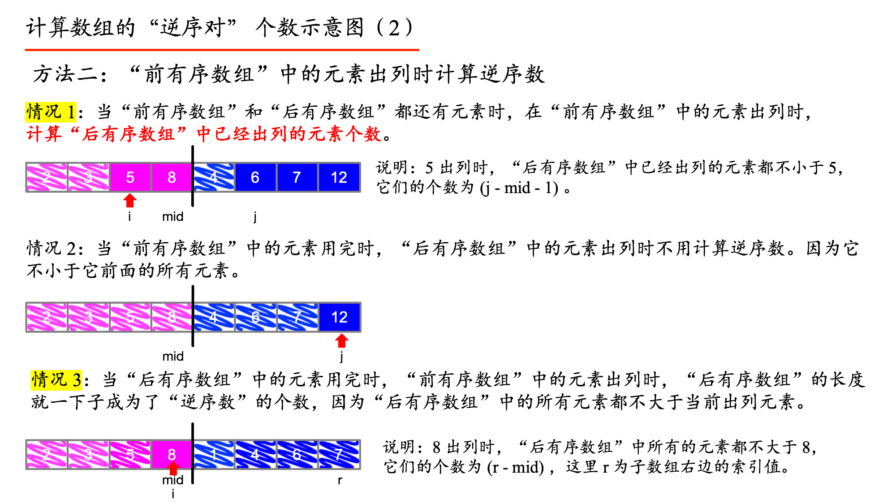

> 原文链接: https://leetcode-cn.com/problems/count-of-smaller-numbers-after-self


## 英文原文
<div><p>You are given an integer array <code>nums</code> and you have to return a new <code>counts</code> array. The <code>counts</code> array has the property where <code>counts[i]</code> is the number of smaller elements to the right of <code>nums[i]</code>.</p>

<p>&nbsp;</p>
<p><strong>Example 1:</strong></p>

<pre>
<strong>Input:</strong> nums = [5,2,6,1]
<strong>Output:</strong> [2,1,1,0]
<strong>Explanation:</strong>
To the right of 5 there are <b>2</b> smaller elements (2 and 1).
To the right of 2 there is only <b>1</b> smaller element (1).
To the right of 6 there is <b>1</b> smaller element (1).
To the right of 1 there is <b>0</b> smaller element.
</pre>

<p><strong>Example 2:</strong></p>

<pre>
<strong>Input:</strong> nums = [-1]
<strong>Output:</strong> [0]
</pre>

<p><strong>Example 3:</strong></p>

<pre>
<strong>Input:</strong> nums = [-1,-1]
<strong>Output:</strong> [0,0]
</pre>

<p>&nbsp;</p>
<p><strong>Constraints:</strong></p>

<ul>
	<li><code>1 &lt;= nums.length &lt;= 10<sup>5</sup></code></li>
	<li><code>-10<sup>4</sup> &lt;= nums[i] &lt;= 10<sup>4</sup></code></li>
</ul>
</div>

## 中文题目
<div><p>给你一个整数数组 <code>nums</code><em> </em>，按要求返回一个新数组&nbsp;<code>counts</code><em> </em>。数组 <code>counts</code> 有该性质： <code>counts[i]</code> 的值是&nbsp; <code>nums[i]</code> 右侧小于&nbsp;<code>nums[i]</code> 的元素的数量。</p>

<p>&nbsp;</p>

<p><strong>示例 1：</strong></p>

<pre>
<strong>输入：</strong>nums = [5,2,6,1]
<strong>输出：</strong><code>[2,1,1,0] 
<strong>解释：</strong></code>
5 的右侧有 <strong>2 </strong>个更小的元素 (2 和 1)
2 的右侧仅有 <strong>1 </strong>个更小的元素 (1)
6 的右侧有 <strong>1 </strong>个更小的元素 (1)
1 的右侧有 <strong>0 </strong>个更小的元素
</pre>

<p><strong>示例 2：</strong></p>

<pre>
<strong>输入：</strong>nums = [-1]
<strong>输出：</strong>[0]
</pre>

<p><strong>示例 3：</strong></p>

<pre>
<strong>输入：</strong>nums = [-1,-1]
<strong>输出：</strong>[0,0]
</pre>

<p>&nbsp;</p>

<p><strong>提示：</strong></p>

<ul>
	<li><code>1 &lt;= nums.length &lt;= 10<sup>5</sup></code></li>
	<li><code>-10<sup>4</sup> &lt;= nums[i] &lt;= 10<sup>4</sup></code></li>
</ul>
</div>

## 通过代码
<RecoDemo>
</RecoDemo>


## 高赞题解
说明：

+ 建议倍速观看视频。由于时间精力有限，没有做剪辑和修饰，感谢大家的理解；
+ 「归并排序」的代码是按照《算法 4》这本书第 2.2 节的写法，与写几个 `while` 循环是等价的，归并回去的时候都需要考虑数组下标越界的情况；
+ 树状数组的知识讲解和写法可以参考：[树状数组（Java 代码、Python 代码）](https://leetcode-cn.com/problems/count-of-smaller-numbers-after-self/solution/shu-zhuang-shu-zu-by-liweiwei1419/)。


#### 归并排序计算逆序数 + 索引数组

使用「归并排序」求解这道问题，需要有求解「逆序对」的经验。可以先做一下「力扣」剑指 Offer 51. [数组中的逆序对](https://leetcode-cn.com/problems/shu-zu-zhong-de-ni-xu-dui-lcof/)；

+ 求解「逆序对」的思想：当其中一个数字放进最终归并以后的有序数组中的时候，这个数字与之前看过的数字个数（或者是未看过的数字个数）可以直接统计出来，而不必一个一个数。这样排序完成以后，原数组的逆序数也就计算出来了；
+ 具体来说，本题让我们求「在一个数组的某个元素的右边，比自己小的元素的个数」，因此，需要在「前有序数组」的元素归并的时候，数一数「后有序数组」已经归并回去的元素的个数，因为这些已经出列的元素都比当前出列的元素要（严格）小；
+ 但是在「归并」的过程中，元素的位置会发生变化，因此下一步需要思考如何定位元素；根据「索引堆」的学习经验，一个元素在算法的执行过程中位置发生变化，我们还想定位它，可以使用「索引数组」，技巧在于：**「原始数组」不变，用于比较两个元素的大小，真正位置变化的是「索引数组」的位置**；
+ 「索引数组」技巧建立了一个一一对应的关系，**记录了当前操作的数对应的「原始数组」的下标**，「索引数组」技巧想法的来源是「索引堆」（《算法（第 4 版）》第 2.4 节 练习）；
+ 「归并排序」还需要一个用于归并的辅助数组，这个时候拷贝的就是索引数组的值了。

**参考代码**：

```Java []
import java.util.ArrayList;
import java.util.List;

public class Solution {

    public List<Integer> countSmaller(int[] nums) {
        List<Integer> result = new ArrayList<>();
        int len = nums.length;
        if (len == 0) {
            return result;
        }

        int[] temp = new int[len];
        int[] res = new int[len];

        // 索引数组，作用：归并回去的时候，方便知道是哪个下标的元素
        int[] indexes = new int[len];
        for (int i = 0; i < len; i++) {
            indexes[i] = i;
        }
        mergeAndCountSmaller(nums, 0, len - 1, indexes, temp, res);

        // 把 int[] 转换成为 List<Integer>，没有业务逻辑
        for (int i = 0; i < len; i++) {
            result.add(res[i]);
        }
        return result;
    }

    /**
     * 针对数组 nums 指定的区间 [left, right] 进行归并排序，在排序的过程中完成统计任务
     *
     * @param nums
     * @param left
     * @param right
     */
    private void mergeAndCountSmaller(int[] nums, int left, int right, int[] indexes, int[] temp, int[] res) {
        if (left == right) {
            return;
        }
        int mid = left + (right - left) / 2;
        mergeAndCountSmaller(nums, left, mid, indexes, temp, res);
        mergeAndCountSmaller(nums, mid + 1, right, indexes, temp, res);

        // 归并排序的优化，如果索引数组有序，则不存在逆序关系，没有必要合并
        if (nums[indexes[mid]] <= nums[indexes[mid + 1]]) {
            return;
        }
        mergeOfTwoSortedArrAndCountSmaller(nums, left, mid, right, indexes, temp, res);
    }

    /**
     * [left, mid] 是排好序的，[mid + 1, right] 是排好序的
     *
     * @param nums
     * @param left
     * @param mid
     * @param right
     * @param indexes
     * @param temp
     * @param res
     */
    private void mergeOfTwoSortedArrAndCountSmaller(int[] nums, int left, int mid, int right, int[] indexes, int[] temp, int[] res) {
        for (int i = left; i <= right; i++) {
            temp[i] = indexes[i];
        }

        int i = left;
        int j = mid + 1;
        for (int k = left; k <= right; k++) {
            if (i > mid) {
                indexes[k] = temp[j];
                j++;
            } else if (j > right) {
                indexes[k] = temp[i];
                i++;
                res[indexes[k]] += (right - mid);
            } else if (nums[temp[i]] <= nums[temp[j]]) {
                // 注意：这里是 <= ，保证稳定性
                indexes[k] = temp[i];
                i++;
                res[indexes[k]] += (j - mid - 1);
            } else {
                indexes[k] = temp[j];
                j++;
            }
        }
    }

    public static void main(String[] args) {
        int[] nums = new int[]{5, 2, 6, 1};
        Solution solution = new Solution();
        List<Integer> countSmaller = solution.countSmaller(nums);
        System.out.println(countSmaller);
    }
}
```
```Python []
from typing import List


class Solution:

    def countSmaller(self, nums: List[int]) -> List[int]:
        size = len(nums)
        if size == 0:
            return []
        if size == 1:
            return [0]

        temp = [None for _ in range(size)]
        res = [0 for _ in range(size)]
        # 索引数组，作用：归并回去的时候，方便知道是哪个下标的元素
        indexes = [i for i in range(size)]

        self.__merge_and_count_smaller(nums, 0, size - 1, temp, indexes, res)
        return res

    def __merge_and_count_smaller(self, nums, left, right, temp, indexes, res):
        if left == right:
            return
        mid = left + (right - left) // 2
        self.__merge_and_count_smaller(nums, left, mid, temp, indexes, res)
        self.__merge_and_count_smaller(nums, mid + 1, right, temp, indexes, res)

        if nums[indexes[mid]] <= nums[indexes[mid + 1]]:
            return
        self.__sort_and_count_smaller(nums, left, mid, right, temp, indexes, res)

    def __sort_and_count_smaller(self, nums, left, mid, right, temp, indexes, res):
        # [left,mid] 前有序数组
        # [mid+1,right] 后有序数组

        # 先拷贝，再合并
        for i in range(left, right + 1):
            temp[i] = indexes[i]

        i = left
        j = mid + 1
        for k in range(left, right + 1):
            if i > mid:
                indexes[k] = temp[j]
                j += 1
            elif j > right:
                indexes[k] = temp[i]
                i += 1
                res[indexes[k]] += (right - mid)
            elif nums[temp[i]] <= nums[temp[j]]:
                indexes[k] = temp[i]
                i += 1
                res[indexes[k]] += (j - mid - 1)
            else:
                indexes[k] = temp[j]
                j += 1


if __name__ == '__main__':
    nums = [5, 2, 6, 1]
    solution = Solution()
    result = solution.countSmaller(nums)
    print(result)
```


**复杂度分析：**

+ 时间复杂度：$O(N \log N)$，数组的元素个数是 $N$，递归执行分治法，时间复杂度是对数级别的，因此时间复杂度是 $O(N \log N)$。
+ 空间复杂度：$O(N)$，需要 $3$ 个数组，一个索引数组，一个临时数组用于索引数组的归并，还有一个结果数组，它们的长度都是 $N$，故空间复杂度是 $O(N)$。

**补充**：视频中的图片。








## 统计信息
| 通过次数 | 提交次数 | AC比率 |
| :------: | :------: | :------: |
|    52323    |    125346    |   41.7%   |

## 提交历史
| 提交时间 | 提交结果 | 执行时间 |  内存消耗  | 语言 |
| :------: | :------: | :------: | :--------: | :--------: |


## 相似题目
|                             题目                             | 难度 |
| :----------------------------------------------------------: | :---------: |
| [区间和的个数](https://leetcode-cn.com/problems/count-of-range-sum/) | 困难|
| [根据身高重建队列](https://leetcode-cn.com/problems/queue-reconstruction-by-height/) | 中等|
| [翻转对](https://leetcode-cn.com/problems/reverse-pairs/) | 困难|
