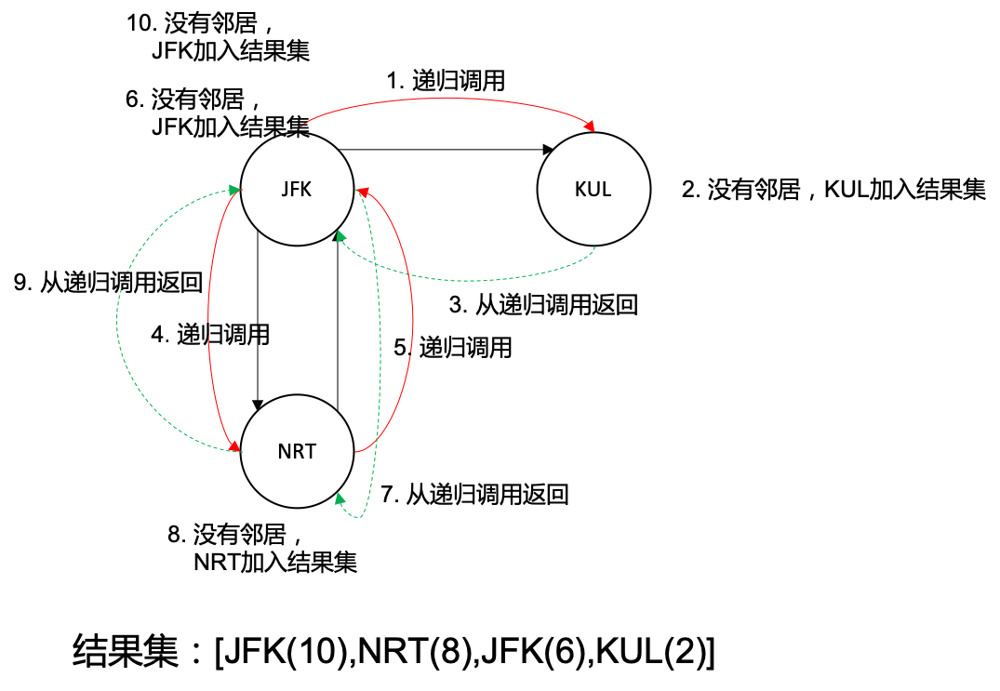

> 原文链接: https://leetcode-cn.com/problems/reconstruct-itinerary


## 英文原文
<div><p>You are given a list of airline <code>tickets</code> where <code>tickets[i] = [from<sub>i</sub>, to<sub>i</sub>]</code> represent the departure and the arrival airports of one flight. Reconstruct the itinerary in order and return it.</p>

<p>All of the tickets belong to a man who departs from <code>&quot;JFK&quot;</code>, thus, the itinerary must begin with <code>&quot;JFK&quot;</code>. If there are multiple valid itineraries, you should return the itinerary that has the smallest lexical order when read as a single string.</p>

<ul>
	<li>For example, the itinerary <code>[&quot;JFK&quot;, &quot;LGA&quot;]</code> has a smaller lexical order than <code>[&quot;JFK&quot;, &quot;LGB&quot;]</code>.</li>
</ul>

<p>You may assume all tickets form at least one valid itinerary. You must use all the tickets once and only once.</p>

<p>&nbsp;</p>
<p><strong>Example 1:</strong></p>

<pre>
<strong>Input:</strong> tickets = [[&quot;MUC&quot;,&quot;LHR&quot;],[&quot;JFK&quot;,&quot;MUC&quot;],[&quot;SFO&quot;,&quot;SJC&quot;],[&quot;LHR&quot;,&quot;SFO&quot;]]
<strong>Output:</strong> [&quot;JFK&quot;,&quot;MUC&quot;,&quot;LHR&quot;,&quot;SFO&quot;,&quot;SJC&quot;]
</pre>

<p><strong>Example 2:</strong></p>

<pre>
<strong>Input:</strong> tickets = [[&quot;JFK&quot;,&quot;SFO&quot;],[&quot;JFK&quot;,&quot;ATL&quot;],[&quot;SFO&quot;,&quot;ATL&quot;],[&quot;ATL&quot;,&quot;JFK&quot;],[&quot;ATL&quot;,&quot;SFO&quot;]]
<strong>Output:</strong> [&quot;JFK&quot;,&quot;ATL&quot;,&quot;JFK&quot;,&quot;SFO&quot;,&quot;ATL&quot;,&quot;SFO&quot;]
<strong>Explanation:</strong> Another possible reconstruction is [&quot;JFK&quot;,&quot;SFO&quot;,&quot;ATL&quot;,&quot;JFK&quot;,&quot;ATL&quot;,&quot;SFO&quot;] but it is larger in lexical order.
</pre>

<p>&nbsp;</p>
<p><strong>Constraints:</strong></p>

<ul>
	<li><code>1 &lt;= tickets.length &lt;= 300</code></li>
	<li><code>tickets[i].length == 2</code></li>
	<li><code>from<sub>i</sub>.length == 3</code></li>
	<li><code>to<sub>i</sub>.length == 3</code></li>
	<li><code>from<sub>i</sub></code> and <code>to<sub>i</sub></code> consist of uppercase English letters.</li>
	<li><code>from<sub>i</sub> != to<sub>i</sub></code></li>
</ul>
</div>

## 中文题目
<div><p>给你一份航线列表 <code>tickets</code> ，其中 <code>tickets[i] = [from<sub>i</sub>, to<sub>i</sub>]</code> 表示飞机出发和降落的机场地点。请你对该行程进行重新规划排序。</p>

<p>所有这些机票都属于一个从 <code>JFK</code>（肯尼迪国际机场）出发的先生，所以该行程必须从 <code>JFK</code> 开始。如果存在多种有效的行程，请你按字典排序返回最小的行程组合。</p>

<ul>
	<li>例如，行程 <code>["JFK", "LGA"]</code> 与 <code>["JFK", "LGB"]</code> 相比就更小，排序更靠前。</li>
</ul>

<p>假定所有机票至少存在一种合理的行程。且所有的机票 必须都用一次 且 只能用一次。</p>

<p> </p>

<p><strong>示例 1：</strong></p>

<pre>
<strong>输入：</strong>tickets = [["MUC","LHR"],["JFK","MUC"],["SFO","SJC"],["LHR","SFO"]]
<strong>输出：</strong>["JFK","MUC","LHR","SFO","SJC"]
</pre>

<p><strong>示例 2：</strong></p>

<pre>
<strong>输入：</strong>tickets = [["JFK","SFO"],["JFK","ATL"],["SFO","ATL"],["ATL","JFK"],["ATL","SFO"]]
<strong>输出：</strong>["JFK","ATL","JFK","SFO","ATL","SFO"]
<strong>解释：</strong>另一种有效的行程是 ["JFK","SFO","ATL","JFK","ATL","SFO"] ，但是它字典排序更大更靠后。
</pre>

<p> </p>

<p><strong>提示：</strong></p>

<ul>
	<li><code>1 <= tickets.length <= 300</code></li>
	<li><code>tickets[i].length == 2</code></li>
	<li><code>from<sub>i</sub>.length == 3</code></li>
	<li><code>to<sub>i</sub>.length == 3</code></li>
	<li><code>from<sub>i</sub></code> 和 <code>to<sub>i</sub></code> 由大写英文字母组成</li>
	<li><code>from<sub>i</sub> != to<sub>i</sub></code></li>
</ul>
</div>

## 通过代码
<RecoDemo>
</RecoDemo>


## 高赞题解
#### 解题思路：
首先，我们忽略按照字典顺序排列这一条件，那么这道题本质上求得的是有向图的欧拉路径。


```
严谨地说，一个连通有向图 G 有欧拉路径，指存在一个顶点，从它出发，沿着有向边的方向，可以不重复地遍历图中所有的边。

https://zh.wikipedia.org/wiki/%E4%B8%80%E7%AC%94%E7%94%BB%E9%97%AE%E9%A2%98
```


题目中给定的机场名称是图的顶点，行程是图的边。题目要求重新安排行程，从示例可以看出每个行程都必须用到且只用一次。对应到欧拉路径的定义，每条边都要走到，且不重复。那么，这道题就转化成了给定起点，求一条字典顺序最小的欧拉路径。为了引出解法，我们先放几个例子。


{:width=200}


图 1 展示了一张顶点度数都为偶数的图，首先我们忽略掉按字典顺序输出的条件。我们可以看出，如果顶点度数为偶数，那么我们先从 JFK 到 MUC 再回 JFK 到 ATL 最后返回 JFK，又或是 JFK 先到 ATL 再回 JFK 再去 MUC 再回 JFK，都是合法的路径。如果按照字典顺序输出，我们 **优先访问字典顺序小的节点ATL即可**。因此，我们 **使用贪心策略，优先访问字典顺序小的顶点**。


{:width=200}


图 2 这个例子可以看出，我们别无选择必须先从 JFK 到 NRT 再回 JFK，最后到达 KUL 作为终点。如果我们按照字典顺序先到 KUL，就进入了 “死路”。但是上一个例子我们提到了，优先访问字典顺序小的顶点，那么我们第一次肯定是先到 KUL，这就走不通了，那怎么解决呢？当我们采用 DFS 方式遍历图时，需要将访问到的节点逆序插入到结果集。因此第一个访问到的节点将出现在结果集最后面，而我们是以顺序的方式来查看结果。如果第一个访问的节点是 “孤岛节点”，他会出现在结果集的最后。当我们顺序读取结果集时，这种 “孤岛节点” 是最后遇到的，是图遍历的终点，这样就没有问题了。


{:width=500}


我们在图 3 绘制了算法执行过程，黑色实线表示图的边；红色实实线表示递归调用；绿色虚线表示递归调用返回；数字代表执行顺序；文字表示执行的操作，结果集的数字表示在第几步操作加入的。我们从 JFK 出发，沿着边到达 KUL（因为 KUL 字典顺序比 NRT 小），然后 KUL 没有临接点，将它放入结果集(2)，然后从 KUL 返回到达 JFK，注意这个是通过调用栈返回而不是沿着边返回。然后从 JFK 出发沿着边到达NRT，因为 NRT 到 JFK 有返回边，沿着边再回到 JFK。此时 JFK 的两个临接点都访问过了，我们将 JFK 加入结果集(6)。然后我们从 JFK 返回到 NRT，这是从调用栈返回。然后 NRT 的临接点都访问过了，我们将 NRT 加入结果集(8)，然后退栈回到 JFK。JFK 的所有临接点都访问过了，将 JFK 加入结果集(10)，然后退栈，整个流程结束。


在实现方面，我们使用 `Map<String, List<String>>` 存储图，Key 为顶点，`List<String>` 为临接点。为了避免存在环路导致节点重复访问，我们每访问过一条边就把它标记为访问过，或者直接将访问过的边删除。为了实现按照字典顺序访问，我们把每个顶点的临接点按照字典顺序排序。这里，我们直接将访问过的边删除，然后每次都取临接点的第一个即可满足字典顺序访问。


因为每个顶点都要访问一次，每条边都要访问一次，时间复杂度应为 $O(|V|+|E|)$，还要记得对临接点排序的时间复杂度 $O(|E|log|E|)$，算法整体时间复杂度为 $O(|E|log|E|)$；如果整个图是链式的，那么调用栈最深，空间复杂度应为 $O(|E|)$。

#### 代码：
``` [-Java]
import java.util.*;
class Solution {
    public List<String> findItinerary(List<List<String>> tickets) {
        // 因为逆序插入，所以用链表
        List<String> ans = new LinkedList<>();
        if (tickets == null || tickets.size() == 0)
            return ans;
        Map<String, List<String>> graph = new HashMap<>();
        for (List<String> pair : tickets) {
            // 因为涉及删除操作，我们用链表
            List<String> nbr = graph.computeIfAbsent(pair.get(0), k -> new LinkedList<>());
            nbr.add(pair.get(1));
        }
        // 按目的顶点排序
        graph.values().forEach(x -> x.sort(String::compareTo));
        visit(graph, "JFK", ans);
        return ans;
    }
    // DFS方式遍历图，当走到不能走为止，再将节点加入到答案
    private void visit(Map<String, List<String>> graph, String src, List<String> ans) {
        List<String> nbr = graph.get(src);
        while (nbr != null && nbr.size() > 0) {
            String dest = nbr.remove(0);
            visit(graph, dest, ans);
        }
        ans.add(0, src); // 逆序插入
    }
}
```


其实我们可以不对临接点排序，而是使用小顶堆（Java可以用优先队列）。这样我们删除边的操作和访问最小字典顺序顶点可以用出队操作代替，时间复杂度应该会比排序再删除要低一些。


``` [-Java]
import java.util.*;
class Solution {
    public List<String> findItinerary(List<List<String>> tickets) {
        // 因为逆序插入，所以用链表
        List<String> ans = new LinkedList<>();
        if (tickets == null || tickets.size() == 0)
            return ans;
        Map<String, PriorityQueue<String>> graph = new HashMap<>();
        for (List<String> pair : tickets) {
            // 因为涉及删除操作，我们用链表
            PriorityQueue<String> nbr = graph.computeIfAbsent(pair.get(0), k -> new PriorityQueue<>());
            nbr.add(pair.get(1));
        }
        visit(graph, "JFK", ans);
        return ans;
    }
    // DFS方式遍历图，当走到不能走为止，再将节点加入到答案
    private void visit(Map<String, PriorityQueue<String>> graph, String src, List<String> ans) {
        PriorityQueue<String> nbr = graph.get(src);
        while (nbr != null && nbr.size() > 0) {
            String dest = nbr.poll();
            visit(graph, dest, ans);
        }
        ans.add(0, src); // 逆序插入
    }
}
```

进一步优化，将递归算法改为迭代算法：

```
import java.util.*;

class Solution {
    public List<String> findItinerary(List<List<String>> tickets) {
        // 因为逆序插入，所以用链表
        List<String> ans = new LinkedList<>();

        if (tickets == null || tickets.size() == 0)
            return ans;

        Map<String, PriorityQueue<String>> graph = new HashMap<>();

        for (List<String> pair : tickets) {
            // 因为涉及删除操作，我们用链表
            PriorityQueue<String> nbr = graph.computeIfAbsent(pair.get(0), k -> new PriorityQueue<>());
            nbr.add(pair.get(1));
        }

        // 按目的顶点排序

        visit(graph, "JFK", ans);

        return ans;
    }

    // DFS方式遍历图，当走到不能走为止，再将节点加入到答案
    private void visit(Map<String, PriorityQueue<String>> graph, String src, List<String> ans) {

        Stack<String> stack = new Stack<>();

        stack.push(src);

        while (!stack.isEmpty()) {
            PriorityQueue<String> nbr;

            while ((nbr = graph.get(stack.peek())) != null &&
                    nbr.size() > 0) {
                stack.push(nbr.poll());
            }
            ans.add(0, stack.pop());
        }
    }
}
```


## 统计信息
| 通过次数 | 提交次数 | AC比率 |
| :------: | :------: | :------: |
|    42320    |    94207    |   44.9%   |

## 提交历史
| 提交时间 | 提交结果 | 执行时间 |  内存消耗  | 语言 |
| :------: | :------: | :------: | :--------: | :--------: |
