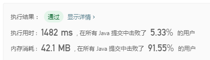
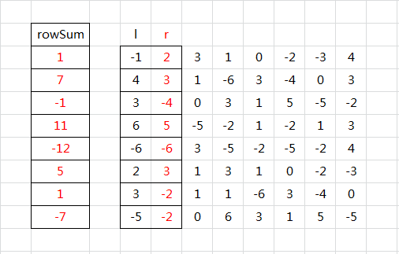

> 原文链接: https://leetcode-cn.com/problems/max-sum-of-rectangle-no-larger-than-k


## 英文原文
<div><p>Given an <code>m x n</code> matrix <code>matrix</code> and an integer <code>k</code>, return <em>the max sum of a rectangle in the matrix such that its sum is no larger than</em> <code>k</code>.</p>

<p>It is <strong>guaranteed</strong> that there will be a rectangle with a sum no larger than <code>k</code>.</p>

<p>&nbsp;</p>
<p><strong>Example 1:</strong></p>

<pre>
<strong>Input:</strong> matrix = [[1,0,1],[0,-2,3]], k = 2
<strong>Output:</strong> 2
<strong>Explanation:</strong> Because the sum of the blue rectangle [[0, 1], [-2, 3]] is 2, and 2 is the max number no larger than k (k = 2).
</pre>

<p><strong>Example 2:</strong></p>

<pre>
<strong>Input:</strong> matrix = [[2,2,-1]], k = 3
<strong>Output:</strong> 3
</pre>

<p>&nbsp;</p>
<p><strong>Constraints:</strong></p>

<ul>
	<li><code>m == matrix.length</code></li>
	<li><code>n == matrix[i].length</code></li>
	<li><code>1 &lt;= m, n &lt;= 100</code></li>
	<li><code>-100 &lt;= matrix[i][j] &lt;= 100</code></li>
	<li><code>-10<sup>5</sup> &lt;= k &lt;= 10<sup>5</sup></code></li>
</ul>

<p>&nbsp;</p>
<p><strong>Follow up:</strong> What if the number of rows is much larger than the number of columns?</p>
</div>

## 中文题目
<div><p>给你一个 <code>m x n</code> 的矩阵 <code>matrix</code> 和一个整数 <code>k</code> ，找出并返回矩阵内部矩形区域的不超过 <code>k</code> 的最大数值和。</p>

<p>题目数据保证总会存在一个数值和不超过 <code>k</code> 的矩形区域。</p>

<p> </p>

<p><strong>示例 1：</strong></p>

<pre>
<strong>输入：</strong>matrix = [[1,0,1],[0,-2,3]], k = 2
<strong>输出：</strong>2
<strong>解释：</strong>蓝色边框圈出来的矩形区域 <code>[[0, 1], [-2, 3]]</code> 的数值和是 2，且 2 是不超过 k 的最大数字（k = 2）。
</pre>

<p><strong>示例 2：</strong></p>

<pre>
<strong>输入：</strong>matrix = [[2,2,-1]], k = 3
<strong>输出：</strong>3
</pre>

<p> </p>

<p><strong>提示：</strong></p>

<ul>
	<li><code>m == matrix.length</code></li>
	<li><code>n == matrix[i].length</code></li>
	<li><code>1 <= m, n <= 100</code></li>
	<li><code>-100 <= matrix[i][j] <= 100</code></li>
	<li><code>-10<sup>5</sup> <= k <= 10<sup>5</sup></code></li>
</ul>

<p> </p>

<p><strong>进阶：</strong>如果行数远大于列数，该如何设计解决方案？</p>
</div>

## 通过代码
<RecoDemo>
</RecoDemo>


## 高赞题解
### 一、暴力 + 动态规划

- 枚举矩形的 左上角、右下角，从 `(i1, j1)` 到 `(i2, j2)`
- 从左上角、到右下角的矩形区域数值和：黄色 = 绿色 + 橙色 - 蓝色 + `(i2, j2)`

<, , , >

- 状态转移方程为 `dp(i1,j1,i2,j2) = dp(i1,j1,i2 - 1,j2) + dp(i1,j1,i2,j2 - 1) - dp(i1,j1,i2 - 1,j2 - 1) + matrix[i2 - 1][j2 - 1];`
- 四层遍历，时间复杂度 $O(m^2n^2)$，空间复杂度 $O(m^2n^2)$
- 超出内存限制
  - 思路有戏，进一步压缩状态试试



```java
public int maxSumSubmatrix(int[][] matrix, int k) {
    int rows = matrix.length, cols = matrix[0].length, max = Integer.MIN_VALUE;
    int[][][][] dp = new int[rows + 1][cols + 1][rows + 1][cols + 1]; // from (i1,j1) to (i2,j2)
    for (int i1 = 1; i1 <= rows; i1++) {
        for (int j1 = 1; j1 <= cols; j1++) {
            dp[i1][j1][i1][j1] = matrix[i1 - 1][j1 - 1];
            for (int i2 = i1; i2 <= rows; i2++) {
                for (int j2 = j1; j2 <= cols; j2++) {
                    dp[i1][j1][i2][j2] = dp[i1][j1][i2 - 1][j2] + dp[i1][j1][i2][j2 - 1] - dp[i1][j1][i2 - 1][j2 - 1] + matrix[i2 - 1][j2 - 1];
                    if (dp[i1][j1][i2][j2] <= k && dp[i1][j1][i2][j2] > max) max = dp[i1][j1][i2][j2];
                }
            }
        }
    }
    return max;
}
```

### 二、暴力 + 动态规划 + 状态压缩

- 从上述代码发现，每次更换左上角 `(i, j)` 之后，之前记录的值都没用过了
- 尝试每次更换左上角时就重复利用 `dp`，故只需记录右下角即可
- 依然四层遍历，时间复杂度 $O(m^2n^2)$，空间复杂度 $O(mn)$



```java
public int maxSumSubmatrix(int[][] matrix, int k) {
    int rows = matrix.length, cols = matrix[0].length, max = Integer.MIN_VALUE;
    for (int i1 = 1; i1 <= rows; i1++) {
        for (int j1 = 1; j1 <= cols; j1++) {
            int[][] dp = new int[rows + 1][cols + 1]; // renew  // from (i1,j1) to (i2,j2)
            dp[i1][j1] = matrix[i1 - 1][j1 - 1];
            for (int i2 = i1; i2 <= rows; i2++) {
                for (int j2 = j1; j2 <= cols; j2++) {
                    dp[i2][j2] = dp[i2 - 1][j2] + dp[i2][j2 - 1] - dp[i2 - 1][j2 - 1] + matrix[i2 - 1][j2 - 1];
                    if (dp[i2][j2] <= k && dp[i2][j2] > max) max = dp[i2][j2];
                }
            }
        }
    }
    return max;
}
```

### 三、数组滚动

- 看过大神的思路 [@powcai 固定左右边界，前缀和+二分](https://leetcode-cn.com/problems/max-sum-of-rectangle-no-larger-than-k/solution/gu-ding-zuo-you-bian-jie-qian-zhui-he-er-fen-by-po/)
  - **固定左右边界** ……这句一下就把思路打开了
  - 虽然看不懂 python..但还是不能放弃呀

#### 先固定左右边界，不断压入 行累计数组

```java
public int maxSumSubmatrix(int[][] matrix, int k) {
    int rows = matrix.length, cols = matrix[0].length, max = Integer.MIN_VALUE;
    // O(cols ^ 2 * rows)
    for (int l = 0; l < cols; l++) { // 枚举左边界
        int[] rowSum = new int[rows]; // 左边界改变才算区域的重新开始
        for (int r = l; r < cols; r++) { // 枚举右边界
            for (int i = 0; i < rows; i++) { // 按每一行累计到 dp
                rowSum[i] += matrix[i][r];
            }

            // ？？？
        }
    }
    return max;
}
```

#### 画图感受一下

- 左边界 从 `0` 开始
- 右边界从左边界开始（即同一列）
- `rowSum` 数组，记录两个边界中间的 **每一行** 的 **和**



- 表演开始了
- 右边界 `r` 向右移动
- `rowSum` 数组，记录两个边界中间的 **每一行** 的 **和**
  - 累加新来的



- 这张过后你也豁然开朗了吗
- 右边界 `r` 继续向右移动
- `rowSum` 数组，仍然记录两个边界中间的 **每一行** 的 **和**
  - 继续累加新来的即可



#### rowSum 有何用

- 以 `l`、`r` 为左右界的，任意矩形的面积，即 **rowSum 连续子数组 的 和**



- 再让我们回到代码

```java
public int maxSumSubmatrix(int[][] matrix, int k) {
    int rows = matrix.length, cols = matrix[0].length, max = Integer.MIN_VALUE;
    // O(cols ^ 2 * rows)
    for (int l = 0; l < cols; l++) { // 枚举左边界
        int[] rowSum = new int[rows]; // 左边界改变才算区域的重新开始
        for (int r = l; r < cols; r++) { // 枚举右边界
            for (int i = 0; i < rows; i++) { // 按每一行累计到 dp
                rowSum[i] += matrix[i][r];
            }

            // 求 rowSum 连续子数组 的 和
            // 和 尽量大，但不大于 k
            max = Math.max(max, dpmax(rowSum, k));
        }
    }
    return max;
}

// 在数组 arr 中，求不超过 k 的最大值
private int dpmax(int[] arr, int k) {
    // TODO
}
```

- 问题进入到最后一个环节，完善 `dpmax()`

#### 暴力求最大值

- 枚举子数组起点、终点，累计中间元素
- 此时的运行时间已经起飞很多了




```java
// 在数组 arr 中，求不超过 k 的最大值
private int dpmax(int[] arr, int k) {
    // O(rows ^ 2)
    int max = Integer.MIN_VALUE;
    for (int l = 0; l < arr.length; l++) {
        int sum = 0;
        for (int r = l; r < arr.length; r++) {
            sum += arr[r];
            if (sum > max && sum <= k) max = sum;
        }
    }
    return max;
}
```

- 可是我们就是要完美一下呢

#### 并不是所有时候都值得遍历找 k

- 先来这题：[53. 最大子序和](https://leetcode-cn.com/problems/maximum-subarray/)，有一种解法是

```java
public int maxSubArray(int[] nums) {
    int len = nums.length, max, dp;
    if (len == 0) return 0;
    // 要尽量大，就尽量不要负数
    dp = max = nums[0];
    for (int i = 1; i < len; i++) {
        if (dp > 0) dp += nums[i]; // 之前的和 > 0，那就累计进来
        else dp = nums[i]; // 之前的和 <= 0，那就重新开始
        if (dp > max) max = dp; // max = Math.max(max, dp);
    }
    return max;
}
```

#### 先画图感受一下

- 开始遍历数组 `[4, 3, -1, -7, -9, 6, 2, -7]`



- 此时出现了 **之前的和小于0** 的情况
- 那下一个数开始，咱就不要之前的了，另起炉灶（还是连续两次另立炉灶）



- 最终得到 `[6, 2]` 这个区间的子数组和最大，最大值 `8`
- 这里复杂的是还要 **不大于 `k`** 怎么办？

#### 继续深入细究 k

- 假设 `k = Integer.MAX_VALUE` ，那么上述数组不小于 `k` 的最大子数组和为 `8`
- 假设 `k = 100` ，那么上述数组不小于 `k` 的最大子数组和 **仍然** 为 `8`
- 你也许注意到了，要是 `k` 很大，大过上述滚动玩法的最大值，那结果就是上述的 `8`
- 那如果 `k == 8` 呢？太棒了，就是 `8` 咯，最好的最大值
- 那如果 `k < 8` 呢，假设 `k = 5`
- 回顾我们 `dp` 一路滚过来的值 `[4, 7, 6, -1, -9, 6, 8, 1]` 
  - 难道不大于 `k = 5` 的子数组的最大值就是 `4` 吗？是的，这里看起来是
  - 注意这是 `dp` 一路滚来的值，不是数组原值
    - 原数组是 `[4, 3, -1, -7, -9, 6, 2, -7]`
- 如果我们再在原数组后增加 `14` 形成 `[4, 3, -1, -7, -9, 6, 2, -7, 14]`
- 则结果应该是 **整个数组** 的和 `5`，而不是 **因为前面的 `-9` 而断开累计**
- 怎么办？——暴力就好了（在下只能暴力了...还有别的法子吗...）



```java []
// 隔壁有完整代码
// 在数组 arr 中，求不超过 k 的最大值
private int dpmax(int[] arr, int k) {
    int rollSum = arr[0], rollMax = rollSum;
    // O(rows)
    for (int i = 1; i < arr.length; i++) {
        if (rollSum > 0) rollSum += arr[i];
        else rollSum = arr[i];
        if (rollSum > rollMax) rollMax = rollSum;
    }
    if (rollMax <= k) return rollMax;
    // O(rows ^ 2)
    int max = Integer.MIN_VALUE;
    for (int l = 0; l < arr.length; l++) {
        int sum = 0;
        for (int r = l; r < arr.length; r++) {
            sum += arr[r];
            if (sum > max && sum <= k) max = sum;
            if (max == k) return k; // 尽量提前
        }
    }
    return max;
}
```
```java []
// 附上完整代码
public int maxSumSubmatrix(int[][] matrix, int k) {
    int rows = matrix.length, cols = matrix[0].length, max = Integer.MIN_VALUE;
    // O(cols ^ 2 * rows)
    for (int l = 0; l < cols; l++) { // 枚举左边界
        int[] rowSum = new int[rows]; // 左边界改变才算区域的重新开始
        for (int r = l; r < cols; r++) { // 枚举右边界
            for (int i = 0; i < rows; i++) { // 按每一行累计到 dp
                rowSum[i] += matrix[i][r];
            }
            max = Math.max(max, dpmax(rowSum, k));
            if (max == k) return k; // 尽量提前
        }
    }
    return max;
}
// 在数组 arr 中，求不超过 k 的最大值
private int dpmax(int[] arr, int k) {
    int rollSum = arr[0], rollMax = rollSum;
    // O(rows)
    for (int i = 1; i < arr.length; i++) {
        if (rollSum > 0) rollSum += arr[i];
        else rollSum = arr[i];
        if (rollSum > rollMax) rollMax = rollSum;
    }
    if (rollMax <= k) return rollMax;
    // O(rows ^ 2)
    int max = Integer.MIN_VALUE;
    for (int l = 0; l < arr.length; l++) {
        int sum = 0;
        for (int r = l; r < arr.length; r++) {
            sum += arr[r];
            if (sum > max && sum <= k) max = sum;
            if (max == k) return k; // 尽量提前
        }
    }
    return max;
}
```

- 得，愉快的大半天又没了，可是你能看到这儿，笔者还是很开心，值了：）

## 统计信息
| 通过次数 | 提交次数 | AC比率 |
| :------: | :------: | :------: |
|    33688    |    68968    |   48.8%   |

## 提交历史
| 提交时间 | 提交结果 | 执行时间 |  内存消耗  | 语言 |
| :------: | :------: | :------: | :--------: | :--------: |
