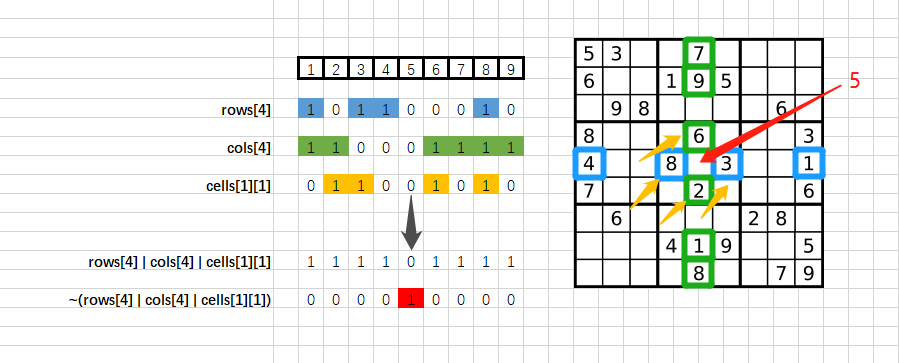

> 原文链接: https://leetcode-cn.com/problems/sudoku-solver


## 英文原文
<div><p>Write a program to solve a Sudoku puzzle by filling the empty cells.</p>

<p>A sudoku solution must satisfy <strong>all of the following rules</strong>:</p>

<ol>
	<li>Each of the digits <code>1-9</code> must occur exactly once in each row.</li>
	<li>Each of the digits <code>1-9</code> must occur exactly once in each column.</li>
	<li>Each of the digits <code>1-9</code> must occur exactly once in each of the 9 <code>3x3</code> sub-boxes of the grid.</li>
</ol>

<p>The <code>&#39;.&#39;</code> character indicates empty cells.</p>

<p>&nbsp;</p>
<p><strong>Example 1:</strong></p>

<pre>
<strong>Input:</strong> board = [[&quot;5&quot;,&quot;3&quot;,&quot;.&quot;,&quot;.&quot;,&quot;7&quot;,&quot;.&quot;,&quot;.&quot;,&quot;.&quot;,&quot;.&quot;],[&quot;6&quot;,&quot;.&quot;,&quot;.&quot;,&quot;1&quot;,&quot;9&quot;,&quot;5&quot;,&quot;.&quot;,&quot;.&quot;,&quot;.&quot;],[&quot;.&quot;,&quot;9&quot;,&quot;8&quot;,&quot;.&quot;,&quot;.&quot;,&quot;.&quot;,&quot;.&quot;,&quot;6&quot;,&quot;.&quot;],[&quot;8&quot;,&quot;.&quot;,&quot;.&quot;,&quot;.&quot;,&quot;6&quot;,&quot;.&quot;,&quot;.&quot;,&quot;.&quot;,&quot;3&quot;],[&quot;4&quot;,&quot;.&quot;,&quot;.&quot;,&quot;8&quot;,&quot;.&quot;,&quot;3&quot;,&quot;.&quot;,&quot;.&quot;,&quot;1&quot;],[&quot;7&quot;,&quot;.&quot;,&quot;.&quot;,&quot;.&quot;,&quot;2&quot;,&quot;.&quot;,&quot;.&quot;,&quot;.&quot;,&quot;6&quot;],[&quot;.&quot;,&quot;6&quot;,&quot;.&quot;,&quot;.&quot;,&quot;.&quot;,&quot;.&quot;,&quot;2&quot;,&quot;8&quot;,&quot;.&quot;],[&quot;.&quot;,&quot;.&quot;,&quot;.&quot;,&quot;4&quot;,&quot;1&quot;,&quot;9&quot;,&quot;.&quot;,&quot;.&quot;,&quot;5&quot;],[&quot;.&quot;,&quot;.&quot;,&quot;.&quot;,&quot;.&quot;,&quot;8&quot;,&quot;.&quot;,&quot;.&quot;,&quot;7&quot;,&quot;9&quot;]]
<strong>Output:</strong> [[&quot;5&quot;,&quot;3&quot;,&quot;4&quot;,&quot;6&quot;,&quot;7&quot;,&quot;8&quot;,&quot;9&quot;,&quot;1&quot;,&quot;2&quot;],[&quot;6&quot;,&quot;7&quot;,&quot;2&quot;,&quot;1&quot;,&quot;9&quot;,&quot;5&quot;,&quot;3&quot;,&quot;4&quot;,&quot;8&quot;],[&quot;1&quot;,&quot;9&quot;,&quot;8&quot;,&quot;3&quot;,&quot;4&quot;,&quot;2&quot;,&quot;5&quot;,&quot;6&quot;,&quot;7&quot;],[&quot;8&quot;,&quot;5&quot;,&quot;9&quot;,&quot;7&quot;,&quot;6&quot;,&quot;1&quot;,&quot;4&quot;,&quot;2&quot;,&quot;3&quot;],[&quot;4&quot;,&quot;2&quot;,&quot;6&quot;,&quot;8&quot;,&quot;5&quot;,&quot;3&quot;,&quot;7&quot;,&quot;9&quot;,&quot;1&quot;],[&quot;7&quot;,&quot;1&quot;,&quot;3&quot;,&quot;9&quot;,&quot;2&quot;,&quot;4&quot;,&quot;8&quot;,&quot;5&quot;,&quot;6&quot;],[&quot;9&quot;,&quot;6&quot;,&quot;1&quot;,&quot;5&quot;,&quot;3&quot;,&quot;7&quot;,&quot;2&quot;,&quot;8&quot;,&quot;4&quot;],[&quot;2&quot;,&quot;8&quot;,&quot;7&quot;,&quot;4&quot;,&quot;1&quot;,&quot;9&quot;,&quot;6&quot;,&quot;3&quot;,&quot;5&quot;],[&quot;3&quot;,&quot;4&quot;,&quot;5&quot;,&quot;2&quot;,&quot;8&quot;,&quot;6&quot;,&quot;1&quot;,&quot;7&quot;,&quot;9&quot;]]
<strong>Explanation:</strong>&nbsp;The input board is shown above and the only valid solution is shown below:


</pre>

<p>&nbsp;</p>
<p><strong>Constraints:</strong></p>

<ul>
	<li><code>board.length == 9</code></li>
	<li><code>board[i].length == 9</code></li>
	<li><code>board[i][j]</code> is a digit or <code>&#39;.&#39;</code>.</li>
	<li>It is <strong>guaranteed</strong> that the input board has only one solution.</li>
</ul>
</div>

## 中文题目
<div><p>编写一个程序，通过填充空格来解决数独问题。</p>

<p>数独的解法需<strong> 遵循如下规则</strong>：</p>

<ol>
	<li>数字 <code>1-9</code> 在每一行只能出现一次。</li>
	<li>数字 <code>1-9</code> 在每一列只能出现一次。</li>
	<li>数字 <code>1-9</code> 在每一个以粗实线分隔的 <code>3x3</code> 宫内只能出现一次。（请参考示例图）</li>
</ol>

<p>数独部分空格内已填入了数字，空白格用 <code>'.'</code> 表示。</p>

<p> </p>

<div class="top-view__1vxA">
<div class="original__bRMd">
<div>
<p><strong>示例：</strong></p>

<pre>
<strong>输入：</strong>board = [["5","3",".",".","7",".",".",".","."],["6",".",".","1","9","5",".",".","."],[".","9","8",".",".",".",".","6","."],["8",".",".",".","6",".",".",".","3"],["4",".",".","8",".","3",".",".","1"],["7",".",".",".","2",".",".",".","6"],[".","6",".",".",".",".","2","8","."],[".",".",".","4","1","9",".",".","5"],[".",".",".",".","8",".",".","7","9"]]
<strong>输出：</strong>[["5","3","4","6","7","8","9","1","2"],["6","7","2","1","9","5","3","4","8"],["1","9","8","3","4","2","5","6","7"],["8","5","9","7","6","1","4","2","3"],["4","2","6","8","5","3","7","9","1"],["7","1","3","9","2","4","8","5","6"],["9","6","1","5","3","7","2","8","4"],["2","8","7","4","1","9","6","3","5"],["3","4","5","2","8","6","1","7","9"]]
<strong>解释：</strong>输入的数独如上图所示，唯一有效的解决方案如下所示：


</pre>

<p> </p>

<p><strong>提示：</strong></p>

<ul>
	<li><code>board.length == 9</code></li>
	<li><code>board[i].length == 9</code></li>
	<li><code>board[i][j]</code> 是一位数字或者 <code>'.'</code></li>
	<li>题目数据 <strong>保证</strong> 输入数独仅有一个解</li>
</ul>
</div>
</div>
</div>
</div>

## 通过代码
<RecoDemo>
</RecoDemo>


## 高赞题解
### 思路

1. 状态压缩

    11. 使用 `bitset<9>` 来压缩存储每一行、每一列、每一个 `3x3` 宫格中 `1-9` 是否出现

    12. 这样每一个格子就可以计算出所有不能填的数字，然后得到所有**能填的数字** `getPossibleStatus()`

    13. 填入数字和回溯时，只需要更新存储信息

    14. 每个格子在使用时，会根据存储信息重新计算**能填的数字**


2. 回溯

    21. 每次都使用 `getNext()` 选择**能填的数字**最少的格子开始填，这样填错的概率最小，回溯次数也会变少

    22. 使用 `fillNum()` 在填入和回溯时负责更新存储信息

    23. 一旦全部填写成功，一路返回 true ，结束递归


### 图解




### 答题

```C++ []

class Solution {

public:

    bitset<9> getPossibleStatus(int x, int y)

    {

        return ~(rows[x] | cols[y] | cells[x / 3][y / 3]);

    }


    vector<int> getNext(vector<vector<char>>& board)

    {

        vector<int> ret;

        int minCnt = 10;

        for (int i = 0; i < board.size(); i++)

        {

            for (int j = 0; j < board[i].size(); j++)

            {

                if (board[i][j] != '.') continue;

                auto cur = getPossibleStatus(i, j);

                if (cur.count() >= minCnt) continue;

                ret = { i, j };

                minCnt = cur.count();

            }

        }

        return ret;

    }


    void fillNum(int x, int y, int n, bool fillFlag)

    {

        rows[x][n] = (fillFlag) ? 1 : 0;

        cols[y][n] = (fillFlag) ? 1 : 0;

        cells[x/3][y/3][n] = (fillFlag) ? 1: 0;

    }

    

    bool dfs(vector<vector<char>>& board, int cnt)

    {

        if (cnt == 0) return true;


        auto next = getNext(board);

        auto bits = getPossibleStatus(next[0], next[1]);

        for (int n = 0; n < bits.size(); n++)

        {

            if (!bits.test(n)) continue;

            fillNum(next[0], next[1], n, true);

            board[next[0]][next[1]] = n + '1';

            if (dfs(board, cnt - 1)) return true;

            board[next[0]][next[1]] = '.';

            fillNum(next[0], next[1], n, false);

        }

        return false;

    }


    void solveSudoku(vector<vector<char>>& board) 

    {

        rows = vector<bitset<9>>(9, bitset<9>());

        cols = vector<bitset<9>>(9, bitset<9>());

        cells = vector<vector<bitset<9>>>(3, vector<bitset<9>>(3, bitset<9>()));


        int cnt = 0;

        for (int i = 0; i < board.size(); i++)

        {

            for (int j = 0; j < board[i].size(); j++)

            {

                cnt += (board[i][j] == '.');

                if (board[i][j] == '.') continue;

                int n = board[i][j] - '1';

                rows[i] |= (1 << n);

                cols[j] |= (1 << n);

                cells[i / 3][j / 3] |= (1 << n);

            }

        }

        dfs(board, cnt);

    }


private:

    vector<bitset<9>> rows;

    vector<bitset<9>> cols;

    vector<vector<bitset<9>>> cells;

};

```


感谢 [@cocowy](/u/cocowy/) 提供的 bitset 风格的 `fillNum()` ，可读性得到质的提升，已更新到上面

下面是我原来位运算风格的 `fillNum()`

```C++ []

    void fillNum(int x, int y, int n, bool fillFlag)

    {

        bitset<9> pick(1 << n);

        rows[x] = (fillFlag) ? (rows[x] | pick) : (rows[x] ^ pick);

        cols[y] = (fillFlag) ? (cols[y] | pick) : (cols[y] ^ pick);

        cells[x / 3][y / 3] = (fillFlag) ? (cells[x / 3][y / 3] | pick) : (cells[x / 3][y / 3] ^ pick);

    }

```


### 执行时间


对格子填入顺序的选择，使得搜索效率大大提升（加上运气好），击败 100%   

得益于状态压缩，内存的使用也击败 100% 

（别太较真儿，看个乐就好）


### 致谢


感谢您的观看，希望对您有帮助，欢迎热烈的交流！  


**如果感觉还不错就点个赞吧~**

## 统计信息
| 通过次数 | 提交次数 | AC比率 |
| :------: | :------: | :------: |
|    109590    |    163431    |   67.1%   |

## 提交历史
| 提交时间 | 提交结果 | 执行时间 |  内存消耗  | 语言 |
| :------: | :------: | :------: | :--------: | :--------: |


## 相似题目
|                             题目                             | 难度 |
| :----------------------------------------------------------: | :---------: |
| [有效的数独](https://leetcode-cn.com/problems/valid-sudoku/) | 中等|
| [不同路径 III](https://leetcode-cn.com/problems/unique-paths-iii/) | 困难|
