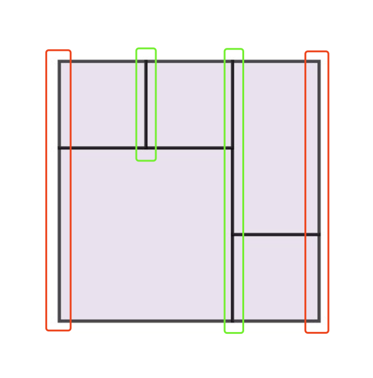
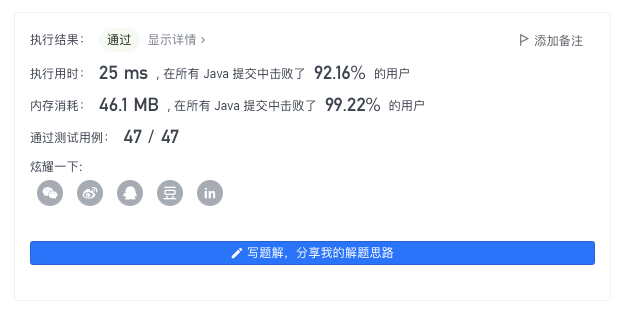

> 原文链接: https://leetcode-cn.com/problems/perfect-rectangle


## 英文原文
<div><p>Given an array <code>rectangles</code> where <code>rectangles[i] = [x<sub>i</sub>, y<sub>i</sub>, a<sub>i</sub>, b<sub>i</sub>]</code> represents an axis-aligned rectangle. The bottom-left point of the rectangle is <code>(x<sub>i</sub>, y<sub>i</sub>)</code> and the top-right point of it is <code>(a<sub>i</sub>, b<sub>i</sub>)</code>.</p>

<p>Return <code>true</code> <em>if all the rectangles together form an exact cover of a rectangular region</em>.</p>

<p>&nbsp;</p>
<p><strong>Example 1:</strong></p>

<pre>
<strong>Input:</strong> rectangles = [[1,1,3,3],[3,1,4,2],[3,2,4,4],[1,3,2,4],[2,3,3,4]]
<strong>Output:</strong> true
<strong>Explanation:</strong> All 5 rectangles together form an exact cover of a rectangular region.
</pre>

<p><strong>Example 2:</strong></p>

<pre>
<strong>Input:</strong> rectangles = [[1,1,2,3],[1,3,2,4],[3,1,4,2],[3,2,4,4]]
<strong>Output:</strong> false
<strong>Explanation:</strong> Because there is a gap between the two rectangular regions.
</pre>

<p><strong>Example 3:</strong></p>

<pre>
<strong>Input:</strong> rectangles = [[1,1,3,3],[3,1,4,2],[1,3,2,4],[3,2,4,4]]
<strong>Output:</strong> false
<strong>Explanation:</strong> Because there is a gap in the top center.
</pre>

<p><strong>Example 4:</strong></p>

<pre>
<strong>Input:</strong> rectangles = [[1,1,3,3],[3,1,4,2],[1,3,2,4],[2,2,4,4]]
<strong>Output:</strong> false
<strong>Explanation:</strong> Because two of the rectangles overlap with each other.
</pre>

<p>&nbsp;</p>
<p><strong>Constraints:</strong></p>

<ul>
	<li><code>1 &lt;= rectangles.length &lt;= 2 * 10<sup>4</sup></code></li>
	<li><code>rectangles[i].length == 4</code></li>
	<li><code>-10<sup>5</sup> &lt;= x<sub>i</sub>, y<sub>i</sub>, a<sub>i</sub>, b<sub>i</sub> &lt;= 10<sup>5</sup></code></li>
</ul>
</div>

## 中文题目
<div><p>给你一个数组 <code>rectangles</code> ，其中 <code>rectangles[i] = [x<sub>i</sub>, y<sub>i</sub>, a<sub>i</sub>, b<sub>i</sub>]</code> 表示一个坐标轴平行的矩形。这个矩形的左下顶点是 <code>(x<sub>i</sub>, y<sub>i</sub>)</code> ，右上顶点是 <code>(a<sub>i</sub>, b<sub>i</sub>)</code> 。</p>

<p>如果所有矩形一起精确覆盖了某个矩形区域，则返回 <code>true</code> ；否则，返回 <code>false</code> 。</p>
&nbsp;

<p><strong>示例 1：</strong></p>

<pre>
<strong>输入：</strong>rectangles = [[1,1,3,3],[3,1,4,2],[3,2,4,4],[1,3,2,4],[2,3,3,4]]
<strong>输出：</strong>true
<strong>解释：</strong>5 个矩形一起可以精确地覆盖一个矩形区域。 
</pre>

<p><strong>示例 2：</strong></p>

<pre>
<strong>输入：</strong>rectangles = [[1,1,2,3],[1,3,2,4],[3,1,4,2],[3,2,4,4]]
<strong>输出：</strong>false
<strong>解释：</strong>两个矩形之间有间隔，无法覆盖成一个矩形。</pre>

<p><strong>示例 3：</strong></p>

<pre>
<strong>输入：</strong>rectangles = [[1,1,3,3],[3,1,4,2],[1,3,2,4],[3,2,4,4]]
<strong>输出：</strong>false
<strong>解释：</strong>图形顶端留有空缺，无法覆盖成一个矩形。</pre>

<p><strong>示例 4：</strong></p>

<pre>
<strong>输入：</strong>rectangles = [[1,1,3,3],[3,1,4,2],[1,3,2,4],[2,2,4,4]]
<strong>输出：</strong>false
<strong>解释：</strong>因为中间有相交区域，虽然形成了矩形，但不是精确覆盖。</pre>

<p>&nbsp;</p>

<p><strong>提示：</strong></p>

<ul>
	<li><code>1 &lt;= rectangles.length &lt;= 2 * 10<sup>4</sup></code></li>
	<li><code>rectangles[i].length == 4</code></li>
	<li><code>-10<sup>5</sup> &lt;= x<sub>i</sub>, y<sub>i</sub>, a<sub>i</sub>, b<sub>i</sub> &lt;= 10<sup>5</sup></code></li>
</ul>
</div>

## 通过代码
<RecoDemo>
</RecoDemo>


## 高赞题解
## 扫描线

将每个矩形 $rectangles[i]$ 看做两条竖直方向的边，使用 $(x, y1, y2)$ 的形式进行存储（其中 $y1$ 代表该竖边的下端点，$y2$ 代表竖边的上端点），同时为了区分是矩形的左边还是右边，再引入一个标识位，即以四元组 $(x, y1, y2, flag)$ 的形式进行存储。

一个完美矩形的充要条件为：**对于完美矩形的每一条非边缘的竖边，都「成对」出现（存在两条完全相同的左边和右边重叠在一起）；对于完美矩形的两条边缘竖边，均独立为一条连续的（不重叠）的竖边。**

如图（红色框的为「完美矩形的边缘竖边」，绿框的为「完美矩形的非边缘竖边」）：



* 绿色：非边缘竖边必然有成对的左右两条完全相同的竖边重叠在一起；
* 红色：边缘竖边由于只有单边，必然不重叠，且连接成一条完成的竖边。



**代码（感谢 [@ricecake](/u/ricecake-5/) 同学提供的 Python3 代码）：**
```Java []
class Solution {
    public boolean isRectangleCover(int[][] rectangles) {
        int n = rectangles.length;
        int[][] rs = new int[n * 2][4];
        for (int i = 0, idx = 0; i < n; i++) {
            int[] re = rectangles[i];
            rs[idx++] = new int[]{re[0], re[1], re[3], 1};
            rs[idx++] = new int[]{re[2], re[1], re[3], -1};
        }
        Arrays.sort(rs, (a,b)->{
            if (a[0] != b[0]) return a[0] - b[0];
            return a[1] - b[1];
        });
        n *= 2;
        // 分别存储相同的横坐标下「左边的线段」和「右边的线段」 (y1, y2)
        List<int[]> l1 = new ArrayList<>(), l2 = new ArrayList<>(); 
        for (int l = 0; l < n; ) {
            int r = l;
            l1.clear(); l2.clear();
            // 找到横坐标相同部分
            while (r < n && rs[r][0] == rs[l][0]) r++;
            for (int i = l; i < r; i++) {
                int[] cur = new int[]{rs[i][1], rs[i][2]};
                List<int[]> list = rs[i][3] == 1 ? l1 : l2;
                if (list.isEmpty()) {
                    list.add(cur);
                } else {
                    int[] prev = list.get(list.size() - 1);
                    if (cur[0] < prev[1]) return false; // 存在重叠
                    else if (cur[0] == prev[1]) prev[1] = cur[1]; // 首尾相连
                    else list.add(cur); 
                }
            }
            if (l > 0 && r < n) {
                // 若不是完美矩形的边缘竖边，检查是否成对出现
                if (l1.size() != l2.size()) return false;
                for (int i = 0; i < l1.size(); i++) {
                    if (l1.get(i)[0] == l2.get(i)[0] && l1.get(i)[1] == l2.get(i)[1]) continue;
                    return false;
                }
            } else {
                // 若是完美矩形的边缘竖边，检查是否形成完整一段
                if (l1.size() + l2.size() != 1) return false;
            }
            l = r;
        }
        return true;
    }
}
```
```Python3 []
class Solution:
    def isRectangleCover(self, rectangles: List[List[int]]) -> bool:
        if not rectangles:
            return False
        n = len(rectangles)
        # 解析数据，(x, y, a, b) -> (x, y, b, 1) ，(a, y, b, -1)
        # 最后一位表示是矩形的左边缘还是右边缘（即扫描线的“上升”和“下降”）
        rs = []
        for rec in rectangles:
            x, y, a, b = rec
            rs.append([x, y, b, 1])
            rs.append([a, y, b, -1])
        rs.sort()
        
        l = r = 0
        while r < len(rs):
            l1 = [] # 记录“上升”的线段
            l2 = [] # 记录“下降”的线段
            while r < len(rs) and rs[r][0] == rs[l][0]:
                r += 1
            for i in range(l, r): # 遍历横坐标相同的线段
                x, y1, y2, isUp = rs[i]
                curl = l1 if isUp == 1 else l2 
                if not curl:
                    curl.append([y1, y2])
                else:
                    if curl[-1][1] > y1: # 有重叠
                        return False 
                    elif curl[-1][1] == y1: # 能连接上，进行连接
                        curl[-1][1] = y2 
                    else: # 不能连接上，记录新的一段
                        curl.append([y1, y2])
            # 若处理的是最左边的边或最右边的边，此时应连成一个线段
            if l == 0 or r == len(rs): 
                if len(l1) + len(l2) != 1:
                    return False 
            else:
                # 若处理的是中间的扫描线，此时上升的线段和下降的线段应完全相同才能正好重叠
                if len(l1) != len(l2):
                    return False 
                for i in range(len(l1)):
                    if l1[i] != l2[i]:
                        return False 
            l = r # 进入下一个横坐标的扫描
        return True
```
* 时间复杂度：将 `rectangles` 划分成边集的复杂度为 $O(n)$；对边集进行排序的复杂度为 $O(n\log{n})$，对排序好的边集进行遍历检查，每条边会被扫描线性次，复杂度为 $O(n)$。整体复杂度为 $O(n\log{n})$
* 空间复杂度：$O(n)$

---

## 其他「扫描线」问题

考虑加练如下「扫描线」问题 🍭🍭🍭

| 题目                                                         | 题解                                                         | 难度 | 推荐指数 |
| ------------------------------------------------------------ | ------------------------------------------------------------ | ---- | -------- |
| [218. 天际线问题](https://leetcode-cn.com/problems/the-skyline-problem/) | [LeetCode 题解链接](https://leetcode-cn.com/problems/the-skyline-problem/solution/gong-shui-san-xie-sao-miao-xian-suan-fa-0z6xc/) | 困难 | 🤩🤩🤩      |
| [391. 完美矩形](https://leetcode-cn.com/problems/perfect-rectangle/) | [LeetCode 题解链接](https://leetcode-cn.com/problems/perfect-rectangle/solution/gong-shui-san-xie-chang-gui-sao-miao-xia-p4q4/) | 困难 | 🤩🤩🤩🤩     |


**注：以上目录整理来自 [wiki](https://github.com/SharingSource/LogicStack-LeetCode/wiki/扫描线)，任何形式的转载引用请保留出处。**

---

## 最后

**如果有帮助到你，请给题解点个赞和收藏，让更多的人看到 ~ ("▔□▔)/**

也欢迎你 [关注我](https://oscimg.oschina.net/oscnet/up-19688dc1af05cf8bdea43b2a863038ab9e5.png)（公主号后台回复「送书」即可参与长期看题解学算法送实体书活动）或 加入[「组队打卡」](https://leetcode-cn.com/u/ac_oier/)小群 ，提供写「证明」&「思路」的高质量题解。

所有题解已经加入 [刷题指南](https://github.com/SharingSource/LogicStack-LeetCode/wiki)，欢迎 star 哦 ~ 

## 统计信息
| 通过次数 | 提交次数 | AC比率 |
| :------: | :------: | :------: |
|    21395    |    45626    |   46.9%   |

## 提交历史
| 提交时间 | 提交结果 | 执行时间 |  内存消耗  | 语言 |
| :------: | :------: | :------: | :--------: | :--------: |
