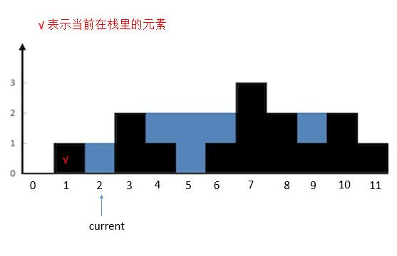
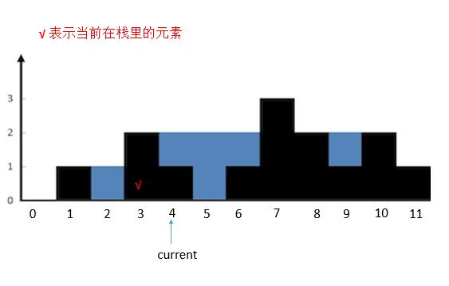

> 原文链接: https://leetcode-cn.com/problems/trapping-rain-water


## 英文原文
<div><p>Given <code>n</code> non-negative integers representing an elevation map where the width of each bar is <code>1</code>, compute how much water it can trap after raining.</p>

<p>&nbsp;</p>
<p><strong>Example 1:</strong></p>

<pre>
<strong>Input:</strong> height = [0,1,0,2,1,0,1,3,2,1,2,1]
<strong>Output:</strong> 6
<strong>Explanation:</strong> The above elevation map (black section) is represented by array [0,1,0,2,1,0,1,3,2,1,2,1]. In this case, 6 units of rain water (blue section) are being trapped.
</pre>

<p><strong>Example 2:</strong></p>

<pre>
<strong>Input:</strong> height = [4,2,0,3,2,5]
<strong>Output:</strong> 9
</pre>

<p>&nbsp;</p>
<p><strong>Constraints:</strong></p>

<ul>
	<li><code>n == height.length</code></li>
	<li><code>1 &lt;= n &lt;= 2 * 10<sup>4</sup></code></li>
	<li><code>0 &lt;= height[i] &lt;= 10<sup>5</sup></code></li>
</ul>
</div>

## 中文题目
<div><p>给定&nbsp;<code>n</code> 个非负整数表示每个宽度为 <code>1</code> 的柱子的高度图，计算按此排列的柱子，下雨之后能接多少雨水。</p>

<p>&nbsp;</p>

<p><strong>示例 1：</strong></p>

<p></p>

<pre>
<strong>输入：</strong>height = [0,1,0,2,1,0,1,3,2,1,2,1]
<strong>输出：</strong>6
<strong>解释：</strong>上面是由数组 [0,1,0,2,1,0,1,3,2,1,2,1] 表示的高度图，在这种情况下，可以接 6 个单位的雨水（蓝色部分表示雨水）。 
</pre>

<p><strong>示例 2：</strong></p>

<pre>
<strong>输入：</strong>height = [4,2,0,3,2,5]
<strong>输出：</strong>9
</pre>

<p>&nbsp;</p>

<p><strong>提示：</strong></p>

<ul>
	<li><code>n == height.length</code></li>
	<li><code>1 &lt;= n &lt;= 2 * 10<sup>4</sup></code></li>
	<li><code>0 &lt;= height[i] &lt;= 10<sup>5</sup></code></li>
</ul>
</div>

## 通过代码
<RecoDemo>
</RecoDemo>


## 高赞题解
### 思路:

黑色的看成墙，蓝色的看成水，宽度一样，给定一个数组，每个数代表从左到右墙的高度，求出能装多少单位的水。也就是图中蓝色正方形的个数。

### 解法一：按行求

这是我最开始想到的一个解法，提交后直接 `AC` 了，自己都震惊了。就是先求高度为 $1$ 的水，再求高度为 $2$ 的水，再求高度为 $3$ 的水。

整个思路就是，求第 `i` 层的水，遍历每个位置，如果当前的高度小于 `i`，并且两边有高度大于等于 `i` 的，说明这个地方一定有水，水就可以加 $1$。

如果求高度为 `i` 的水，首先用一个变量 `temp` 保存当前累积的水，初始化为 $0$。从左到右遍历墙的高度，遇到高度大于等于 `i` 的时候，开始更新 `temp`。更新原则是遇到高度小于 `i` 的就把 `temp` 加 $1$，遇到高度大于等于 `i` 的，就把 `temp` 加到最终的答案 `ans` 里，并且 `temp` 置零，然后继续循环。

我们就以题目的例子讲一下。

先求第 $1$ 行的水。

{:width=500}
{:align=center}

也就是红色区域中的水，数组是 `height = [ 0, 1, 0, 2, 1, 0, 1, 3, 2, 1, 2, 1 ] `。

原则是高度小于 `1`，`temp ++`，高度大于等于 `1`，`ans = ans + temp，temp = 0`。

`temp` 初始化为 `0`，`ans = 0`

`height[0]` 等于 `0 < 1`，不更新。  

`height[1]` 等于 `1 >= 1`，开始更新 `temp`。

`height[2]` 等于 `0 < 1`，`temp = temp + 1 = 1`。

`height[3]` 等于 `2 >= 1`，`ans = ans + temp = 1`，`temp = 0`。

`height[4]` 等于 `1 >= 1`，`ans = ans + temp = 1`，`temp = 0`。

`height[5]` 等于 `0 < 1`，`temp = temp + 1 = 1`。

`height[6]` 等于 `1 >= 1`，`ans = ans + temp = 2`，`temp = 0`。

剩下的 `height[7]` 到最后，高度都大于等于 `1`，更新 `ans = ans + temp = 2`，`temp = 0`。而其实 `temp` 一直都是 `0`，所以 `ans` 没有变化。

再求第 2 行的水。

{:width=500}
{:align=center}

也就是红色区域中的水，数组是 `height = [ 0, 1, 0, 2, 1, 0, 1, 3, 2, 1, 2, 1 ]`。

原则是高度小于 `2`，`temp ++`，高度大于等于 `2`，`ans = ans + temp，temp = 0`。

`temp` 初始化为 `0`，`ans` 此时等于 `2`。

`height[0]` 等于 `0 < 2`，不更新。  

`height[1]` 等于 `1 < 2`，不更新。  

`height[2]` 等于 `0 < 2`，不更新。  

`height[3]` 等于 `2 >= 2`，开始更新

`height[4]` 等于 `1 < 2`，`temp = temp + 1 = 1`。

`height[5]` 等于 `0 < 2`，`temp = temp + 1 = 2`。

`height[6]` 等于 `1 < 2`，`temp = temp + 1 = 3`。

`height[7]` 等于 `3 >= 2`，`ans = ans + temp = 5`，`temp = 0`。

`height[8]` 等于 `2 >= 2`，`ans = ans + temp = 3`，`temp = 0`。

`height[9]` 等于 `1 < 2`，`temp = temp + 1 = 1`。

`height[10]` 等于 `2 >= 2`，`ans = ans + temp = 6`，`temp = 0`。

`height[11]` 等于 `1 < 2`，`temp = temp + 1 = 1`。

然后结束循环，此时的 `ans` 就是`6`。

再看第 3 层。

{:width=600}
{:align=center}

按照之前的算法，之前的都是小于 `3` 的，不更新 `temp`，然后到 `height[7]` 等于 `3`，开始更新 `temp`，但是后边没有 `height` 大于等于 `3` 了，所以 `ans` 没有更新。

所以最终的 `ans` 就是 `6`。

看下代码吧。

```java [-Java]
public int trap(int[] height) {
    int sum = 0;
    int max = getMax(height);//找到最大的高度，以便遍历。
    for (int i = 1; i <= max; i++) {
        boolean isStart = false; //标记是否开始更新 temp
        int temp_sum = 0;
        for (int j = 0; j < height.length; j++) {
            if (isStart && height[j] < i) {
                temp_sum++;
            }
            if (height[j] >= i) {
                sum = sum + temp_sum;
                temp_sum = 0;
                isStart = true;
            }
        }
    }
    return sum;
}
private int getMax(int[] height) {
		int max = 0;
		for (int i = 0; i < height.length; i++) {
			if (height[i] > max) {
				max = height[i];
			}
		}
		return max;
}
```

时间复杂度：如果最大的数是 $m$，个数是 $n$，那么就是 $O(m*n)$。

空间复杂度：$O(1)$。

评论区提示这个解法现在 AC 不了了，会报超时，但还是放在这里吧。
下边讲一下， leetcode [solution](https://leetcode.com/problems/trapping-rain-water/solution/) 提供的 4 个算法。

### 解法二：按列求

求每一列的水，我们只需要关注当前列，以及左边最高的墙，右边最高的墙就够了。

装水的多少，当然根据木桶效应，我们只需要看左边最高的墙和右边最高的墙中较矮的一个就够了。

所以，根据较矮的那个墙和当前列的墙的高度可以分为三种情况。

* 较矮的墙的高度大于当前列的墙的高度

{:width=500}
{:align=center}

  把正在求的列左边最高的墙和右边最高的墙确定后，然后为了方便理解，我们把无关的墙去掉。

{:width=500}
{:align=center}

  这样就很清楚了，现在想象一下，往两边最高的墙之间注水。正在求的列会有多少水？

  很明显，较矮的一边，也就是左边的墙的高度，减去当前列的高度就可以了，也就是 2 - 1 = 1，可以存一个单位的水。

* 较矮的墙的高度小于当前列的墙的高度

{:width=500}
{:align=center}

  同样的，我们把其他无关的列去掉。

{:width=500}
{:align=center}

  想象下，往两边最高的墙之间注水。正在求的列会有多少水？ 

  正在求的列不会有水，因为它大于了两边较矮的墙。

* 较矮的墙的高度等于当前列的墙的高度。

  和上一种情况是一样的，不会有水。

{:width=500}
{:align=center}

明白了这三种情况，程序就很好写了，遍历每一列，然后分别求出这一列两边最高的墙。找出较矮的一端，和当前列的高度比较，结果就是上边的三种情况。

```java [-Java]
public int trap(int[] height) {
    int sum = 0;
    //最两端的列不用考虑，因为一定不会有水。所以下标从 1 到 length - 2
    for (int i = 1; i < height.length - 1; i++) {
        int max_left = 0;
        //找出左边最高
        for (int j = i - 1; j >= 0; j--) {
            if (height[j] > max_left) {
                max_left = height[j];
            }
        }
        int max_right = 0;
        //找出右边最高
        for (int j = i + 1; j < height.length; j++) {
            if (height[j] > max_right) {
                max_right = height[j];
            }
        }
        //找出两端较小的
        int min = Math.min(max_left, max_right);
        //只有较小的一段大于当前列的高度才会有水，其他情况不会有水
        if (min > height[i]) {
            sum = sum + (min - height[i]);
        }
    }
    return sum;
}
```

时间复杂度：$O(n²）$，遍历每一列需要 $n$，找出左边最高和右边最高的墙加起来刚好又是一个 $n$，所以是 $n²$。

空间复杂度：$O(1）$。

### 解法三: 动态规划

我们注意到，解法二中。对于每一列，我们求它左边最高的墙和右边最高的墙，都是重新遍历一遍所有高度，这里我们可以优化一下。

首先用两个数组，`max_left [i] `代表第 `i` 列左边最高的墙的高度，`max_right[i]` 代表第 `i` 列右边最高的墙的高度。（一定要注意下，第 i 列左（右）边最高的墙，是不包括自身的，和 leetcode 上边的讲的有些不同）

对于 `max_left`我们其实可以这样求。

`max_left [i] = Max(max_left [i-1]`,`height[i-1])`。它前边的墙的左边的最高高度和它前边的墙的高度选一个较大的，就是当前列左边最高的墙了。

对于 max_right我们可以这样求。

`max_right[i] = Max(max_right[i+1]`,`height[i+1])` 。它后边的墙的右边的最高高度和它后边的墙的高度选一个较大的，就是当前列右边最高的墙了。

这样，我们再利用解法二的算法，就不用在 `for` 循环里每次重新遍历一次求 `max_left` 和 `max_right` 了。

```java [-Java]
public int trap(int[] height) {
    int sum = 0;
    int[] max_left = new int[height.length];
    int[] max_right = new int[height.length];
    
    for (int i = 1; i < height.length - 1; i++) {
        max_left[i] = Math.max(max_left[i - 1], height[i - 1]);
    }
    for (int i = height.length - 2; i >= 0; i--) {
        max_right[i] = Math.max(max_right[i + 1], height[i + 1]);
    }
    for (int i = 1; i < height.length - 1; i++) {
        int min = Math.min(max_left[i], max_right[i]);
        if (min > height[i]) {
            sum = sum + (min - height[i]);
        }
    }
    return sum;
}
```

时间复杂度：$O(n)$。

空间复杂度：$O(n)$，用来保存每一列左边最高的墙和右边最高的墙。

### 解法四：双指针

动态规划中，我们常常可以对空间复杂度进行进一步的优化。

例如这道题中，可以看到，`max_left [ i ]` 和 `max_right [ i ]` 数组中的元素我们其实只用一次，然后就再也不会用到了。所以我们可以不用数组，只用一个元素就行了。我们先改造下 `max_left`。

```java [-Java]
public int trap(int[] height) {
    int sum = 0;
    int max_left = 0;
    int[] max_right = new int[height.length];
    for (int i = height.length - 2; i >= 0; i--) {
        max_right[i] = Math.max(max_right[i + 1], height[i + 1]);
    }
    for (int i = 1; i < height.length - 1; i++) {
        max_left = Math.max(max_left, height[i - 1]);
        int min = Math.min(max_left, max_right[i]);
        if (min > height[i]) {
            sum = sum + (min - height[i]);
        }
    }
    return sum;
}
```

我们成功将 `max_left` 数组去掉了。但是会发现我们不能同时把 `max_right` 的数组去掉，因为最后的 `for` 循环是从左到右遍历的，而 `max_right` 的更新是从右向左的。

所以这里要用到两个指针，`left` 和 `right`，从两个方向去遍历。

那么什么时候从左到右，什么时候从右到左呢？根据下边的代码的更新规则，我们可以知道

```java [-Java]
max_left = Math.max(max_left, height[i - 1]);
```

`height [ left - 1]` 是可能成为 `max_left` 的变量， 同理，`height [ right + 1 ]` 是可能成为 `right_max` 的变量。

只要保证 `height [ left - 1 ] < height [ right + 1 ]` ，那么 `max_left` 就一定小于 `max_right`。

因为 `max_left` 是由 `height [ left - 1]` 更新过来的，而 `height [ left - 1 ]` 是小于 `height [ right + 1]` 的，而 `height [ right + 1 ]` 会更新` max_right`，所以间接的得出 `max_left` 一定小于 `max_right`。	

反之，我们就从右到左更。

```java [-Java]
public int trap(int[] height) {
    int sum = 0;
    int max_left = 0;
    int max_right = 0;
    int left = 1;
    int right = height.length - 2; // 加右指针进去
    for (int i = 1; i < height.length - 1; i++) {
        //从左到右更
        if (height[left - 1] < height[right + 1]) {
            max_left = Math.max(max_left, height[left - 1]);
            int min = max_left;
            if (min > height[left]) {
                sum = sum + (min - height[left]);
            }
            left++;
        //从右到左更
        } else {
            max_right = Math.max(max_right, height[right + 1]);
            int min = max_right;
            if (min > height[right]) {
                sum = sum + (min - height[right]);
            }
            right--;
        }
    }
    return sum;
}
```

时间复杂度： $O(n)$。

空间复杂度： $O(1)$。

 ### 解法五：栈

{:width=500}
{:align=center}

说到栈，我们肯定会想到括号匹配了。我们仔细观察蓝色的部分，可以和括号匹配类比下。每次匹配出一对括号（找到对应的一堵墙），就计算这两堵墙中的水。

我们用栈保存每堵墙。

当遍历墙的高度的时候，如果当前高度小于栈顶的墙高度，说明这里会有积水，我们将墙的高度的下标入栈。

如果当前高度大于栈顶的墙的高度，说明之前的积水到这里停下，我们可以计算下有多少积水了。计算完，就把当前的墙继续入栈，作为新的积水的墙。

总体的原则就是，

1. 当前高度小于等于栈顶高度，入栈，指针后移。

2. 当前高度大于栈顶高度，出栈，计算出当前墙和栈顶的墙之间水的多少，然后计算当前的高度和新栈的高度的关系，重复第 2 步。直到当前墙的高度不大于栈顶高度或者栈空，然后把当前墙入栈，指针后移。

我们看具体的例子。	

* 首先将 `height [ 0 ]` 入栈。然后 `current` 指向的高度大于栈顶高度，所以把栈顶 `height [ 0 ]` 出栈，然后栈空了，再把 `height [ 1 ]` 入栈。`current` 后移。

{:width=500}
{:align=center}

* 然后 `current` 指向的高度小于栈顶高度，`height [ 2 ]` 入栈，`current` 后移。

{:width=500}
{:align=center}

* 然后 `current` 指向的高度大于栈顶高度，栈顶 `height [ 2 ]` 出栈。计算 `height [ 3 ]` 和新的栈顶之间的水。计算完之后继续判断 `current` 和新的栈顶的关系。

{:width=500}
{:align=center}

* `current` 指向的高度大于栈顶高度，栈顶 `height [ 1 ]` 出栈，栈空。所以把 `height [ 3 ]` 入栈。`currtent` 后移。

{:width=500}
{:align=center}

* 然后 `current` 指向的高度小于栈顶 `height [ 3 ]` 的高度，height `[ 4 ]` 入栈。`current` 后移。

{:width=500}
{:align=center}

* 然后 `current` 指向的高度小于栈顶 `height [ 4 ]` 的高度，`height [ 5 ]` 入栈。`current` 后移。

{:width=500}
{:align=center}

* 然后 `current` 指向的高度大于栈顶 `height [ 5 ]` 的高度，将栈顶 `height [ 5 ]` 出栈，然后计算 `current` 指向的墙和新栈顶 `height [ 4 ]` 之间的水。计算完之后继续判断 `current` 的指向和新栈顶的关系。此时 `height [ 6 ]` 不大于栈顶` height [ 4 ]` ，所以将 `height [ 6 ]` 入栈。`current` 后移。

{:width=600}
{:align=center}

* 然后 `current` 指向的高度大于栈顶高度，将栈顶 `height [ 6 ]` 出栈。计算和新的栈顶 `height [ 4 ]` 组成两个边界中的水。然后判断 `current` 和新的栈顶 `height [ 4 ]` 的关系，依旧是大于，所以把 `height [ 4 ]` 出栈。计算 `current` 和 新的栈顶 `height [ 3 ]` 之间的水。然后判断 `current` 和新的栈顶 `height [ 3 ]` 的关系，依旧是大于，所以把 `height [ 3 ]` 出栈，栈空。将 `current` 指向的 `height [ 7 ]` 入栈。`current` 后移。

  其实不停的出栈，可以看做是在找与 7 匹配的墙，也就是 3 。

{:width=500}
{:align=center}

而对于计算 `current` 指向墙和新的栈顶之间的水，根据图的关系，我们可以直接把这两个墙当做之前解法三的 `max_left` 和 `max_right`，然后之前弹出的栈顶当做每次遍历的 `height [ i ]`。水量就是 `Min ( max _ left ，max _ right ) - height [ i ]`，只不过这里需要乘上两个墙之间的距离。可以看下代码继续理解下。

```java [-Java]
public int trap6(int[] height) {
    int sum = 0;
    Stack<Integer> stack = new Stack<>();
    int current = 0;
    while (current < height.length) {
        //如果栈不空并且当前指向的高度大于栈顶高度就一直循环
        while (!stack.empty() && height[current] > height[stack.peek()]) {
            int h = height[stack.peek()]; //取出要出栈的元素
            stack.pop(); //出栈
            if (stack.empty()) { // 栈空就出去
                break; 
            }
            int distance = current - stack.peek() - 1; //两堵墙之前的距离。
            int min = Math.min(height[stack.peek()], height[current]);
            sum = sum + distance * (min - h);
        }
        stack.push(current); //当前指向的墙入栈
        current++; //指针后移
    }
    return sum;
}
```

时间复杂度：虽然 `while` 循环里套了一个 `while` 循环，但是考虑到每个元素最多访问两次，入栈一次和出栈一次，所以时间复杂度是 $O(n)$。

空间复杂度：$O(n)$。栈的空间。

### 总结:

解法二到解法三，利用动态规划，空间换时间，解法三到解法四，优化动态规划的空间，这一系列下来，让人心旷神怡。


## 统计信息
| 通过次数 | 提交次数 | AC比率 |
| :------: | :------: | :------: |
|    359643    |    611147    |   58.8%   |

## 提交历史
| 提交时间 | 提交结果 | 执行时间 |  内存消耗  | 语言 |
| :------: | :------: | :------: | :--------: | :--------: |


## 相似题目
|                             题目                             | 难度 |
| :----------------------------------------------------------: | :---------: |
| [盛最多水的容器](https://leetcode-cn.com/problems/container-with-most-water/) | 中等|
| [除自身以外数组的乘积](https://leetcode-cn.com/problems/product-of-array-except-self/) | 中等|
| [接雨水 II](https://leetcode-cn.com/problems/trapping-rain-water-ii/) | 困难|
| [倒水](https://leetcode-cn.com/problems/pour-water/) | 中等|
