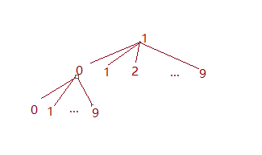

> 原文链接: https://leetcode-cn.com/problems/k-th-smallest-in-lexicographical-order


## 英文原文
<div><p>Given two integers <code>n</code> and <code>k</code>, return <em>the</em> <code>k<sup>th</sup></code> <em>lexicographically smallest integer in the range</em> <code>[1, n]</code>.</p>

<p>&nbsp;</p>
<p><strong>Example 1:</strong></p>

<pre>
<strong>Input:</strong> n = 13, k = 2
<strong>Output:</strong> 10
<strong>Explanation:</strong> The lexicographical order is [1, 10, 11, 12, 13, 2, 3, 4, 5, 6, 7, 8, 9], so the second smallest number is 10.
</pre>

<p><strong>Example 2:</strong></p>

<pre>
<strong>Input:</strong> n = 1, k = 1
<strong>Output:</strong> 1
</pre>

<p>&nbsp;</p>
<p><strong>Constraints:</strong></p>

<ul>
	<li><code>1 &lt;= k &lt;= n &lt;= 10<sup>9</sup></code></li>
</ul>
</div>

## 中文题目
<div><p>给定整数&nbsp;<code>n</code>&nbsp;和&nbsp;<code>k</code>，找到&nbsp;<code>1</code>&nbsp;到&nbsp;<code>n</code>&nbsp;中字典序第&nbsp;<code>k</code>&nbsp;小的数字。</p>

<p>注意：1 &le; k &le; n &le; 10<sup>9</sup>。</p>

<p><strong>示例 :</strong></p>

<pre>
<strong>输入:</strong>
n: 13   k: 2

<strong>输出:</strong>
10

<strong>解释:</strong>
字典序的排列是 [1, 10, 11, 12, 13, 2, 3, 4, 5, 6, 7, 8, 9]，所以第二小的数字是 10。
</pre>
</div>

## 通过代码
<RecoDemo>
</RecoDemo>


## 高赞题解
### 解题思路：
乍一看这一题貌似毫无头绪，什么是字典序？如何定位这个数？没错，刚接触这个题目的时候，我的脑筋里也是一团乱麻。

但是我觉得作为一个拥有聪明才智的程序员来说，最重要的能力就是迅速抽象问题、拆解问题的能力。经过一段时间的思考，我的脑筋里还是没有答案。

哈哈。

言归正传，我们来分析一下这个问题。

首先，什么是字典序？

### 什么是字典序？
简而言之，就是根据数字的前缀进行排序，

比如 10 < 9，因为 10 的前缀是 1，比 9 小。

再比如 112 < 12，因为 112 的前缀 11 小于 12。

这样排序下来，会跟平常的升序排序会有非常大的不同。先给你一个直观的感受，一个数乘 10，或者加 1，哪个大？可能你会吃惊，后者会更大。

但其实掌握它的本质之后，你一点都不会吃惊。

### 问题建模：

画一个图你就懂了。

{:width=400}

每一个节点都拥有 10 个孩子节点，因为作为一个前缀 ，它后面可以接 0~9 这十个数字。而且你可以非常容易地发现，整个字典序排列也就是对十叉树进行先序遍历。1, 10,  100, 101, ... 11, 110 ... 

回到题目的意思，我们需要找到排在第k位的数。找到他的排位，需要搞清楚三件事情:

1. 怎么确定一个前缀下所有子节点的个数？
2. 如果第 k 个数在当前的前缀下，怎么继续往下面的子节点找？
3. 如果第 k 个数不在当前的前缀，即当前的前缀比较小，如何扩大前缀，增大寻找的范围？

接下来 ，我们一一拆解这些问题。

### 理顺思路：

**1. 确定指定前缀下所有子节点数**
现在的任务就是给定一个前缀，返回下面子节点总数。

我们现在的思路就是用下一个前缀的起点减去当前前缀的起点，那么就是当前前缀下的所有子节点数总和啦。
```js [-js]
//prefix是前缀，n是上界
var getCount = (prefix, n) => {
    let cur = prefix;
    let next = prefix + 1;//下一个前缀
    let count = 0;
    //当前的前缀当然不能大于上界
    while(cur <= n) {
        count += next - cur;//下一个前缀的起点减去当前前缀的起点
        cur *= 10; 
        next *= 10;
        // 如果说刚刚prefix是1，next是2，那么现在分别变成10和20
        // 1为前缀的子节点增加10个，十叉树增加一层, 变成了两层
        
        // 如果说现在prefix是10，next是20，那么现在分别变成100和200，
        // 1为前缀的子节点增加100个，十叉树又增加了一层，变成了三层
    }
    return count;//把当前前缀下的子节点和返回去。
}
```
当然，不知道大家发现一个问题没有，当 next 的值大于上界的时候，那以这个前缀为根节点的十叉树就不是满十叉树了啊，应该到上界那里，后面都不再有子节点。因此，$count += next - cur$ 还是有些问题的，我们来修正这个问题:
```js [-js]
count += Math.min(n+1, next) - cur;
```
你可能会问:咦？怎么是 `n+1` ,而不是 $n$ 呢？不是说好了 $n$ 是上界吗？

我举个例子，假若现在上界 $n$为 12，算出以 1 为前缀的子节点数，首先 1 本身是一个节点，接下来要算下面 10，11，12，一共有 4 个子节点。

那么如果用 $Math.min(n, next) - cur$ 会怎么样？

这时候算出来会少一个，12 - 10 加上根节点，最后只有 3 个。因此我们务必要写 `n+1`。

现在，我们搞定了前缀的子节点数问题。

**2. 第k个数在当前前缀下**
现在无非就是往子树里面去看。

prefix这样处理就可以了。
```js [-js]
prefix *= 10
```
**3.第k个数不在当前前缀下**
说白了，当前的前缀小了嘛，我们扩大前缀。
```js [-js]
prefix ++;
```

### 框架搭建：
整合一下刚刚的思路。
```js [-js]
let findKthNumber = function(n, k) {
  let p = 1;//作为一个指针，指向当前所在位置，当p==k时，也就是到了排位第k的数
  let prefix = 1;//前缀
  while(p < k) {
    let count = getNumber(prefix, n);//获得当前前缀下所有子节点的和
    if(p + count > k) { //第k个数在当前前缀下
      prefix *= 10;
      p++; //把指针指向了第一个子节点的位置，比如11乘10后变成110，指针从11指向了110
    } else if(p + count <= k) { //第k个数不在当前前缀下
      prefix ++;
      p += count;//注意这里的操作，把指针指向了下一前缀的起点
    }
  }
  return prefix;
};
```

### 完整代码展示：
```js [-js]
/**
 * @param {number} n
 * @param {number} k
 * @return {number}
 */
var findKthNumber = function(n, k) {
  let getCount = (prefix, n) => {
    let count =  0;
    for(let cur = prefix, next = prefix + 1; cur <= n; cur *= 10, next *= 10) 
      count += Math.min(next, n+1) - cur;
    return count;
  }
  let p = 1;
  let prefix = 1;
  while(p < k) {
    let count = getCount(prefix, n);
    if(p + count > k) {
      prefix *= 10;
      p++;
    } else if(p + count <= k) {
      prefix ++;
      p += count;
    }
  }
  return prefix;
};
```
成功 AC！


## 统计信息
| 通过次数 | 提交次数 | AC比率 |
| :------: | :------: | :------: |
|    17442    |    45707    |   38.2%   |

## 提交历史
| 提交时间 | 提交结果 | 执行时间 |  内存消耗  | 语言 |
| :------: | :------: | :------: | :--------: | :--------: |
