> 原文链接: https://leetcode-cn.com/problems/poor-pigs


## 英文原文
<div><p>There are <code>buckets</code> buckets of liquid, where <strong>exactly one</strong> of the buckets is poisonous. To figure out which one is poisonous, you feed some number of (poor) pigs the liquid to see whether they will die or not. Unfortunately, you only have <code>minutesToTest</code> minutes to determine which bucket is poisonous.</p>

<p>You can feed the pigs according to these steps:</p>

<ol>
	<li>Choose some live pigs to feed.</li>
	<li>For each pig, choose which buckets to feed it. The pig will consume all the chosen buckets simultaneously and will take no time.</li>
	<li>Wait for <code>minutesToDie</code> minutes. You may <strong>not</strong> feed any other pigs during this time.</li>
	<li>After <code>minutesToDie</code> minutes have passed, any pigs that have been fed the poisonous bucket will die, and all others will survive.</li>
	<li>Repeat this process until you run out of time.</li>
</ol>

<p>Given <code>buckets</code>, <code>minutesToDie</code>, and <code>minutesToTest</code>, return <em>the <strong>minimum</strong> number of pigs needed to figure out which bucket is poisonous within the allotted time</em>.</p>

<p>&nbsp;</p>
<p><strong>Example 1:</strong></p>
<pre><strong>Input:</strong> buckets = 1000, minutesToDie = 15, minutesToTest = 60
<strong>Output:</strong> 5
</pre><p><strong>Example 2:</strong></p>
<pre><strong>Input:</strong> buckets = 4, minutesToDie = 15, minutesToTest = 15
<strong>Output:</strong> 2
</pre><p><strong>Example 3:</strong></p>
<pre><strong>Input:</strong> buckets = 4, minutesToDie = 15, minutesToTest = 30
<strong>Output:</strong> 2
</pre>
<p>&nbsp;</p>
<p><strong>Constraints:</strong></p>

<ul>
	<li><code>1 &lt;= buckets &lt;= 1000</code></li>
	<li><code>1 &lt;=&nbsp;minutesToDie &lt;=&nbsp;minutesToTest &lt;= 100</code></li>
</ul>
</div>

## 中文题目
<div><p>有<code> buckets</code> 桶液体，其中 <strong>正好</strong> 有一桶含有毒药，其余装的都是水。它们从外观看起来都一样。为了弄清楚哪只水桶含有毒药，你可以喂一些猪喝，通过观察猪是否会死进行判断。不幸的是，你只有 <code>minutesToTest</code> 分钟时间来确定哪桶液体是有毒的。</p>

<p>喂猪的规则如下：</p>

<ol>
	<li>选择若干活猪进行喂养</li>
	<li>可以允许小猪同时饮用任意数量的桶中的水，并且该过程不需要时间。</li>
	<li>小猪喝完水后，必须有 <code>minutesToDie</code> 分钟的冷却时间。在这段时间里，你只能观察，而不允许继续喂猪。</li>
	<li>过了 <code>minutesToDie</code> 分钟后，所有喝到毒药的猪都会死去，其他所有猪都会活下来。</li>
	<li>重复这一过程，直到时间用完。</li>
</ol>

<p>给你桶的数目 <code>buckets</code> ，<code>minutesToDie</code> 和 <code>minutesToTest</code> ，返回在规定时间内判断哪个桶有毒所需的 <strong>最小</strong> 猪数。</p>

<p> </p>

<p><strong>示例 1：</strong></p>

<pre>
<strong>输入：</strong>buckets = 1000, minutesToDie = 15, minutesToTest = 60
<strong>输出：</strong>5
</pre>

<p><strong>示例 2：</strong></p>

<pre>
<strong>输入：</strong>buckets = 4, minutesToDie = 15, minutesToTest = 15
<strong>输出：</strong>2
</pre>

<p><strong>示例 3：</strong></p>

<pre>
<strong>输入：</strong>buckets = 4, minutesToDie = 15, minutesToTest = 30
<strong>输出：</strong>2
</pre>

<p> </p>

<p><strong>提示：</strong></p>

<ul>
	<li><code>1 <= buckets <= 1000</code></li>
	<li><code>1 <= minutesToDie <= minutesToTest <= 100</code></li>
</ul>
</div>

## 通过代码
<RecoDemo>
</RecoDemo>


## 高赞题解
### 解题方案

#### 思路：

**标签：数学**

这道题初看的时候，很多人会纠结：到底需要多少只小猪，而每只小猪又应该具体如何喝水才能判断出哪只水桶有***？

这道题最开始不要去关注细节，去想到底应该怎么喂水。而是应该先思考在考察哪方面的问题，数组、链表、二叉树还是数学？那么仔细思考就能得出结论，本质上在考察数学中的 **进制** 问题。

举例说明：

- 假设：总时间 `minutesToTest = 60`，死亡时间 `minutesToDie = 15`，`pow(x, y)` 表示 `x` 的 `y` 次方，`ceil(x)`表示 `x` 向上取整
- 当前有 $1$ 只小猪，最多可以喝 `times = minutesToTest` / `minutesToDie = 4` 次水
- 最多可以喝 $4$ 次水，能够携带 `base = times + 1 = 5` 个的信息量，也就是（便于理解从 $0$ 开始）：
  - (1) 喝 $0$ 号死去，$0$ 号桶水有毒
  - (2) 喝 $1$ 号死去，$1$ 号桶水有毒
  - (3) 喝 $2$ 号死去，$2$ 号桶水有毒
  - (4) 喝 $3$ 号死去，$3$ 号桶水有毒
  - (5) 喝了上述所有水依然活蹦乱跳，$4$ 号桶水有毒
  - 结论是 $1$ 只小猪最多能够验证 $5$ 桶水中哪只水桶含有***，当 `buckets ≤ 5` 时，`answer = 1`
- 那么 $2$ 只小猪可以验证的范围最多到多少呢？我们把每只小猪携带的信息量看成是 **base进制数**，$2$ 只小猪的信息量就是 `pow(base, 2) = pow(5, 2) = 25`，所以当 `5 ≤ buckets ≤ 25时`，`anwser = 2`
- 那么可以得到公式关系：`pow(base, ans) ≥ buckets`，取对数后即为：`ans ≥ log(buckets) / log(base)`，因为 `ans` 为整数，所以 `ans = ceil(log(buckets) / log(base))`

**时间复杂度：$O(1)$**

看到这里我们再去关注细节，$2$ 只小猪到底怎么喂水，在上述假设下，能够最多验证 $25$ 桶水呢？请看下方图画解答：

<,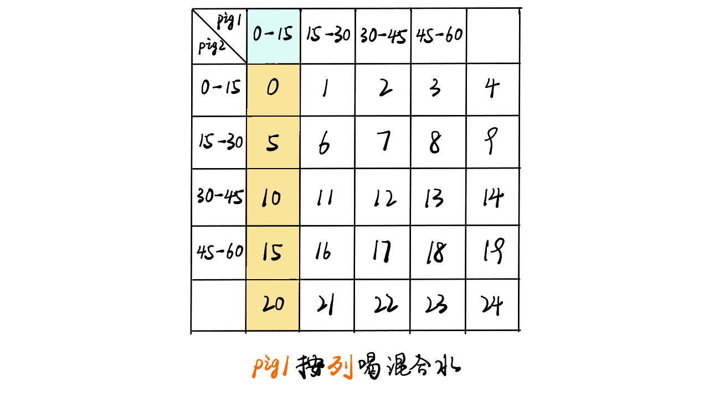,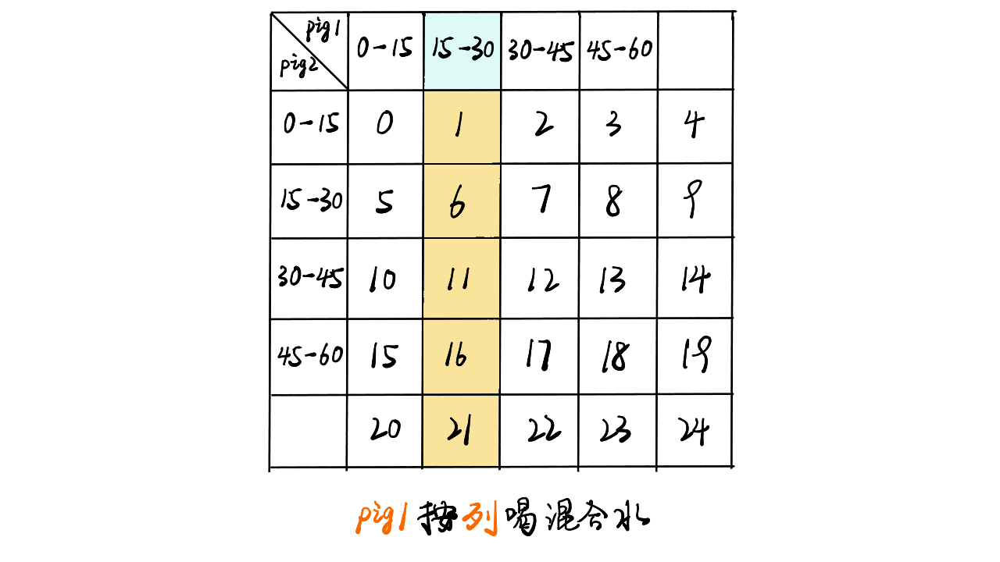,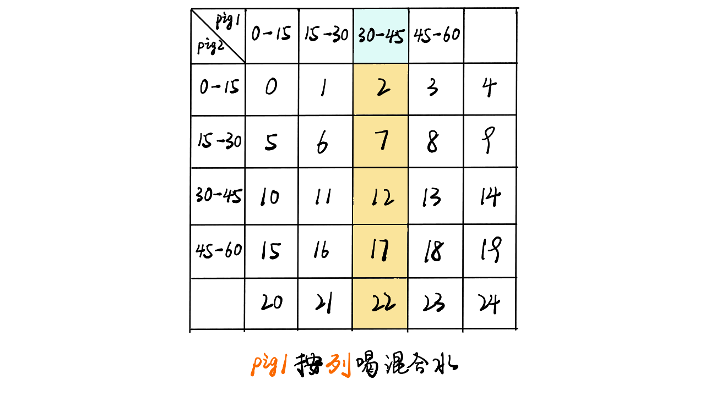,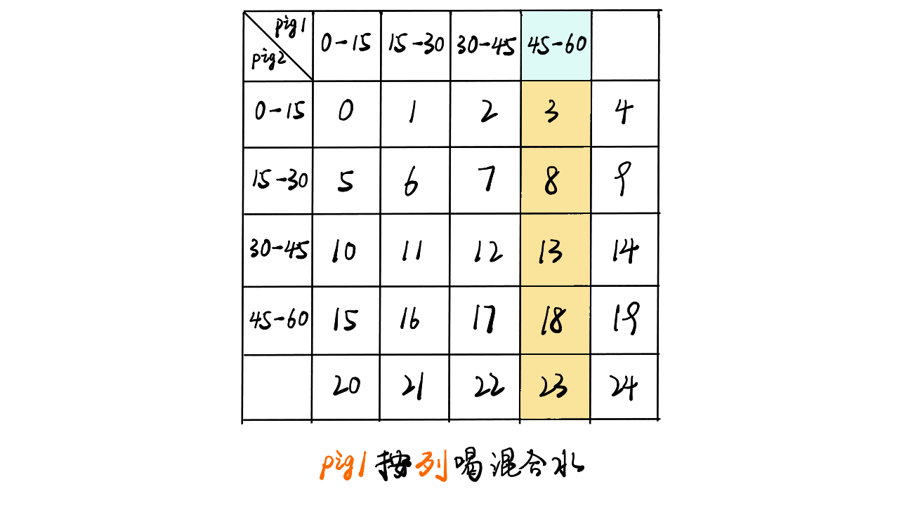,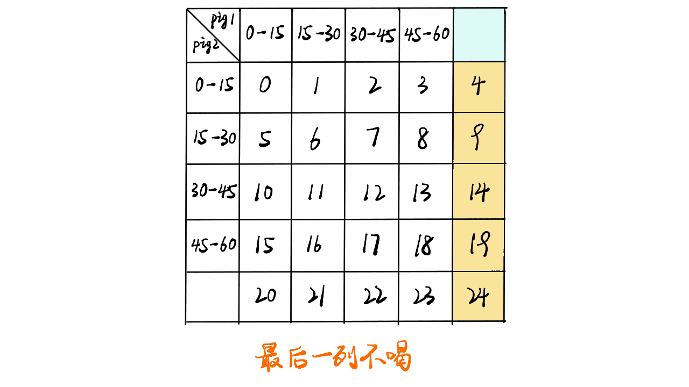,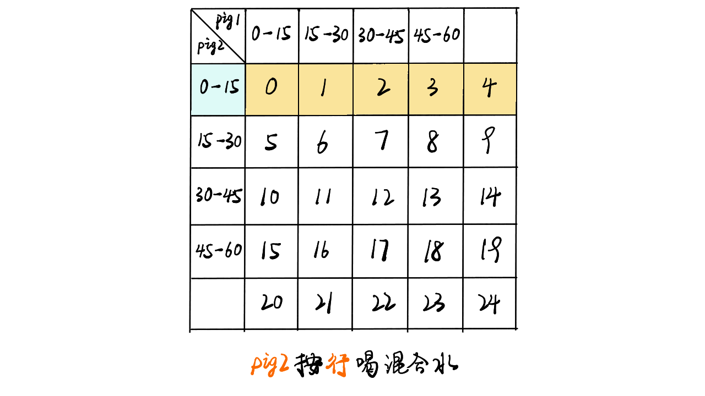,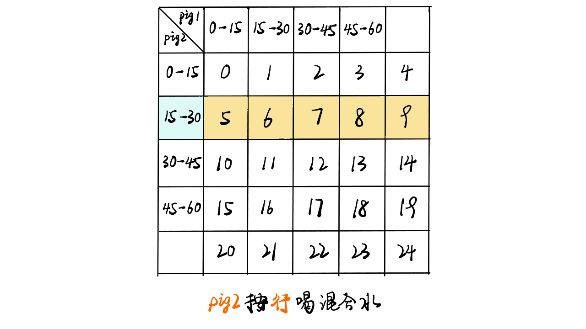,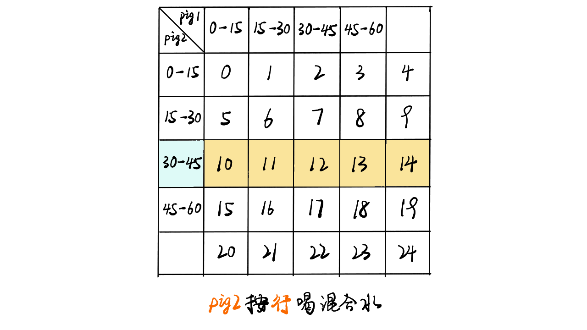,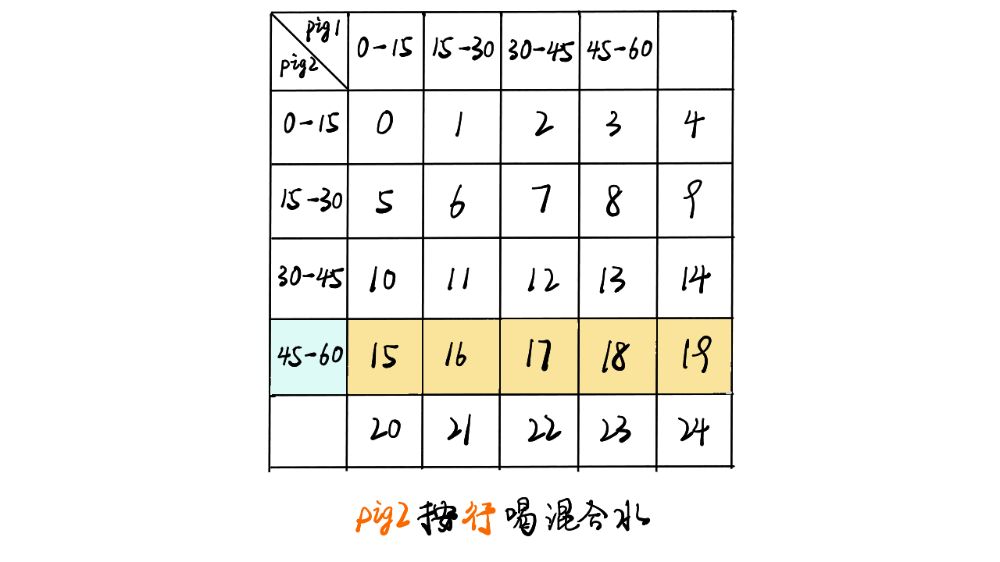,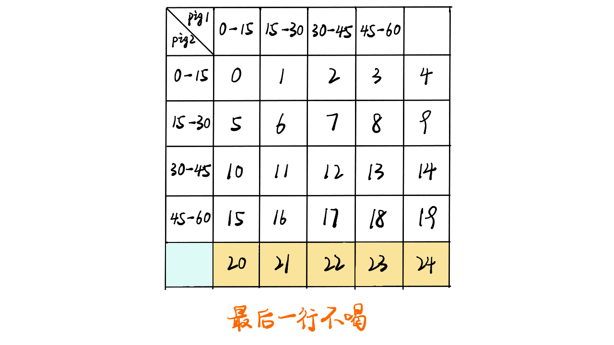,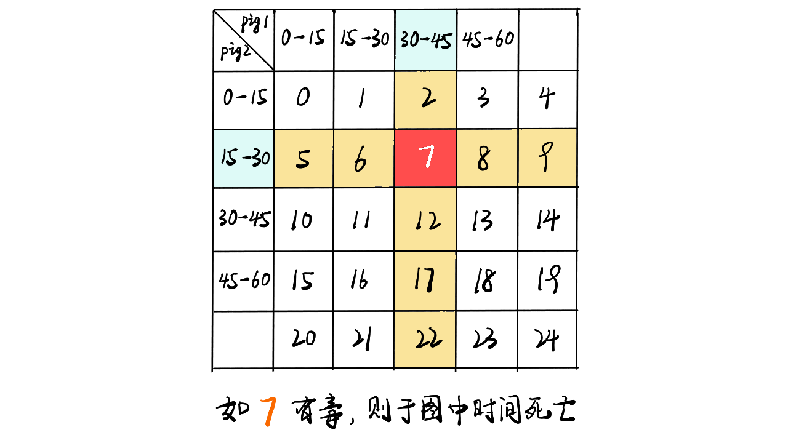,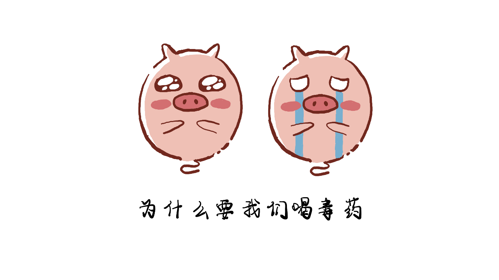>

### 代码:


```Java []
class Solution {
    public int poorPigs(int buckets, int minutesToDie, int minutesToTest) {
        int times = minutesToTest / minutesToDie;
        int base = times + 1;
        // base ^ ans >= buckets 
        // ans >= log(buckets) / log(base)
        double temp = Math.log(buckets) / Math.log(base);
        int ans = (int)Math.ceil(temp)
        return ans;
    }
}
```
```JavaScript []
/**
 * @param {number} buckets
 * @param {number} minutesToDie
 * @param {number} minutesToTest
 * @return {number}
 */
var poorPigs = function(buckets, minutesToDie, minutesToTest) {
    const times = minutesToTest / minutesToDie;
    const base = times + 1;
    // base ^ ans >= buckets 
    // ans >= log(buckets) / log(base)
    const temp = Math.log(buckets) / Math.log(base);
    const ans = Math.ceil(temp)
    return ans;
};
```

想看大鹏画解更多高频面试题，欢迎阅读大鹏的 LeetBook：[《画解剑指 Offer 》](https://leetcode-cn.com/leetbook/detail/illustrate-lcof/)，O(∩_∩)O

## 统计信息
| 通过次数 | 提交次数 | AC比率 |
| :------: | :------: | :------: |
|    23061    |    33019    |   69.8%   |

## 提交历史
| 提交时间 | 提交结果 | 执行时间 |  内存消耗  | 语言 |
| :------: | :------: | :------: | :--------: | :--------: |
