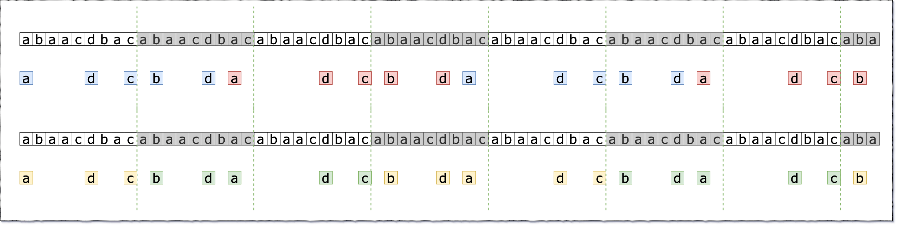

> 原文链接: https://leetcode-cn.com/problems/count-the-repetitions


## 英文原文
<div><p>We define <code>str = [s, n]</code> as the string <code>str</code> which consists of the string <code>s</code> concatenated <code>n</code> times.</p>

<ul>
	<li>For example, <code>str == [&quot;abc&quot;, 3] ==&quot;abcabcabc&quot;</code>.</li>
</ul>

<p>We define that string <code>s1</code> can be obtained from string <code>s2</code> if we can remove some characters from <code>s2</code> such that it becomes <code>s1</code>.</p>

<ul>
	<li>For example, <code>s1 = &quot;abc&quot;</code> can be obtained from <code>s2 = &quot;ab<strong><u>dbe</u></strong>c&quot;</code> based on our definition by removing the bolded underlined characters.</li>
</ul>

<p>You are given two strings <code>s1</code> and <code>s2</code> and two integers <code>n1</code> and <code>n2</code>. You have the two strings <code>str1 = [s1, n1]</code> and <code>str2 = [s2, n2]</code>.</p>

<p>Return <em>the maximum integer </em><code>m</code><em> such that </em><code>str = [str2, m]</code><em> can be obtained from </em><code>str1</code>.</p>

<p>&nbsp;</p>
<p><strong>Example 1:</strong></p>
<pre><strong>Input:</strong> s1 = "acb", n1 = 4, s2 = "ab", n2 = 2
<strong>Output:</strong> 2
</pre><p><strong>Example 2:</strong></p>
<pre><strong>Input:</strong> s1 = "acb", n1 = 1, s2 = "acb", n2 = 1
<strong>Output:</strong> 1
</pre>
<p>&nbsp;</p>
<p><strong>Constraints:</strong></p>

<ul>
	<li><code>1 &lt;= s1.length, s2.length &lt;= 100</code></li>
	<li><code>s1</code> and <code>s2</code> consist of lowercase English letters.</li>
	<li><code>1 &lt;= n1, n2 &lt;= 10<sup>6</sup></code></li>
</ul>
</div>

## 中文题目
<div><p>定义 <code>str = [s, n]</code> 表示 <code>str</code> 由 <code>n</code> 个字符串 <code>s</code> 连接构成。</p>

<ul>
	<li>例如，<code>str == ["abc", 3] =="abcabcabc"</code> 。</li>
</ul>

<p>如果可以从 <code>s2</code><sub> </sub>中删除某些字符使其变为 <code>s1</code>，则称字符串 <code>s1</code><sub> </sub>可以从字符串 <code>s2</code> 获得。</p>

<ul>
	<li>例如，根据定义，<code>s1 = "abc"</code> 可以从 <code>s2 = "ab<em><strong>dbe</strong></em>c"</code> 获得，仅需要删除加粗且用斜体标识的字符。</li>
</ul>

<p>现在给你两个字符串 <code>s1</code> 和 <code>s2</code> 和两个整数 <code>n1</code> 和 <code>n2</code> 。由此构造得到两个字符串，其中 <code>str1 = [s1, n1]</code>、<code>str2 = [s2, n2]</code> 。</p>

<p>请你找出一个最大整数 <code>m</code> ，以满足 <code>str = [str2, m]</code> 可以从 <code>str1</code> 获得。</p>

<p> </p>

<p><strong>示例 1：</strong></p>

<pre>
<strong>输入：</strong>s1 = "acb", n1 = 4, s2 = "ab", n2 = 2
<strong>输出：</strong>2
</pre>

<p><strong>示例 2：</strong></p>

<pre>
<strong>输入：</strong>s1 = "acb", n1 = 1, s2 = "acb", n2 = 1
<strong>输出：</strong>1
</pre>

<p> </p>

<p><strong>提示：</strong></p>

<ul>
	<li><code>1 <= s1.length, s2.length <= 100</code></li>
	<li><code>s1</code> 和 <code>s2</code> 由小写英文字母组成</li>
	<li><code>1 <= n1, n2 <= 10<sup>6</sup></code></li>
</ul>
</div>

## 通过代码
<RecoDemo>
</RecoDemo>


## 高赞题解
#### 解题思路
先读懂题目
关于**字符串 A 从 B 获得** ：

> 如果我们可以从字符串 B 中删除某些字符使其变为 A，则称字符串 A 可以从字符串 B 获得。
> 例如，根据定义，`"abc"` 可以从 `“abdbec”` 获得，但不能从` “acbbe”` 获得。 

关于字符串的**生成规则**（Repeat）：

> 将 n 个字符串 s 连接在一起组成字符串 R，记作`R = [s,n]`。
> 例如，`R ["abc",3]=“abcabcabc”`。

最后是**题目要求**：

> 现在给你两个非空字符串  Sa 和 Sb（每个最多 100 个字符长）和两个整数 0 ≤ Na ≤ 10⁶ 和 1 ≤ Nb ≤ 10⁶。
> 现在考虑字符串 Ra 和 Rb，其中 `Ra=[Sa,Na]` 、`Rb=[Sb,Nb]` 。
> 现在我们希望构造一个字符串 `Rc=[Rb, M]` ，同时又要保证 Rc 能够从 Ra 获得。
> 请你找出 M 最大取值是多少 。


以题目样例来说： 

> `Ra = ["acb", 4]` ，其实就是 `Sa = "acb", Ra = "acbacbacbacb", Na = 4`；
> 而 `Rb = ["ab", 2]`，其实就是 `Sb = "ab", Rb = "abab", Nb = 2`；
> Rb 重复 M 次后，仍然能够 **从 Ra 中获得**，求 M 的**最大取值**。
> 可以看到 `"abab"` 最多重复 2 次，超过就无法从 `"acbacbacbacb"` 中获得了。

这样拆分重组之后，应该能比之前容易读懂一点了。


#### 寻找循环段落

这题其实思路也蛮简单的，其实就是尽可能的找出循环来减少遍历的次数。

我们以官方题解的示例数据为例：

> Ra = ["abaacdbac", 100]   
> Rb = ["adcbd", 4]


先画简单的图来示意一下，能够注意到的是，似乎在开头这部分，并没有出现循环。

那么我们再多来几段试试看：


从图中可以看到，随着 Rb 的不断重复，首字母 a 的位置变的稳定了起来，看起来也比较有规律了，但是好像和 Rb 对的不是很齐的样子，不太好算啊。

这时我们可以换另一个思路来『上色』，按下面这种黄绿的方式来分组。




先抛开前面的 `adc` 三个字母不管，我们以两个 Sa 为一组来看，循环的部分就规整了很多。


如上图所示，前面有前导的 `abc` 三个字母占了点位置，末尾有我也不知道是什么样子的结尾部分；

但是可以肯定的是，中间的部分肯定是 `bdadc` 的不断循环，同时每个循环占用了 2 个 Sa 的长度。


接下来的工作，就是把这些循环的部分优化掉了。

其实根据上图我们可以看到，当我们遍历到第一次出现循环的时候，计算出有多少个循环，直接跳到 End 的位置做收尾工作就好了。


#### 解答

基本上按照上面的思路按部就班的写代码就好了，计算的时候稍微留意一下 Rb 的下标还在自增。

```Go []
func getMaxRepetitions(s1 string, n1 int, s2 string, n2 int) int {
	len1, len2 := len(s1), len(s2)
	index1, index2 := 0, 0 // 注意此处直接使用 Ra Rb 的下标，不取模

	if len1 == 0 || len2 == 0 || len1*n1 < len2*n2 {
		return 0
	}

	map1, map2 := make(map[int]int), make(map[int]int)
	ans := 0 // 注意，此处存储的是 Ra 中 Sb 的个数，而非 Ra 中 Rb 的个数

	for index1/len1 < n1 { // 遍历整个 Ra
		if index1%len1 == len1-1 { //在 Sa 末尾
			if val, ok := map1[index2%len2]; ok { // 出现了循环，进行快进
				cycleLen := index1/len1 - val/len1                 // 每个循环占多少个 Sa
				cycleNum := (n1 - 1 - index1/len1) / cycleLen      // 还有多少个循环
				cycleS2Num := index2/len2 - map2[index2%len2]/len2 // 每个循环含有多少个 Sb

				index1 += cycleNum * cycleLen * len1 // 将 Ra 快进到相应的位置
				ans += cycleNum * cycleS2Num         // 把快进部分的答案数量加上
			} else { // 第一次，注意存储的是未取模的
				map1[index2%len2] = index1
				map2[index2%len2] = index2
			}

		}

		if s1[index1%len1] == s2[index2%len2] {
			if index2%len2 == len2-1 {
				ans += 1
			}
			index2 += 1
		}
		index1 += 1
	}
	return ans / n2
}
```


0ms 2MB ，性能还不错。


## 统计信息
| 通过次数 | 提交次数 | AC比率 |
| :------: | :------: | :------: |
|    11801    |    31571    |   37.4%   |

## 提交历史
| 提交时间 | 提交结果 | 执行时间 |  内存消耗  | 语言 |
| :------: | :------: | :------: | :--------: | :--------: |
