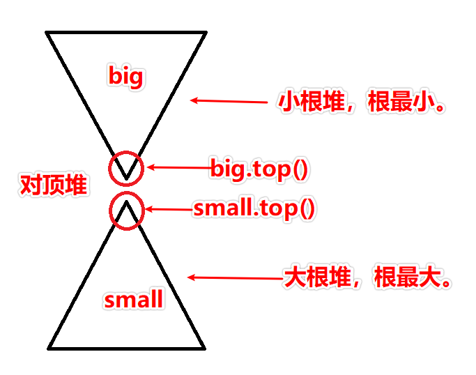

> 原文链接: https://leetcode-cn.com/problems/sliding-window-median


## 英文原文
<div><p>The <strong>median</strong> is the middle value in an ordered integer list. If the size of the list is even, there is no middle value. So the median is the mean of the two middle values.</p>

<ul>
	<li>For examples, if <code>arr = [2,<u>3</u>,4]</code>, the median is <code>3</code>.</li>
	<li>For examples, if <code>arr = [1,<u>2,3</u>,4]</code>, the median is <code>(2 + 3) / 2 = 2.5</code>.</li>
</ul>

<p>You are given an integer array <code>nums</code> and an integer <code>k</code>. There is a sliding window of size <code>k</code> which is moving from the very left of the array to the very right. You can only see the <code>k</code> numbers in the window. Each time the sliding window moves right by one position.</p>

<p>Return <em>the median array for each window in the original array</em>. Answers within <code>10<sup>-5</sup></code> of the actual value will be accepted.</p>

<p>&nbsp;</p>
<p><strong>Example 1:</strong></p>

<pre>
<strong>Input:</strong> nums = [1,3,-1,-3,5,3,6,7], k = 3
<strong>Output:</strong> [1.00000,-1.00000,-1.00000,3.00000,5.00000,6.00000]
<strong>Explanation:</strong> 
Window position                Median
---------------                -----
[<strong>1  3  -1</strong>] -3  5  3  6  7        1
 1 [<strong>3  -1  -3</strong>] 5  3  6  7       -1
 1  3 [<strong>-1  -3  5</strong>] 3  6  7       -1
 1  3  -1 [<strong>-3  5  3</strong>] 6  7        3
 1  3  -1  -3 [<strong>5  3  6</strong>] 7        5
 1  3  -1  -3  5 [<strong>3  6  7</strong>]       6
</pre>

<p><strong>Example 2:</strong></p>

<pre>
<strong>Input:</strong> nums = [1,2,3,4,2,3,1,4,2], k = 3
<strong>Output:</strong> [2.00000,3.00000,3.00000,3.00000,2.00000,3.00000,2.00000]
</pre>

<p>&nbsp;</p>
<p><strong>Constraints:</strong></p>

<ul>
	<li><code>1 &lt;= k &lt;= nums.length &lt;= 10<sup>5</sup></code></li>
	<li><code>-2<sup>31</sup> &lt;= nums[i] &lt;= 2<sup>31</sup> - 1</code></li>
</ul>
</div>

## 中文题目
<div><p>中位数是有序序列最中间的那个数。如果序列的长度是偶数，则没有最中间的数；此时中位数是最中间的两个数的平均数。</p>

<p>例如：</p>

<ul>
	<li><code>[2,3,4]</code>，中位数是 <code>3</code></li>
	<li><code>[2,3]</code>，中位数是 <code>(2 + 3) / 2 = 2.5</code></li>
</ul>

<p>给你一个数组 <em>nums</em>，有一个长度为 <em>k</em> 的窗口从最左端滑动到最右端。窗口中有 <em>k</em> 个数，每次窗口向右移动 <em>1</em> 位。你的任务是找出每次窗口移动后得到的新窗口中元素的中位数，并输出由它们组成的数组。</p>

<p> </p>

<p><strong>示例：</strong></p>

<p>给出 <em>nums</em> = <code>[1,3,-1,-3,5,3,6,7]</code>，以及 <em>k</em> = 3。</p>

<pre>
窗口位置                      中位数
---------------               -----
[1  3  -1] -3  5  3  6  7       1
 1 [3  -1  -3] 5  3  6  7      -1
 1  3 [-1  -3  5] 3  6  7      -1
 1  3  -1 [-3  5  3] 6  7       3
 1  3  -1  -3 [5  3  6] 7       5
 1  3  -1  -3  5 [3  6  7]      6
</pre>

<p> 因此，返回该滑动窗口的中位数数组 <code>[1,-1,-1,3,5,6]</code>。</p>

<p> </p>

<p><strong>提示：</strong></p>

<ul>
	<li>你可以假设 <code>k</code> 始终有效，即：<code>k</code> 始终小于等于输入的非空数组的元素个数。</li>
	<li>与真实值误差在 <code>10 ^ -5</code> 以内的答案将被视作正确答案。</li>
</ul>
</div>

## 通过代码
<RecoDemo>
</RecoDemo>


## 高赞题解
### 解题思路
本题考查动态维护数组的中位数。
我们思考中位数的性质：如果一个数是中位数，那么在这个数组中，大于中位数的数目和小于中位数的数目，要么相等，要么就相差一。
因此，我们采用对顶堆的做法，控制所有小于等于中位数的数字放到一个堆中，控制所有比中位数大的数字放到另一个堆中，并且保证两个堆的数目相差小于等于1。这样就可以保证每一次查询中位数的时候，答案一定出于两个堆的堆顶元素之一。
因此选定数据结构：优先队列。因为优先队列采用的是堆结构，正好符合我们的需求。我们将所有小于等于中位数的元素放到small堆中（是一个大顶堆），将所有大于中位数的元素放到big堆中（是一个小顶堆）。

初始化方法如下：
- 将前K个元素全部插入到small堆中。从small堆中弹出K/2个元素到big堆中。
- 这样，当K为奇数，则small堆元素比big堆元素多1；当K为偶数，两个堆元素相等。

取中位数的操作：
+ 我们的插入操作可以保证每次优先插入到small堆中，因此small堆中的元素个数大于等于big堆的元素个数。
+ 当K为奇数时候，中位数是元素数量较多的small堆 堆顶元素。
+ 当K为偶数时候，中位数是small堆和big堆的堆顶元素平均值。

窗口滑动过程中的操作：
+ 假定在上一次滑动之后，已经有small堆和big堆元素数目相差小于等于1.
+ 设置当前的滑动时，balance = 0。balance表示因本次窗口滑动导致small堆元素数目与big堆元素个数差值的增量。
+ 删除窗口左侧的元素。
+ + 由于堆无法直接删除掉某个指定元素，先欠下这个账，等某次元素出现在堆顶的时候，再删除他。mp记录这个元素欠账的个数。mp[left]++;
+ + 虽然没有真的在堆数据结构中删除窗口最左侧的元素，但是在我们的心中已经删掉他了。堆两侧的平衡性发生了变化。如果left<=small.top()，就说明删掉的元素在small堆中，我们让balance--;否则，就说明删掉的元素在big堆中，让balance++;
+ 添加进来窗口右侧的元素。如果right<=small.top()，就应该让这个元素放到samll堆里面，balance++；否则放到big堆里，balance--。
+ 经过上面的操作，balance要么为0，要么为2，要么为-2。我们需要经过调整使得balance为0。
+ + 如果balance为0，在这次窗口滑动之前已经是平衡的，这次调整也没有让两堆的数目变化，所以不用调整两边的堆。
+ + 如果balance为2，就说明small堆的元素比big堆的元素多了两个。从small堆减少一个，big堆里增加一个，就可以让两边相等。big.push(small.top());small.pop();
+ + 如果balance为-2，就说明big堆的元素比small堆的元素多了两个。从big堆减少一个，small堆里增加一个，就可以让两边相等。small.push(big.top());big.pop();
+ 调整完了，现在该欠债还钱了。不能让那些早该删除的元素涉及到中位数的运算。
+ + 分别检查两边的堆顶元素，如果堆顶元素欠着债，则弹出堆顶元素，直到堆顶元素没有欠债为止。有朋友问了：堆顶下面也有欠债的怎么办呢？我们之前说过，取中位数的时候只与堆顶元素有关，至于那些堆顶下面欠着债的，欠着就欠着吧，等他们到堆顶的时候再弹出去就好了。
+ 最后，添加中位数即可。

2021/2/3 20:50更新：对顶堆长这样：



### 代码

```cpp
class Solution {
public:
    priority_queue<int> small;
    priority_queue<int, vector<int>, greater<int> > big;
    unordered_map<int, int> mp;
    double get(int& k){
        if(k%2) return small.top();
        else return ((long long)small.top()+big.top())*0.5;
    }
    vector<double> medianSlidingWindow(vector<int>& nums, int k) {
        for(int i = 0; i < k; i++){small.push(nums[i]);};
        for(int i = 0; i < k / 2; i++){big.push(small.top()); small.pop();}
        vector<double> ans{get(k)};
        for(int i = k; i < nums.size(); i++){
            int balance = 0;
            int l = nums[i-k];
            mp[l]++;
            if(!small.empty() && l<=small.top()){balance--;}
            else {balance++;}
            if(!small.empty() && nums[i] <= small.top()){
                small.push(nums[i]);
                balance++;
            }
            else{
                big.push(nums[i]);
                balance--;
            }
            if(balance>0){
                big.push(small.top());
                small.pop();
            }
            if(balance<0){
                small.push(big.top());
                big.pop();
            }
            while(!small.empty() && mp[small.top()]>0){
                mp[small.top()]--;
                small.pop();
            }
            while(!big.empty() && mp[big.top()]>0){
                mp[big.top()]--;
                big.pop();
            }
            ans.push_back(get(k));
            
        }
        return ans;
    }
};
```

## 统计信息
| 通过次数 | 提交次数 | AC比率 |
| :------: | :------: | :------: |
|    30356    |    67818    |   44.8%   |

## 提交历史
| 提交时间 | 提交结果 | 执行时间 |  内存消耗  | 语言 |
| :------: | :------: | :------: | :--------: | :--------: |


## 相似题目
|                             题目                             | 难度 |
| :----------------------------------------------------------: | :---------: |
| [数据流的中位数](https://leetcode-cn.com/problems/find-median-from-data-stream/) | 困难|
