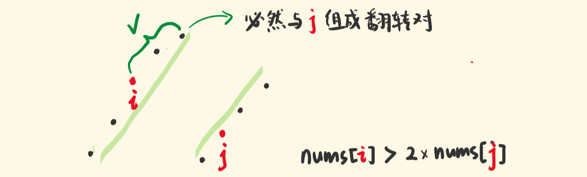
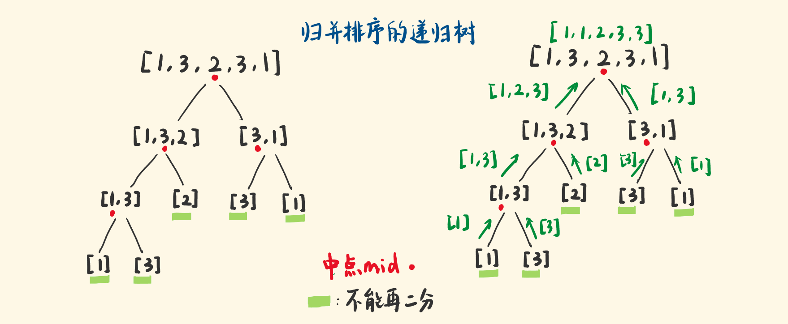

> 原文链接: https://leetcode-cn.com/problems/reverse-pairs


## 英文原文
<div><p>Given an integer array <code>nums</code>, return <em>the number of <strong>reverse pairs</strong> in the array</em>.</p>

<p>A reverse pair is a pair <code>(i, j)</code> where <code>0 &lt;= i &lt; j &lt; nums.length</code> and <code>nums[i] &gt; 2 * nums[j]</code>.</p>

<p>&nbsp;</p>
<p><strong>Example 1:</strong></p>
<pre><strong>Input:</strong> nums = [1,3,2,3,1]
<strong>Output:</strong> 2
</pre><p><strong>Example 2:</strong></p>
<pre><strong>Input:</strong> nums = [2,4,3,5,1]
<strong>Output:</strong> 3
</pre>
<p>&nbsp;</p>
<p><strong>Constraints:</strong></p>

<ul>
	<li><code>1 &lt;= nums.length &lt;= 5 * 10<sup>4</sup></code></li>
	<li><code>-2<sup>31</sup> &lt;= nums[i] &lt;= 2<sup>31</sup> - 1</code></li>
</ul>
</div>

## 中文题目
<div><p>给定一个数组&nbsp;<code>nums</code>&nbsp;，如果&nbsp;<code>i &lt; j</code>&nbsp;且&nbsp;<code>nums[i] &gt; 2*nums[j]</code>&nbsp;我们就将&nbsp;<code>(i, j)</code>&nbsp;称作一个<strong><em>重要翻转对</em></strong>。</p>

<p>你需要返回给定数组中的重要翻转对的数量。</p>

<p><strong>示例 1:</strong></p>

<pre>
<strong>输入</strong>: [1,3,2,3,1]
<strong>输出</strong>: 2
</pre>

<p><strong>示例 2:</strong></p>

<pre>
<strong>输入</strong>: [2,4,3,5,1]
<strong>输出</strong>: 3
</pre>

<p><strong>注意:</strong></p>

<ol>
	<li>给定数组的长度不会超过<code>50000</code>。</li>
	<li>输入数组中的所有数字都在32位整数的表示范围内。</li>
</ol>
</div>

## 通过代码
<RecoDemo>
</RecoDemo>


## 高赞题解
#### 思路


- 想要更快地统计翻转对，就要去掉一些不必要的判断！


- 找到一对翻转对 $i、j$，如果能因此 **保证** 一些 “pair” **也一定是翻转对**，就很 nice。

- `nums[i] > 2*nums[j]`，那些比`nums[i]`大的数，且在`nums[j]`左边，就一定和`nums[j]`组成翻转对，而且这些数的个数最好是好算的。 


- 想到维护**两个升序的序列**，如下图，`nums[i]`在左序列，`nums[j]`在右序列

 - 如果恰好满足：`nums[i] > 2*nums[j]`，则有：

     - 左序列中`nums[i]`右侧的数，必然能和`nums[j]`组成翻转对，且 个数 好统计。




想到**归并排序**——不断二分，直到不能二分，就形成了有序序列（单个元素即有序），然后不断合并两个有序序列。

- 我们为处于右序列的`nums[j]`，去找处于左序列的`nums[i]`，找到了就统计一下个数。

- 对于`nums[j]`，它先是在规模小的左序列中找目标数，下次，它被放在一个新的有序右序列里，它又会在规模更大的左序列中找目标数，找到了，就又统计一下

- 随着递归结束，它会把左侧所有的数都考察了，找完了属于它的翻转对。

- 因为每次都二分，找到了，就有一段不用考察，时间复杂度是 $O(nlgn)$。


####  统计翻转对的时机

在**得到左右有序序列**之后，**合并左右有序序列**之前。


怎么统计呢？


i、j 指针分别扫描左右序列，为当前的 `nums[j]` 寻找 `nums[i]`。

找到了，那 i 到左序列的末尾，都能和`nums[j]`构成翻转对，通过索引之差统计个数。


```

i := start   // i 指向左序列的开头

j := mid + 1 // j 指向右序列的开头

for i <= mid && j <= end { // i扫描左序列，j扫描右序列

    if nums[i] > 2*nums[j] { 

        count += mid - i + 1 // i到mid，都能和j构成翻转对

        j++                  // 考察下一个j，为它找i

    } else {                 // 当前i不满足，考察下一个i

        i++

    }

}

```


#### 需要一个辅助数组

每次两个有序序列，合并成一个新的有序序列，保存在 temp 数组里。再更新到 nums 原数组。

归并排序就这么做的。

其实，去掉统计翻转对的部分，这就是一个单纯的归并排序。


#### 代码 


```go []

func reversePairs(nums []int) int {

    if len(nums) == 0 { // 没有元素，没有翻转对

        return 0

    }

    count := 0 // 翻转对个数

    mergeSort(nums, &count, 0, len(nums)-1) // 归并的范围：0到末尾

    return count

}


// 对当前的序列（start到end）进行归并排序

func mergeSort(nums []int, count *int, start, end int) {

    if start == end { // 递归的出口：不能再二分了，返回

        return

    }

    mid := start + (end-start)>>1 // 当前序列的中点索引


    mergeSort(nums, count, start, mid) // 递归左序列

    mergeSort(nums, count, mid+1, end) // 递归右序列


    // 此时左右序列已升序，现在做：合并前的统计、以及合并

    i := start                 // 左序列的开头

    j := mid + 1               // 右序列的开头

    for i <= mid && j <= end { // i j 都不越界

        if nums[i] > 2*nums[j] {

            *count += mid - i + 1 // i 到 mid，都ok

            j++                   // 考察下一个j，继续找 i

        } else {                  // 当前i不满足，考察下一个i

            i++

        }

    }

    i = start  

    j = mid + 1 // 复原 i j 指针，因为现在要合并左右序列


    temp := make([]int, end-start+1) // 辅助数组，存放合并排序的数

    index := 0                       // 从0开始

    for i <= mid && j <= end {       // 如果 i j 都没越界

        if nums[i] < nums[j] {    // nums[i]更小

            temp[index] = nums[i] // 取nums[i]，确定了temp[index]

            index++               // 确定下一个

            i++                   // 考察下一个i，j不动

        } else {

            temp[index] = nums[j]

            index++

            j++

        }

    }

    for i <= mid {            // 如果 i 没越界，j越界了

        temp[index] = nums[i] // i 和 i右边的都取过来

        index++               // 确定下一个数

        i++

    }

    for j <= end {            // j 没越界，i越界了

        temp[index] = nums[j] // j 和 j右边的都取过来

        index++               // 确定下一个数

        j++

    }

    k := 0

    for i := start; i <= end; i++ { // 根据合并后的情况，更新nums

        nums[i] = temp[k]

        k++

    }

}

```

```js []

var reversePairs = function (nums) {

    if (nums.length == 0) {

        return 0;

    }

    let count = 0;


    function mergeSort(nums, start, end) {

        if (start == end) {

            return 0;

        }

        const mid = start + ((end - start) >> 1);

        mergeSort(nums, start, mid);

        mergeSort(nums, mid + 1, end);


        let i = start;

        let j = mid + 1;

        while (i <= mid && j <= end) {

            if (nums[i] > 2 * nums[j]) {

                count += mid - i + 1;

                j++;

            } else {

                i++;

            }

        }

        i = start;

        j = mid + 1;

        const temp = new Array(end - start + 1);

        let index = 0;

        while (i <= mid && j <= end) {

            if (nums[i] < nums[j]) {

                temp[index] = nums[i];

                index++;

                i++;

            } else {

                temp[index] = nums[j];

                index++;

                j++;

            }

        }

        while (i <= mid) {

            temp[index] = nums[i];

            index++;

            i++;

        }

        while (j <= end) {

            temp[index] = nums[j];

            index++;

            j++;

        }

        for (let i = start, k = 0; i <= end; i++, k++) {

            nums[i] = temp[k];

        }

    }

    

    mergeSort(nums, 0, nums.length - 1);

    return count;

};

```


#### 复盘总结

随着递归的出栈，归并排序会「并」两个有序的序列，形成新的有序序列，再和别的有序序列合并，我们在合并之前，在两个有序序列中寻找 i j pair，找到了，就统计一下，每次递归的「并」之前都找，就累加统计完了。


统计个数，只是归并排序的副操作，需要你对归并排序有比较好的理解。

下图是归并排序的递归树，对归并排序不熟的朋友可以看看：





#### 谢谢收看，再见。如果觉得不错的话，帮我用赞顶上去。


最后修改于：2021-11-01

## 统计信息
| 通过次数 | 提交次数 | AC比率 |
| :------: | :------: | :------: |
|    27249    |    78618    |   34.7%   |

## 提交历史
| 提交时间 | 提交结果 | 执行时间 |  内存消耗  | 语言 |
| :------: | :------: | :------: | :--------: | :--------: |


## 相似题目
|                             题目                             | 难度 |
| :----------------------------------------------------------: | :---------: |
| [计算右侧小于当前元素的个数](https://leetcode-cn.com/problems/count-of-smaller-numbers-after-self/) | 困难|
| [区间和的个数](https://leetcode-cn.com/problems/count-of-range-sum/) | 困难|
