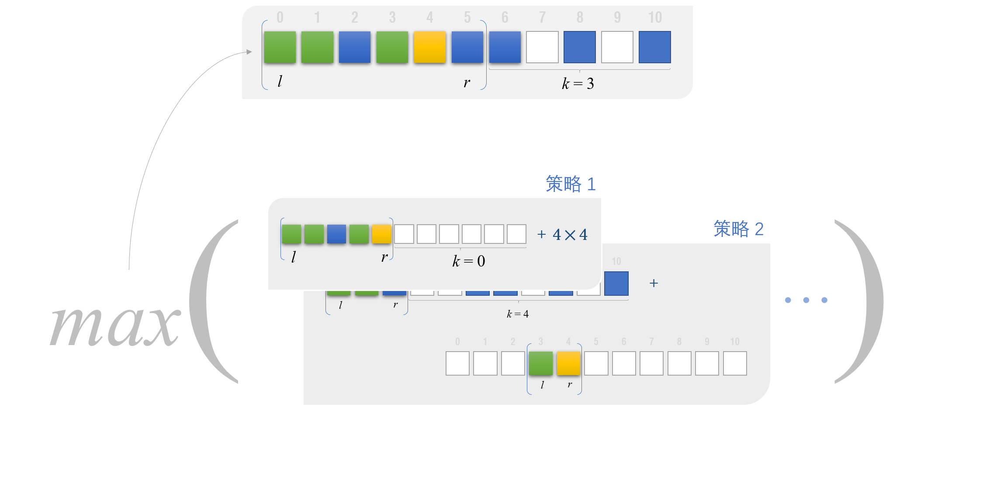

> 原文链接: https://leetcode-cn.com/problems/remove-boxes

## 英文原文

You are given several <code>boxes</code> with different colors represented by different positive numbers.

You may experience several rounds to remove boxes until there is no box left. Each time you can choose some continuous boxes with the same color (i.e., composed of <code>k</code> boxes, <code>k &gt;= 1</code>), remove them and get <code>k * k</code> points.

Return <em>the maximum points you can get</em>.

&nbsp;

<strong>Example 1:</strong>

<pre>
<strong>Input:</strong> boxes = [1,3,2,2,2,3,4,3,1]
<strong>Output:</strong> 23
<strong>Explanation:</strong>
[1, 3, 2, 2, 2, 3, 4, 3, 1] 
----&gt; [1, 3, 3, 4, 3, 1] (3*3=9 points) 
----&gt; [1, 3, 3, 3, 1] (1*1=1 points) 
----&gt; [1, 1] (3*3=9 points) 
----&gt; [] (2*2=4 points)
</pre>

<strong>Example 2:</strong>

<pre>
<strong>Input:</strong> boxes = [1,1,1]
<strong>Output:</strong> 9
</pre>

<strong>Example 3:</strong>

<pre>
<strong>Input:</strong> boxes = [1]
<strong>Output:</strong> 1
</pre>

&nbsp;

<strong>Constraints:</strong>

<ul>
	<li><code>1 &lt;= boxes.length &lt;= 100</code></li>
	<li><code>1 &lt;= boxes[i]&nbsp;&lt;= 100</code></li>
</ul>

## 中文题目

给出一些不同颜色的盒子，盒子的颜色由数字表示，即不同的数字表示不同的颜色。

你将经过若干轮操作去去掉盒子，直到所有的盒子都去掉为止。每一轮你可以移除具有相同颜色的连续 <code>k</code> 个盒子（<code>k >= 1</code>），这样一轮之后你将得到 <code>k * k</code> 个积分。

当你将所有盒子都去掉之后，求你能获得的最大积分和。

 

<strong>示例 1：</strong>

<pre>
<strong>输入：</strong>boxes = [1,3,2,2,2,3,4,3,1]
<strong>输出：</strong>23
<strong>解释：</strong>
[1, 3, 2, 2, 2, 3, 4, 3, 1] 
----> [1, 3, 3, 4, 3, 1] (3*3=9 分) 
----> [1, 3, 3, 3, 1] (1*1=1 分) 
----> [1, 1] (3*3=9 分) 
----> [] (2*2=4 分)
</pre>

<strong>示例 2：</strong>

<pre>
<strong>输入：</strong>boxes = [1,1,1]
<strong>输出：</strong>9
</pre>

<strong>示例 3：</strong>

<pre>
<strong>输入：</strong>boxes = [1]
<strong>输出：</strong>1
</pre>

 

<strong>提示：</strong>

<ul>
	<li><code>1 <= boxes.length <= 100</code></li>
	<li><code>1 <= boxes[i] <= 100</code></li>
</ul>

## 通过代码
<RecoDemo>
</RecoDemo>

## 高赞题解
作为一个算法小白，看了很久才明白官方解法，因此决定做成一个可爱的动画，来帮助大家理解。

---

#### 解释

这道题，其实就是在玩消消乐游戏~

首先，假设我们拿到的 `boxes` 长这样：

{:width=400}

{:align=center}

假设我们经过一系列操作后消掉了其中一些盒子：

{:width=400}

{:align=center}

对于这样一个子序列，我们就可以记录到 `dp` 数组里。我们可以操作的范围是 `l` 到 `r` 的子序列。由于我们对每个子序列默认都是点击 `boxes[r]` 来消除，因此要知道`r`的后面还连着几个与 `boxes[r]` 相同颜色的盒子，记为 `k`。如下图，`l = 0, r = 6, k = 2`， 将其能获得的最高得分记在 `dp[0][6][2]`。

{:width=400}

{:align=center}

现在我们调用 `calculatePoints(i, r, k)` 来计算它的最高得分 `dp[i][r][k]`。

#### calculatePoints(i, r, k)

在我们这个子序列中，`dp[0][6][2]` 与 `dp[0][5][3]` 实际上是等价的。我们将 `r` 向左一直移动到不能再移动为止。 

{:width=400}

{:align=center}

接着，我们计算出不同策略的得分，取最高分。

#### 策略 1

我们可以直接点 `boxes[r]`，把最后 4 个盒子一次性消除，获得 16 分！

{:width=400}

{:align=center}

剩下的盒子成为这样一个子序列 `dp[0][4][0]`：

{:width=400}

{:align=center}

策略1得分：`4*4 + dp[0][4][0]`

#### 策略 2

我们还可以把夹在中间的杂鱼盒子都消掉，让后面连起来的盒子数更多：

{:width=400}

{:align=center}

为了找到可以跟 `boxes[r]` 连起来的盒子，令 `i = l`：

{:width=400}

{:align=center}

`i++`

{:width=400}

{:align=center}

直到 `boxes[i] == boxes[r]`，就说明我们搜索到了

{:width=400}

{:align=center}

在这个例子中，消掉杂鱼盒子能获得的分数是 `dp[3][4][0]`。

{:width=400}

{:align=center}

剩下的盒子的得分是 `dp[0][2][4]` 。

{:width=400}

{:align=center}

综上，策略2得分：`dp[0][2][4] + dp[3][4][0]`

#### 总结

为了取得一个子序列的最高得分，我们分不同策略，每种策略的得分可以看作是1~2个子子序列的最高分之和。

{:width=400}

{:align=center}

## 统计信息
| 通过次数 | 提交次数 | AC比率 |
| :------: | :------: | :------: |
|    15319    |    24425    |   62.7%   |

## 提交历史
| 提交时间 | 提交结果 | 执行时间 |  内存消耗  | 语言 |
| :------: | :------: | :------: | :--------: | :--------: |

## 相似题目
|                             题目                             | 难度 |
| :----------------------------------------------------------: | :---------: |
| [奇怪的打印机](https://leetcode-cn.com/problems/strange-printer/) | 困难|
