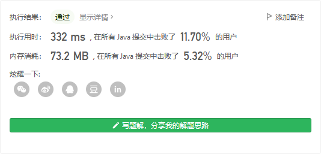
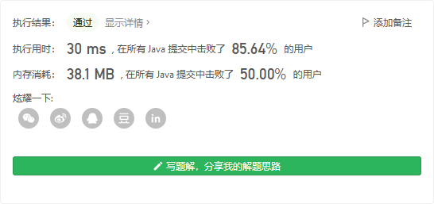

> 原文链接: https://leetcode-cn.com/problems/student-attendance-record-ii


## 英文原文
<div><p>An attendance record for a student can be represented as a string where each character signifies whether the student was absent, late, or present on that day. The record only contains the following three characters:</p>

<ul>
	<li><code>&#39;A&#39;</code>: Absent.</li>
	<li><code>&#39;L&#39;</code>: Late.</li>
	<li><code>&#39;P&#39;</code>: Present.</li>
</ul>

<p>Any student is eligible for an attendance award if they meet <strong>both</strong> of the following criteria:</p>

<ul>
	<li>The student was absent (<code>&#39;A&#39;</code>) for <strong>strictly</strong> fewer than 2 days <strong>total</strong>.</li>
	<li>The student was <strong>never</strong> late (<code>&#39;L&#39;</code>) for 3 or more <strong>consecutive</strong> days.</li>
</ul>

<p>Given an integer <code>n</code>, return <em>the <strong>number</strong> of possible attendance records of length</em> <code>n</code><em> that make a student eligible for an attendance award. The answer may be very large, so return it <strong>modulo</strong> </em><code>10<sup>9</sup> + 7</code>.</p>

<p>&nbsp;</p>
<p><strong>Example 1:</strong></p>

<pre>
<strong>Input:</strong> n = 2
<strong>Output:</strong> 8
<strong>Explanation:</strong> There are 8 records with length 2 that are eligible for an award:
&quot;PP&quot;, &quot;AP&quot;, &quot;PA&quot;, &quot;LP&quot;, &quot;PL&quot;, &quot;AL&quot;, &quot;LA&quot;, &quot;LL&quot;
Only &quot;AA&quot; is not eligible because there are 2 absences (there need to be fewer than 2).
</pre>

<p><strong>Example 2:</strong></p>

<pre>
<strong>Input:</strong> n = 1
<strong>Output:</strong> 3
</pre>

<p><strong>Example 3:</strong></p>

<pre>
<strong>Input:</strong> n = 10101
<strong>Output:</strong> 183236316
</pre>

<p>&nbsp;</p>
<p><strong>Constraints:</strong></p>

<ul>
	<li><code>1 &lt;= n &lt;= 10<sup>5</sup></code></li>
</ul>
</div>

## 中文题目
<div>可以用字符串表示一个学生的出勤记录，其中的每个字符用来标记当天的出勤情况（缺勤、迟到、到场）。记录中只含下面三种字符：
<ul>
	<li><code>'A'</code>：Absent，缺勤</li>
	<li><code>'L'</code>：Late，迟到</li>
	<li><code>'P'</code>：Present，到场</li>
</ul>

<p>如果学生能够 <strong>同时</strong> 满足下面两个条件，则可以获得出勤奖励：</p>

<ul>
	<li>按 <strong>总出勤</strong> 计，学生缺勤（<code>'A'</code>）<strong>严格</strong> 少于两天。</li>
	<li>学生 <strong>不会</strong> 存在 <strong>连续</strong> 3 天或 <strong>连续</strong> 3 天以上的迟到（<code>'L'</code>）记录。</li>
</ul>

<p>给你一个整数 <code>n</code> ，表示出勤记录的长度（次数）。请你返回记录长度为 <code>n</code> 时，可能获得出勤奖励的记录情况 <strong>数量</strong> 。答案可能很大，所以返回对 <code>10<sup>9</sup> + 7</code> <strong>取余</strong> 的结果。</p>

<p>&nbsp;</p>

<p><strong>示例 1：</strong></p>

<pre>
<strong>输入：</strong>n = 2
<strong>输出：</strong>8
<strong>解释：
</strong>有 8 种长度为 2 的记录将被视为可奖励：
"PP" , "AP", "PA", "LP", "PL", "AL", "LA", "LL" 
只有"AA"不会被视为可奖励，因为缺勤次数为 2 次（需要少于 2 次）。
</pre>

<p><strong>示例 2：</strong></p>

<pre>
<strong>输入：</strong>n = 1
<strong>输出：</strong>3
</pre>

<p><strong>示例 3：</strong></p>

<pre>
<strong>输入：</strong>n = 10101
<strong>输出：</strong>183236316
</pre>

<p>&nbsp;</p>

<p><strong>提示：</strong></p>

<ul>
	<li><code>1 &lt;= n &lt;= 10<sup>5</sup></code></li>
</ul>
</div>

## 通过代码
<RecoDemo>
</RecoDemo>


## 高赞题解


小白都能看懂的题解！


# 方法一、爆搜DFS（超时）


乍一看这个题还挺简单的，相当于有 n 个位置，每个位置可以放 P/A/L 三个字符中的一个，但是有一些限制，总共的 A 不能超过 2 个，不能有连续的 L。


OK，题目解读完毕，可以直接写一个 DFS 搞定，在 DFS 的过程中，记录总共的 A 的数量，同时，记录连续的 L 的数量，当前填入的数不是 L 的时候就把 L 的数量置 0。


好了，直接上代码：


```java

class Solution {


    int MOD = 1000000007;


    public int checkRecord(int n) {

        return dfs(0, n, 0, 0);

    }


    private int dfs(int day, int n, int absent, int late) {

        if (day >= n) {

            return 1;

        }


        // 回溯开始

        int ans = 0;

        // 1. Present随便放

        ans = (ans + dfs(day + 1, n, absent, 0)) % MOD;

        // 2. Absent最多只能放一个

        if (absent < 1) {

            ans = (ans + dfs(day + 1, n, 1, 0)) % MOD;

        }

        // 3. Late最多连续放2个

        if (late < 2) {

            ans = (ans + dfs(day + 1, n, absent, late + 1)) % MOD;

        }


        return ans;

    }

}

```


- 时间复杂度：$O(3^n)$，n 个位置，每个位置有 3 个选择，就是`3*3*...*3`，为 $3^n$。

- 空间复杂度：$O(n)$，递归层数为 n。


提交代码，啪，运行超时：


# 方法二、DFS + 记忆化


在方法一中，我们可以看到 DFS 的过程中有三个变量：day、absent、late，而这三个变量相同的情况下是有可能重复计算的。


比如，我们要计算 `day=2, absent=1, late=0`，它有可能从哪些状态而来呢？


- `absent=1`可能是第 0 天填入的；

- `absent=1`可能是第 1 天填入的；


所以，以上两种情况，到第 2 天的时候的状态是完全一样的，也就产生了重复计算，所以，我们可以声明一个缓存，记录每个状态下计算得到的值，下次再遇到相同的状态，直接返回即可。


这里的状态总共有三个维度：[day, absent, late]。


这就是**记忆化搜索**，请看代码：


```java

class Solution {


    int MOD = 1000000007;


    public int checkRecord(int n) {

        int[][][] memo = new int[n][2][3];

        return dfs(0, n, 0, 0, memo);

    }


    private int dfs(int day, int n, int absent, int late, int[][][] memo) {

        if (day >= n) {

            return 1;

        }

		

        // 相同的状态计算过了直接返回

        if (memo[day][absent][late] != 0) {

            return memo[day][absent][late];

        }


        // 回溯开始

        int ans = 0;

        // 1. Present随便放

        ans = (ans + dfs(day + 1, n, absent, 0, memo)) % MOD;

        // 2. Absent最多只能放一个

        if (absent < 1) {

            ans = (ans + dfs(day + 1, n, 1, 0, memo)) % MOD;

        }

        // 3. Late最多连续放2个

        if (late < 2) {

            ans = (ans + dfs(day + 1, n, absent, late + 1, memo)) % MOD;

        }

		

        // 记录每一个状态的计算结果

        memo[day][absent][late] = ans;


        return ans;

    }

}

```


- 时间复杂度：$O(n)$，通过memo可以看到有 $n * 2 * 3$ 种状态，每个状态只会计算一遍，所以是 $6n$，时间复杂度为 $O(n)$。

- 空间复杂度：$O(n)$，递归层数为 n，memo数组占用 $n * 2 * 3 = 6n$ 的空间，两者空间复杂度都是 $O(n)$。


运行结果如下：





# 方法三、动态规划


好了，有了记忆化，转 DP 就非常简单了，只要把 memo 改成 dp 即可，我们这样定义动态规划：


- 状态定义：`dp[i][j][k]`表示第 i 天、在 A 为 j 次、连续的 L 为 k 次的方案数。

- 状态转移：所有的状态都是从前一天，即 i-1，转移而来，但是对于 j 和 k，要分三种情况来讨论：

  - 当前填入的是 P，i-1 天的任何状态都能转移过来；

  - 当前填入的是 A，i-1 天即之前肯定没填过 A，同时所有的 late 状态都可以转移到过来。

  - 当前填入的是 L，i-1 天最多只能有一个连续的 L，其他的状态依次转移过来。


为了方便计算，我们把第 0 天的值初始化。


好了，请看代码，加了详细注释：


```java

class Solution {


    int MOD = 1000000007;


    public int checkRecord(int n) {

        long[][][] dp = new long[n][2][3];

        // 初始值

        dp[0][0][0] = 1;

        dp[0][1][0] = 1;

        dp[0][0][1] = 1;


        for (int i = 1; i < n; i++) {

            // 本次填入P，分成前一天累计了0个A和1个A两种情况

            dp[i][0][0] = (dp[i - 1][0][0] + dp[i - 1][0][1] + dp[i - 1][0][2]) % MOD;

            dp[i][1][0] = (dp[i - 1][1][0] + dp[i - 1][1][1] + dp[i - 1][1][2]) % MOD;

            // 本次填入A，前一天没有累计A都能转移过来

            // 这行可以与上面一行合并计算，为了方便理解，我们分开，下面会合并

            dp[i][1][0] = (dp[i][1][0] + dp[i - 1][0][0] + dp[i - 1][0][1] + dp[i - 1][0][2]) % MOD;

            // 本次填入L，前一天最多只有一个连续的L，分成四种情况

            dp[i][0][1] = dp[i - 1][0][0];

            dp[i][0][2] = dp[i - 1][0][1];

            dp[i][1][1] = dp[i - 1][1][0];

            dp[i][1][2] = dp[i - 1][1][1];

        }


        // 计算结果，即最后一天的所有状态相加

        long ans = 0;

        for (int i = 0; i < 2; i++) {

            for (int j = 0; j < 3; j++) {

                ans = (ans + dp[n - 1][i][j]) % MOD;

            }

        }


        return (int) ans;

    }

}

```


- 时间复杂度：$O(n)$，遍历 n 次，每次处理 7 种情况。

- 空间复杂度：$O(n)$，dp数组占用 $n * 2 * 3 = 6n$ 的空间。


运行结果如下：


# 方法四、动态规划 + 降维I


在方法三中，可以看到，i 天的状态只与 i-1 天的状态有关，所以，i-1 天之前的状态完全不需要存储，我们这里可以使用临时数组优化一下。


注意：不能直接在原 dp 数组上计算，因为 i-1 天的状态会被多次利用，直接覆盖会导致结果不准确。


请看代码：


```java

class Solution {


    int MOD = 1000000007;


    public int checkRecord(int n) {

        long[][] dp = new long[2][3];

        // 初始值

        dp[0][0] = 1;

        dp[1][0] = 1;

        dp[0][1] = 1;


        for (int i = 1; i < n; i++) {

            long[][] newDp = new long[2][3];

            newDp[0][0] = (dp[0][0] + dp[0][1] + dp[0][2]) % MOD;

            // 把方法三中间两个一样的状态合并为一行

            newDp[1][0] = (dp[1][0] + dp[1][1] + dp[1][2] + dp[0][0] + dp[0][1] + dp[0][2]) % MOD;

            newDp[0][1] = dp[0][0];

            newDp[0][2] = dp[0][1];

            newDp[1][1] = dp[1][0];

            newDp[1][2] = dp[1][1];

            

            dp = newDp;

        }


        long ans = 0;

        for (int i = 0; i < 2; i++) {

            for (int j = 0; j < 3; j++) {

                ans = (ans + dp[i][j]) % MOD;

            }

        }


        return (int) ans;

    }

}

```


- 时间复杂度：$O(n)$，遍历 n 次，每次处理 6 种情况。

- 空间复杂度：$O(1)$，dp数组占用 $2 * 3 = 6$ 的常量空间，但是每次循环都重复创建了 newDp 数组。


运行结果如下：


# 方法五、动态规划 + 降维II


通过前面的分析，我们可以看到，其实一共就只有 6 种状态，所以，我们可以只声明一个一维数组代替上面的二维数组，将二维降维成一维。


二维降一维的计算公式为：$index = i * cols + j$，其中，$cols$ 表示列数，大家要记住，直接在方法四的基础改两下代码就成了。


请看代码：


```java

import java.util.stream.LongStream;


class Solution {


    int MOD = 1000000007;


    public int checkRecord(int n) {

        long[] dp = new long[6];

        // 初始值

        dp[0] = 1;

        dp[1] = 1;

        dp[3] = 1;


        for (int i = 1; i < n; i++) {

            long[] newDp = new long[6];

            newDp[0] = (dp[0] + dp[1] + dp[2]) % MOD;

            newDp[1] = dp[0];

            newDp[2] = dp[1];

            // 稍微调整了一下顺序

            newDp[3] = (dp[3] + dp[4] + dp[5] + dp[0] + dp[1] + dp[2]) % MOD;

            newDp[4] = dp[3];

            newDp[5] = dp[4];

            

            dp = newDp;

        }


        return (int) (LongStream.of(dp).sum() % MOD);

    }

}

```


- 时间复杂度：$O(n)$，遍历 n 次，每次处理 6 种情况。

- 空间复杂度：$O(1)$，dp数组占用 $6$ 的常量空间，但是每次循环都重复创建了 newDp 数组。


运行结果如下：





# 方法六、动态规划 + 滚动数组


方法五中每次都重新申请 newDp 数组，着实有点浪费，有没有办法重复利用的，其实也是有的，使用滚动数组即可，将 dp 数组加一个维度，这个维度的大小为2，每次计算当前应该使用的下标。


请看代码：


```java

import java.util.stream.LongStream;


class Solution {


    int MOD = 1000000007;


    public int checkRecord(int n) {

        long[][] dp = new long[2][6];

        // 初始值

        dp[0][0] = 1;

        dp[0][1] = 1;

        dp[0][3] = 1;


        for (int i = 1; i < n; i++) {

            // 当前使用的下标

            int cur = i & 1;

            // 上一次使用的下标

            int last = (i - 1) & 1;

            dp[cur][0] = (dp[last][0] + dp[last][1] + dp[last][2]) % MOD;

            dp[cur][1] = dp[last][0];

            dp[cur][2] = dp[last][1];

            dp[cur][3] = (dp[last][3] + dp[last][4] + dp[last][5] + dp[last][0] + dp[last][1] + dp[last][2]) % MOD;

            dp[cur][4] = dp[last][3];

            dp[cur][5] = dp[last][4];

        }


        return (int) (LongStream.of(dp[(n - 1) & 1]).sum() % MOD);

    }

}

```


- 时间复杂度：$O(n)$，遍历 n 次，每次处理 6 种情况。

- 空间复杂度：$O(1)$，dp数组占用 $12$ 的常量空间。


运行结果如下：


# 最后


**如果对你有帮助，请点个赞吧，谢谢^^**


也可以关注我的公号【彤哥来刷题啦】，每日分享题解，一起刷题，一起拿全家桶。

## 统计信息
| 通过次数 | 提交次数 | AC比率 |
| :------: | :------: | :------: |
|    24478    |    42411    |   57.7%   |

## 提交历史
| 提交时间 | 提交结果 | 执行时间 |  内存消耗  | 语言 |
| :------: | :------: | :------: | :--------: | :--------: |


## 相似题目
|                             题目                             | 难度 |
| :----------------------------------------------------------: | :---------: |
| [学生出勤记录 I](https://leetcode-cn.com/problems/student-attendance-record-i/) | 简单|
