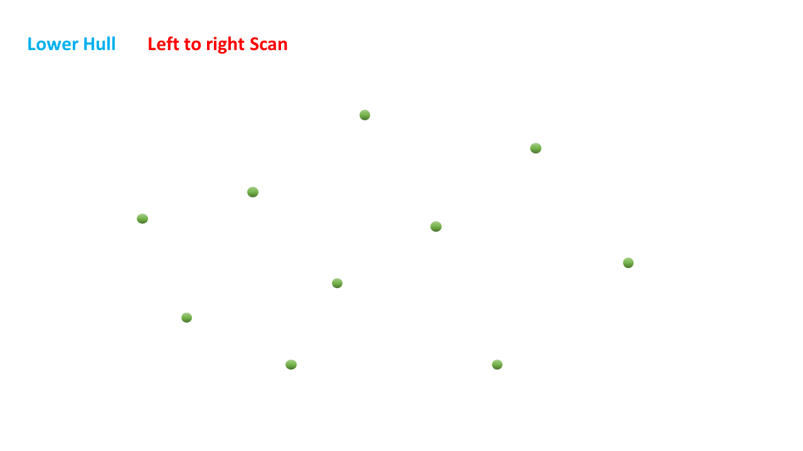
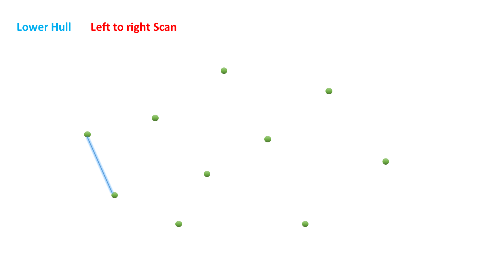
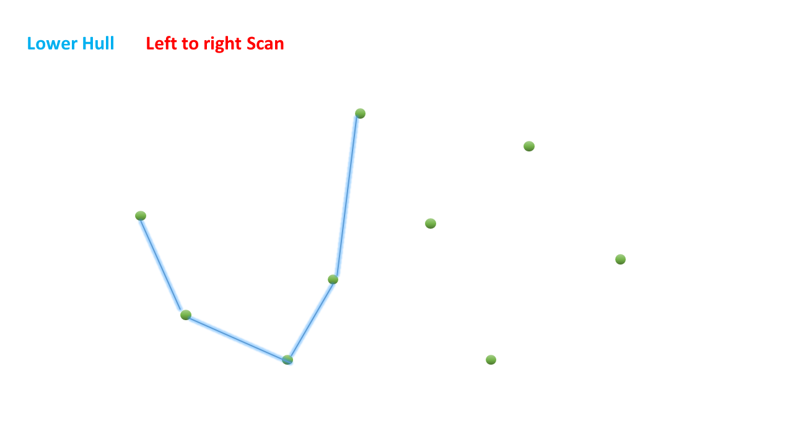
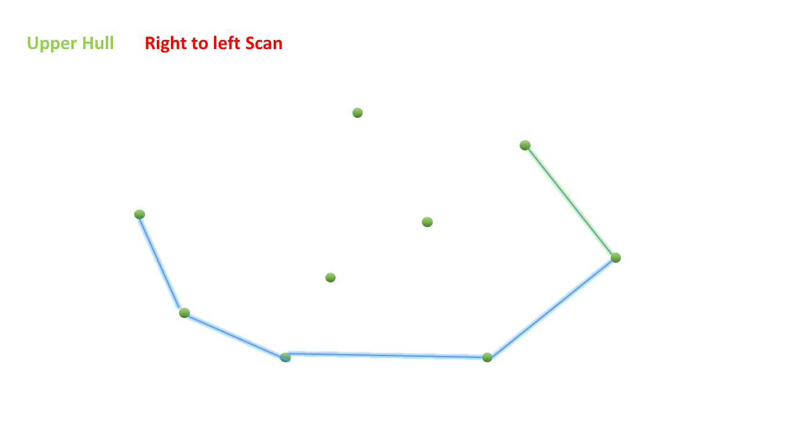

> 原文链接: https://leetcode-cn.com/problems/erect-the-fence


## 英文原文
<div><p>You are given an array <code>trees</code> where <code>trees[i] = [x<sub>i</sub>, y<sub>i</sub>]</code> represents the location of a tree in the garden.</p>

<p>You are asked to fence the entire garden using the minimum length of rope as it is expensive. The garden is well fenced only if <strong>all the trees are enclosed</strong>.</p>

<p>Return <em>the coordinates of trees that are exactly located on the fence perimeter</em>.</p>

<p>&nbsp;</p>
<p><strong>Example 1:</strong></p>

<pre>
<strong>Input:</strong> points = [[1,1],[2,2],[2,0],[2,4],[3,3],[4,2]]
<strong>Output:</strong> [[1,1],[2,0],[3,3],[2,4],[4,2]]
</pre>

<p><strong>Example 2:</strong></p>

<pre>
<strong>Input:</strong> points = [[1,2],[2,2],[4,2]]
<strong>Output:</strong> [[4,2],[2,2],[1,2]]
</pre>

<p>&nbsp;</p>
<p><strong>Constraints:</strong></p>

<ul>
	<li><code>1 &lt;= points.length &lt;= 3000</code></li>
	<li><code>points[i].length == 2</code></li>
	<li><code>0 &lt;= x<sub>i</sub>, y<sub>i</sub> &lt;= 100</code></li>
	<li>All the given points are <strong>unique</strong>.</li>
</ul>
</div>

## 中文题目
<div><p>在一个二维的花园中，有一些用 (x, y) 坐标表示的树。由于安装费用十分昂贵，你的任务是先用<strong>最短</strong>的绳子围起所有的树。只有当所有的树都被绳子包围时，花园才能围好栅栏。你需要找到正好位于栅栏边界上的树的坐标。</p>

<p>&nbsp;</p>

<p><strong>示例 1:</strong></p>

<pre><strong>输入:</strong> [[1,1],[2,2],[2,0],[2,4],[3,3],[4,2]]
<strong>输出:</strong> [[1,1],[2,0],[4,2],[3,3],[2,4]]
<strong>解释:</strong>

</pre>

<p><strong>示例 2:</strong></p>

<pre><strong>输入:</strong> [[1,2],[2,2],[4,2]]
<strong>输出:</strong> [[1,2],[2,2],[4,2]]
<strong>解释:</strong>

即使树都在一条直线上，你也需要先用绳子包围它们。
</pre>

<p>&nbsp;</p>

<p><strong>注意:</strong></p>

<ol>
	<li>所有的树应当被围在一起。你不能剪断绳子来包围树或者把树分成一组以上。</li>
	<li>输入的整数在 0 到 100 之间。</li>
	<li>花园至少有一棵树。</li>
	<li>所有树的坐标都是不同的。</li>
	<li>输入的点<strong>没有</strong>顺序。输出顺序也没有要求。</li>
</ol></div>

## 通过代码
<RecoDemo>
</RecoDemo>


## 官方题解
#### 方法 1： Jarvis 算法 [Accepted]

**算法**

Jarvis 算法背后的想法非常简单。我们从给定点集中最左边的点开始，按逆时针方向考虑将所有给定点包围起来的边界点。

这意味着对每一个点 $p$，我们试图找到一个点 $q$，满足点 $q$ 是所有点中相对于 $p$ 点逆时针方向最近的点。为了找到点 $q$，我们使用函数 `orientation()`，这个函数有 3 个参数，分别是当前凸包上的点 $p$，下一个会加到凸包里的点 $q$，其他点空间内的任何一个点 $r$。如果 $q$ 点相对于 $r$ 点来说在点 $p$ 的逆时针方向上的话，这个函数返回一个负值。

下图说明了这样的关系，点 $q$ 相比点 $r$ 在点 $p$ 的逆时针方向上。


{:align="center"}


从上图中，我们可以观察到点 $p$，$q$ 和 $r$ 形成的向量相应地都是逆时针方向，向量 $\vec{pq}$ 和 $\vex{qr}$ 的方向都朝平面向外，也就是是个正值。

$$\vec{pq}\ \times\ \vec{qr} > 0$$

$$\begin{vmatrix} (q_x-p_x) & (q_y-p_y) \\ (r_x-q_x) & (r_y-p_y) \end{vmatrix} > 0$$

$$(q_x - p_x)*(r_y - q_y) - (q_y - p_y)*(r_x - q_x) > 0$$

$$(q_y - p_y)*(r_x - q_x) - (r_y - q_y)*(q_x - p_x) < 0$$

上面的结果通过函数 `orientation()` 计算。

我们遍历所有点 $r$，找到相对于点 $p$ 来说逆时针方向最靠外的点 $q$，把它加入凸包。进一步的，如果存在 2 个点相对点 $p$ 在同一条线上，我们使用 `inBetween()` 函数，将 $q$ 和 $p$ 同一线段上的边界点都考虑进来。

通过这样，我们不断将凸包上的点加入，直到回到了开始的点。

下面的动图描述了该过程。

<,,,,,,,,,,,,,,,,,,,,,,,,,,,,,,,,,,,,,,,>

```Java []
import java.util.Arrays;
import java.util.HashSet;
import java.util.Set;

public class Solution {

    public int[][] outerTrees(int[][] trees) {
        Set<int[]> hull = new HashSet<>();
        if (trees.length < 4) {
            hull.addAll(Arrays.asList(trees));

            int[][] res = new int[hull.size()][2];
            int index = 0;
            for (int[] h : hull) {
                res[index] = h;
                index++;
            }
            return res;
        }
        int leftMost = 0;
        for (int i = 0; i < trees.length; i++) {
            if (trees[i][0] < trees[leftMost][0]) {
                leftMost = i;
            }
        }
        int p = leftMost;
        do {
            int q = (p + 1) % trees.length;
            for (int i = 0; i < trees.length; i++) {
                if (orientation(trees[p], trees[i], trees[q]) < 0) {
                    q = i;
                }
            }
            for (int i = 0; i < trees.length; i++) {
                if (i != p && i != q && orientation(trees[p], trees[i], trees[q]) == 0 && inBetween(trees[p], trees[i], trees[q])) {
                    hull.add(trees[i]);
                }
            }
            hull.add(trees[q]);
            p = q;
        } while (p != leftMost);
        int[][] res = new int[hull.size()][2];
        int index = 0;
        for (int[] h : hull) {
            res[index] = h;
            index++;
        }
        return res;
    }

    public int orientation(int[] p, int[] q, int[] r) {
        return (q[1] - p[1]) * (r[0] - q[0]) - (q[0] - p[0]) * (r[1] - q[1]);
    }

    public boolean inBetween(int[] p, int[] i, int[] q) {
        boolean a = i[0] >= p[0] && i[0] <= q[0] || i[0] <= p[0] && i[0] >= q[0];
        boolean b = i[1] >= p[1] && i[1] <= q[1] || i[1] <= p[1] && i[1] >= q[1];
        return a && b;
    }
}
```

**复杂度分析**

* 时间复杂度： $O(m*n)$ 。对于凸包上的每一个点，我们需要检查所有其他的点来确定下一个在凸包上的点。这里 $n$ 是输入的点数， $m$ 是输出的点数（即凸包上的点数）。（$m \leq n$）。

* 空间复杂度： $O(m)$ 。列表 $hull$ 最多大小为 $m$ 。

#### 方法 2：Graham 扫描 [Accepted]

**算法**

Graham 算法也是一个给定点集找凸壳的标准算法。下面的动画说明了这一算法的过程。

<,,,,,,,,,,,,,,>

这个方法的具体实现为：首先选择一个凸包上的初始点 $bm$ 。我们选择 y 坐标最小的点为起始点，如果有相同的最小 y 坐标，我们选择 x 坐标最小的，这个点被记为动图中的点 0 。然后我们将给定点集按照相对初始点的极角坐标排序（也就是从点 0 出发的一条直线）。

这一排序过程大致给了我们在逆时针顺序选点时候的思路。为了将点排序，我们使用上一方法使用过的函数 `orientation` 。极角顺序更小的点排在数组的前面。如果有两个点相对于点 0 在同一方向上，我们将它们按照与点 0 的距离排序。

我们还需要考虑另一种重要的情况，如果共线的点在凸壳的最后一条边上，我们需要从距离初始点最远的点开始考虑起。所以，在将数组排序后，我们从尾开始遍历有序数组并将共线且朝有序数组尾部的点反转顺序，因为这些点是形成凸壳过程中尾部的点，所以在经过了这些处理以后，我们得到了求凸壳时正确的点的顺序。

现在我们从有序数组最开始两个点开始考虑。我们将这条线上的点放入栈中。然后我们从第三个点开始遍历有序数组 $points$ 。如果当前点与栈顶的点相比前一条线是一个“左拐”或者是同一条线段上，我们都将当前点添加到栈顶，表示这个点暂时被添加到凸壳上。

检查左拐或者右拐使用的还是 `orientation` 函数。如果函数返回值大于 0 ，这表示当前点与栈顶点与上一条线之间的关系是逆时针的（即右拐的）。类似的，如果函数返回值是负数，表示是左拐。

如果当前点与上一条线之间的关系是右拐的，说明上一个点不应该被包括在凸壳里，因为它在边界的里面（正如动画中点 4 ）。所以我们将它从栈中弹出并考虑倒数第二条线的方向。

重复这一过程，弹栈的操作会一直进行，直到我们当前点在凸壳中出现了右拐。这表示这时凸壳中只包括边界上的点而不包括边界以内的点。在所有点被遍历了一遍以后，栈中的点就是构成凸壳的点。

```Java []
import java.util.Arrays;
import java.util.Comparator;
import java.util.Stack;

public class Solution {

    public int[][] outerTrees(int[][] trees) {
        if (trees.length <= 1) {
            return trees;
        }
        int[] bm = bottomLeft(trees);
        Arrays.sort(trees, (o1, o2) -> {
            double diff = orientation(bm, o1, o2) - orientation(bm, o2, o1);
            if (diff == 0) {
                return distance(bm, o1) - distance(bm, o2);
            } else {
                return diff > 0 ? 1 : -1;
            }
        });

        int i = trees.length - 1;
        while (i >= 0 && orientation(bm, trees[trees.length - 1], trees[i]) == 0) {
            i--;
        }
        for (int l = i + 1, h = trees.length - 1; l < h; l++, h--) {
            int[] temp = trees[l];
            trees[l] = trees[h];
            trees[h] = temp;
        }
        Stack<int[]> stack = new Stack<>();
        stack.push(trees[0]);
        stack.push(trees[1]);
        for (int j = 2; j < trees.length; j++) {
            int[] top = stack.pop();
            while (orientation(stack.peek(), top, trees[j]) > 0) {
                top = stack.pop();
            }
            stack.push(top);
            stack.push(trees[j]);
        }

        int[][] res = new int[stack.size()][2];
        int index = 0;
        for (int[] tree : stack) {
            res[index] = tree;
            index++;
        }
        return res;
    }

    public int orientation(int[] p, int[] q, int[] r) {
        return (q[1] - p[1]) * (r[0] - q[0]) - (q[0] - p[0]) * (r[1] - q[1]);
    }

    public int distance(int[] p, int[] q) {
        return (p[0] - q[0]) * (p[0] - q[0]) + (p[1] - q[1]) * (p[1] - q[1]);
    }

    private int[] bottomLeft(int[][] points) {
        int[] bottomLeft = points[0];
        for (int[] p : points) {
            if (p[1] < bottomLeft[1]) {
                bottomLeft = p;
            }
        }
        return bottomLeft;
    }
}
```

**复杂度分析**

* 时间复杂度： $O\big(nlog(n)\big)$。将给定点排序需要花费 $O\big(nlog(n)\big)$ 的时间。进一步的，在排序以后，每个点会在两种情况中被考虑到，分别是压栈和弹栈的过程。所以每个点最多会被访问 2 次，最坏情况下要 $2n$ ($O(n)$) 的时间。

* 空间复杂度：$O(n)$。最坏情况下栈的大小为 $n$。

#### 方法 3：单调链 [Accepted]

**算法**

单调链算法的想法与 Graham 扫描算分类似。它们主要的不同点在于凸壳上点的顺序。与 Graham 扫描算法按照点计较顺序排序不同，我们按照点的 x 坐标排序。如果两个点又相同的 x 坐标，那么就按照它们的 y 坐标排序。背后的原因稍后会做解释。

在这个算法中，我们将凸壳考虑成 2 个子边界组成：上凸壳和下凸壳。我们处理这两部分时略有不同。

我们首先将最初始的两个点添加到凸壳中，然后遍历排好序的 $points$ 数组。对于每个新的点，我们检查当前点是否在最后两个点的逆时针方向上。如果是的话，当前点直接被压入凸壳 $hull$ 中，如果不是的话（即 `orientation` 返回的结果为正数），我们可以知道栈顶的元素在凸壳里面而不是凸壳边上。我们继续从 $hull$ 中弹出元素直到当前点相对于栈顶的两个点的逆时针方向上。

这个方法中，我们不需要显式地考虑共线的点，因为这些点已经按照 x 坐标排好了序。所以如果有共线的点，它们已经被隐式地按正确顺序考虑了。

通过这样，我们会一直遍历到 x 坐标最大的点为止。但是凸壳还没有完全求解出来。目前求解出来的部分只包括凸壳的下半部分。现在我们需要求出凸壳的上半部分。

我们继续找下一个逆时针的点并将不在边界上的点从栈中弹出，但这次我们遍历的顺序是按照 x 坐标从大到小，我们只需要从后往前遍历有序数组 $points$ 即可。我们将新的上凸壳的值添加到之前的 $hull$ 数组中。最后，$hull$ 数组返回了我们需要的边界上的点。

下面的动图展示了这一过程。

<,,,,,,,,,,,,,,,,,,,,,,,,,,,,>

```Java []
import java.util.Arrays;
import java.util.HashSet;
import java.util.Objects;
import java.util.Set;
import java.util.Stack;

public class Solution {

    public int[][] outerTrees(int[][] trees) {
        Arrays.sort(trees, (p, q) -> q[0] - p[0] == 0 ? q[1] - p[1] : q[0] - p[0]);

        Stack<int[]> hull = new Stack<>();
        for (int[] tree : trees) {
            while (hull.size() >= 2 && orientation(hull.get(hull.size() - 2), hull.get(hull.size() - 1), tree) > 0) {
                hull.pop();
            }
            hull.push(tree);
        }
        hull.pop();
        for (int i = trees.length - 1; i >= 0; i--) {
            while (hull.size() >= 2 && orientation(hull.get(hull.size() - 2), hull.get(hull.size() - 1), trees[i]) > 0) {
                hull.pop();
            }
            hull.push(trees[i]);
        }


        // 去重
        Set<Point> hashSet = new HashSet<>();
        for (int[] tree : hull) {
            hashSet.add(new Point(tree[0], tree[1]));
        }


        int index = 0;
        int[][] res = new int[hashSet.size()][2];
        for (Point tree : hashSet) {
            res[index] = new int[]{tree.a, tree.b};
            index++;
        }
        return res;
    }


    class Point {
        int a;
        int b;

        public Point(int a, int b) {
            this.a = a;
            this.b = b;
        }

        @Override
        public boolean equals(Object o) {
            if (this == o) {
                return true;
            }
            if (o == null || getClass() != o.getClass()) {
                return false;
            }
            Point point = (Point) o;
            return a == point.a && b == point.b;
        }

        @Override
        public int hashCode() {
            return Objects.hash(a, b);
        }
    }

    public int orientation(int[] p, int[] q, int[] r) {
        return (q[1] - p[1]) * (r[0] - q[0]) - (q[0] - p[0]) * (r[1] - q[1]);
    }
}
```

**复杂度分析**

* 时间复杂度：$O\big(nlog(n)\big)$。将给定点集排序需要 $O\big(nlog(n)\big)$ 的时间。进一步的，排序后的点会在两种情况下遍历到，一次是压入栈中，另一次是弹出栈。每个点最多会被遍历 2 次，最坏情况下时间复杂度为 $2n$($O(n)$)。

* 空间复杂度：$O(n)$。栈 $hull$ 大小最多为 $n$。


## 统计信息
| 通过次数 | 提交次数 | AC比率 |
| :------: | :------: | :------: |
|    2254    |    5807    |   38.8%   |

## 提交历史
| 提交时间 | 提交结果 | 执行时间 |  内存消耗  | 语言 |
| :------: | :------: | :------: | :--------: | :--------: |
