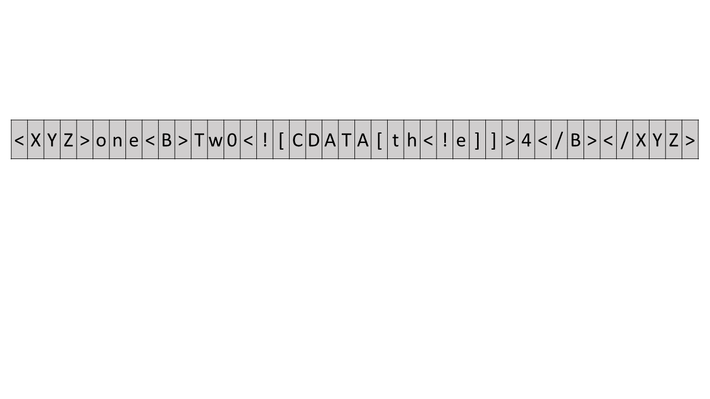
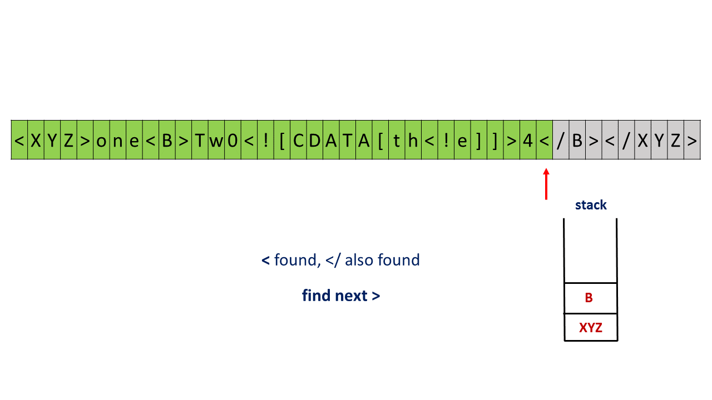
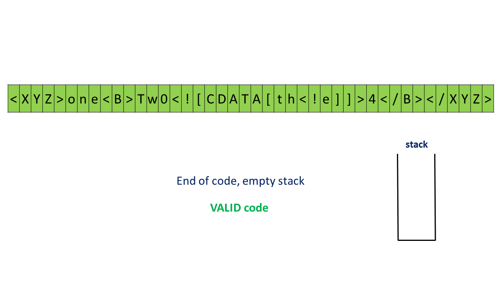

> 原文链接: https://leetcode-cn.com/problems/tag-validator


## 英文原文
<div><p>Given a string representing a code snippet, implement a tag validator to parse the code and return whether it is valid.</p>

<p>A code snippet is valid if all the following rules hold:</p>

<ol>
	<li>The code must be wrapped in a <b>valid closed tag</b>. Otherwise, the code is invalid.</li>
	<li>A <b>closed tag</b> (not necessarily valid) has exactly the following format : <code>&lt;TAG_NAME&gt;TAG_CONTENT&lt;/TAG_NAME&gt;</code>. Among them, <code>&lt;TAG_NAME&gt;</code> is the start tag, and <code>&lt;/TAG_NAME&gt;</code> is the end tag. The TAG_NAME in start and end tags should be the same. A closed tag is <b>valid</b> if and only if the TAG_NAME and TAG_CONTENT are valid.</li>
	<li>A <b>valid</b> <code>TAG_NAME</code> only contain <b>upper-case letters</b>, and has length in range [1,9]. Otherwise, the <code>TAG_NAME</code> is <b>invalid</b>.</li>
	<li>A <b>valid</b> <code>TAG_CONTENT</code> may contain other <b>valid closed tags</b>, <b>cdata</b> and any characters (see note1) <b>EXCEPT</b> unmatched <code>&lt;</code>, unmatched start and end tag, and unmatched or closed tags with invalid TAG_NAME. Otherwise, the <code>TAG_CONTENT</code> is <b>invalid</b>.</li>
	<li>A start tag is unmatched if no end tag exists with the same TAG_NAME, and vice versa. However, you also need to consider the issue of unbalanced when tags are nested.</li>
	<li>A <code>&lt;</code> is unmatched if you cannot find a subsequent <code>&gt;</code>. And when you find a <code>&lt;</code> or <code>&lt;/</code>, all the subsequent characters until the next <code>&gt;</code> should be parsed as TAG_NAME (not necessarily valid).</li>
	<li>The cdata has the following format : <code>&lt;![CDATA[CDATA_CONTENT]]&gt;</code>. The range of <code>CDATA_CONTENT</code> is defined as the characters between <code>&lt;![CDATA[</code> and the <b>first subsequent</b> <code>]]&gt;</code>.</li>
	<li><code>CDATA_CONTENT</code> may contain <b>any characters</b>. The function of cdata is to forbid the validator to parse <code>CDATA_CONTENT</code>, so even it has some characters that can be parsed as tag (no matter valid or invalid), you should treat it as <b>regular characters</b>.</li>
</ol>

<p>&nbsp;</p>
<p><strong>Example 1:</strong></p>

<pre>
<strong>Input:</strong> code = &quot;&lt;DIV&gt;This is the first line &lt;![CDATA[&lt;div&gt;]]&gt;&lt;/DIV&gt;&quot;
<strong>Output:</strong> true
<strong>Explanation:</strong> 
The code is wrapped in a closed tag : &lt;DIV&gt; and &lt;/DIV&gt;. 
The TAG_NAME is valid, the TAG_CONTENT consists of some characters and cdata. 
Although CDATA_CONTENT has an unmatched start tag with invalid TAG_NAME, it should be considered as plain text, not parsed as a tag.
So TAG_CONTENT is valid, and then the code is valid. Thus return true.
</pre>

<p><strong>Example 2:</strong></p>

<pre>
<strong>Input:</strong> code = &quot;&lt;DIV&gt;&gt;&gt;  ![cdata[]] &lt;![CDATA[&lt;div&gt;]&gt;]]&gt;]]&gt;&gt;]&lt;/DIV&gt;&quot;
<strong>Output:</strong> true
<strong>Explanation:</strong>
We first separate the code into : start_tag|tag_content|end_tag.
start_tag -&gt; <b>&quot;&lt;DIV&gt;&quot;</b>
end_tag -&gt; <b>&quot;&lt;/DIV&gt;&quot;</b>
tag_content could also be separated into : text1|cdata|text2.
text1 -&gt; <b>&quot;&gt;&gt;  ![cdata[]] &quot;</b>
cdata -&gt; <b>&quot;&lt;![CDATA[&lt;div&gt;]&gt;]]&gt;&quot;</b>, where the CDATA_CONTENT is <b>&quot;&lt;div&gt;]&gt;&quot;</b>
text2 -&gt; <b>&quot;]]&gt;&gt;]&quot;</b>
The reason why start_tag is NOT <b>&quot;&lt;DIV&gt;&gt;&gt;&quot;</b> is because of the rule 6.
The reason why cdata is NOT <b>&quot;&lt;![CDATA[&lt;div&gt;]&gt;]]&gt;]]&gt;&quot;</b> is because of the rule 7.
</pre>

<p><strong>Example 3:</strong></p>

<pre>
<strong>Input:</strong> code = &quot;&lt;A&gt;  &lt;B&gt; &lt;/A&gt;   &lt;/B&gt;&quot;
<strong>Output:</strong> false
<strong>Explanation:</strong> Unbalanced. If &quot;&lt;A&gt;&quot; is closed, then &quot;&lt;B&gt;&quot; must be unmatched, and vice versa.
</pre>

<p><strong>Example 4:</strong></p>

<pre>
<strong>Input:</strong> code = &quot;&lt;DIV&gt;  div tag is not closed  &lt;DIV&gt;&quot;
<strong>Output:</strong> false
</pre>

<p>&nbsp;</p>
<p><strong>Constraints:</strong></p>

<ul>
	<li><code>1 &lt;= code.length &lt;= 500</code></li>
	<li><code>code</code> consists of English letters, digits, <code>&#39;&lt;&#39;</code>, <code>&#39;&gt;&#39;</code>, <code>&#39;/&#39;</code>, <code>&#39;!&#39;</code>, <code>&#39;[&#39;</code>, <code>&#39;]&#39;</code>, <code>&#39;.&#39;</code>, and <code>&#39; &#39;</code>.</li>
</ul>
</div>

## 中文题目
<div><p>给定一个表示代码片段的字符串，你需要实现一个验证器来解析这段代码，并返回它是否合法。合法的代码片段需要遵守以下的所有规则：</p>

<ol>
	<li>代码必须被<strong>合法的闭合标签</strong>包围。否则，代码是无效的。</li>
	<li><strong>闭合标签</strong>（不一定合法）要严格符合格式：<code>&lt;TAG_NAME&gt;TAG_CONTENT&lt;/TAG_NAME&gt;</code>。其中，<code>&lt;TAG_NAME&gt;</code>是起始标签，<code>&lt;/TAG_NAME&gt;</code>是结束标签。起始和结束标签中的 TAG_NAME 应当相同。当且仅当&nbsp;TAG_NAME 和 TAG_CONTENT 都是合法的，闭合标签才是<strong>合法的</strong>。</li>
	<li><strong>合法的</strong>&nbsp;<code>TAG_NAME</code>&nbsp;仅含有<strong>大写字母</strong>，长度在范围 [1,9] 之间。否则，该&nbsp;<code>TAG_NAME</code>&nbsp;是<strong>不合法的</strong>。</li>
	<li><strong>合法的</strong>&nbsp;<code>TAG_CONTENT</code>&nbsp;可以包含其他<strong>合法的闭合标签</strong>，<strong>cdata</strong>&nbsp;（请参考规则7）和任意字符（注意参考规则1）<strong>除了</strong>不匹配的<code>&lt;</code>、不匹配的起始和结束标签、不匹配的或带有不合法 TAG_NAME 的闭合标签。否则，<code>TAG_CONTENT</code>&nbsp;是<strong>不合法的</strong>。</li>
	<li>一个起始标签，如果没有具有相同&nbsp;TAG_NAME 的结束标签与之匹配，是不合法的。反之亦然。不过，你也需要考虑标签嵌套的问题。</li>
	<li>一个<code>&lt;</code>，如果你找不到一个后续的<code>&gt;</code>与之匹配，是不合法的。并且当你找到一个<code>&lt;</code>或<code>&lt;/</code>时，所有直到下一个<code>&gt;</code>的前的字符，都应当被解析为&nbsp;TAG_NAME（不一定合法）。</li>
	<li>cdata 有如下格式：<code>&lt;![CDATA[CDATA_CONTENT]]&gt;</code>。<code>CDATA_CONTENT</code>&nbsp;的范围被定义成&nbsp;<code>&lt;![CDATA[</code>&nbsp;和<strong>后续的第一个</strong>&nbsp;<code>]]&gt;</code>之间的字符。</li>
	<li><code>CDATA_CONTENT</code>&nbsp;可以包含<strong>任意字符</strong>。cdata 的功能是阻止验证器解析<code>CDATA_CONTENT</code>，所以即使其中有一些字符可以被解析为标签（无论合法还是不合法），也应该将它们视为<strong>常规字符</strong>。</li>
</ol>

<p><strong>合法代码的例子:</strong></p>

<pre>
<strong>输入:</strong> &quot;&lt;DIV&gt;This is the first line &lt;![CDATA[&lt;div&gt;]]&gt;&lt;/DIV&gt;&quot;

<strong>输出:</strong> True

<strong>解释:</strong> 

代码被包含在了闭合的标签内： &lt;DIV&gt; 和 &lt;/DIV&gt; 。

TAG_NAME 是合法的，TAG_CONTENT 包含了一些字符和 cdata 。 

即使 CDATA_CONTENT 含有不匹配的起始标签和不合法的 TAG_NAME，它应该被视为普通的文本，而不是标签。

所以 TAG_CONTENT 是合法的，因此代码是合法的。最终返回True。


<strong>输入:</strong> &quot;&lt;DIV&gt;&gt;&gt;  ![cdata[]] &lt;![CDATA[&lt;div&gt;]&gt;]]&gt;]]&gt;&gt;]&lt;/DIV&gt;&quot;

<strong>输出:</strong> True

<strong>解释:</strong>

我们首先将代码分割为： start_tag|tag_content|end_tag 。

start_tag -&gt; <strong>&quot;&lt;DIV&gt;&quot;</strong>

end_tag -&gt; <strong>&quot;&lt;/DIV&gt;&quot;</strong>

tag_content 也可被分割为： text1|cdata|text2 。

text1 -&gt; <strong>&quot;&gt;&gt;  ![cdata[]] &quot;</strong>

cdata -&gt; <strong>&quot;&lt;![CDATA[&lt;div&gt;]&gt;]]&gt;&quot;</strong> ，其中 CDATA_CONTENT 为 <strong>&quot;&lt;div&gt;]&gt;&quot;</strong>

text2 -&gt; <strong>&quot;]]&gt;&gt;]&quot;</strong>


start_tag <strong>不</strong>是 <strong>&quot;&lt;DIV&gt;&gt;&gt;&quot;</strong> 的原因参照规则 6 。
cdata <strong>不</strong>是 <strong>&quot;&lt;![CDATA[&lt;div&gt;]&gt;]]&gt;]]&gt;&quot;</strong> 的原因参照规则 7 。
</pre>

<p><strong>不合法代码的例子:</strong></p>

<pre>
<strong>输入:</strong> &quot;&lt;A&gt;  &lt;B&gt; &lt;/A&gt;   &lt;/B&gt;&quot;
<strong>输出:</strong> False
<strong>解释:</strong> 不合法。如果 &quot;&lt;A&gt;&quot; 是闭合的，那么 &quot;&lt;B&gt;&quot; 一定是不匹配的，反之亦然。

<strong>输入:</strong> &quot;&lt;DIV&gt;  div tag is not closed  &lt;DIV&gt;&quot;
<strong>输出:</strong> False

<strong>输入:</strong> &quot;&lt;DIV&gt;  unmatched &lt;  &lt;/DIV&gt;&quot;
<strong>输出:</strong> False

<strong>输入:</strong> &quot;&lt;DIV&gt; closed tags with invalid tag name  &lt;b&gt;123&lt;/b&gt; &lt;/DIV&gt;&quot;
<strong>输出:</strong> False

<strong>输入:</strong> &quot;&lt;DIV&gt; unmatched tags with invalid tag name  &lt;/1234567890&gt; and &lt;CDATA[[]]&gt;  &lt;/DIV&gt;&quot;
<strong>输出:</strong> False

<strong>输入:</strong> &quot;&lt;DIV&gt;  unmatched start tag &lt;B&gt;  and unmatched end tag &lt;/C&gt;  &lt;/DIV&gt;&quot;
<strong>输出:</strong> False
</pre>

<p><strong>注意:</strong></p>

<ol>
	<li>为简明起见，你可以假设输入的代码（包括提到的<strong>任意字符</strong>）只包含<code>数字</code>, <font color="#c7254e" face="Menlo, Monaco, Consolas, Courier New, monospace"><span style="background-color:#f9f2f4; font-size:12.6px">字母</span></font>, <code>&#39;&lt;&#39;</code>,<code>&#39;&gt;&#39;</code>,<code>&#39;/&#39;</code>,<code>&#39;!&#39;</code>,<code>&#39;[&#39;</code>,<code>&#39;]&#39;</code>和<code>&#39; &#39;</code>。</li>
</ol>
</div>

## 通过代码
<RecoDemo>
</RecoDemo>


## 官方题解
#### 栈：

我们可以使用栈来模拟整个代码片段的解析过程。当我们发现一个起始标签时，我们把标签入栈；当我们发现一个结束标签时，我们必须保证它和栈顶的起始标签的 `TAG_NAME` 相匹配。在代码解析完毕之后，我们必须保证栈为空。

我们从代码的起始位置遍历整个代码片段。当我们发现 `<` 时，如果我们目前不在 cdata 的范围内，那么我们必须解析这个 `<`，即接下来一定是一个标签（起始标签或结束标签）或者一段 cdata。如果 `<` 后面接着的是 `!`，那么后面一定是一段 cdata，接下来必须匹配到 `[CDATA[`。在这之后，我们就可以遍历代码片段直到遇到 `]]>`，表示 cdata 的结束，这中间的所有特殊符号我们都不需要解析。

如果 `<` 后面接着的不是 `!`，那么它一定是一个标签。如果是 `</` 那么它是结束标签，否则是开始标签。我们继续遍历代码片段，直到遇到 `>` 表示标签的结束为止。此时 `<` 或 `</` 与 `>` 之间的部分就是 `TAG_NAME`，我们需要检查 `TAG_NAME` 的合法性。如果它是一个起始标签，我们会把 `TAG_NAME` 入栈，如果它是一个结束标签，我们需要检查 `TAG_NAME` 和栈顶的元素是否相同。如果不相同或者栈为空，那么这就是一个不合法的结束标签。

在代码片段遍历结束后，我们还需要检查两点：第一是栈是否为空，如果不为空，说明还有未闭合的标签；第二是代码片段是否被合法的闭合标签包围，我们需要保证在第一个起始标签被闭合后，接下来不会有任何代码，并且每个 cdata 必须在栈不为空的时候才能出现。

<,,,,,,,,,,,,,,,,,,,,>

```Java [sol1]
public class Solution {
    Stack < String > stack = new Stack < > ();
    boolean contains_tag = false;
    public boolean isValidTagName(String s, boolean ending) {
        if (s.length() < 1 || s.length() > 9)
            return false;
        for (int i = 0; i < s.length(); i++) {
            if (!Character.isUpperCase(s.charAt(i)))
                return false;
        }
        if (ending) {
            if (!stack.isEmpty() && stack.peek().equals(s))
                stack.pop();
            else
                return false;
        } else {
            contains_tag = true;
            stack.push(s);
        }
        return true;
    }
    public boolean isValidCdata(String s) {
        return s.indexOf("[CDATA[") == 0;
    }
    public boolean isValid(String code) {
        if (code.charAt(0) != '<' || code.charAt(code.length() - 1) != '>')
            return false;
        for (int i = 0; i < code.length(); i++) {
            boolean ending = false;
            int closeindex;
            if(stack.isEmpty() && contains_tag)
                return false;
            if (code.charAt(i) == '<') {
                if (!stack.isEmpty() && code.charAt(i + 1) == '!') {
                    closeindex = code.indexOf("]]>", i + 1);
                    if (closeindex < 0 || !isValidCdata(code.substring(i + 2, closeindex)))
                        return false;
                } else {
                    if (code.charAt(i + 1) == '/') {
                        i++;
                        ending = true;
                    }
                    closeindex = code.indexOf('>', i + 1);
                    if (closeindex < 0 || !isValidTagName(code.substring(i + 1, closeindex), ending))
                        return false;
                }
                i = closeindex;
            }
        }
        return stack.isEmpty() && contains_tag;
    }
}
```

**复杂度分析**

* 时间复杂度：$O(N)$，其中 $N$ 是代码片段的长度。

* 空间复杂度：$O(N)$。

## 统计信息
| 通过次数 | 提交次数 | AC比率 |
| :------: | :------: | :------: |
|    1914    |    5590    |   34.2%   |

## 提交历史
| 提交时间 | 提交结果 | 执行时间 |  内存消耗  | 语言 |
| :------: | :------: | :------: | :--------: | :--------: |


## 相似题目
|                             题目                             | 难度 |
| :----------------------------------------------------------: | :---------: |
| [给字符串添加加粗标签](https://leetcode-cn.com/problems/add-bold-tag-in-string/) | 中等|
