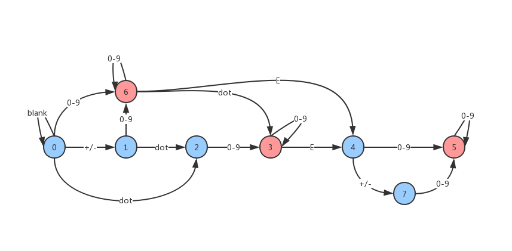

> 原文链接: https://leetcode-cn.com/problems/valid-number


## 英文原文
<div><p>A <strong>valid number</strong> can be split up into these components (in order):</p>

<ol>
	<li>A <strong>decimal number</strong> or an <strong>integer</strong>.</li>
	<li>(Optional) An <code>&#39;e&#39;</code> or <code>&#39;E&#39;</code>, followed by an <strong>integer</strong>.</li>
</ol>

<p>A <strong>decimal number</strong> can be split up into these components (in order):</p>

<ol>
	<li>(Optional) A sign character (either <code>&#39;+&#39;</code> or <code>&#39;-&#39;</code>).</li>
	<li>One of the following formats:
	<ol>
		<li>One or more digits, followed by a dot <code>&#39;.&#39;</code>.</li>
		<li>One or more digits, followed by a dot <code>&#39;.&#39;</code>, followed by one or more digits.</li>
		<li>A dot <code>&#39;.&#39;</code>, followed by one or more digits.</li>
	</ol>
	</li>
</ol>

<p>An <strong>integer</strong> can be split up into these components (in order):</p>

<ol>
	<li>(Optional) A sign character (either <code>&#39;+&#39;</code> or <code>&#39;-&#39;</code>).</li>
	<li>One or more digits.</li>
</ol>

<p>For example, all the following are valid numbers: <code>[&quot;2&quot;, &quot;0089&quot;, &quot;-0.1&quot;, &quot;+3.14&quot;, &quot;4.&quot;, &quot;-.9&quot;, &quot;2e10&quot;, &quot;-90E3&quot;, &quot;3e+7&quot;, &quot;+6e-1&quot;, &quot;53.5e93&quot;, &quot;-123.456e789&quot;]</code>, while the following are not valid numbers: <code>[&quot;abc&quot;, &quot;1a&quot;, &quot;1e&quot;, &quot;e3&quot;, &quot;99e2.5&quot;, &quot;--6&quot;, &quot;-+3&quot;, &quot;95a54e53&quot;]</code>.</p>

<p>Given a string <code>s</code>, return <code>true</code><em> if </em><code>s</code><em> is a <strong>valid number</strong></em>.</p>

<p>&nbsp;</p>
<p><strong>Example 1:</strong></p>

<pre>
<strong>Input:</strong> s = &quot;0&quot;
<strong>Output:</strong> true
</pre>

<p><strong>Example 2:</strong></p>

<pre>
<strong>Input:</strong> s = &quot;e&quot;
<strong>Output:</strong> false
</pre>

<p><strong>Example 3:</strong></p>

<pre>
<strong>Input:</strong> s = &quot;.&quot;
<strong>Output:</strong> false
</pre>

<p><strong>Example 4:</strong></p>

<pre>
<strong>Input:</strong> s = &quot;.1&quot;
<strong>Output:</strong> true
</pre>

<p>&nbsp;</p>
<p><strong>Constraints:</strong></p>

<ul>
	<li><code>1 &lt;= s.length &lt;= 20</code></li>
	<li><code>s</code> consists of only English letters (both uppercase and lowercase), digits (<code>0-9</code>), plus <code>&#39;+&#39;</code>, minus <code>&#39;-&#39;</code>, or dot <code>&#39;.&#39;</code>.</li>
</ul>
</div>

## 中文题目
<div><p><strong>有效数字</strong>（按顺序）可以分成以下几个部分：</p>

<ol>
	<li>一个 <strong>小数</strong> 或者 <strong>整数</strong></li>
	<li>（可选）一个 <code>'e'</code> 或 <code>'E'</code> ，后面跟着一个 <strong>整数</strong></li>
</ol>

<p><strong>小数</strong>（按顺序）可以分成以下几个部分：</p>

<ol>
	<li>（可选）一个符号字符（<code>'+'</code> 或 <code>'-'</code>）</li>
	<li>下述格式之一：
	<ol>
		<li>至少一位数字，后面跟着一个点 <code>'.'</code></li>
		<li>至少一位数字，后面跟着一个点 <code>'.'</code> ，后面再跟着至少一位数字</li>
		<li>一个点 <code>'.'</code> ，后面跟着至少一位数字</li>
	</ol>
	</li>
</ol>

<p><strong>整数</strong>（按顺序）可以分成以下几个部分：</p>

<ol>
	<li>（可选）一个符号字符（<code>'+'</code> 或 <code>'-'</code>）</li>
	<li>至少一位数字</li>
</ol>

<p>部分有效数字列举如下：</p>

<ul>
	<li><code>["2", "0089", "-0.1", "+3.14", "4.", "-.9", "2e10", "-90E3", "3e+7", "+6e-1", "53.5e93", "-123.456e789"]</code></li>
</ul>

<p>部分无效数字列举如下：</p>

<ul>
	<li><code>["abc", "1a", "1e", "e3", "99e2.5", "--6", "-+3", "95a54e53"]</code></li>
</ul>

<p>给你一个字符串 <code>s</code> ，如果 <code>s</code> 是一个 <strong>有效数字</strong> ，请返回 <code>true</code> 。</p>

<p> </p>

<p><strong>示例 1：</strong></p>

<pre>
<strong>输入：</strong>s = "0"
<strong>输出：</strong>true
</pre>

<p><strong>示例 2：</strong></p>

<pre>
<strong>输入：</strong>s = "e"
<strong>输出：</strong>false
</pre>

<p><strong>示例 3：</strong></p>

<pre>
<strong>输入：</strong>s = "."
<strong>输出：</strong>false
</pre>

<p><strong>示例 4：</strong></p>

<pre>
<strong>输入：</strong>s = ".1"
<strong>输出：</strong>true
</pre>

<p> </p>

<p><strong>提示：</strong></p>

<ul>
	<li><code>1 <= s.length <= 20</code></li>
	<li><code>s</code> 仅含英文字母（大写和小写），数字（<code>0-9</code>），加号 <code>'+'</code> ，减号 <code>'-'</code> ，或者点 <code>'.'</code> 。</li>
</ul>
</div>

## 通过代码
<RecoDemo>
</RecoDemo>


## 高赞题解
本题可以采用《编译原理》里面的确定的有限状态机（DFA）解决。构造一个DFA并实现，构造方法可以先写正则表达式，然后转为 DFA，也可以直接写，我就是直接写的，虽然大概率不会是最简结构（具体请参考《编译器原理》图灵出版社），不过不影响解题。DFA 作为确定的有限状态机，比 NFA 更加实用，因为对于每一个状态接收的下一个字符，DFA 能确定唯一一条转换路径，所以使用简单的表驱动的一些方法就可以实现，并且只需要读一遍输入流，比起 NFA 需要回读在速度上会有所提升。

构建出来的状态机如封面图片所示（红色为 **终止状态**，蓝色为 **中间状态**）。根据《编译原理》的解释，DFA 从状态 0 接受串 s 作为输入。当s耗尽的时候如果当前状态处于中间状态，则拒绝；如果到达终止状态，则接受。

然后，根据 DFA 列出如下的状态跳转表，之后我们就可以采用 **表驱动法** 进行编程实现了。需要注意的是，这里面多了一个状态 8，是用于处理串后面的若干个多余空格的。所以，所有的终止态都要跟上一个状态 8。其中，有一些状态标识为-1，是表示遇到了一些意外的字符，可以直接停止后续的计算。状态跳转表如下：

state | blank | +/- | 0-9 | . | e | other  
--|--|--|--|--|--|--
 0| 0| 1| 6| 2|-1|-1
 1|-1|-1| 6| 2|-1|-1
 2|-1|-1| 3|-1|-1|-1
 3|8|-1| 3|-1| 4|-1
 4|-1| 7| 5|-1|-1|-1
 5|8|-1| 5|-1|-1|-1
 6|8|-1| 6| 3| 4|-1
 7|-1|-1| 5|-1|-1|-1
 8|8|-1|-1|-1|-1|-1

状态图：


```JavaScript []
var isNumber = function(s) {
    let state = 0, 
        finals = [0,0,0,1,0,1,1,0,1],
        transfer = [[ 0, 1, 6, 2,-1,-1],
                    [-1,-1, 6, 2,-1,-1],
                    [-1,-1, 3,-1,-1,-1],
                    [ 8,-1, 3,-1, 4,-1],
                    [-1, 7, 5,-1,-1,-1],
                    [ 8,-1, 5,-1,-1,-1],
                    [ 8,-1, 6, 3, 4,-1],
                    [-1,-1, 5,-1,-1,-1],
                    [ 8,-1,-1,-1,-1,-1]], 
        make = (c) => {
            switch(c) {
                case " ": return 0;
                case "+":
                case "-": return 1;
                case ".": return 3;
                case "e": return 4;
                default:
                    let code = c.charCodeAt();
                    if(code >= 48 && code <= 57) {
                        return 2;
                    } else {
                        return 5;
                    }
            }
        };
    for(let i=0; i < s.length; ++i) {
        state = transfer[state][make(s[i])];
        if (state < 0) return false;
    }
    return finals[state];
};
```
```Java []
class Solution {
    public int make(char c) {
        switch(c) {
            case ' ': return 0;
            case '+':
            case '-': return 1;
            case '.': return 3;
            case 'e': return 4;
            default:
                if(c >= 48 && c <= 57) return 2;
        }
        return -1;
    }
    
    public boolean isNumber(String s) {
        int state = 0;
        int finals = 0b101101000;
        int[][] transfer = new int[][]{{ 0, 1, 6, 2,-1},
                                       {-1,-1, 6, 2,-1},
                                       {-1,-1, 3,-1,-1},
                                       { 8,-1, 3,-1, 4},
                                       {-1, 7, 5,-1,-1},
                                       { 8,-1, 5,-1,-1},
                                       { 8,-1, 6, 3, 4},
                                       {-1,-1, 5,-1,-1},
                                       { 8,-1,-1,-1,-1}};
        char[] ss = s.toCharArray();
        for(int i=0; i < ss.length; ++i) {
            int id = make(ss[i]);
            if (id < 0) return false;
            state = transfer[state][id];
            if (state < 0) return false;
        }
        return (finals & (1 << state)) > 0;
    }
}
```

## 统计信息
| 通过次数 | 提交次数 | AC比率 |
| :------: | :------: | :------: |
|    48185    |    177855    |   27.1%   |

## 提交历史
| 提交时间 | 提交结果 | 执行时间 |  内存消耗  | 语言 |
| :------: | :------: | :------: | :--------: | :--------: |


## 相似题目
|                             题目                             | 难度 |
| :----------------------------------------------------------: | :---------: |
| [字符串转换整数 (atoi)](https://leetcode-cn.com/problems/string-to-integer-atoi/) | 中等|
