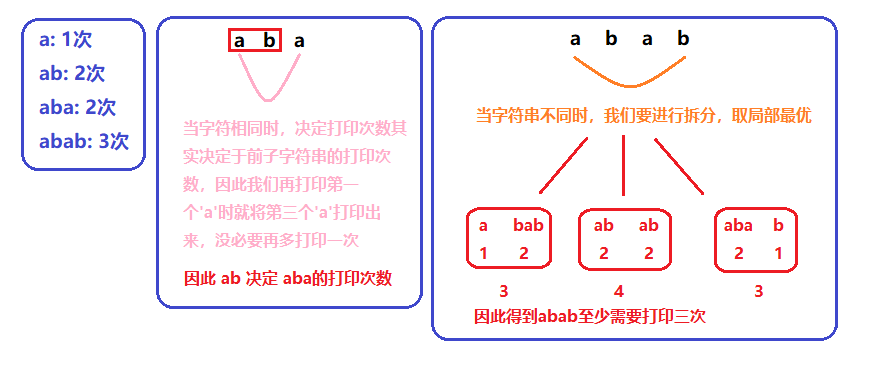
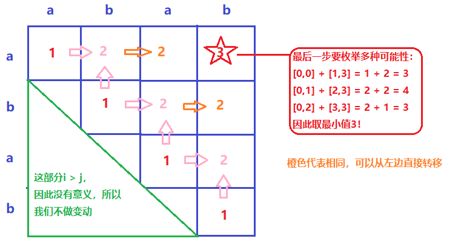

> 原文链接: https://leetcode-cn.com/problems/strange-printer


## 英文原文
<div><p>There is a strange printer with the following two special properties:</p>

<ul>
	<li>The printer can only print a sequence of <strong>the same character</strong> each time.</li>
	<li>At each turn, the printer can print new characters starting from and ending at any place and will cover the original existing characters.</li>
</ul>

<p>Given a string <code>s</code>, return <em>the minimum number of turns the printer needed to print it</em>.</p>

<p>&nbsp;</p>
<p><strong>Example 1:</strong></p>

<pre>
<strong>Input:</strong> s = &quot;aaabbb&quot;
<strong>Output:</strong> 2
<strong>Explanation:</strong> Print &quot;aaa&quot; first and then print &quot;bbb&quot;.
</pre>

<p><strong>Example 2:</strong></p>

<pre>
<strong>Input:</strong> s = &quot;aba&quot;
<strong>Output:</strong> 2
<strong>Explanation:</strong> Print &quot;aaa&quot; first and then print &quot;b&quot; from the second place of the string, which will cover the existing character &#39;a&#39;.
</pre>

<p>&nbsp;</p>
<p><strong>Constraints:</strong></p>

<ul>
	<li><code>1 &lt;= s.length &lt;= 100</code></li>
	<li><code>s</code> consists of lowercase English letters.</li>
</ul>
</div>

## 中文题目
<div><p>有台奇怪的打印机有以下两个特殊要求：</p>

<ul>
	<li>打印机每次只能打印由 <strong>同一个字符</strong> 组成的序列。</li>
	<li>每次可以在任意起始和结束位置打印新字符，并且会覆盖掉原来已有的字符。</li>
</ul>

<p>给你一个字符串 <code>s</code> ，你的任务是计算这个打印机打印它需要的最少打印次数。</p>
 

<p><strong>示例 1：</strong></p>

<pre>
<strong>输入：</strong>s = "aaabbb"
<strong>输出：</strong>2
<strong>解释：</strong>首先打印 "aaa" 然后打印 "bbb"。
</pre>

<p><strong>示例 2：</strong></p>

<pre>
<strong>输入：</strong>s = "aba"
<strong>输出：</strong>2
<strong>解释：</strong>首先打印 "aaa" 然后在第二个位置打印 "b" 覆盖掉原来的字符 'a'。
</pre>

<p> </p>

<p><strong>提示：</strong></p>

<ul>
	<li><code>1 <= s.length <= 100</code></li>
	<li><code>s</code> 由小写英文字母组成</li>
</ul>
</div>

## 通过代码
<RecoDemo>
</RecoDemo>


## 高赞题解
### 缩小问题规模
对于以下情况的打印次数:
1. 只有一个字符`a`: 一次(最基本的情况)
2. 打印两个字符`ab`: 打印两次. 在1的基础上多打印一次
3. 打印`aba`: 还是两次, 同`2`的打印方式相同, 但需要在打印第一个`a`时将第三个`a`也打印出来
4. 打印`abab`: 三次, 有多种打印方式, 可以在打印`aba`的基础上再打印`b`,或者在打印`bab`的基础上再打印`a`. 无论那种方式,最少也需要三次才能打印出来.

通过以上的事实我们得到两点：
1. 我们知道当区间的两边字符相同时(`aba`), 它的打印次数可以从它的更小一层的子区间的打印次数而来
2. 当区间两边字符不同时(`abab`)，它的打印次数会取其子区间中的最优解，这一部分我们需要枚举所有的可能性

******************
### 动态规划
由以上的思路我们知道本题可以使用自低向上的动态规划解法。我们首先要定义对于`dp[i][j]`的含义。`dp[i][j]`代表的是字符串在区间`[i,j]`中需要最少的打印次数。
1. 打印一个字符串的次数为1，因此`dp[i][i] = 1`
2. 当字符串长度大于等于2时，判断是否两边区间字符相等`s[i] == s[j]?`
    - 如果相等，打印次数可以从子区间的打印次数转移而来`dp[i][j] = dp[i][j-1];`。例如`aba`的打印次数由`ab`的打印次数决定。
    - 如果不相等，则枚举所有的可能组合，然后取其最优解。

这里我们以`abab`做一次示例：

*******************
### 代码
```cpp
class Solution {
public:
    int strangePrinter(string s) {
        int n = s.size();
        vector<vector<int>> dp(n, vector<int>(n, INT_MAX));
        for(int i = n-1; i >= 0; --i)
        {
            dp[i][i] = 1;
            for(int j = i + 1; j < n; ++j)
            {
                if(s[i] == s[j])
                    dp[i][j] = dp[i][j-1];
                else //枚举区间内所有的可能性，取最优
                    for(int k = i; k < j; ++k)
                        dp[i][j] = min(dp[i][j], dp[i][k] + dp[k+1][j]);
            }
        }
        return dp[0][n-1];
    }
};
```
*****************
时间复杂度: $O(n^3)$
空间复杂度: $O(n^2)$

## 统计信息
| 通过次数 | 提交次数 | AC比率 |
| :------: | :------: | :------: |
|    22425    |    34291    |   65.4%   |

## 提交历史
| 提交时间 | 提交结果 | 执行时间 |  内存消耗  | 语言 |
| :------: | :------: | :------: | :--------: | :--------: |


## 相似题目
|                             题目                             | 难度 |
| :----------------------------------------------------------: | :---------: |
| [移除盒子](https://leetcode-cn.com/problems/remove-boxes/) | 困难|
