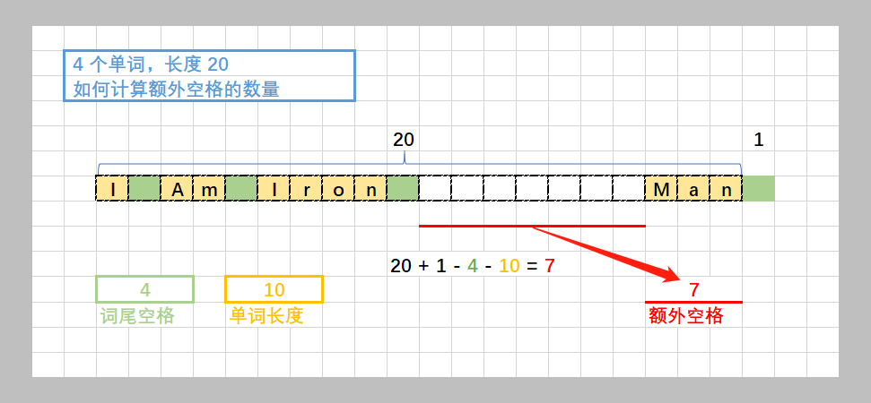
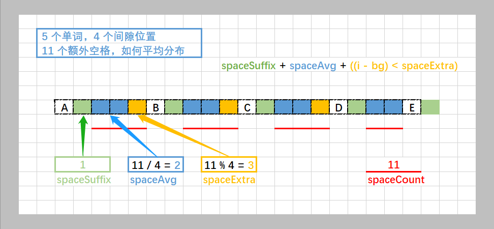

> 原文链接: https://leetcode-cn.com/problems/text-justification


## 英文原文
<div><p>Given an array of strings <code>words</code> and a width <code>maxWidth</code>, format the text such that each line has exactly <code>maxWidth</code> characters and is fully (left and right) justified.</p>

<p>You should pack your words in a greedy approach; that is, pack as many words as you can in each line. Pad extra spaces <code>&#39; &#39;</code> when necessary so that each line has exactly <code>maxWidth</code> characters.</p>

<p>Extra spaces between words should be distributed as evenly as possible. If the number of spaces on a line does not divide evenly between words, the empty slots on the left will be assigned more spaces than the slots on the right.</p>

<p>For the last line of text, it should be left-justified and no extra space is inserted between words.</p>

<p><strong>Note:</strong></p>

<ul>
	<li>A word is defined as a character sequence consisting of non-space characters only.</li>
	<li>Each word&#39;s length is guaranteed to be greater than 0 and not exceed maxWidth.</li>
	<li>The input array <code>words</code> contains at least one word.</li>
</ul>

<p>&nbsp;</p>
<p><strong>Example 1:</strong></p>

<pre>
<strong>Input:</strong> words = [&quot;This&quot;, &quot;is&quot;, &quot;an&quot;, &quot;example&quot;, &quot;of&quot;, &quot;text&quot;, &quot;justification.&quot;], maxWidth = 16
<strong>Output:</strong>
[
&nbsp; &nbsp;&quot;This &nbsp; &nbsp;is &nbsp; &nbsp;an&quot;,
&nbsp; &nbsp;&quot;example &nbsp;of text&quot;,
&nbsp; &nbsp;&quot;justification. &nbsp;&quot;
]</pre>

<p><strong>Example 2:</strong></p>

<pre>
<strong>Input:</strong> words = [&quot;What&quot;,&quot;must&quot;,&quot;be&quot;,&quot;acknowledgment&quot;,&quot;shall&quot;,&quot;be&quot;], maxWidth = 16
<strong>Output:</strong>
[
&nbsp; &quot;What &nbsp; must &nbsp; be&quot;,
&nbsp; &quot;acknowledgment &nbsp;&quot;,
&nbsp; &quot;shall be &nbsp; &nbsp; &nbsp; &nbsp;&quot;
]
<strong>Explanation:</strong> Note that the last line is &quot;shall be    &quot; instead of &quot;shall     be&quot;, because the last line must be left-justified instead of fully-justified.
Note that the second line is also left-justified becase it contains only one word.</pre>

<p><strong>Example 3:</strong></p>

<pre>
<strong>Input:</strong> words = [&quot;Science&quot;,&quot;is&quot;,&quot;what&quot;,&quot;we&quot;,&quot;understand&quot;,&quot;well&quot;,&quot;enough&quot;,&quot;to&quot;,&quot;explain&quot;,&quot;to&quot;,&quot;a&quot;,&quot;computer.&quot;,&quot;Art&quot;,&quot;is&quot;,&quot;everything&quot;,&quot;else&quot;,&quot;we&quot;,&quot;do&quot;], maxWidth = 20
<strong>Output:</strong>
[
&nbsp; &quot;Science &nbsp;is &nbsp;what we&quot;,
  &quot;understand &nbsp; &nbsp; &nbsp;well&quot;,
&nbsp; &quot;enough to explain to&quot;,
&nbsp; &quot;a &nbsp;computer. &nbsp;Art is&quot;,
&nbsp; &quot;everything &nbsp;else &nbsp;we&quot;,
&nbsp; &quot;do &nbsp; &nbsp; &nbsp; &nbsp; &nbsp; &nbsp; &nbsp; &nbsp; &nbsp;&quot;
]</pre>

<p>&nbsp;</p>
<p><strong>Constraints:</strong></p>

<ul>
	<li><code>1 &lt;= words.length &lt;= 300</code></li>
	<li><code>1 &lt;= words[i].length &lt;= 20</code></li>
	<li><code>words[i]</code> consists of only English letters and symbols.</li>
	<li><code>1 &lt;= maxWidth &lt;= 100</code></li>
	<li><code>words[i].length &lt;= maxWidth</code></li>
</ul>
</div>

## 中文题目
<div><p>给定一个单词数组和一个长度&nbsp;<em>maxWidth</em>，重新排版单词，使其成为每行恰好有&nbsp;<em>maxWidth</em>&nbsp;个字符，且左右两端对齐的文本。</p>

<p>你应该使用&ldquo;贪心算法&rdquo;来放置给定的单词；也就是说，尽可能多地往每行中放置单词。必要时可用空格&nbsp;<code>&#39; &#39;</code>&nbsp;填充，使得每行恰好有 <em>maxWidth</em>&nbsp;个字符。</p>

<p>要求尽可能均匀分配单词间的空格数量。如果某一行单词间的空格不能均匀分配，则左侧放置的空格数要多于右侧的空格数。</p>

<p>文本的最后一行应为左对齐，且单词之间不插入<strong>额外的</strong>空格。</p>

<p><strong>说明:</strong></p>

<ul>
	<li>单词是指由非空格字符组成的字符序列。</li>
	<li>每个单词的长度大于 0，小于等于&nbsp;<em>maxWidth</em>。</li>
	<li>输入单词数组 <code>words</code>&nbsp;至少包含一个单词。</li>
</ul>

<p><strong>示例:</strong></p>

<pre><strong>输入:</strong>
words = [&quot;This&quot;, &quot;is&quot;, &quot;an&quot;, &quot;example&quot;, &quot;of&quot;, &quot;text&quot;, &quot;justification.&quot;]
maxWidth = 16
<strong>输出:</strong>
[
&nbsp; &nbsp;&quot;This &nbsp; &nbsp;is &nbsp; &nbsp;an&quot;,
&nbsp; &nbsp;&quot;example &nbsp;of text&quot;,
&nbsp; &nbsp;&quot;justification. &nbsp;&quot;
]
</pre>

<p><strong>示例&nbsp;2:</strong></p>

<pre><strong>输入:</strong>
words = [&quot;What&quot;,&quot;must&quot;,&quot;be&quot;,&quot;acknowledgment&quot;,&quot;shall&quot;,&quot;be&quot;]
maxWidth = 16
<strong>输出:</strong>
[
&nbsp; &quot;What &nbsp; must &nbsp; be&quot;,
&nbsp; &quot;acknowledgment &nbsp;&quot;,
&nbsp; &quot;shall be &nbsp; &nbsp; &nbsp; &nbsp;&quot;
]
<strong>解释: </strong>注意最后一行的格式应为 &quot;shall be    &quot; 而不是 &quot;shall     be&quot;,
&nbsp;    因为最后一行应为左对齐，而不是左右两端对齐。       
     第二行同样为左对齐，这是因为这行只包含一个单词。
</pre>

<p><strong>示例&nbsp;3:</strong></p>

<pre><strong>输入:</strong>
words = [&quot;Science&quot;,&quot;is&quot;,&quot;what&quot;,&quot;we&quot;,&quot;understand&quot;,&quot;well&quot;,&quot;enough&quot;,&quot;to&quot;,&quot;explain&quot;,
&nbsp;        &quot;to&quot;,&quot;a&quot;,&quot;computer.&quot;,&quot;Art&quot;,&quot;is&quot;,&quot;everything&quot;,&quot;else&quot;,&quot;we&quot;,&quot;do&quot;]
maxWidth = 20
<strong>输出:</strong>
[
&nbsp; &quot;Science &nbsp;is &nbsp;what we&quot;,
  &quot;understand &nbsp; &nbsp; &nbsp;well&quot;,
&nbsp; &quot;enough to explain to&quot;,
&nbsp; &quot;a &nbsp;computer. &nbsp;Art is&quot;,
&nbsp; &quot;everything &nbsp;else &nbsp;we&quot;,
&nbsp; &quot;do &nbsp; &nbsp; &nbsp; &nbsp; &nbsp; &nbsp; &nbsp; &nbsp; &nbsp;&quot;
]
</pre>
</div>

## 通过代码
<RecoDemo>
</RecoDemo>


## 高赞题解
### 思路
1. 先取出一行能够容纳的单词，将这些单词根据规则填入一行

2. 计算出**额外空格**的数量 `spaceCount`，**额外空格**就是正常书写用不到的空格
    21. 由总长度算起
    22. 除去每个单词末尾必须的空格，为了统一处理可以在结尾虚拟加上一个长度
    23. 除去所有单词的长度




3. 按照单词的间隙数量 `wordCount - 1`，对**额外空格平均分布**
    > **平均分布**可查看 【[另一篇题解](https://leetcode-cn.com/circle/discuss/eXOcnD/view/SecVmv/)】，简单来说就是商和余数的计算
    31. 对于每个词填充之后，需要填充的空格数量等于 `spaceSuffix + spaceAvg + ((i - bg) < spaceExtra)`
        `spaceSuffix` 【单词尾部固定的空格】
        `spaceAvg` 【**额外空格**的平均值，每个间隙都要填入 spaceAvg 个空格】
        `((i - bg) < spaceExtra)` 【**额外空格**的余数，前 spaceExtra 个间隙需要多 1 个空格】
    


4. 特殊处理
    41. 一行只有一个单词，单词左对齐，右侧填满空格
    42. 最后一行，所有单词左对齐，中间只有一个空格，最后一个单词右侧填满空格


### 答题
```C++ []
    string fillWords(vector<string>& words, int bg, int ed, int maxWidth, bool lastLine = false)
    {
        int wordCount = ed - bg + 1;
        int spaceCount = maxWidth + 1 - wordCount;  // 除去每个单词尾部空格， + 1 是最后一个单词的尾部空格的特殊处理
        for (int i = bg; i <= ed; i++)
        {
            spaceCount -= words[i].size();  // 除去所有单词的长度
        }

        int spaceSuffix = 1;    // 词尾空格
        int spaceAvg = (wordCount == 1) ? 1 : spaceCount / (wordCount - 1);     // 额外空格的平均值
        int spaceExtra = (wordCount == 1) ? 0 : spaceCount % (wordCount - 1);   // 额外空格的余数

        string ans;
        for (int i = bg; i < ed; i++)
        {
            ans += words[i];    // 填入单词
            if (lastLine)   // 特殊处理最后一行
            {
                fill_n(back_inserter(ans), 1, ' ');
                continue;
            }
            fill_n(back_inserter(ans), spaceSuffix + spaceAvg + ((i - bg) < spaceExtra), ' ');  // 根据计算结果补上空格
        }
        ans += words[ed];   // 填入最后一个单词
        fill_n(back_inserter(ans), maxWidth - ans.size(), ' '); // 补上这一行最后的空格
        return ans;
    }

    vector<string> fullJustify(vector<string>& words, int maxWidth) 
    {
        vector<string> ans;
        int cnt = 0;
        int bg = 0;
        for (int i = 0; i < words.size(); i++)
        {
            cnt += words[i].size() + 1;

            if (i + 1 == words.size() || cnt + words[i + 1].size() > maxWidth)
            {   // 如果是最后一个单词，或者加上下一个词就超过长度了，即可凑成一行
                ans.push_back(fillWords(words, bg, i, maxWidth, i + 1 == words.size()));
                bg = i + 1;
                cnt = 0;
            }
        }
        return ans;
    }
```
```C++ []
    string fillWords(vector<string>& words, int bg, int ed, int maxWidth, bool lastLine = false)
    {
        int wordCount = ed - bg + 1;
        int spaceCount = maxWidth + 1 - wordCount;
        for (int i = bg; i <= ed; i++)
        {
            spaceCount -= words[i].size();
        }

        int spaceSuffix = 1;
        int spaceAvg = (wordCount == 1) ? 1 : spaceCount / (wordCount - 1);
        int spaceExtra = (wordCount == 1) ? 0 : spaceCount % (wordCount - 1);

        string ans;
        for (int i = bg; i < ed; i++)
        {
            ans += words[i];
            if (lastLine)
            {
                fill_n(back_inserter(ans), 1, ' ');
                continue;
            }
            fill_n(back_inserter(ans), spaceSuffix + spaceAvg + ((i - bg) < spaceExtra), ' ');
        }
        ans += words[ed];
        fill_n(back_inserter(ans), maxWidth - ans.size(), ' ');
        return ans;
    }

    vector<string> fullJustify(vector<string>& words, int maxWidth) 
    {
        vector<string> ans;
        int cnt = 0;
        int bg = 0;
        for (int i = 0; i < words.size(); i++)
        {
            cnt += words[i].size() + 1;

            if (i + 1 == words.size() || cnt + words[i + 1].size() > maxWidth)
            {
                ans.push_back(fillWords(words, bg, i, maxWidth, i + 1 == words.size()));
                bg = i + 1;
                cnt = 0;
            }
        }
        return ans;
    }
```


### 执行时间


### 致谢

感谢您的观看，希望对您有帮助，欢迎热烈的交流！  

**如果感觉还不错就点个赞吧~**


## 统计信息
| 通过次数 | 提交次数 | AC比率 |
| :------: | :------: | :------: |
|    39263    |    74993    |   52.4%   |

## 提交历史
| 提交时间 | 提交结果 | 执行时间 |  内存消耗  | 语言 |
| :------: | :------: | :------: | :--------: | :--------: |
