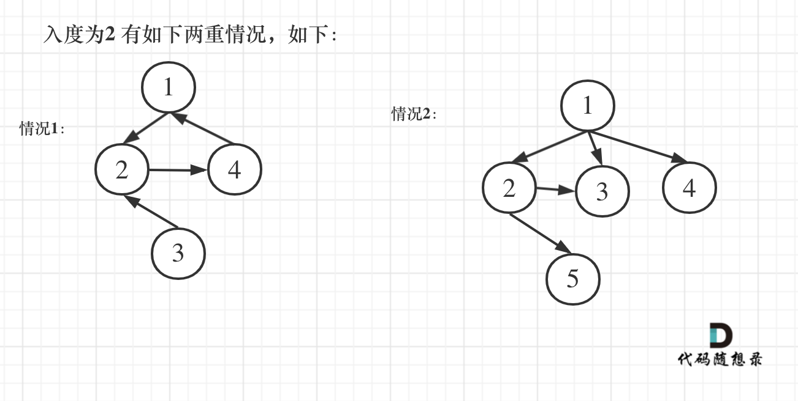

> 原文链接: https://leetcode-cn.com/problems/redundant-connection-ii


## 英文原文
<div><p>In this problem, a rooted tree is a <b>directed</b> graph such that, there is exactly one node (the root) for which all other nodes are descendants of this node, plus every node has exactly one parent, except for the root node which has no parents.</p>

<p>The given input is a directed graph that started as a rooted tree with <code>n</code> nodes (with distinct values from <code>1</code> to <code>n</code>), with one additional directed edge added. The added edge has two different vertices chosen from <code>1</code> to <code>n</code>, and was not an edge that already existed.</p>

<p>The resulting graph is given as a 2D-array of <code>edges</code>. Each element of <code>edges</code> is a pair <code>[u<sub>i</sub>, v<sub>i</sub>]</code> that represents a <b>directed</b> edge connecting nodes <code>u<sub>i</sub></code> and <code>v<sub>i</sub></code>, where <code>u<sub>i</sub></code> is a parent of child <code>v<sub>i</sub></code>.</p>

<p>Return <em>an edge that can be removed so that the resulting graph is a rooted tree of</em> <code>n</code> <em>nodes</em>. If there are multiple answers, return the answer that occurs last in the given 2D-array.</p>

<p>&nbsp;</p>
<p><strong>Example 1:</strong></p>

<pre>
<strong>Input:</strong> edges = [[1,2],[1,3],[2,3]]
<strong>Output:</strong> [2,3]
</pre>

<p><strong>Example 2:</strong></p>

<pre>
<strong>Input:</strong> edges = [[1,2],[2,3],[3,4],[4,1],[1,5]]
<strong>Output:</strong> [4,1]
</pre>

<p>&nbsp;</p>
<p><strong>Constraints:</strong></p>

<ul>
	<li><code>n == edges.length</code></li>
	<li><code>3 &lt;= n &lt;= 1000</code></li>
	<li><code>edges[i].length == 2</code></li>
	<li><code>1 &lt;= u<sub>i</sub>, v<sub>i</sub> &lt;= n</code></li>
	<li><code>u<sub>i</sub> != v<sub>i</sub></code></li>
</ul>
</div>

## 中文题目
<div><p>在本问题中，有根树指满足以下条件的 <strong>有向</strong> 图。该树只有一个根节点，所有其他节点都是该根节点的后继。该树除了根节点之外的每一个节点都有且只有一个父节点，而根节点没有父节点。</p>

<p>输入一个有向图，该图由一个有着 <code>n</code> 个节点（节点值不重复，从 <code>1</code> 到 <code>n</code>）的树及一条附加的有向边构成。附加的边包含在 <code>1</code> 到 <code>n</code> 中的两个不同顶点间，这条附加的边不属于树中已存在的边。</p>

<p>结果图是一个以边组成的二维数组 <code>edges</code> 。 每个元素是一对 <code>[u<sub>i</sub>, v<sub>i</sub>]</code>，用以表示 <strong>有向 </strong>图中连接顶点 <code>u<sub>i</sub></code> 和顶点 <code>v<sub>i</sub></code> 的边，其中 <code>u<sub>i</sub></code> 是 <code>v<sub>i</sub></code> 的一个父节点。</p>

<p>返回一条能删除的边，使得剩下的图是有 <code>n</code> 个节点的有根树。若有多个答案，返回最后出现在给定二维数组的答案。</p>

<p> </p>

<p><strong>示例 1：</strong></p>

<pre>
<strong>输入：</strong>edges = [[1,2],[1,3],[2,3]]
<strong>输出：</strong>[2,3]
</pre>

<p><strong>示例 2：</strong></p>

<pre>
<strong>输入：</strong>edges = [[1,2],[2,3],[3,4],[4,1],[1,5]]
<strong>输出：</strong>[4,1]
</pre>

<p> </p>

<p><strong>提示：</strong></p>

<ul>
	<li><code>n == edges.length</code></li>
	<li><code>3 <= n <= 1000</code></li>
	<li><code>edges[i].length == 2</code></li>
	<li><code>1 <= u<sub>i</sub>, v<sub>i</sub> <= n</code></li>
</ul>
</div>

## 通过代码
<RecoDemo>
</RecoDemo>


## 高赞题解
#### 解题思路 

先重点读懂题目中的这句 **该图由一个有着 N 个节点 (节点值不重复 1, 2, ..., N) 的树及一条附加的边构成。附加的边的两个顶点包含在 1 到 N 中间，这条附加的边不属于树中已存在的边。** 

**这说明题目中的图原本是是一棵树，只不过在不增加节点的情况下多加了一条边！**

还有 **若有多个答案，返回最后出现在给定二维数组的答案**。这说明在两天边都可以删除的情况下，要删顺序靠后的！


那么有如下三种情况，前两种情况是出现入度为 2 的点，如图：




且只有一个节点入度为 2，为什么不看出度呢，出度没有意义，一颗树中随便一个父节点就有多个出度。


第三种情况是没有入度为 2 的点，那么图中一定出现了有向环（**注意这里强调是有向环！**）

如图：


首先先计算节点的入度，代码如下：

```C++ []
        int inDegree[N] = {0}; // 记录节点入度
        n = edges.size(); // 边的数量
        for (int i = 0; i < n; i++) {
            inDegree[edges[i][1]]++; // 统计入度
        }
```

前两种入度为 2 的情况，一定是删除指向入度为 2 的节点的两条边其中的一条，如果删了一条，判断这个图是一个树，那么这条边就是答案，同时注意要从后向前遍历，因为如果两天边删哪一条都可以成为树，就删最后那一条。

代码如下：

```C++ []
        vector<int> vec; // 记录入度为2的边（如果有的话就两条边）
        // 找入度为2的节点所对应的边，注意要倒叙，因为优先返回最后出现在二维数组中的答案
        for (int i = n - 1; i >= 0; i--) {
            if (inDegree[edges[i][1]] == 2) {
                vec.push_back(i);
            }
        }
        // 处理图中情况1 和 情况2
        // 如果有入度为2的节点，那么一定是两条边里删一个，看删哪个可以构成树
        if (vec.size() > 0) {
            if (isTreeAfterRemoveEdge(edges, vec[0])) {
                return edges[vec[0]];
            } else {
                return edges[vec[1]];
            }
        }
```

在来看情况三，明确没有入度为 2 的情况，那么一定有有向环，找到构成环的边就是要删除的边。

可以定义一个函数，代码如下：

```
// 在有向图里找到删除的那条边，使其变成树，返回值就是要删除的边
vector<int> getRemoveEdge(const vector<vector<int>>& edges)
```

此时 大家应该知道了，我们要实现两个最为关键的函数：

* `isTreeAfterRemoveEdge()` 判断删一个边之后是不是树了
* `getRemoveEdge` 确定图中一定有了有向环，那么要找到需要删除的那条边

此时应该是用到 **并查集**了，并查集为什么可以判断 一个图是不是树呢？ 

**因为如果两个点所在的边在添加图之前如果就可以在并查集里找到了相同的根，那么这条边添加上之后 这个图一定不是树了** 

时间有限，暂时不对并查集展开过多的讲解了，翻到了自己九年前写过了一篇并查集的文章 [并查集学习](https://blog.csdn.net/youngyangyang04/article/details/6447435)，哈哈，那时候还太年轻，写不咋地，有空我会重写一篇！

敬请期待！

本题代码如下：（详细注释了）


```C++ []

class Solution {
private:
    static const int N = 1010; // 如题：二维数组大小的在3到1000范围内
    int father[N];
    int n; // 边的数量
    // 并查集初始化
    void init() {
        for (int i = 1; i <= n; ++i) {
            father[i] = i;
        }
    }
    // 并查集里寻根的过程
    int find(int u) {
        return u == father[u] ? u : father[u] = find(father[u]);
    }
    // 将v->u 这条边加入并查集
    void join(int u, int v) {
        u = find(u);
        v = find(v);
        if (u == v) return ;
        father[v] = u;
    }
    // 判断 u 和 v是否找到同一个根
    bool same(int u, int v) {
        u = find(u);
        v = find(v);
        return u == v;
    }
    // 在有向图里找到删除的那条边，使其变成树
    vector<int> getRemoveEdge(const vector<vector<int>>& edges) {
        init(); // 初始化并查集
        for (int i = 0; i < n; i++) { // 遍历所有的边
            if (same(edges[i][0], edges[i][1])) { // 构成有向环了，就是要删除的边
                return edges[i];
            }
            join(edges[i][0], edges[i][1]);
        }
        return {};
    }

    // 删一条边之后判断是不是树
    bool isTreeAfterRemoveEdge(const vector<vector<int>>& edges, int deleteEdge) {
        init(); // 初始化并查集
        for (int i = 0; i < n; i++) {
            if (i == deleteEdge) continue;
            if (same(edges[i][0], edges[i][1])) { // 构成有向环了，一定不是树
                return false;
            }
            join(edges[i][0], edges[i][1]);
        }
        return true;
    }
public:

    vector<int> findRedundantDirectedConnection(vector<vector<int>>& edges) {
        int inDegree[N] = {0}; // 记录节点入度
        n = edges.size(); // 边的数量
        for (int i = 0; i < n; i++) {
            inDegree[edges[i][1]]++; // 统计入度
        }
        vector<int> vec; // 记录入度为2的边（如果有的话就两条边）
        // 找入度为2的节点所对应的边，注意要倒叙，因为优先返回最后出现在二维数组中的答案
        for (int i = n - 1; i >= 0; i--) {
            if (inDegree[edges[i][1]] == 2) {
                vec.push_back(i);
            }
        }
        // 处理图中情况1 和 情况2
        // 如果有入度为2的节点，那么一定是两条边里删一个，看删哪个可以构成树
        if (vec.size() > 0) {
            if (isTreeAfterRemoveEdge(edges, vec[0])) {
                return edges[vec[0]];
            } else {
                return edges[vec[1]];
            }
        }
        // 处理图中情况3
        // 明确没有入度为2的情况，那么一定有有向环，找到构成环的边返回就可以了
        return getRemoveEdge(edges);

    }
};
```


## 统计信息
| 通过次数 | 提交次数 | AC比率 |
| :------: | :------: | :------: |
|    20671    |    48108    |   43.0%   |

## 提交历史
| 提交时间 | 提交结果 | 执行时间 |  内存消耗  | 语言 |
| :------: | :------: | :------: | :--------: | :--------: |


## 相似题目
|                             题目                             | 难度 |
| :----------------------------------------------------------: | :---------: |
| [冗余连接](https://leetcode-cn.com/problems/redundant-connection/) | 中等|
