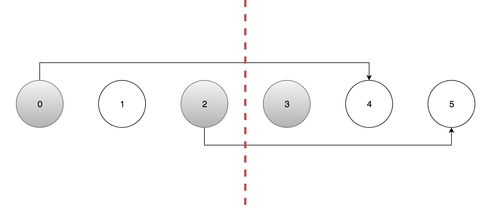

> 原文链接: https://leetcode-cn.com/problems/random-pick-with-blacklist


## 英文原文
<div><p>You are given an integer <code>n</code> and an array of <strong>unique</strong> integers <code>blacklist</code>. Design an algorithm to pick a random integer in the range <code>[0, n - 1]</code> that is <strong>not</strong> in <code>blacklist</code>. Any integer that is in the mentioned range and not in <code>blacklist</code> should be <strong>equally likely</strong> to be returned.</p>

<p>Optimize your algorithm such that it minimizes the number of calls to the <strong>built-in</strong> random function of your language.</p>

<p>Implement the <code>Solution</code> class:</p>

<ul>
	<li><code>Solution(int n, int[] blacklist)</code> Initializes the object with the integer <code>n</code> and the blacklisted integers <code>blacklist</code>.</li>
	<li><code>int pick()</code> Returns a random integer in the range <code>[0, n - 1]</code> and not in <code>blacklist</code>.</li>
</ul>

<p>&nbsp;</p>
<p><strong>Example 1:</strong></p>

<pre>
<strong>Input</strong>
[&quot;Solution&quot;, &quot;pick&quot;, &quot;pick&quot;, &quot;pick&quot;, &quot;pick&quot;, &quot;pick&quot;, &quot;pick&quot;, &quot;pick&quot;]
[[7, [2, 3, 5]], [], [], [], [], [], [], []]
<strong>Output</strong>
[null, 0, 4, 1, 6, 1, 0, 4]

<strong>Explanation</strong>
Solution solution = new Solution(7, [2, 3, 5]);
solution.pick(); // return 0, any integer from [0,1,4,6] should be ok. Note that for every call of pick,
                 // 0, 1, 4, and 6 must be equally likely to be returned (i.e., with probability 1/4).
solution.pick(); // return 4
solution.pick(); // return 1
solution.pick(); // return 6
solution.pick(); // return 1
solution.pick(); // return 0
solution.pick(); // return 4
</pre>

<p>&nbsp;</p>
<p><strong>Constraints:</strong></p>

<ul>
	<li><code>1 &lt;= n &lt;= 10<sup>9</sup></code></li>
	<li><code>0 &lt;= blacklist.length &lt;- min(10<sup>5</sup>, n - 1)</code></li>
	<li><code>0 &lt;= blacklist[i] &lt; n</code></li>
	<li>All the values of <code>blacklist</code> are <strong>unique</strong>.</li>
	<li>At most <code>2 * 10<sup>4</sup></code> calls will be made to <code>pick</code>.</li>
</ul>
</div>

## 中文题目
<div><p>给定一个包含 <code>[0，n)</code> 中不重复整数的黑名单 <code>blacklist</code> ，写一个函数从 <code>[0, n)</code> 中返回一个<strong>不在</strong> <code>blacklist</code> 中的随机整数。</p>

<p>对它进行优化使其尽量少调用系统方法 <code>Math.random()</code> 。</p>

<p><strong>提示:</strong></p>

<ol>
	<li><code>1 <= n <= 1000000000</code></li>
	<li><code>0 <= blacklist.length < min(100000, N)</code></li>
	<li><code>[0, n)</code> 不包含 <code>n</code> ，详细参见 <a href="https://en.wikipedia.org/wiki/Interval_(mathematics)" target="_blank">interval notation</a> 。</li>
</ol>

<p><strong>示例 1：</strong></p>

<pre>
<strong>输入：
</strong>["Solution","pick","pick","pick"]
[[1,[]],[],[],[]]
<strong>输出：</strong>[null,0,0,0]
</pre>

<p><strong>示例 2：</strong></p>

<pre>
<strong>输入：
</strong>["Solution","pick","pick","pick"]
[[2,[]],[],[],[]]
<strong>输出：</strong>[null,1,1,1]
</pre>

<p><strong>示例 3：</strong></p>

<pre>
<strong>输入：
</strong>["Solution","pick","pick","pick"]
[[3,[1]],[],[],[]]
<strong>输出：</strong>[null,0,0,2]
</pre>

<p><strong>示例 4：</strong></p>

<pre>
<strong>输入： 
</strong>["Solution","pick","pick","pick"]
[[4,[2]],[],[],[]]
<strong>输出：</strong>[null,1,3,1]
</pre>

<p><strong>输入语法说明：</strong></p>

<p>输入是两个列表：调用成员函数名和调用的参数。<code>Solution</code>的构造函数有两个参数，<code>n</code> 和黑名单 <code>blacklist</code>。<code>pick</code> 没有参数，输入参数是一个列表，即使参数为空，也会输入一个 <code>[]</code> 空列表。</p>
</div>

## 通过代码
<RecoDemo>
</RecoDemo>


## 官方题解
#### 方法一：维护白名单 [超出时间限制，超出空间限制]

如果我们有了白名单（即黑名单之外的所有整数），那么我们就可以在白名单中随机选取整数并返回了。

我们首先在集合中放入 `[0, N)` 中的所有整数，随后移除所有在黑名单中出现过的数，并把剩下的数放入列表中，就得到了白名单。

```C++ [sol1]
class Solution {
public:

    vector<int> w;

    Solution(int n, vector<int> blacklist) {
        unordered_set<int> W;
        for (int i = 0; i < n; i++) W.insert(i);
        for (int x : blacklist) W.erase(x);
        for (auto it = W.begin(); it != W.end(); it++) w.push_back(*it);
    }

    int pick() {
        return w[rand() % w.size()];
    }
};
```

```Java [sol1]
class Solution {

    List<Integer> w;
    Random r;

    public Solution(int n, int[] b) {
        w = new ArrayList<>();
        r = new Random();
        Set<Integer> W = new HashSet<>();
        for (int i = 0; i < n; i++) W.add(i);
        for (int x : b) W.remove(x);
        for (int x : W) w.add(x);
    }

    public int pick() {
        return w.get(r.nextInt(w.size()));
    }
}
```

然而题目中的 `N` 的最大值为 `1000000000`，将所有的数放入集合中会超出时间限制，并且存储这个白名单会超出空间限制。

**复杂度分析**

* 时间复杂度：$O(N)$。预处理的时间复杂度为 $O(N)$，超出了时间限制。随机选择的时间复杂度为 $O(1)$。

* 空间复杂度：$O(N)$，超出了空间限制。

#### 方法二：二分查找 [通过]

**分析**

通过 `N` 和黑名单列表，我们可以知道白名单中的数的数量 `M`。我们可以在 `0` 到 `M - 1` 之间产生随机数 `k`，通过在黑名单上二分查找的方法，得到白名单中第 `k` 个数。

{:width=400}
{:align=center}


**算法**

我们设黑名单为 `B`，白名单为 `W`，给定 `k`，需要得到白名单中的第 `k` 个数 `W[k]`。

首先我们将黑名单中的数进行排序，并在黑名单上二分查找。初始的值为 `lo = 0` 和 `hi = len(B) - 1`，在二分查找的每一轮中：

- `mid = (lo + hi + 1) / 2`；

- 令 `c = B[mid] - mid`，表示比 `B[mid]` 小的在白名单中的数的个数；

- 如果 `c > k`，说明 `B[mid]` 大于 `W[k]`，因此设置 `hi = mid - 1`；

- 如果 `c <= k`，说明 `B[mid]` 小于 `W[k]`，因此设置 `lo = mid`；

在二分查找结束后，会有两种情况。第一种是 `B` 中最小的数都大于 `k`，那么此时 `W[k]` 就等于 `k`。第二种是 `W[k]` 大于 `B[lo]`，那么此时 `W[k]` 等于 `k + lo + 1`。

```C++ [sol2]
class Solution {

    int n;
    vector<int> b;

public:

    Solution(int N, vector<int> blacklist) {
        n = N;
        sort(blacklist.begin(), blacklist.end());
        b = blacklist;
    }

    int pick() {
        int k = rand() % (n - b.size());
        int lo = 0;
        int hi = b.size() - 1;

        while (lo < hi) {
            int i = (lo + hi + 1) / 2;
            if (b[i] - i > k) hi = i - 1;
            else lo = i;
        }
        return lo == hi && b[lo] - lo <= k ? k + lo + 1 : k;
    }
};
```

```Java [sol2]
class Solution {

    int n;
    vector<int> b;

public:

    Solution(int N, vector<int> blacklist) {
        n = N;
        sort(blacklist.begin(), blacklist.end());
        b = blacklist;
    }

    int pick() {
        int k = rand() % (n - b.size());
        int lo = 0;
        int hi = b.size() - 1;

        while (lo < hi) {
            int i = (lo + hi + 1) / 2;
            if (b[i] - i > k) hi = i - 1;
            else lo = i;
        }
        return lo == hi && b[lo] - lo <= k ? k + lo + 1 : k;
    }
};
```

**复杂度分析**

* 时间复杂度：预处理的时间复杂度为 $O(B\log B)$，随机选择的时间复杂度为 $O(\log B)$。

* 空间复杂度：根据使用的排序算法是否为原地排序，空间复杂度为 $O(B)$ 或 $O(1)$。

#### 方法三：黑名单映射 [通过]

**分析**

白名单中数的个数为 `N - len(B)`，那么可以直接在 `[0, N - len(B))` 中随机生成整数。我们把所有小于 `N - len(B)` 且在黑名单中数一一映射到大于等于 `N - len(B)` 且出现在白名单中的数。这样一来，如果随机生成的整数出现在黑名单中，我们就返回它唯一对应的那个出现在白名单中的数即可。

例如当 `N = 6`，`B = [0, 2, 3]` 时，我们在 `[0, 3)` 中随机生成整数，并将 `2` 映射到 `4`，`3` 映射到 `5`，这样随机生成的整数就是 `[0, 1, 4, 5]` 中的一个。

**算法**

我们将黑名单分成两部分，第一部分 `X` 的数都小于 `N - len(B)`，需要进行映射；第二部分 `Y` 的数都大于等于 `N - len(B)`，这些数不需要进行映射，因为并不会随机到它们。

我们先用 `Y` 构造出 `W`，表示大于等于 `N - len(B)` 且在白名单中的数，`X` 和 `W` 的长度一定是相等的。随后遍历 `X` 和 `W`，构造一个映射表（HashMap）`M`，将 `X` 和 `W` 中的数构造一一映射。

在 `[0, N - len(B))` 中随机生成整数 `a` 时，如果 `a` 出现在 `M` 中，则将它的映射返回，否则直接返回 `a`。

```C++ [sol3]
class Solution {
public:

    unordered_map<int, int> m;
    int wlen;

    Solution(int n, vector<int> b) {
        wlen = n - b.size();
        unordered_set<int> w;
        for (int i = wlen; i < n; i++) w.insert(i);
        for (int x : b) w.erase(x);
        auto wi = w.begin();
        for (int x : b)
            if (x < wlen)
                m[x] = *wi++;
    }

    int pick() {
        int k = rand() % wlen;
        return m.count(k) ? m[k] : k;
    }
};
```

```Java [sol3]
class Solution {

    Map<Integer, Integer> m;
    Random r;
    int wlen;

    public Solution(int n, int[] b) {
        m = new HashMap<>();
        r = new Random();
        wlen = n - b.length;
        Set<Integer> w = new HashSet<>();
        for (int i = wlen; i < n; i++) w.add(i);
        for (int x : b) w.remove(x);
        Iterator<Integer> wi = w.iterator();
        for (int x : b)
            if (x < wlen)
                m.put(x, wi.next());
    }

    public int pick() {
        int k = r.nextInt(wlen);
        return m.getOrDefault(k, k);
    }
}
```

**复杂度分析**

* 时间复杂度：预处理的时间复杂度为 $O(B)$，随机选择的时间复杂度为 $O(1)$。

* 空间复杂度：$O(B)$。

## 统计信息
| 通过次数 | 提交次数 | AC比率 |
| :------: | :------: | :------: |
|    5739    |    16023    |   35.8%   |

## 提交历史
| 提交时间 | 提交结果 | 执行时间 |  内存消耗  | 语言 |
| :------: | :------: | :------: | :--------: | :--------: |


## 相似题目
|                             题目                             | 难度 |
| :----------------------------------------------------------: | :---------: |
| [随机数索引](https://leetcode-cn.com/problems/random-pick-index/) | 中等|
| [按权重随机选择](https://leetcode-cn.com/problems/random-pick-with-weight/) | 中等|
