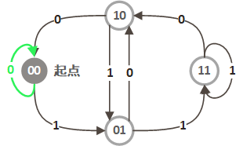
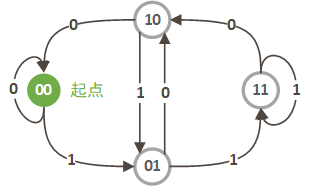
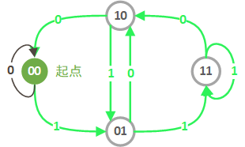
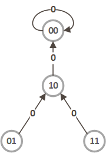
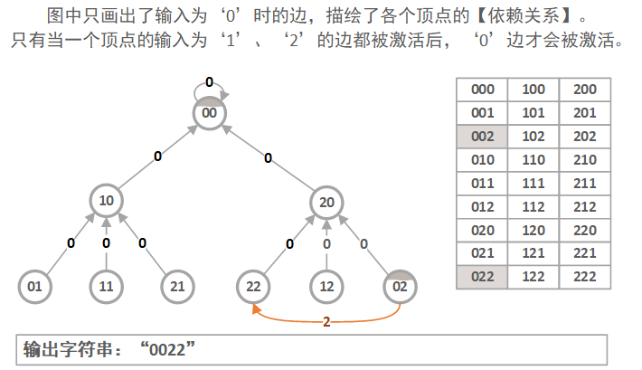

> 原文链接: https://leetcode-cn.com/problems/cracking-the-safe


## 英文原文
<div><p>There is a safe protected by a password. The password is a sequence of <code>n</code> digits where each digit can be in the range <code>[0, k - 1]</code>.</p>

<p>The safe has a peculiar way of checking the password. When you enter in a sequence, it checks the <strong>most recent </strong><code>n</code><strong> digits</strong> that were entered each time you type a digit.</p>

<ul>
	<li>For example, the correct password is <code>&quot;345&quot;</code> and you enter in <code>&quot;012345&quot;</code>:

	<ul>
		<li>After typing <code>0</code>, the most recent <code>3</code> digits is <code>&quot;0&quot;</code>, which is incorrect.</li>
		<li>After typing <code>1</code>, the most recent <code>3</code> digits is <code>&quot;01&quot;</code>, which is incorrect.</li>
		<li>After typing <code>2</code>, the most recent <code>3</code> digits is <code>&quot;012&quot;</code>, which is incorrect.</li>
		<li>After typing <code>3</code>, the most recent <code>3</code> digits is <code>&quot;123&quot;</code>, which is incorrect.</li>
		<li>After typing <code>4</code>, the most recent <code>3</code> digits is <code>&quot;234&quot;</code>, which is incorrect.</li>
		<li>After typing <code>5</code>, the most recent <code>3</code> digits is <code>&quot;345&quot;</code>, which is correct and the safe unlocks.</li>
	</ul>
	</li>
</ul>

<p>Return <em>any string of <strong>minimum length</strong> that will unlock the safe <strong>at some point</strong> of entering it</em>.</p>

<p>&nbsp;</p>
<p><strong>Example 1:</strong></p>

<pre>
<strong>Input:</strong> n = 1, k = 2
<strong>Output:</strong> &quot;10&quot;
<strong>Explanation:</strong> The password is a single digit, so enter each digit. &quot;01&quot; would also unlock the safe.
</pre>

<p><strong>Example 2:</strong></p>

<pre>
<strong>Input:</strong> n = 2, k = 2
<strong>Output:</strong> &quot;01100&quot;
<strong>Explanation:</strong> For each possible password:
- &quot;00&quot; is typed in starting from the 4<sup>th</sup> digit.
- &quot;01&quot; is typed in starting from the 1<sup>st</sup> digit.
- &quot;10&quot; is typed in starting from the 3<sup>rd</sup> digit.
- &quot;11&quot; is typed in starting from the 2<sup>nd</sup> digit.
Thus &quot;01100&quot; will unlock the safe. &quot;01100&quot;, &quot;10011&quot;, and &quot;11001&quot; would also unlock the safe.
</pre>

<p>&nbsp;</p>
<p><strong>Constraints:</strong></p>

<ul>
	<li><code>1 &lt;= n &lt;= 4</code></li>
	<li><code>1 &lt;= k &lt;= 10</code></li>
	<li><code>1 &lt;= k<sup>n</sup> &lt;= 4096</code></li>
</ul>
</div>

## 中文题目
<div><p>有一个需要密码才能打开的保险箱。密码是&nbsp;<code>n</code> 位数, 密码的每一位是&nbsp;<code>k</code>&nbsp;位序列&nbsp;<code>0, 1, ..., k-1</code>&nbsp;中的一个 。</p>

<p>你可以随意输入密码，保险箱会自动记住最后&nbsp;<code>n</code>&nbsp;位输入，如果匹配，则能够打开保险箱。</p>

<p>举个例子，假设密码是&nbsp;<code>&quot;345&quot;</code>，你可以输入&nbsp;<code>&quot;012345&quot;</code>&nbsp;来打开它，只是你输入了 6&nbsp;个字符.</p>

<p>请返回一个能打开保险箱的最短字符串。</p>

<p>&nbsp;</p>

<p><strong>示例1:</strong></p>

<pre><strong>输入:</strong> n = 1, k = 2
<strong>输出:</strong> &quot;01&quot;
<strong>说明:</strong> &quot;10&quot;也可以打开保险箱。
</pre>

<p>&nbsp;</p>

<p><strong>示例2:</strong></p>

<pre><strong>输入:</strong> n = 2, k = 2
<strong>输出:</strong> &quot;00110&quot;
<strong>说明: </strong>&quot;01100&quot;, &quot;10011&quot;, &quot;11001&quot; 也能打开保险箱。
</pre>

<p>&nbsp;</p>

<p><strong>提示：</strong></p>

<ol>
	<li><code>n</code> 的范围是&nbsp;<code>[1, 4]</code>。</li>
	<li><code>k</code> 的范围是&nbsp;<code>[1, 10]</code>。</li>
	<li><code>k^n</code> 最大可能为&nbsp;<code>4096</code>。</li>
</ol>

<p>&nbsp;</p>
</div>

## 通过代码
<RecoDemo>
</RecoDemo>


## 高赞题解
#### 题意描述
求出一个最短的字符串，使其包含从 $0 \sim k^n$（$k$ 进制）中的所有数字。

#### 题意转化
首先对题意进行转化和抽象，具体方式类似官方题解，即将所有的 $n-1$ 位数作为节点。每个节点有 $k$ 条边，节点上添加数字 $0 \sim k-1$ 视为一条边。

举例说明，如 $n=3,k=2$（三位二进制数），其节点（二位二进制数）为 $“00”，“01”，“10”，“11”$，每个节点有 $2$ 条边，节点上添加数字 $0 \sim 1$ 可转化到自身或另一个节点，如下图所示。



如果我们从任一节点出发，能够找出一条路径，**经过图中的所有边且只经过一次**，然后把边上的数字写入字符串（还需加入起始节点的数字），那么这个字符串显然符合要求，而且找不出比它更短的字符串了。

#### 直观解法
直觉上，有一种思路，就是从任一节点开始，从 $0 \sim k-1$ 遍历，只要有可用的路就走，直到无法继续为止。
仍以 $n=3,k=2$ 为例：

<,,,,,,>

我们走到了起始点 $“00”$，发现没有路可以走了，但是，仍有一些边没有遍历到。



这时该怎么办？

一种方法是官方题解中给出的，我们另选一个节点，从该节点出发，再找一条路径（**01**→11→11→10→**01**）：



然后把它和一开始的路径（00→00→ **[01]** →10→00）结合起来（00→00→ **[01→11→11→10→01]** →10→00）即可。这是官方的 dfs 思路。

#### 贪心构造算法
但是我们还有一种更简单的贪心思路。
注意到，**当我们无路可走时，一定是在起始点，并且起始点的所有边都已经过。** 这是因为所有节点的入度和出度均为 $k$。如果我们不在起始点，那 “只要有进去的路，就一定还有至少一条出去的路”。

再看之前出现的无路可走的情况（下图），我们发现，**起始点回的太早了**。从贪心的角度来想，如果可以 **尽可能晚返回起始点**，就能遍历更多的边。



如果实现这个算法呢？很简单，稍微改动之前的算法即可。我们选择 $“00”$ 作为起始点。但是每次要选择添加的数字时，从大数字开始（即从 $k-1$ 遍历到 $0$）。这样可以尽可能晚地回到起始点。

首先拿上面 $n=3, k=2$ 的例子验证一下：

<,,,,,,,,,>

是不是感觉很神奇。

#### 代码也很简单
```cpp
class Solution {
public:
    string crackSafe(int n, int k) {
        int kn = pow(k, n), kn_1 = pow(k, n-1), num[kn_1];
        fill(num, num + kn_1, k-1);
        string s(kn + (n-1), '0');
        for(int i = n-1, node = 0; i < s.size(); ++i) {
            s[i] = num[node]-- + '0';
            node = node*k - (s[i-(n-1)]-'0')*kn_1 + num[node] + 1;
        }
        return s;
    }
};
```
**时间复杂度：** $O(k^n)$。
**空间复杂度：** $O(k^n)$。如果不考虑输出字符串，为 $O(k^{n-1})$。

#### 正确性证明（进阶）
下面从原理上证明一下。
我们简化一下上面的图，仅画出添加的数字为 $‘0’$ 的边：



有没有感觉像一棵树。实际上，忽略箭头的方向，再忽略节点 $“00”$ 上的自环，这就是一棵树。
好了，下面我就把它当成一棵“伪树”了，根节点为 $“00”$。
- 我们从根节点 $“00”$ 出发，首先选择数字 $‘1’$ 的边（简称 出边 $1$，图中省略）进行遍历。
- 不管之后如何遍历，我们一定会再次返回节点 $“00”$。那我们会从哪个节点返回呢？一定其“子”节点 $“10”$，添加数字 $‘0’$ 后返回。
- 那么，节点 $“10”$ 既然遍历了 出边 $0$，那么其 出边 $1$（图中省略）自然也已经被遍历了，因为我们从大到小遍历添加的数字。这样，节点 $“10”$ 被遍历了 $2$ 次。
- 节点 $“10”$ 可以由其 “子”节点 $“01”$、$“11”$ 添加数字 $‘0’$ 到达。因为节点 $“10”$ 被遍历了 $2$ 次，所以节点 $“01”$、$“11”$ 的 出边 $0$ 遍历过。那么同理，其 出边 $1$ 也一定被遍历过，因此节点 $“01”$、$“11”$ 也都被遍历过 $2$ 次。
- 综上所述，当我们返回节点 $“00”$ 时，其余节点都遍历了 $2$ 次。这表明此时，除了节点 $“00”$ 的自环之外，其余节点的所有边都已经被遍历。因此我们只需遍历节点 $“00”$ 的自环即可遍历完所有的边。这样，当我们最后一次返回节点 $00$ （即通过自环返回时），所有节点的所有边都已被遍历。
- 大家也可以对照上面的动图来理解一下。

对于其他示例，我们也可以只画出数字为 $‘0’$ 的边，构造出类似的“树”装结构。
如 $n=3,k=3$ 时为：



通过类似的证明可得，采用该算法，当我们最后一次返回节点 $00$ 时，原有向图中的所有边都已被遍历。

针对 $n=3,k=3$ 的情况，程序运行的过程如下图所示，可以根据程序运行的过程来理解算法的正确性。 

<,,,,,,,,,,,,,,,,,,,,,,,,,,,,,,,>

针对一般情况的证明：
- 对于任意 $n,k$，图中共有 $k^{n-1}$ 个节点，每个节点有 $k$ 条边连入，$k$ 条边连出，共 $k^n$ 条边。
- 仅考虑对应数字为 $‘0’$ 的边，则每个节点有 $1$ 条边，共有 $k^{n-1}$ 条边。若忽略节点 $0$ 的自环，则共有 $k^{n-1} - 1$ 条边。
- 若不考虑边的方向，则这 $k^{n-1}$ 个节点一定同属一个连通域，因为任何节点都可以通过不断添加 $‘0’$ 到达节点 $0$，从而与节点 $0$ 联通。因此这 $k^{n-1}$ 个节点、 $k^{n-1} - 1$ 条边只能形成一个树状结构。令节点 $0$ 为根节点。
- 从根节点 $0$ 开始遍历。当我们最后一次进入根节点时，根节点的所有边（指原有向图中的边）已被遍历。因此根节点的所有（直连）子节点（$1...0$、$2...0$ ~ $k-1...0$，共 $k-1$ 个）的 出边 $0$ 也已被遍历。由于我们从大到小遍历边，因此子节点的 所有出边 被遍历过。又因为节点的入边和出边数量相等，所以其 所有入边 也被遍历过。
- 类似地思路可以地推得，**若一 非叶节点 的所有边都被遍历，其所有的（直连）子节点 的 所有边 也都被遍历了。**
- 通过递归地分析可知，当我们最后一次进入根节点时，原有向图中的所有边已被遍历。

## 统计信息
| 通过次数 | 提交次数 | AC比率 |
| :------: | :------: | :------: |
|    3407    |    5731    |   59.4%   |

## 提交历史
| 提交时间 | 提交结果 | 执行时间 |  内存消耗  | 语言 |
| :------: | :------: | :------: | :--------: | :--------: |
