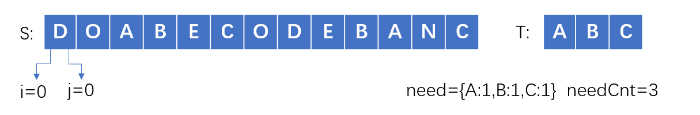
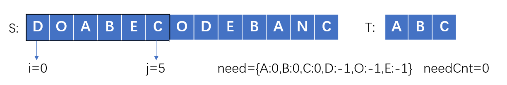
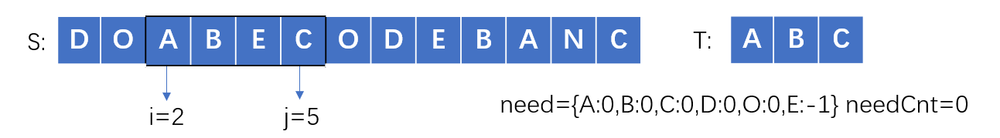
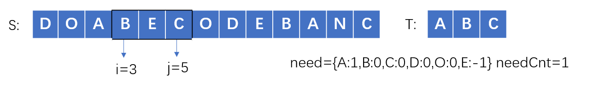

> 原文链接: https://leetcode-cn.com/problems/minimum-window-substring


## 英文原文
<div><p>Given two strings <code>s</code> and <code>t</code> of lengths <code>m</code> and <code>n</code> respectively, return <em>the <strong>minimum window substring</strong> of </em><code>s</code><em> such that every character in </em><code>t</code><em> (<strong>including duplicates</strong>) is included in the window. If there is no such substring</em><em>, return the empty string </em><code>&quot;&quot;</code><em>.</em></p>

<p>The testcases will be generated such that the answer is <strong>unique</strong>.</p>

<p>A <strong>substring</strong> is a contiguous sequence of characters within the string.</p>

<p>&nbsp;</p>
<p><strong>Example 1:</strong></p>

<pre>
<strong>Input:</strong> s = &quot;ADOBECODEBANC&quot;, t = &quot;ABC&quot;
<strong>Output:</strong> &quot;BANC&quot;
<strong>Explanation:</strong> The minimum window substring &quot;BANC&quot; includes &#39;A&#39;, &#39;B&#39;, and &#39;C&#39; from string t.
</pre>

<p><strong>Example 2:</strong></p>

<pre>
<strong>Input:</strong> s = &quot;a&quot;, t = &quot;a&quot;
<strong>Output:</strong> &quot;a&quot;
<strong>Explanation:</strong> The entire string s is the minimum window.
</pre>

<p><strong>Example 3:</strong></p>

<pre>
<strong>Input:</strong> s = &quot;a&quot;, t = &quot;aa&quot;
<strong>Output:</strong> &quot;&quot;
<strong>Explanation:</strong> Both &#39;a&#39;s from t must be included in the window.
Since the largest window of s only has one &#39;a&#39;, return empty string.
</pre>

<p>&nbsp;</p>
<p><strong>Constraints:</strong></p>

<ul>
	<li><code>m == s.length</code></li>
	<li><code>n == t.length</code></li>
	<li><code>1 &lt;= m, n&nbsp;&lt;= 10<sup>5</sup></code></li>
	<li><code>s</code> and <code>t</code> consist of uppercase and lowercase English letters.</li>
</ul>

<p>&nbsp;</p>
<strong>Follow up:</strong> Could you find an algorithm that runs in <code>O(m + n)</code> time?</div>

## 中文题目
<div><p>给你一个字符串 <code>s</code> 、一个字符串 <code>t</code> 。返回 <code>s</code> 中涵盖 <code>t</code> 所有字符的最小子串。如果 <code>s</code> 中不存在涵盖 <code>t</code> 所有字符的子串，则返回空字符串 <code>""</code> 。</p>

<p> </p>

<p><strong>注意：</strong></p>

<ul>
	<li>对于 <code>t</code> 中重复字符，我们寻找的子字符串中该字符数量必须不少于 <code>t</code> 中该字符数量。</li>
	<li>如果 <code>s</code> 中存在这样的子串，我们保证它是唯一的答案。</li>
</ul>

<p> </p>

<p><strong>示例 1：</strong></p>

<pre>
<strong>输入：</strong>s = "ADOBECODEBANC", t = "ABC"
<strong>输出：</strong>"BANC"
</pre>

<p><strong>示例 2：</strong></p>

<pre>
<strong>输入：</strong>s = "a", t = "a"
<strong>输出：</strong>"a"
</pre>

<p><strong>示例 3:</strong></p>

<pre>
<strong>输入:</strong> s = "a", t = "aa"
<strong>输出:</strong> ""
<strong>解释:</strong> t 中两个字符 'a' 均应包含在 s 的子串中，
因此没有符合条件的子字符串，返回空字符串。</pre>

<p> </p>

<p><strong>提示：</strong></p>

<ul>
	<li><code>1 <= s.length, t.length <= 10<sup>5</sup></code></li>
	<li><code>s</code> 和 <code>t</code> 由英文字母组成</li>
</ul>

<p> </p>
<strong>进阶：</strong>你能设计一个在 <code>o(n)</code> 时间内解决此问题的算法吗？</div>

## 通过代码
<RecoDemo>
</RecoDemo>


## 高赞题解
## 题解


### 滑动窗口的思想：

用`i`,`j`表示滑动窗口的左边界和右边界，通过改变`i`,`j`来扩展和收缩滑动窗口，可以想象成一个窗口在字符串上游走，当这个窗口包含的元素满足条件，即包含字符串T的所有元素，记录下这个滑动窗口的长度`j-i+1`，这些长度中的最小值就是要求的结果。


### 步骤一

不断增加`j`使滑动窗口增大，直到窗口包含了T的所有元素


### 步骤二

不断增加`i`使滑动窗口缩小，因为是要求最小字串，所以将不必要的元素排除在外，使长度减小，直到碰到一个**必须包含的元素**，这个时候不能再扔了，再扔就不满足条件了，记录此时滑动窗口的长度，并保存最小值


### 步骤三

让`i`再增加一个位置，这个时候滑动窗口肯定不满足条件了，那么继续从**步骤一**开始执行，寻找新的满足条件的滑动窗口，如此反复，直到`j`超出了字符串S范围。


### 面临的问题：

**如何判断滑动窗口包含了T的所有元素？**

我们用一个字典`need`来表示当前滑动窗口中需要的各元素的数量，一开始滑动窗口为空，用T中各元素来初始化这个`need`，当滑动窗口扩展或者收缩的时候，去维护这个`need`字典，例如当滑动窗口包含某个元素，我们就让`need`中这个元素的数量减1，代表所需元素减少了1个；当滑动窗口移除某个元素，就让`need`中这个元素的数量加1。

记住一点：`need`始终记录着当前滑动窗口下，我们还需要的元素数量，我们在改变`i`,`j`时，需同步维护`need`。

值得注意的是，只要某个元素包含在滑动窗口中，我们就会在`need`中存储这个元素的数量，如果某个元素存储的是负数代表这个元素是多余的。比如当`need`等于`{'A':-2,'C':1}`时，表示当前滑动窗口中，我们有2个A是多余的，同时还需要1个C。这么做的目的就是为了**步骤二**中，**排除不必要的元素**，数量为负的就是不必要的元素，而数量为0表示刚刚好。

回到问题中来，那么如何判断滑动窗口包含了T的所有元素？结论就是当`need`中所有元素的数量都小于等于0时，表示当前滑动窗口不再需要任何元素。

**优化**

如果每次判断滑动窗口是否包含了T的所有元素，都去遍历`need`看是否所有元素数量都小于等于0，这个会耗费$O(k)$的时间复杂度，k代表字典长度，最坏情况下，k可能等于`len(S)`。

其实这个是可以避免的，我们可以维护一个额外的变量`needCnt`来记录**所需元素**的总数量，当我们碰到一个**所需元素**`c`，不仅`need[c]`的数量减少1，同时`needCnt`也要减少1，这样我们通过`needCnt`就可以知道是否满足条件，而无需遍历字典了。

前面也提到过，`need`记录了遍历到的所有元素，而只有`need[c]>0`大于0时，代表`c`就是**所需元素**


### 图示

以`S="DOABECODEBANC"`，`T="ABC"`为例

初始状态：



步骤一：不断增加`j`使滑动窗口增大，直到窗口包含了T的所有元素，`need`中所有元素的数量都小于等于0，同时`needCnt`也是0



步骤二：不断增加`i`使滑动窗口缩小，直到碰到一个**必须包含的元素**A，此时记录长度更新结果



步骤三：让`i`再增加一个位置，开始寻找下一个满足条件的滑动窗口




## 代码


```python3

    def minWindow(self, s: str, t: str) -> str:

        need=collections.defaultdict(int)

        for c in t:

            need[c]+=1

        needCnt=len(t)

        i=0

        res=(0,float('inf'))

        for j,c in enumerate(s):

            if need[c]>0:

                needCnt-=1

            need[c]-=1

            if needCnt==0:       #步骤一：滑动窗口包含了所有T元素

                while True:      #步骤二：增加i，排除多余元素

                    c=s[i] 

                    if need[c]==0:

                        break

                    need[c]+=1

                    i+=1

                if j-i<res[1]-res[0]:   #记录结果

                    res=(i,j)

                need[s[i]]+=1  #步骤三：i增加一个位置，寻找新的满足条件滑动窗口

                needCnt+=1

                i+=1

        return '' if res[1]>len(s) else s[res[0]:res[1]+1]    #如果res始终没被更新过，代表无满足条件的结果

```

我们会用`j`扫描一遍S，也会用`i`扫描一遍S，最多扫描2次S，所以时间复杂度是$O(n)$，空间复杂度为$O(k)$，k为S和T中的字符集合。

## 统计信息
| 通过次数 | 提交次数 | AC比率 |
| :------: | :------: | :------: |
|    205334    |    478455    |   42.9%   |

## 提交历史
| 提交时间 | 提交结果 | 执行时间 |  内存消耗  | 语言 |
| :------: | :------: | :------: | :--------: | :--------: |


## 相似题目
|                             题目                             | 难度 |
| :----------------------------------------------------------: | :---------: |
| [串联所有单词的子串](https://leetcode-cn.com/problems/substring-with-concatenation-of-all-words/) | 困难|
| [长度最小的子数组](https://leetcode-cn.com/problems/minimum-size-subarray-sum/) | 中等|
| [滑动窗口最大值](https://leetcode-cn.com/problems/sliding-window-maximum/) | 困难|
| [字符串的排列](https://leetcode-cn.com/problems/permutation-in-string/) | 中等|
| [最小窗口子序列](https://leetcode-cn.com/problems/minimum-window-subsequence/) | 困难|
