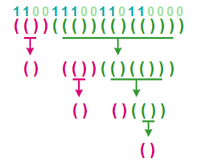

> 原文链接: https://leetcode-cn.com/problems/special-binary-string


## 英文原文
<div><p><strong>Special binary strings</strong> are binary strings with the following two properties:</p>

<ul>
	<li>The number of <code>0</code>&#39;s is equal to the number of <code>1</code>&#39;s.</li>
	<li>Every prefix of the binary string has at least as many <code>1</code>&#39;s as <code>0</code>&#39;s.</li>
</ul>

<p>You are given a <strong>special binary</strong> string <code>s</code>.</p>

<p>A move consists of choosing two consecutive, non-empty, special substrings of <code>s</code>, and swapping them. Two strings are consecutive if the last character of the first string is exactly one index before the first character of the second string.</p>

<p>Return <em>the lexicographically largest resulting string possible after applying the mentioned operations on the string</em>.</p>

<p>&nbsp;</p>
<p><strong>Example 1:</strong></p>

<pre>
<strong>Input:</strong> s = &quot;11011000&quot;
<strong>Output:</strong> &quot;11100100&quot;
<strong>Explanation:</strong> The strings &quot;10&quot; [occuring at s[1]] and &quot;1100&quot; [at s[3]] are swapped.
This is the lexicographically largest string possible after some number of swaps.
</pre>

<p><strong>Example 2:</strong></p>

<pre>
<strong>Input:</strong> s = &quot;10&quot;
<strong>Output:</strong> &quot;10&quot;
</pre>

<p>&nbsp;</p>
<p><strong>Constraints:</strong></p>

<ul>
	<li><code>1 &lt;= s.length &lt;= 50</code></li>
	<li><code>s[i]</code> is either <code>&#39;0&#39;</code> or <code>&#39;1&#39;</code>.</li>
	<li><code>s</code> is a special binary string.</li>
</ul>
</div>

## 中文题目
<div><p>特殊的二进制序列是具有以下两个性质的二进制序列：</p>

<ul>
	<li>0 的数量与 1 的数量相等。</li>
	<li>二进制序列的每一个前缀码中 1 的数量要大于等于 0 的数量。</li>
</ul>

<p>给定一个特殊的二进制序列&nbsp;<code>S</code>，以字符串形式表示。定义一个<em>操作 </em>为首先选择&nbsp;<code>S</code>&nbsp;的两个连续且非空的特殊的子串，然后将它们交换。（两个子串为连续的当且仅当第一个子串的最后一个字符恰好为第二个子串的第一个字符的前一个字符。)</p>

<p>在任意次数的操作之后，交换后的字符串按照字典序排列的最大的结果是什么？</p>

<p><strong>示例 1:</strong></p>

<pre>
<strong>输入:</strong> S = &quot;11011000&quot;
<strong>输出:</strong> &quot;11100100&quot;
<strong>解释:</strong>
将子串 &quot;10&quot; （在S[1]出现） 和 &quot;1100&quot; （在S[3]出现）进行交换。
这是在进行若干次操作后按字典序排列最大的结果。
</pre>

<p><strong>说明:</strong></p>

<ol>
	<li><code>S</code>&nbsp;的长度不超过&nbsp;<code>50</code>。</li>
	<li><code>S</code>&nbsp;保证为一个满足上述定义的<em>特殊 </em>的二进制序列。</li>
</ol>
</div>

## 通过代码
<RecoDemo>
</RecoDemo>


## 高赞题解
### 解题思路
相信好多人看到题目中 “特殊的二进制序列” 的定义就懵逼了，这到底是什么鬼？
所以题目最难的地方就是 “不说人话”。其实只要想到这种定义就是 “有效的括号字符串” 就容易许多了，“1” 代表 “(”，“0” 代表 “)”。
- 0 和 1 的数量相等。 → “右括号” 数量和 “左括号” 相同。
- 二进制序列的每一个前缀码中 1 的数量要大于等于 0 的数量。→ “右括号” 必须能够找到一个 “左括号” 匹配。

再看题目中 “操作” 的定义：首先选择 S 的两个 **连续** 且非空的 **特殊** 的子串，然后将它们交换。
翻译过来就是：选择 S 中的两个 **相邻** 的 **有效的括号字符串**，然后交换即可。

现在再来解决问题。首先分析 “有效的括号字符串” 的性质。
- 一个有效的括号字符串一般能够被拆分为一段或几段，其中每一段都是 “**不可拆分的**有效的括号字符串”，比如，“()(())” 可以拆分为 “()” 和 “(())”。
- 另外，“有效的括号字符串” 中的每一 “段” **内部** （即去掉最外层括号的字串）都是另一个 “有效括号字符串”，比如 “(())” 里面是 “()”。

根据上面的规则，我们可以 递归地 将二进制序列对应的 “括号字符串” 分解。以序列 “110011100110110000” 为例：


我们容易想到一种 递归地 解题思路。
- 第一步，将字符串拆分成一段或几段 “不可拆分的有效的括号字符串”。
- 第二步，将每一段 **内部** 的子串（也是 “有效的括号字符串”）分别重新排列成字典序最大的字符串（解决子问题）。
- 第三步，由于 **每一对相邻的段都可以交换**，因此无限次交换相当于我们可以把各个段以 **任意顺序** 排列。我们要找到字典序最大的排列。
这里有一个值得思考的地方：由于每一 “段” 必会以 “0” 结尾，因此只要将 “字典序最大” 的串放在第一位，“字典序次大” 的串放在第二位，...，就可以得到字典序最大的排列。（即将各个段按照字典序从大到小排序即可）。

### 代码

```cpp
class Solution {
public:
    int *ne;
    void arrange(string& s, int l, int r) {
        if(l <= r) {
            multiset<string> strs; // 注意，必须是 "multiset"，以便保持重复的字符串
            for(int i = l; i <= r;) {
                arrange(s, i+1, ne[i]-1);
                strs.insert(s.substr(i, ne[i] - i + 1));
                i = ne[i] + 1;
            }
            int p = l;
            for(auto it = strs.rbegin(); it != strs.rend(); ++it)
                for(char c : *it)
                    s[p++] = c;
        }
    }
    string makeLargestSpecial(string s) {
        ne = new int[s.size()];
        stack<int> st;
        for(int i = 0; i < s.size(); ++i) {
            if(s[i] == '1') {
                st.push(i);
            } else {
                ne[st.top()] = i;
                st.pop();
            }
        }
        arrange(s, 0, (int)s.size() - 1);
        return s;
    }
};
```

## 统计信息
| 通过次数 | 提交次数 | AC比率 |
| :------: | :------: | :------: |
|    2182    |    3686    |   59.2%   |

## 提交历史
| 提交时间 | 提交结果 | 执行时间 |  内存消耗  | 语言 |
| :------: | :------: | :------: | :--------: | :--------: |


## 相似题目
|                             题目                             | 难度 |
| :----------------------------------------------------------: | :---------: |
| [有效的括号字符串](https://leetcode-cn.com/problems/valid-parenthesis-string/) | 中等|
