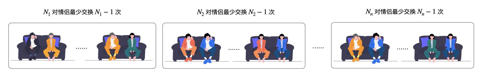

> 原文链接: https://leetcode-cn.com/problems/couples-holding-hands


## 英文原文
<div><p>There are <code>n</code> couples sitting in <code>2n</code> seats arranged in a row and want to hold hands.</p>

<p>The people and seats are represented by an integer array <code>row</code> where <code>row[i]</code> is the ID of the person sitting in the <code>i<sup>th</sup></code> seat. The couples are numbered in order, the first couple being <code>(0, 1)</code>, the second couple being <code>(2, 3)</code>, and so on with the last couple being <code>(2n - 2, 2n - 1)</code>.</p>

<p>Return <em>the minimum number of swaps so that every couple is sitting side by side</em>. A swap consists of choosing any two people, then they stand up and switch seats.</p>

<p>&nbsp;</p>
<p><strong>Example 1:</strong></p>

<pre>
<strong>Input:</strong> row = [0,2,1,3]
<strong>Output:</strong> 1
<strong>Explanation:</strong> We only need to swap the second (row[1]) and third (row[2]) person.
</pre>

<p><strong>Example 2:</strong></p>

<pre>
<strong>Input:</strong> row = [3,2,0,1]
<strong>Output:</strong> 0
<strong>Explanation:</strong> All couples are already seated side by side.
</pre>

<p>&nbsp;</p>
<p><strong>Constraints:</strong></p>

<ul>
	<li><code>2n == row.length</code></li>
	<li><code>2 &lt;= n &lt;= 30</code></li>
	<li><code>n</code> is even.</li>
	<li><code>0 &lt;= row[i] &lt; 2n</code></li>
	<li>All the elements of <code>row</code> are <strong>unique</strong>.</li>
</ul>
</div>

## 中文题目
<div><p>N 对情侣坐在连续排列的 2N 个座位上，想要牵到对方的手。 计算最少交换座位的次数，以便每对情侣可以并肩坐在一起。 <em>一</em>次交换可选择任意两人，让他们站起来交换座位。</p>

<p>人和座位用&nbsp;<code>0</code>&nbsp;到&nbsp;<code>2N-1</code>&nbsp;的整数表示，情侣们按顺序编号，第一对是&nbsp;<code>(0, 1)</code>，第二对是&nbsp;<code>(2, 3)</code>，以此类推，最后一对是&nbsp;<code>(2N-2, 2N-1)</code>。</p>

<p>这些情侣的初始座位&nbsp;&nbsp;<code>row[i]</code>&nbsp;是由最初始坐在第 i 个座位上的人决定的。</p>

<p><strong>示例 1:</strong></p>

<pre>
<strong>输入:</strong> row = [0, 2, 1, 3]
<strong>输出:</strong> 1
<strong>解释:</strong> 我们只需要交换row[1]和row[2]的位置即可。
</pre>

<p><strong>示例 2:</strong></p>

<pre>
<strong>输入:</strong> row = [3, 2, 0, 1]
<strong>输出:</strong> 0
<strong>解释:</strong> 无需交换座位，所有的情侣都已经可以手牵手了。
</pre>

<p><strong>说明:</strong></p>

<ol>
	<li><code>len(row)</code> 是偶数且数值在&nbsp;<code>[4, 60]</code>范围内。</li>
	<li>可以保证<code>row</code> 是序列&nbsp;<code>0...len(row)-1</code>&nbsp;的一个全排列。</li>
</ol>
</div>

## 通过代码
<RecoDemo>
</RecoDemo>


## 官方题解
### 📺 视频讲解 

>力扣君温馨小贴士：觉得视频时间长的扣友，可以在视频右下角的「设置」按钮处选择 1.5 倍速或者 2 倍速观看。


**题意解读**：

一对情侣，两个座位，无须交换就可以牵手成功。

{:width=400}{:align=center}

两对情侣，如下图所示的时候，最少须要交换 $1$ 次。


三对情侣，如果不能够彼此牵手，只可能出现下面这种 **首尾相连** 的情况。

{:width=700}{:align=center}

四对情侣、五对情侣以上的情况也可以类似看待。通过举例，可以知道把 **坐错了位置、逻辑上连在一起的情侣** 拆成所有的情侣都能彼此牵手的 **「最少交换次数 = 情侣对数 - 1」**。

### 方法：并查集

「首尾相连」这件事情可以使用 **并查集** 表示，将输入数组相邻位置的两个 **编号** 在并查集中进行合并。编写代码基于了下面的事实：

如果一对情侣恰好坐在了一起，并且坐在了成组的座位上，其中一个下标一定是偶数，另一个一定是奇数，并且「偶数的值 + 1 = 奇数的值」。例如编号数对 `[2, 3]`、`[9, 8]`，这些数对的特点是除以 $2$（下取整）得到的数相等。

#### 输出是什么？

要求出「最少交换次数」。假设一共有 $N$ 对情侣，逻辑上连在了一起的情侣（包括坐错位置和坐对位置的情况）分别有 $N_1,N_2,\cdots,N_n$ 对，这里 $n$ 是并查集里连通分量的个数，并且 $N_1 + N_2 + \cdots N_n = N$。把逻辑上连在一起的情侣拆开，每一个连通分量至少须要 $N_1 - 1,N_2 - 1,\cdots,N_n - 1$ 次。




这种规律对于初始的时候已经坐在一起的情侣同样成立，因为已经坐在一起的情侣在并查集里成为一个连通分量，无须交换，此时 $1 - 1 = 0$。综上所述，让所有的情侣都能牵手至少须要交换的次数为 

$$
(N_1 - 1) + (N_2 - 1) + \cdots + (N_n - 1) = (N_1 + N_2 + \cdots + N_n) - n = N - n
$$

故「至少交换的次数 = 所有情侣的对数 - 并查集里连通分量的个数」。

**参考代码**：

```Java []
public class Solution {

    public int minSwapsCouples(int[] row) {
        int len = row.length;
        int N = len / 2;
        UnionFind unionFind = new UnionFind(N);
        for (int i = 0; i < len; i += 2) {
            unionFind.union(row[i] / 2, row[i + 1] / 2);
        }
        return N - unionFind.getCount();
    }

    private class UnionFind {

        private int[] parent;

        private int count;

        public int getCount() {
            return count;
        }

        public UnionFind(int n) {
            this.count = n;
            this.parent = new int[n];
            for (int i = 0; i < n; i++) {
                parent[i] = i;
            }
        }

        public int find(int x) {
            while (x != parent[x]) {
                parent[x] = parent[parent[x]];
                x = parent[x];
            }
            return x;
        }

        public void union(int x, int y) {
            int rootX = find(x);
            int rootY = find(y);
            if (rootX == rootY) {
                return;
            }

            parent[rootX] = rootY;
            count--;
        }
    }
}
```

**复杂度分析**：

+ 时间复杂度： $O(N \log N)$，这里 $N$  是输入数组的长度，$O(\cfrac{N}{2} \log \cfrac{N}{2}) = O(N\log N)$ ；
+ 空间复杂度：$O(N)$，并查集底层使用的数组长度为 $\cfrac{N}{2}$，$O(\cfrac{N}{2})= O(N)$。

## 统计信息
| 通过次数 | 提交次数 | AC比率 |
| :------: | :------: | :------: |
|    29862    |    44942    |   66.4%   |

## 提交历史
| 提交时间 | 提交结果 | 执行时间 |  内存消耗  | 语言 |
| :------: | :------: | :------: | :--------: | :--------: |


## 相似题目
|                             题目                             | 难度 |
| :----------------------------------------------------------: | :---------: |
| [缺失的第一个正数](https://leetcode-cn.com/problems/first-missing-positive/) | 困难|
| [丢失的数字](https://leetcode-cn.com/problems/missing-number/) | 简单|
| [相似度为 K 的字符串](https://leetcode-cn.com/problems/k-similar-strings/) | 困难|
