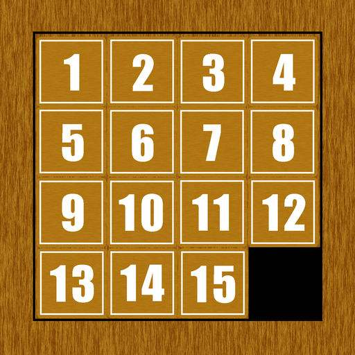
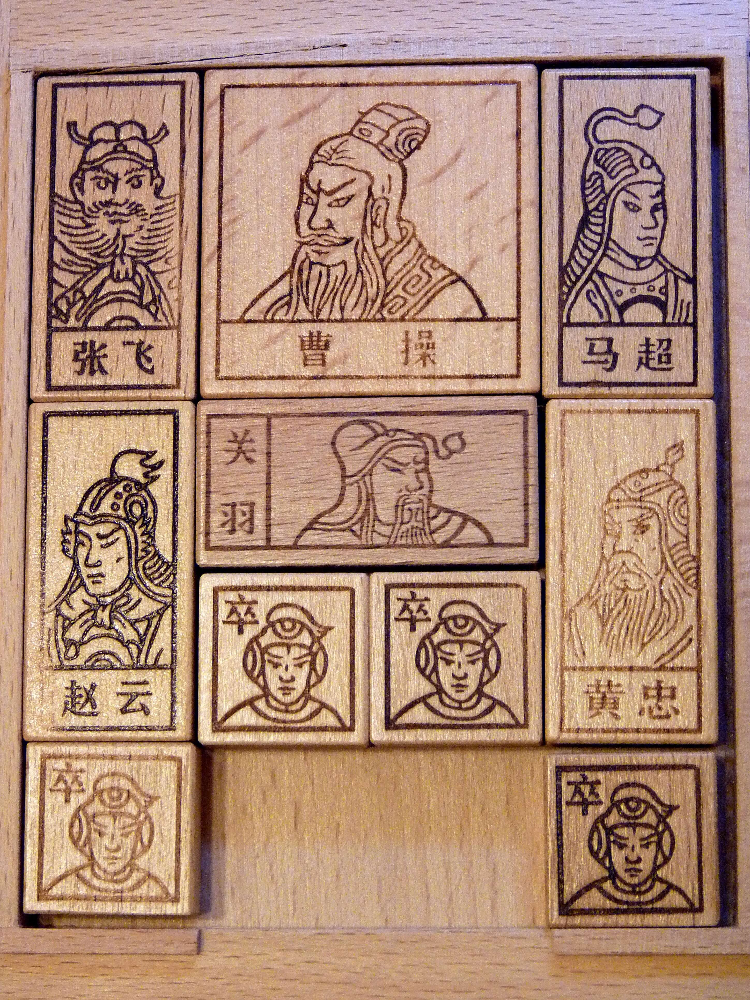
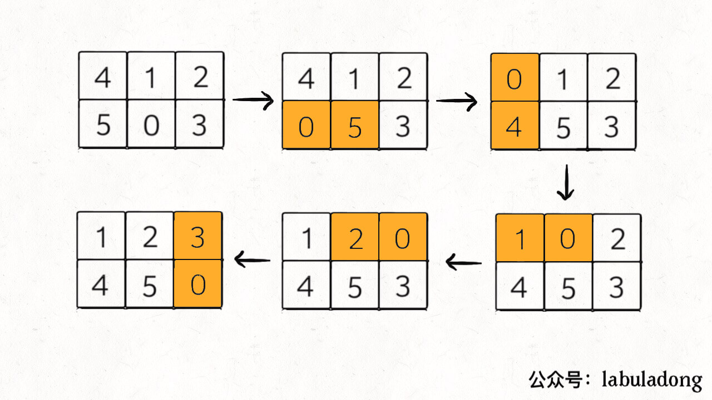
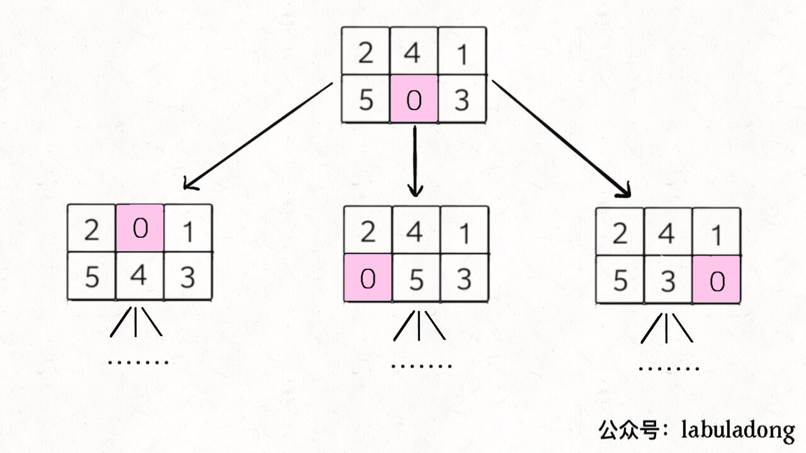
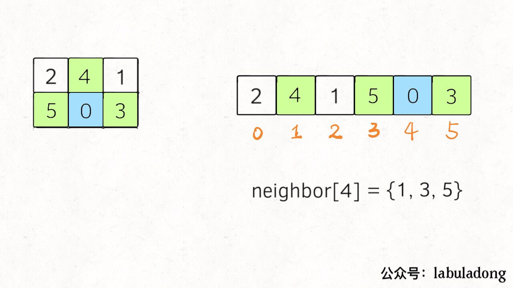

> 原文链接: https://leetcode-cn.com/problems/sliding-puzzle


## 英文原文
<div><p>On an <code>2 x 3</code> board, there are five tiles labeled from <code>1</code> to <code>5</code>, and an empty square represented by <code>0</code>. A <strong>move</strong> consists of choosing <code>0</code> and a 4-directionally adjacent number and swapping it.</p>

<p>The state of the board is solved if and only if the board is <code>[[1,2,3],[4,5,0]]</code>.</p>

<p>Given the puzzle board <code>board</code>, return <em>the least number of moves required so that the state of the board is solved</em>. If it is impossible for the state of the board to be solved, return <code>-1</code>.</p>

<p>&nbsp;</p>
<p><strong>Example 1:</strong></p>

<pre>
<strong>Input:</strong> board = [[1,2,3],[4,0,5]]
<strong>Output:</strong> 1
<strong>Explanation:</strong> Swap the 0 and the 5 in one move.
</pre>

<p><strong>Example 2:</strong></p>

<pre>
<strong>Input:</strong> board = [[1,2,3],[5,4,0]]
<strong>Output:</strong> -1
<strong>Explanation:</strong> No number of moves will make the board solved.
</pre>

<p><strong>Example 3:</strong></p>

<pre>
<strong>Input:</strong> board = [[4,1,2],[5,0,3]]
<strong>Output:</strong> 5
<strong>Explanation:</strong> 5 is the smallest number of moves that solves the board.
An example path:
After move 0: [[4,1,2],[5,0,3]]
After move 1: [[4,1,2],[0,5,3]]
After move 2: [[0,1,2],[4,5,3]]
After move 3: [[1,0,2],[4,5,3]]
After move 4: [[1,2,0],[4,5,3]]
After move 5: [[1,2,3],[4,5,0]]
</pre>

<p><strong>Example 4:</strong></p>

<pre>
<strong>Input:</strong> board = [[3,2,4],[1,5,0]]
<strong>Output:</strong> 14
</pre>

<p>&nbsp;</p>
<p><strong>Constraints:</strong></p>

<ul>
	<li><code>board.length == 2</code></li>
	<li><code>board[i].length == 3</code></li>
	<li><code>0 &lt;= board[i][j] &lt;= 5</code></li>
	<li>Each value <code>board[i][j]</code> is <strong>unique</strong>.</li>
</ul>
</div>

## 中文题目
<div><p>在一个 2 x 3 的板上（<code>board</code>）有 5 块砖瓦，用数字 <code>1~5</code> 来表示, 以及一块空缺用&nbsp;<code>0</code>&nbsp;来表示.</p>

<p>一次移动定义为选择&nbsp;<code>0</code>&nbsp;与一个相邻的数字（上下左右）进行交换.</p>

<p>最终当板&nbsp;<code>board</code>&nbsp;的结果是&nbsp;<code>[[1,2,3],[4,5,0]]</code>&nbsp;谜板被解开。</p>

<p>给出一个谜板的初始状态，返回最少可以通过多少次移动解开谜板，如果不能解开谜板，则返回 -1 。</p>

<p><strong>示例：</strong></p>

<pre>
<strong>输入：</strong>board = [[1,2,3],[4,0,5]]
<strong>输出：</strong>1
<strong>解释：</strong>交换 0 和 5 ，1 步完成
</pre>

<pre>
<strong>输入：</strong>board = [[1,2,3],[5,4,0]]
<strong>输出：</strong>-1
<strong>解释：</strong>没有办法完成谜板
</pre>

<pre>
<strong>输入：</strong>board = [[4,1,2],[5,0,3]]
<strong>输出：</strong>5
<strong>解释：</strong>
最少完成谜板的最少移动次数是 5 ，
一种移动路径:
尚未移动: [[4,1,2],[5,0,3]]
移动 1 次: [[4,1,2],[0,5,3]]
移动 2 次: [[0,1,2],[4,5,3]]
移动 3 次: [[1,0,2],[4,5,3]]
移动 4 次: [[1,2,0],[4,5,3]]
移动 5 次: [[1,2,3],[4,5,0]]
</pre>

<pre>
<strong>输入：</strong>board = [[3,2,4],[1,5,0]]
<strong>输出：</strong>14
</pre>

<p><strong>提示：</strong></p>

<ul>
	<li><code>board</code>&nbsp;是一个如上所述的 2 x 3 的数组.</li>
	<li><code>board[i][j]</code>&nbsp;是一个&nbsp;<code>[0, 1, 2, 3, 4, 5]</code>&nbsp;的排列.</li>
</ul>
</div>

## 通过代码
<RecoDemo>
</RecoDemo>


## 高赞题解


读完本文，你可以去力扣拿下如下题目：

[773.滑动谜题](https://leetcode-cn.com/problems/sliding-puzzle)

**-----------**

滑动拼图游戏大家应该都玩过，下图是一个 4x4 的滑动拼图：

{:width=450}{:align=center}

拼图中有一个格子是空的，可以利用这个空着的格子移动其他数字。你需要通过移动这些数字，得到某个特定排列顺序，这样就算赢了。

我小时候还玩过一款叫做「华容道」的益智游戏，也和滑动拼图比较类似：

{:width=450}{:align=center}

那么这种游戏怎么玩呢？我记得是有一些套路的，类似于魔方还原公式。但是我们今天不来研究让人头秃的技巧，**这些益智游戏通通可以用暴力搜索算法解决，所以今天我们就学以致用，用 BFS 算法框架来秒杀这些游戏**。

### 一、题目解析

LeetCode 第 773 题就是滑动拼图问题，题目的意思如下：

给你一个 2x3 的滑动拼图，用一个 2x3 的数组 `board` 表示。拼图中有数字 0~5 六个数，其中数字 0 就表示那个空着的格子，你可以移动其中的数字，当 `board` 变为 `[[1,2,3],[4,5,0]]` 时，赢得游戏。

请你写一个算法，计算赢得游戏需要的最少移动次数，如果不能赢得游戏，返回 -1。

比如说输入的二维数组 `board = [[4,1,2],[5,0,3]]`，算法应该返回 5：

{:width=450}{:align=center}

如果输入的是 `board = [[1,2,3],[5,0,4]]`，则算法返回 -1，因为这种局面下无论如何都不能赢得游戏。

### 二、思路分析

对于这种计算最小步数的问题，我们就要敏感地想到 BFS 算法。

这个题目转化成 BFS 问题是有一些技巧的，我们面临如下问题：

1、一般的 BFS 算法，是从一个起点 `start` 开始，向终点 `target` 进行寻路，但是拼图问题不是在寻路，而是在不断交换数字，这应该怎么转化成 BFS 算法问题呢？

2、即便这个问题能够转化成 BFS 问题，如何处理起点 `start` 和终点 `target`？它们都是数组哎，把数组放进队列，套 BFS 框架，想想就比较麻烦且低效。

首先回答第一个问题，**BFS 算法并不只是一个寻路算法，而是一种暴力搜索算法**，只要涉及暴力穷举的问题，BFS 就可以用，而且可以最快地找到答案。

你想想计算机怎么解决问题的？哪有那么多奇技淫巧，本质上就是把所有可行解暴力穷举出来，然后从中找到一个最优解罢了。

明白了这个道理，我们的问题就转化成了：**如何穷举出 `board` 当前局面下可能衍生出的所有局面**？这就简单了，看数字 0 的位置呗，和上下左右的数字进行交换就行了：

{:width=450}{:align=center}

这样其实就是一个 BFS 问题，每次先找到数字 0，然后和周围的数字进行交换，形成新的局面加入队列…… 当第一次到达 `target` 时，就得到了赢得游戏的最少步数。

对于第二个问题，我们这里的 `board` 仅仅是 2x3 的二维数组，所以可以压缩成一个一维字符串。**其中比较有技巧性的点在于，二维数组有「上下左右」的概念，压缩成一维后，如何得到某一个索引上下左右的索引**？

很简单，我们只要手动写出来这个映射就行了：

```cpp
vector<vector<int>> neighbor = {
    { 1, 3 },
    { 0, 4, 2 },
    { 1, 5 },
    { 0, 4 },
    { 3, 1, 5 },
    { 4, 2 }
};
```

**这个含义就是，在一维字符串中，索引 `i` 在二维数组中的的相邻索引为 `neighbor[i]`**，：

{:width=450}{:align=center}

至此，我们就把这个问题完全转化成标准的 BFS 问题了，借助前文 [BFS 算法框架](https://labuladong.gitbook.io/algo) 的代码框架，直接就可以套出解法代码了：

```cpp
int slidingPuzzle(vector<vector<int>>& board) {
    int m = 2, n = 3;
    string start = "";
    string target = "123450";
    // 将 2x3 的数组转化成字符串
    for (int i = 0; i < m; i++) {
        for (int j = 0; j < n; j++) {
            start.push_back(board[i][j] + '0');
        }
    }
    // 记录一维字符串的相邻索引
    vector<vector<int>> neighbor = {
        { 1, 3 },
        { 0, 4, 2 },
        { 1, 5 },
        { 0, 4 },
        { 3, 1, 5 },
        { 4, 2 }
    };
    
    /******* BFS 算法框架开始 *******/
    queue<string> q;
    unordered_set<string> visited;
    q.push(start);
    visited.insert(start);
    
    int step = 0;
    while (!q.empty()) {
        int sz = q.size();
        for (int i = 0; i < sz; i++) {
            string cur = q.front(); q.pop();
            // 判断是否达到目标局面
            if (target == cur) {
                return step;
            }
            // 找到数字 0 的索引
            int idx = 0;
            for (; cur[idx] != '0'; idx++);
            // 将数字 0 和相邻的数字交换位置
            for (int adj : neighbor[idx]) {
                string new_board = cur;
                swap(new_board[adj], new_board[idx]);
                // 防止走回头路
                if (!visited.count(new_board)) {
                    q.push(new_board);
                    visited.insert(new_board);
                }
            }
        }
        step++;
    }
    return -1;
    /******* BFS 算法框架结束 *******/
}
```

至此，这道题目就解决了，其实框架完全没有变，套路都是一样的，我们只是花了比较多的时间将滑动拼图游戏转化成 BFS 算法。

很多益智游戏都是这样，虽然看起来特别巧妙，但都架不住暴力穷举，常用的算法就是回溯算法或者 BFS 算法。​

**＿＿＿＿＿＿＿＿＿＿＿＿＿**

**点击 [我的头像](https://labuladong.gitbook.io/algo/) 看更多优质文章**。


## 统计信息
| 通过次数 | 提交次数 | AC比率 |
| :------: | :------: | :------: |
|    24166    |    34017    |   71.0%   |

## 提交历史
| 提交时间 | 提交结果 | 执行时间 |  内存消耗  | 语言 |
| :------: | :------: | :------: | :--------: | :--------: |
