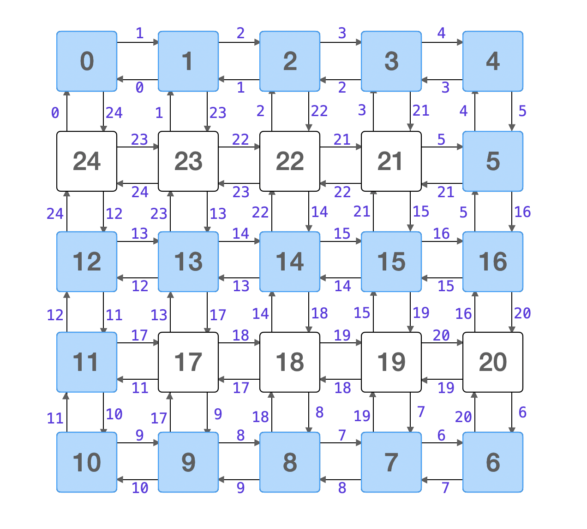

> 原文链接: https://leetcode-cn.com/problems/swim-in-rising-water


## 英文原文
<div><p>You are given an <code>n x n</code> integer matrix <code>grid</code> where each value <code>grid[i][j]</code> represents the elevation at that point <code>(i, j)</code>.</p>

<p>The rain starts to fall. At time <code>t</code>, the depth of the water everywhere is <code>t</code>. You can swim from a square to another 4-directionally adjacent square if and only if the elevation of both squares individually are at most <code>t</code>. You can swim infinite distances in zero time. Of course, you must stay within the boundaries of the grid during your swim.</p>

<p>Return <em>the least time until you can reach the bottom right square </em><code>(n - 1, n - 1)</code><em> if you start at the top left square </em><code>(0, 0)</code>.</p>

<p>&nbsp;</p>
<p><strong>Example 1:</strong></p>

<pre>
<strong>Input:</strong> grid = [[0,2],[1,3]]
<strong>Output:</strong> 3
Explanation:
At time 0, you are in grid location (0, 0).
You cannot go anywhere else because 4-directionally adjacent neighbors have a higher elevation than t = 0.
You cannot reach point (1, 1) until time 3.
When the depth of water is 3, we can swim anywhere inside the grid.
</pre>

<p><strong>Example 2:</strong></p>

<pre>
<strong>Input:</strong> grid = [[0,1,2,3,4],[24,23,22,21,5],[12,13,14,15,16],[11,17,18,19,20],[10,9,8,7,6]]
<strong>Output:</strong> 16
<strong>Explanation:</strong> The final route is shown.
We need to wait until time 16 so that (0, 0) and (4, 4) are connected.
</pre>

<p>&nbsp;</p>
<p><strong>Constraints:</strong></p>

<ul>
	<li><code>n == grid.length</code></li>
	<li><code>n == grid[i].length</code></li>
	<li><code>1 &lt;= n &lt;= 50</code></li>
	<li><code>0 &lt;= grid[i][j] &lt;&nbsp;n<sup>2</sup></code></li>
	<li>Each value <code>grid[i][j]</code> is <strong>unique</strong>.</li>
</ul>
</div>

## 中文题目
<div><p>在一个 N x N 的坐标方格 <code>grid</code> 中，每一个方格的值 <code>grid[i][j]</code> 表示在位置 <code>(i,j)</code> 的平台高度。</p>

<p>现在开始下雨了。当时间为 <code>t</code> 时，此时雨水导致水池中任意位置的水位为 <code>t</code> 。你可以从一个平台游向四周相邻的任意一个平台，但是前提是此时水位必须同时淹没这两个平台。假定你可以瞬间移动无限距离，也就是默认在方格内部游动是不耗时的。当然，在你游泳的时候你必须待在坐标方格里面。</p>

<p>你从坐标方格的左上平台 (0，0) 出发。最少耗时多久你才能到达坐标方格的右下平台 <code>(N-1, N-1)</code>？</p>

<p> </p>

<p><strong>示例 1:</strong></p>

<pre>
<strong>输入:</strong> [[0,2],[1,3]]
<strong>输出:</strong> 3
<strong>解释:</strong>
时间为0时，你位于坐标方格的位置为 <code>(0, 0)。</code>
此时你不能游向任意方向，因为四个相邻方向平台的高度都大于当前时间为 0 时的水位。

等时间到达 3 时，你才可以游向平台 (1, 1). 因为此时的水位是 3，坐标方格中的平台没有比水位 3 更高的，所以你可以游向坐标方格中的任意位置
</pre>

<p><strong>示例2:</strong></p>

<pre>
<strong>输入:</strong> [[0,1,2,3,4],[24,23,22,21,5],[12,13,14,15,16],[11,17,18,19,20],[10,9,8,7,6]]
<strong>输出:</strong> 16
<strong>解释:</strong>
<strong> 0  1  2  3  4</strong>
24 23 22 21  <strong>5</strong>
<strong>12 13 14 15 16</strong>
<strong>11</strong> 17 18 19 20
<strong>10  9  8  7  6</strong>

最终的路线用加粗进行了标记。
我们必须等到时间为 16，此时才能保证平台 (0, 0) 和 (4, 4) 是连通的
</pre>

<p> </p>

<p><strong>提示:</strong></p>

<ol>
	<li><code>2 <= N <= 50</code>.</li>
	<li><code>grid[i][j]</code> 是 <code>[0, ..., N*N - 1]</code> 的排列。</li>
</ol>
</div>

## 通过代码
<RecoDemo>
</RecoDemo>


## 官方题解


### 📺 视频讲解 

>力扣君温馨小贴士：觉得视频时间长的扣友，可以在视频右下角的「设置」按钮处选择 1.5 倍速或者 2 倍速观看。


### 📖 文字解析

注意题目中的重要信息：假定你可以 **瞬间移动** 无限距离，**游动不耗时**。当前这个问题就转换成为：找一个时刻 `t`，使得这个二维网格上数值 **小于等于** `t` 的部分，存在一条从左上角到右下角的路径。即：经过了时间 `t` 以后，可以瞬间从左上角（坐标 `[0, 0]`）游到右下角（坐标 `[N - 1, N - 1]`）。

### 方法一：二分查找 + 遍历

根据题目中的描述：

+ 如果等待的时间 `t` 越少，网格上可以游泳的部分就越少，存在从左上角到右下角的一条路径的可能性越小；
+ 如果等待的时间 `t` 越多，网格上可以游泳的部分就越多，存在从左上角到右下角的一条路径的可能性越大。


这是本问题具有的 **单调性**。因此可以使用二分查找定位到最短等待时间。具体来说：在区间 `[0, N * N - 1]` 里猜一个整数，针对这个整数从起点（左上角）开始做一次深度优先遍历或者广度优先遍历。

+ 当小于等于该数值时，如果存在一条从左上角到右下角的路径，说明答案可能是这个数值，也可能更小；
+ 当小于等于该数值时，如果不存在一条从左上角到右下角的路径，说明答案一定比这个数值更大。

按照这种方式不断缩小搜索的区间，最终找到最少等待时间。

**参考代码 1**：

说明：选项卡一使用深度优先遍历，选项卡二使用广度优先遍历。

```Java []
public class Solution {

    private int N;

    public static final int[][] DIRECTIONS = {{0, 1}, {0, -1}, {1, 0}, {-1, 0}};

    public int swimInWater(int[][] grid) {
        this.N = grid.length;

        int left = 0;
        int right = N * N - 1;
        while (left < right) {
            // left + right 不会溢出
            int mid = (left + right) / 2;
            boolean[][] visited = new boolean[N][N];
            if (grid[0][0] <= mid && dfs(grid, 0, 0, visited, mid)) {
                // mid 可以，尝试 mid 小一点是不是也可以呢？下一轮搜索的区间 [left, mid]
                right = mid;
            } else {
                left = mid + 1;
            }
        }
        return left;
    }

    /**
     * 使用深度优先遍历得到从 (x, y) 开始向四个方向的所有小于等于 threshold 且与 (x, y) 连通的结点
     *
     * @param grid
     * @param x
     * @param y
     * @param visited
     * @param threshold
     * @return
     */
    private boolean dfs(int[][] grid, int x, int y, boolean[][] visited, int threshold) {
        visited[x][y] = true;
        for (int[] direction : DIRECTIONS) {
            int newX = x + direction[0];
            int newY = y + direction[1];
            if (inArea(newX, newY) && !visited[newX][newY] && grid[newX][newY] <= threshold) {
                if (newX == N - 1 && newY == N - 1) {
                    return true;
                }

                if (dfs(grid, newX, newY, visited, threshold)) {
                    return true;
                }
            }
        }
        return false;
    }

    private boolean inArea(int x, int y) {
        return x >= 0 && x < N && y >= 0 && y < N;
    }
}
```
```Java []
import java.util.LinkedList;
import java.util.Queue;

public class Solution {

    private int N;

    public static final int[][] DIRECTIONS = {{0, 1}, {0, -1}, {1, 0}, {-1, 0}};

    public int swimInWater(int[][] grid) {
        this.N = grid.length;

        int left = 0;
        int right = N * N - 1;
        while (left < right) {
            int mid = (left + right) / 2;

            if (grid[0][0] <= mid && bfs(grid, mid)) {
                // mid 可以，尝试 mid 小一点是不是也可以呢？// [left, mid]
                right = mid;
            } else {
                left = mid + 1;
            }
        }
        return left;
    }


    /**
     * 使用广度优先遍历得到从 (x, y) 开始向四个方向的所有小于等于 threshold 且与 (x, y) 连通的结点
     *
     * @param grid
     * @param threshold
     * @return
     */
    private boolean bfs(int[][] grid, int threshold) {
        Queue<int[]> queue = new LinkedList<>();
        queue.offer(new int[]{0, 0});
        boolean[][] visited = new boolean[N][N];
        visited[0][0] = true;

        while (!queue.isEmpty()) {
            int[] front = queue.poll();
            int x = front[0];
            int y = front[1];
            for (int[] direction : DIRECTIONS) {
                int newX = x + direction[0];
                int newY = y + direction[1];
                if (inArea(newX, newY) && !visited[newX][newY] && grid[newX][newY] <= threshold) {
                    if (newX == N - 1 && newY == N - 1) {
                        return true;
                    }

                    queue.offer(new int[]{newX, newY});
                    visited[newX][newY] = true;
                }
            }
        }
        return false;
    }

    private boolean inArea(int x, int y) {
        return x >= 0 && x < N && y >= 0 && y < N;
    }

}
```


**复杂度分析**：

- 时间复杂度：$O(N^2 \log N)$。
其中 $N$ 是方格的边长。最差情况下进行 $\log N^2$ 次二分查找，每一次二分查找最差情况下要遍历所有单元格一次，时间复杂度为 $O(N^2)$。总的时间复杂度为 $O(N^2 \log N^2) = O(2N^2 \log N) = O(N^2 \log N)$；
- 空间复杂度：$O(N^2)$。
数组 `visited` 的大小为 $N^2$ ，如果使用深度优先遍历，须要使用的栈的大小最多为 $N^2$ ，如果使用广度优先遍历，须要使用的栈的大小最多为 $N^2$。

---

关于连通性的问题，如果只问结果，不问具体怎么连起来的，还可以考虑使用并查集。

### 方法二：并查集

由于题目要我们找的是最少等待时间，可以模拟下雨的过程，把网格抽象成一个无权图，每经过一个时刻，就考虑此时和雨水高度相等的单元格，考虑这个单元格的上、下、左、右、四个方向，并且高度更低的单元格，把它们在并查集中进行合并。


**参考代码 2**：


```Java []
public class Solution {

    private int N;

    public static final int[][] DIRECTIONS = {{0, 1}, {0, -1}, {1, 0}, {-1, 0}};

    public int swimInWater(int[][] grid) {
        this.N = grid.length;

        int len = N * N;
        // 下标：方格的高度，值：对应在方格中的坐标
        int[] index = new int[len];
        for (int i = 0; i < N; i++) {
            for (int j = 0; j < N; j++) {
                index[grid[i][j]] = getIndex(i, j);
            }
        }

        UnionFind unionFind = new UnionFind(len);
        for (int i = 0; i < len; i++) {
            int x = index[i] / N;
            int y = index[i] % N;

            for (int[] direction : DIRECTIONS) {
                int newX = x + direction[0];
                int newY = y + direction[1];
                if (inArea(newX, newY) && grid[newX][newY] <= i) {
                    unionFind.union(index[i], getIndex(newX, newY));
                }

                if (unionFind.isConnected(0, len - 1)) {
                    return i;
                }
            }
        }
        return -1;
    }

    private int getIndex(int x, int y) {
        return x * N + y;
    }

    private boolean inArea(int x, int y) {
        return x >= 0 && x < N && y >= 0 && y < N;
    }

    private class UnionFind {

        private int[] parent;

        public UnionFind(int n) {
            this.parent = new int[n];
            for (int i = 0; i < n; i++) {
                parent[i] = i;
            }
        }

        public int root(int x) {
            while (x != parent[x]) {
                parent[x] = parent[parent[x]];
                x = parent[x];
            }
            return x;
        }

        public boolean isConnected(int x, int y) {
            return root(x) == root(y);
        }

        public void union(int p, int q) {
            if (isConnected(p, q)) {
                return;
            }
            parent[root(p)] = root(q);
        }
    }
}
```

**复杂度分析**

- 时间复杂度：$O(N^2 \log N)$，其中 $N$ 是方格的边长，计数排序 $O(N^2)$，合并四周、检查起点和终点是否同属于一个连通分量 $O(\log N^2)$，总的时间复杂度为 $O(N^2 + N^2\log N^2) = O(N^2 + 2N^2 \log N) = O(N^2 \log N)$；
- 空间复杂度：$O(N^2)$，数组 `index` 的长度，并查集底层的长度均为 $N^2$。

---

### 方法三：Dijkstra 算法

注意这个问题求的是从一个源点到目标顶点的最短路径，并且**这条路径上的边没有负数**（**这一点非常重要，单元格的高度大于等于 $0$**），符合 Dijkstra 算法的应用场景。为此我们可以把问题抽象成一个带权有向图，权值是有向边指向的顶点的高度。如下图所示：

{:width=400}

Dijkstra 算法是应用很广泛的求解 **没有负权边** 的单源最短路径算法，《算法（第 4 版）》对这个算法做了详细的介绍，大家还可以阅读这本书的配套英文教程的 [ 4.4 Shortest Paths](https://algs4.cs.princeton.edu/44sp/) 进行学习。没有负权边是应用 Dijkstra 算法的前提，也是理解 Dijkstra 算法执行流程的关键。

Dijkstra 算法应用在示例 2 寻找最短路径的过程如下图所示：


**参考代码 3**：


```Java []
import java.util.Arrays;
import java.util.Comparator;
import java.util.PriorityQueue;
import java.util.Queue;

public class Solution {

    // Dijkstra 算法（应用前提：没有负权边，找单源最短路径）

    public int swimInWater(int[][] grid) {
        int n = grid.length;

        Queue<int[]> minHeap = new PriorityQueue<>(Comparator.comparingInt(o -> grid[o[0]][o[1]]));
        minHeap.offer(new int[]{0, 0});

        boolean[][] visited = new boolean[n][n];
        // distTo[i][j] 表示：到顶点 [i, j] 须要等待的最少的时间
        int[][] distTo = new int[n][n];
        for (int[] row : distTo) {
            Arrays.fill(row, n * n);
        }
        distTo[0][0] = grid[0][0];

        int[][] directions = {{0, 1}, {0, -1}, {1, 0}, {-1, 0}};
        while (!minHeap.isEmpty()) {
            // 找最短的边
            int[] front = minHeap.poll();
            int currentX = front[0];
            int currentY = front[1];
            if (visited[currentX][currentY]) {
                continue;
            }

            // 确定最短路径顶点
            visited[currentX][currentY] = true;
            if (currentX == n - 1 && currentY == n - 1) {
                return distTo[n - 1][n - 1];
            }

            // 更新
            for (int[] direction : directions) {
                int newX = currentX + direction[0];
                int newY = currentY + direction[1];
                if (inArea(newX, newY, n) && !visited[newX][newY] &&
                        Math.max(distTo[currentX][currentY], grid[newX][newY]) < distTo[newX][newY]) {
                    distTo[newX][newY] = Math.max(distTo[currentX][currentY], grid[newX][newY]);
                    minHeap.offer(new int[]{newX, newY});
                }
            }
        }
        return -1;
    }

    private boolean inArea(int x, int y, int n) {
        return x >= 0 && x < n && y >= 0 && y < n;
    }
}
```

**复杂度分析**：


+ 时间复杂度：$O(N^2 \log N)$。
使用了优先队列的 Dijkstra 算法的时间复杂度是 $O(E \log E)$ ，这里 $E$ 是边数，至多是顶点数的 $4$ 倍，顶点数为 $N^2$，因此 $O(E \log E) = O(4N^2 \log N^2)  = O(N^2 \log N)$；
+ 空间复杂度：$O(N^2)$。
数组 `visited` 、`distTo` 的大小为 $O(N^2)$，优先队列中保存的边的总数也是 $N^2$ 级别的。

## 统计信息
| 通过次数 | 提交次数 | AC比率 |
| :------: | :------: | :------: |
|    24260    |    40905    |   59.3%   |

## 提交历史
| 提交时间 | 提交结果 | 执行时间 |  内存消耗  | 语言 |
| :------: | :------: | :------: | :--------: | :--------: |
