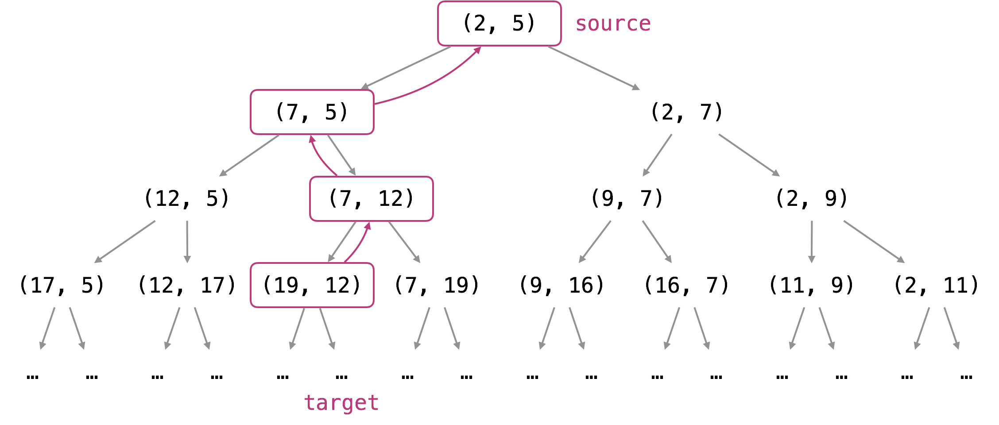

> 原文链接: https://leetcode-cn.com/problems/reaching-points


## 英文原文
<div><p>Given four integers <code>sx</code>, <code>sy</code>, <code>tx</code>, and <code>ty</code>, return <code>true</code><em> if it is possible to convert the point </em><code>(sx, sy)</code><em> to the point </em><code>(tx, ty)</code> <em>through some operations</em><em>, or </em><code>false</code><em> otherwise</em>.</p>

<p>The allowed operation on some point <code>(x, y)</code> is to convert it to either <code>(x, x + y)</code> or <code>(x + y, y)</code>.</p>

<p>&nbsp;</p>
<p><strong>Example 1:</strong></p>

<pre>
<strong>Input:</strong> sx = 1, sy = 1, tx = 3, ty = 5
<strong>Output:</strong> true
<strong>Explanation:</strong>
One series of moves that transforms the starting point to the target is:
(1, 1) -&gt; (1, 2)
(1, 2) -&gt; (3, 2)
(3, 2) -&gt; (3, 5)
</pre>

<p><strong>Example 2:</strong></p>

<pre>
<strong>Input:</strong> sx = 1, sy = 1, tx = 2, ty = 2
<strong>Output:</strong> false
</pre>

<p><strong>Example 3:</strong></p>

<pre>
<strong>Input:</strong> sx = 1, sy = 1, tx = 1, ty = 1
<strong>Output:</strong> true
</pre>

<p>&nbsp;</p>
<p><strong>Constraints:</strong></p>

<ul>
	<li><code>1 &lt;= sx, sy, tx, ty &lt;= 10<sup>9</sup></code></li>
</ul>
</div>

## 中文题目
<div><p>从点&nbsp;<code>(x, y)</code>&nbsp;可以<strong>转换</strong>到&nbsp;<code>(x, x+y)</code>&nbsp; 或者&nbsp;<code>(x+y, y)</code>。</p>

<p>给定一个起点&nbsp;<code>(sx, sy)</code>&nbsp;和一个终点&nbsp;<code>(tx, ty)</code>，如果通过一系列的<strong>转换</strong>可以从起点到达终点，则返回 <code>True&nbsp;</code>，否则返回&nbsp;<code>False</code>。</p>

<pre>
<strong>示例:</strong>
<strong>输入:</strong> sx = 1, sy = 1, tx = 3, ty = 5
<strong>输出:</strong> True
<strong>解释:
</strong>可以通过以下一系列<strong>转换</strong>从起点转换到终点：
(1, 1) -&gt; (1, 2)
(1, 2) -&gt; (3, 2)
(3, 2) -&gt; (3, 5)

<strong>输入:</strong> sx = 1, sy = 1, tx = 2, ty = 2
<strong>输出:</strong> False

<strong>输入:</strong> sx = 1, sy = 1, tx = 1, ty = 1
<strong>输出:</strong> True

</pre>

<p><strong>注意:</strong></p>

<ul>
	<li><code>sx, sy, tx, ty</code>&nbsp;是范围在&nbsp;<code>[1, 10^9]</code>&nbsp;的整数。</li>
</ul>
</div>

## 通过代码
<RecoDemo>
</RecoDemo>


## 官方题解
#### 方法一：穷举搜索【超出时间限制】

**思路和算法**

每个点都可以转换成两个子点，递归搜索所有子点。

```java [solution1-Java]
class Solution {
    public boolean reachingPoints(int sx, int sy, int tx, int ty) {
        if (sx > tx || sy > ty) return false;
        if (sx == tx && sy == ty) return true;
        return reachingPoints(sx+sy, sy, tx, ty) || reachingPoints(sx, sx+sy, tx, ty);
    }
}
```

```python [solution1-Python]
class Solution(object):
    def reachingPoints(self, sx, sy, tx, ty):
        if sx > tx or sy > ty: return False
        if sx == tx and sy == ty: return True
        return self.reachingPoints(sx+sy, sy, tx, ty) or \
               self.reachingPoints(sx, sx+sy, tx, ty)
```

**复杂度分析**

* 时间复杂度：$O(2^{tx + ty})$，每一步转换都是 `(x, y) -> (x+1, y)` 或者 `(x, y) -> (x, y+1)`。

* 空间复杂度：$O(tx * ty)$，隐式调用栈的大小。

#### 方法二：动态规划【超出时间限制】

**思路和算法**

为了避免重复计算，使用一个集合 `seen` 存储*方法一*中递归搜索到的子点。

```java [solution2-Java]
import java.awt.Point;

class Solution {
    Set<Point> seen;
    int tx, ty;

    public boolean reachingPoints(int sx, int sy, int tx, int ty) {
        seen = new HashSet();
        this.tx = tx;
        this.ty = ty;
        search(new Point(sx, sy));
        return seen.contains(new Point(tx, ty));
    }

    public void search(Point P) {
        if (seen.contains(P)) return;
        if (P.x > tx || P.y > ty) return;
        seen.add(P);
        search(new Point(P.x + P.y, P.y));
        search(new Point(P.x, P.x + P.y));
    }
}
```

```python [solution2-Python]
class Solution(object):
    def reachingPoints(self, sx, sy, tx, ty):
        seen = set()
        def search(x, y):
            if (x, y) in seen: return
            if x > tx or y > ty: return
            seen.add((x, y))
            search(x+y, y)
            search(x, x+y)

        search(sx, sy)
        return (tx, ty) in seen
```

**复杂度分析**

* 时间复杂度：$O(tx * ty)$，最多 `tx * ty` 个点被搜索一次。

* 空间复杂度：$O(tx * ty)$，隐式调用栈的大小。

#### 方法三：回溯法（简单变体）【超出时间限制】

**思路**

每个父点 `(x, y)` 都有两个子点 `(x, x+y)` 和 `(x+y, y)`。由于坐标不能为负，每个子点 `(x, y)` 只能有一个父点，当 `x >= y` 时父点为 `(x-y, y)`；当 `y > x` 时父点为 `(x, y-x)`。

{:width=500}

从终点开始不断向上求解父点，可以判断给定点是否是正确的起点。例如，当终点是 `(19, 12)` 时，它的父点是 `(7, 12)`， `(7, 5)` 和 `(2, 5)`。因此 `(2, 5)` 是 `(19, 12)` 的起点。

**算法**

反复使用 `{tx, ty}` 中较大的值减去较小的值更新点，到达点 `{sx, sy}` 时返回 `true`。

```java [solution3-Java]
class Solution {
    public boolean reachingPoints(int sx, int sy, int tx, int ty) {
        while (tx >= sx && ty >= sy) {
            if (sx == tx && sy == ty)
                return true;
            if (tx > ty) tx -= ty;
            else ty -= tx;
        }
        return false;
    }
}
```

```python[solution3-Python]
class Solution(object):
    def reachingPoints(self, sx, sy, tx, ty):
        while tx >= sx and ty >= sy:
            if sx == tx and sy == ty: return True
            if tx > ty:
                tx -= ty
            else:
                ty -= tx
        return False
```

**复杂度分析**

* 时间复杂度：$O(\max(tx, ty))$，如果 `ty = 1`，需要做 `tx` 次减法。 

* 空间复杂度：$O(1)$。

#### 方法四：回溯法 （取模变体）【通过】

**思路**

与*方法三*一样，使用回溯法。通过求解父点完成 `(x, y) -> (x-y, y) 或 (x, y-x)` 的转换，具体使用哪一种转换取决于哪种结果没有负数。

可以使用模运算加速求解父点的过程。

**算法**

当 `tx > ty` 时，求解父点的运算是 `tx - ty`，并且它的往上 `tx = tx % ty` 个父点都是减去 `ty`。当同时满足 `tx > ty 和 ty <= sy` 时，可以一次性执行所有的这些操作，直接令 `tx %= ty`。

否则，如果满足 `tx > ty 和 ty <= sy`，那么 `ty` 不再改变，只能不断从 `tx` 中减去 `ty`。因此， `(tx - sx) % ty == 0` 是结果为 `true` 的充要条件。

上面的分析是针对 `tx > ty` 的情况，对于 `ty > tx` 的情况类似。 当 `tx == ty` 时，无法再求解父点。

```java [solution4-Java]
class Solution {
    public boolean reachingPoints(int sx, int sy, int tx, int ty) {
        while (tx >= sx && ty >= sy) {
            if (tx == ty) break;
            if (tx > ty) {
                if (ty > sy) tx %= ty;
                else return (tx - sx) % ty == 0;
            } else {
                if (tx > sx) ty %= tx;
                else return (ty - sy) % tx == 0;
            }
        }
        return (tx == sx && ty == sy);
    }
}
```

```python [solution4-Python]
class Solution(object):
    def reachingPoints(self, sx, sy, tx, ty):
        while tx >= sx and ty >= sy:
            if tx == ty:
                break
            elif tx > ty:
                if ty > sy:
                    tx %= ty
                else:
                    return (tx - sx) % ty == 0
            else:
                if tx > sx:
                    ty %= tx
                else:
                    return (ty - sy) % tx == 0

        return tx == sx and ty == sy
```

**复杂度分析**

* 时间复杂度：$O(\log(\max{(tx, ty)}))$。 与欧几里得算法相似，假定模运算可以在 $O(1)$ 时间内完成。

* 空间复杂度：$O(1)$。

## 统计信息
| 通过次数 | 提交次数 | AC比率 |
| :------: | :------: | :------: |
|    3451    |    12000    |   28.8%   |

## 提交历史
| 提交时间 | 提交结果 | 执行时间 |  内存消耗  | 语言 |
| :------: | :------: | :------: | :--------: | :--------: |
