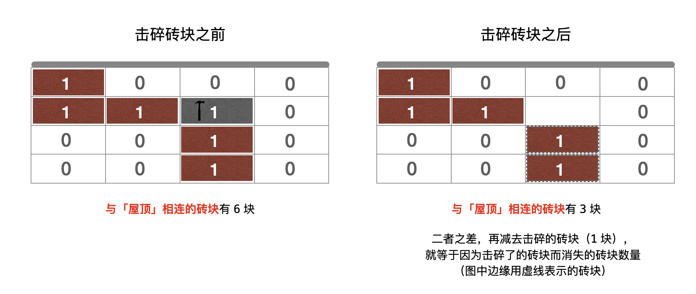
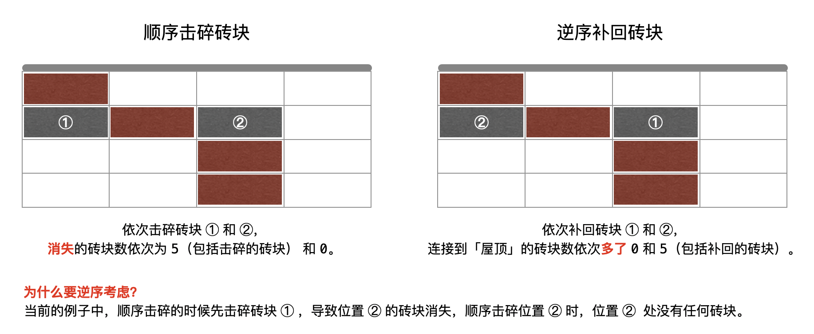
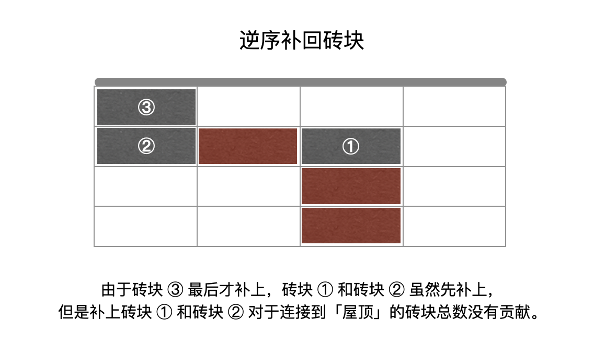
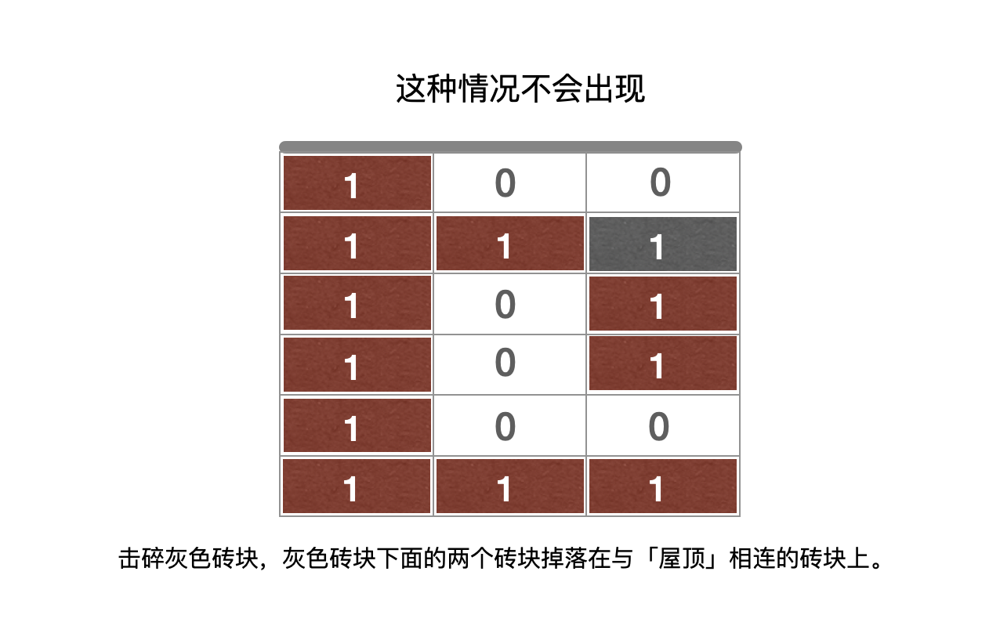

> 原文链接: https://leetcode-cn.com/problems/bricks-falling-when-hit


## 英文原文
<div><p>You are given an <code>m x n</code> binary <code>grid</code>, where each <code>1</code> represents a brick and <code>0</code> represents an empty space. A brick is <strong>stable</strong> if:</p>

<ul>
	<li>It is directly connected to the top of the grid, or</li>
	<li>At least one other brick in its four adjacent cells is <strong>stable</strong>.</li>
</ul>

<p>You are also given an array <code>hits</code>, which is a sequence of erasures we want to apply. Each time we want to erase the brick at the location <code>hits[i] = (row<sub>i</sub>, col<sub>i</sub>)</code>. The brick on that location&nbsp;(if it exists) will disappear. Some other bricks may no longer be stable because of that erasure and will <strong>fall</strong>. Once a brick falls, it is <strong>immediately</strong> erased from the <code>grid</code> (i.e., it does not land on other stable bricks).</p>

<p>Return <em>an array </em><code>result</code><em>, where each </em><code>result[i]</code><em> is the number of bricks that will <strong>fall</strong> after the </em><code>i<sup>th</sup></code><em> erasure is applied.</em></p>

<p><strong>Note</strong> that an erasure may refer to a location with no brick, and if it does, no bricks drop.</p>

<p>&nbsp;</p>
<p><strong>Example 1:</strong></p>

<pre>
<strong>Input:</strong> grid = [[1,0,0,0],[1,1,1,0]], hits = [[1,0]]
<strong>Output:</strong> [2]
<strong>Explanation: </strong>Starting with the grid:
[[1,0,0,0],
 [<u>1</u>,1,1,0]]
We erase the underlined brick at (1,0), resulting in the grid:
[[1,0,0,0],
 [0,<u>1</u>,<u>1</u>,0]]
The two underlined bricks are no longer stable as they are no longer connected to the top nor adjacent to another stable brick, so they will fall. The resulting grid is:
[[1,0,0,0],
 [0,0,0,0]]
Hence the result is [2].
</pre>

<p><strong>Example 2:</strong></p>

<pre>
<strong>Input:</strong> grid = [[1,0,0,0],[1,1,0,0]], hits = [[1,1],[1,0]]
<strong>Output:</strong> [0,0]
<strong>Explanation: </strong>Starting with the grid:
[[1,0,0,0],
 [1,<u>1</u>,0,0]]
We erase the underlined brick at (1,1), resulting in the grid:
[[1,0,0,0],
 [1,0,0,0]]
All remaining bricks are still stable, so no bricks fall. The grid remains the same:
[[1,0,0,0],
 [<u>1</u>,0,0,0]]
Next, we erase the underlined brick at (1,0), resulting in the grid:
[[1,0,0,0],
 [0,0,0,0]]
Once again, all remaining bricks are still stable, so no bricks fall.
Hence the result is [0,0].
</pre>

<p>&nbsp;</p>
<p><strong>Constraints:</strong></p>

<ul>
	<li><code>m == grid.length</code></li>
	<li><code>n == grid[i].length</code></li>
	<li><code>1 &lt;= m, n &lt;= 200</code></li>
	<li><code>grid[i][j]</code> is <code>0</code> or <code>1</code>.</li>
	<li><code>1 &lt;= hits.length &lt;= 4 * 10<sup>4</sup></code></li>
	<li><code>hits[i].length == 2</code></li>
	<li><code>0 &lt;= x<sub>i&nbsp;</sub>&lt;= m - 1</code></li>
	<li><code>0 &lt;=&nbsp;y<sub>i</sub> &lt;= n - 1</code></li>
	<li>All <code>(x<sub>i</sub>, y<sub>i</sub>)</code> are unique.</li>
</ul>
</div>

## 中文题目
<div><p>有一个 <code>m x n</code> 的二元网格，其中 <code>1</code> 表示砖块，<code>0</code> 表示空白。砖块 <strong>稳定</strong>（不会掉落）的前提是：</p>

<ul>
	<li>一块砖直接连接到网格的顶部，或者</li>
	<li>至少有一块相邻（4 个方向之一）砖块<strong> 稳定 </strong>不会掉落时</li>
</ul>

<p>给你一个数组 <code>hits</code> ，这是需要依次消除砖块的位置。每当消除 <code>hits[i] = (rowi, coli)</code> 位置上的砖块时，对应位置的砖块（若存在）会消失，然后其他的砖块可能因为这一消除操作而掉落。一旦砖块掉落，它会立即从网格中消失（即，它不会落在其他稳定的砖块上）。</p>

<p>返回一个数组 <code>result</code> ，其中 <code>result[i]</code> 表示第 <code>i</code> 次消除操作对应掉落的砖块数目。</p>

<p><strong>注意</strong>，消除可能指向是没有砖块的空白位置，如果发生这种情况，则没有砖块掉落。</p>

<p> </p>

<p><strong>示例 1：</strong></p>

<pre>
<strong>输入：</strong>grid = [[1,0,0,0],[1,1,1,0]], hits = [[1,0]]
<strong>输出：</strong>[2]
<strong>解释：</strong>
网格开始为：
[[1,0,0,0]，
 [<strong>1</strong>,1,1,0]]
消除 (1,0) 处加粗的砖块，得到网格：
[[1,0,0,0]
 [0,<strong>1</strong>,<strong>1</strong>,0]]
两个加粗的砖不再稳定，因为它们不再与顶部相连，也不再与另一个稳定的砖相邻，因此它们将掉落。得到网格：
[[1,0,0,0],
 [0,0,0,0]]
因此，结果为 [2] 。
</pre>

<p><strong>示例 2：</strong></p>

<pre>
<strong>输入：</strong>grid = [[1,0,0,0],[1,1,0,0]], hits = [[1,1],[1,0]]
<strong>输出：</strong>[0,0]
<strong>解释：</strong>
网格开始为：
[[1,0,0,0],
 [1,<strong>1</strong>,0,0]]
消除 (1,1) 处加粗的砖块，得到网格：
[[1,0,0,0],
 [1,0,0,0]]
剩下的砖都很稳定，所以不会掉落。网格保持不变：
[[1,0,0,0], 
 [<strong>1</strong>,0,0,0]]
接下来消除 (1,0) 处加粗的砖块，得到网格：
[[1,0,0,0],
 [0,0,0,0]]
剩下的砖块仍然是稳定的，所以不会有砖块掉落。
因此，结果为 [0,0] 。</pre>

<p> </p>

<p><strong>提示：</strong></p>

<ul>
	<li><code>m == grid.length</code></li>
	<li><code>n == grid[i].length</code></li>
	<li><code>1 <= m, n <= 200</code></li>
	<li><code>grid[i][j]</code> 为 <code>0</code> 或 <code>1</code></li>
	<li><code>1 <= hits.length <= 4 * 10<sup>4</sup></code></li>
	<li><code>hits[i].length == 2</code></li>
	<li><code>0 <= x<sub>i </sub><= m - 1</code></li>
	<li><code>0 <= y<sub>i</sub> <= n - 1</code></li>
	<li>所有 <code>(x<sub>i</sub>, y<sub>i</sub>)</code> 互不相同</li>
</ul>
</div>

## 通过代码
<RecoDemo>
</RecoDemo>


## 官方题解
### 📺 视频讲解 

> 力扣君温馨小贴士：觉得视频时间长的扣友，可以在视频右下角的「设置」按钮处选择 1.5 倍速或者 2 倍速观看。


### 📖 文字解析

> **阅读提示**：我们在文字描述中给出的 4 个图，覆盖了这个问题的几种特殊情况，包括了一般情况和特殊情况，还有不可能出现的情况。

#### 1. 解释题意

首先，**题解题意很重要**。不会掉落的「砖块」需要满足两个条件：

+ 「砖块」位于下标为 $0$ 的行；
+ 与下标为 $0$ 的行的砖块在上、下、左、右 $4$ 个方向上相连。

题目问按照数组 `hits` 中击落砖块的顺序，每一次有多少个砖块因为这个被击碎的砖块而消失。解题的时候须要注意以下两个条件（原因最后说）：

+ 一旦砖块掉落，它会立即从网格中消失（它不会落在其他稳定的砖块上）；
+ 所有的 $(x_i, y_i)$ 互不相同。


#### 2. 如何计算每次击碎砖块而消失的砖块的数量（关注「与屋顶相连的砖块的总数变化」）

和顶部相连的砖块不会掉落，击碎了一个砖块以后，可能会使得其它与 **被击碎砖块** 连接的砖块不再与顶部相连，然后它们消失。

「击碎砖块之前」与「击碎砖块之后」与 **屋顶** 相连的砖块数的差值，再减 $1$ 就是因为这一次操作而消失的砖块数。如下图所示：




#### 3. 如何想到并查集

+ 当前问题是一个图的连通性问题，砖块和砖块如果在 $4$ 个方向上相邻，表示这两个砖块上有一条边。砖块的相邻关系而产生的连接关系具有传递性；
+ 第 $0$ 行的砖块连接着「屋顶」；
+ 击碎了一个砖块以后，可能会使得其它与「被击碎砖块」 **连接** 的砖块不再与顶部相连，然后它们消失；
+ 题目只问结果，没有问具体连接的情况；
+ 连通的砖块个数是我们所关心的，「并查集」内部可以维护「以当前结点为根结点的子树的结点总数」。

#### 4. 如何使用并查集

+ 消除一个砖块的效果是：一个连通分量被分成了两个连通分量；
+ 并查集的作用是：把两个连通分量合并成一个连通分量。

提示我们这个问题需要 **反向** 思考。即考虑：**补上被击碎的砖块以后，有多少个砖块因为这个补上的这个砖块而与屋顶的砖块相连**。每一次击碎一个砖块，**因击碎砖块而消失的砖块只会越来越少**。因此可以按照数组 `hits` 的顺序 **逆序地** 把这些砖块依次补上。如图所示：




**当最后一块砖块补上的时候，就恰好可以恢复成刚开始的时候整个二维表格的样子**。


#### 5. 解题步骤

+ 根据数组 `hits`，将输入的表格 `grid` 里的对应位置全部设置为 $0$ ，这是因为我们要逆序补全出整个初始化的时候二维表格的砖块；
+ 从最后一个击碎的砖块开始，计算补上这个被击碎的砖块的时候，有多少个砖块因为这个补上的砖块而与屋顶相连，这个数目就是按照题目中的描述，击碎砖块以后掉落的砖块的数量。

下面我们介绍实现细节。

#### 6. 实现细节

+ 在并查集中设置一个特殊的结点，表示「屋顶」；
+ 逆序补回的时候，由于补回，增加的连接到「屋顶」的砖块数应该这样算：`res[i] = Math.max(0, current - origin - 1);` （`current` 和 `origin` 的含义请见代码）。因为有可能补回一个砖块前后，连接到「屋顶」的砖块总数没有变化，如下图所示：

{:width=500}


**参考代码**：

> 力扣君温馨小贴士：为了保证语义和层次清晰，我们加入了注释和空行，所以代码看起来有点长，但主要的逻辑就 3 步。我们建议大家先理解逻辑的先后顺序，尝试自己实现，然后再看代码的细节。


```Java []
public class Solution {

    private int rows;
    private int cols;

    public static final int[][] DIRECTIONS = {{0, 1}, {1, 0}, {-1, 0}, {0, -1}};

    public int[] hitBricks(int[][] grid, int[][] hits) {
        this.rows = grid.length;
        this.cols = grid[0].length;

        // 第 1 步：把 grid 中的砖头全部击碎，通常算法问题不能修改输入数据，这一步非必需，可以认为是一种答题规范
        int[][] copy = new int[rows][cols];
        for (int i = 0; i < rows; i++) {
            for (int j = 0; j < cols; j++) {
                copy[i][j] = grid[i][j];
            }
        }

        // 把 copy 中的砖头全部击碎
        for (int[] hit : hits) {
            copy[hit[0]][hit[1]] = 0;
        }

        // 第 2 步：建图，把砖块和砖块的连接关系输入并查集，size 表示二维网格的大小，也表示虚拟的「屋顶」在并查集中的编号
        int size = rows * cols;
        UnionFind unionFind = new UnionFind(size + 1);

        // 将下标为 0 的这一行的砖块与「屋顶」相连
        for (int j = 0; j < cols; j++) {
            if (copy[0][j] == 1) {
                unionFind.union(j, size);
            }
        }

        // 其余网格，如果是砖块向上、向左看一下，如果也是砖块，在并查集中进行合并
        for (int i = 1; i < rows; i++) {
            for (int j = 0; j < cols; j++) {
                if (copy[i][j] == 1) {
                    // 如果上方也是砖块
                    if (copy[i - 1][j] == 1) {
                        unionFind.union(getIndex(i - 1, j), getIndex(i, j));
                    }
                    // 如果左边也是砖块
                    if (j > 0 && copy[i][j - 1] == 1) {
                        unionFind.union(getIndex(i, j - 1), getIndex(i, j));
                    }
                }
            }
        }

        // 第 3 步：按照 hits 的逆序，在 copy 中补回砖块，把每一次因为补回砖块而与屋顶相连的砖块的增量记录到 res 数组中
        int hitsLen = hits.length;
        int[] res = new int[hitsLen];
        for (int i = hitsLen - 1; i >= 0; i--) {
            int x = hits[i][0];
            int y = hits[i][1];

            // 注意：这里不能用 copy，语义上表示，如果原来在 grid 中，这一块是空白，这一步不会产生任何砖块掉落
            // 逆向补回的时候，与屋顶相连的砖块数量也肯定不会增加
            if (grid[x][y] == 0) {
                continue;
            }

            // 补回之前与屋顶相连的砖块数
            int origin = unionFind.getSize(size);

            // 注意：如果补回的这个结点在第 1 行，要告诉并查集它与屋顶相连（逻辑同第 2 步）
            if (x == 0) {
                unionFind.union(y, size);
            }

            // 在 4 个方向上看一下，如果相邻的 4 个方向有砖块，合并它们
            for (int[] direction : DIRECTIONS) {
                int newX = x + direction[0];
                int newY = y + direction[1];

                if (inArea(newX, newY) && copy[newX][newY] == 1) {
                    unionFind.union(getIndex(x, y), getIndex(newX, newY));
                }
            }

            // 补回之后与屋顶相连的砖块数
            int current = unionFind.getSize(size);
            // 减去的 1 是逆向补回的砖块（正向移除的砖块），与 0 比较大小，是因为存在一种情况，添加当前砖块，不会使得与屋顶连接的砖块数更多
            res[i] = Math.max(0, current - origin - 1);

            // 真正补上这个砖块
            copy[x][y] = 1;
        }
        return res;
    }

    /**
     * 输入坐标在二维网格中是否越界
     *
     * @param x
     * @param y
     * @return
     */
    private boolean inArea(int x, int y) {
        return x >= 0 && x < rows && y >= 0 && y < cols;
    }

    /**
     * 二维坐标转换为一维坐标
     *
     * @param x
     * @param y
     * @return
     */
    private int getIndex(int x, int y) {
        return x * cols + y;
    }

    private class UnionFind {

        /**
         * 当前结点的父亲结点
         */
        private int[] parent;
        /**
         * 以当前结点为根结点的子树的结点总数
         */
        private int[] size;

        public UnionFind(int n) {
            parent = new int[n];
            size = new int[n];
            for (int i = 0; i < n; i++) {
                parent[i] = i;
                size[i] = 1;
            }
        }

        /**
         * 路径压缩，只要求每个不相交集合的「根结点」的子树包含的结点总数数值正确即可，因此在路径压缩的过程中不用维护数组 size
         *
         * @param x
         * @return
         */
        public int find(int x) {
            if (x != parent[x]) {
                parent[x] = find(parent[x]);
            }
            return parent[x];
        }

        public void union(int x, int y) {
            int rootX = find(x);
            int rootY = find(y);

            if (rootX == rootY) {
                return;
            }
            parent[rootX] = rootY;
            // 在合并的时候维护数组 size
            size[rootY] += size[rootX];
        }

        /**
         * @param x
         * @return x 在并查集的根结点的子树包含的结点总数
         */
        public int getSize(int x) {
            int root = find(x);
            return size[root];
        }
    }
}
```


**复杂度分析**

- 时间复杂度：$O((N + rows \cdot cols) \cdot \log(rows \cdot cols))$，其中 $N$ 为数组 $\textit{hits}$ 的长度，$rows$ 和 $cols$ 分别为矩阵的行数和列数，只使用了路径压缩，并查集的单次操作的时间复杂度为 $O(\log(rows \cdot cols))$；

- 空间复杂度：$O(rows \cdot cols)$。


#### 7. 解释开篇说的两个条件

+ 条件 1：一旦砖块掉落，它会立即从网格中消失（它不会落在其他稳定的砖块上），意思是下面的这种情况不会出现。

{:width=500}

+ 条件 2：所有的 $(x_i, y_i)$ 互不相同。如果 `hits` 数组里有相同的结点，**逆序把这些砖块补充回去以后，有可能出现以下情况**：
  + 不能拼接出初始化的时候整个二维表格；
  + 同一个位置的砖块敲击两次，逆序求解的时候，第 1 次补回去的时候，把结果记录 `res[i]`，第 2 次由于敲了同一个位置，在之前的 `res[i]` 这一步操作其实是无效的，应该恢复成 `0`。

如果没有这两个条件，求解这个问题会变得复杂。大家在做题的时候一定要注意题目中的限制，以免漏看条件或者加强了题目的条件。

---

这种逆向去考虑一个问题的思路其实在「力扣」上并不少见，感兴趣的朋友可以复习一下我们在打卡题中曾经做过的：[174. 地下城游戏](https://leetcode-cn.com/problems/dungeon-game/) 和 [312. 戳气球](https://leetcode-cn.com/problems/burst-balloons/)。

## 统计信息
| 通过次数 | 提交次数 | AC比率 |
| :------: | :------: | :------: |
|    12462    |    25938    |   48.0%   |

## 提交历史
| 提交时间 | 提交结果 | 执行时间 |  内存消耗  | 语言 |
| :------: | :------: | :------: | :--------: | :--------: |
