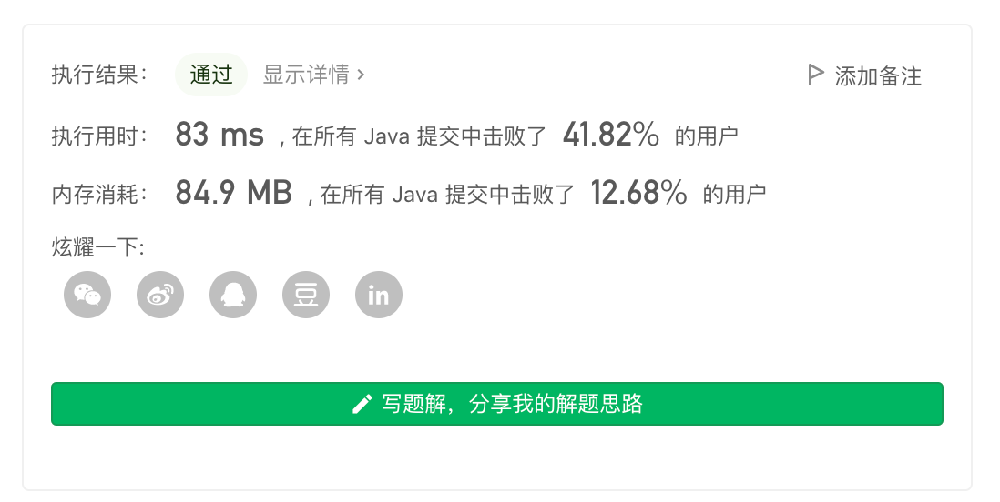

> 原文链接: https://leetcode-cn.com/problems/bus-routes


## 英文原文
<div><p>You are given an array <code>routes</code> representing bus routes where <code>routes[i]</code> is a bus route that the <code>i<sup>th</sup></code> bus repeats forever.</p>

<ul>
	<li>For example, if <code>routes[0] = [1, 5, 7]</code>, this means that the <code>0<sup>th</sup></code> bus travels in the sequence <code>1 -&gt; 5 -&gt; 7 -&gt; 1 -&gt; 5 -&gt; 7 -&gt; 1 -&gt; ...</code> forever.</li>
</ul>

<p>You will start at the bus stop <code>source</code> (You are not on any bus initially), and you want to go to the bus stop <code>target</code>. You can travel between bus stops by buses only.</p>

<p>Return <em>the least number of buses you must take to travel from </em><code>source</code><em> to </em><code>target</code>. Return <code>-1</code> if it is not possible.</p>

<p>&nbsp;</p>
<p><strong>Example 1:</strong></p>

<pre>
<strong>Input:</strong> routes = [[1,2,7],[3,6,7]], source = 1, target = 6
<strong>Output:</strong> 2
<strong>Explanation:</strong> The best strategy is take the first bus to the bus stop 7, then take the second bus to the bus stop 6.
</pre>

<p><strong>Example 2:</strong></p>

<pre>
<strong>Input:</strong> routes = [[7,12],[4,5,15],[6],[15,19],[9,12,13]], source = 15, target = 12
<strong>Output:</strong> -1
</pre>

<p>&nbsp;</p>
<p><strong>Constraints:</strong></p>

<ul>
	<li><code>1 &lt;= routes.length &lt;= 500</code>.</li>
	<li><code>1 &lt;= routes[i].length &lt;= 10<sup>5</sup></code></li>
	<li>All the values of <code>routes[i]</code> are <strong>unique</strong>.</li>
	<li><code>sum(routes[i].length) &lt;= 10<sup>5</sup></code></li>
	<li><code>0 &lt;= routes[i][j] &lt; 10<sup>6</sup></code></li>
	<li><code>0 &lt;= source, target &lt; 10<sup>6</sup></code></li>
</ul>
</div>

## 中文题目
<div><p>给你一个数组 <code>routes</code> ，表示一系列公交线路，其中每个 <code>routes[i]</code> 表示一条公交线路，第 <code>i</code> 辆公交车将会在上面循环行驶。</p>

<ul>
	<li>例如，路线 <code>routes[0] = [1, 5, 7]</code> 表示第 <code>0</code> 辆公交车会一直按序列 <code>1 -> 5 -> 7 -> 1 -> 5 -> 7 -> 1 -> ...</code> 这样的车站路线行驶。</li>
</ul>

<p>现在从 <code>source</code> 车站出发（初始时不在公交车上），要前往 <code>target</code> 车站。 期间仅可乘坐公交车。</p>

<p>求出 <strong>最少乘坐的公交车数量</strong> 。如果不可能到达终点车站，返回 <code>-1</code> 。</p>

<p> </p>

<p><strong>示例 1：</strong></p>

<pre>
<strong>输入：</strong>routes = [[1,2,7],[3,6,7]], source = 1, target = 6
<strong>输出：</strong>2
<strong>解释：</strong>最优策略是先乘坐第一辆公交车到达车站 7 , 然后换乘第二辆公交车到车站 6 。 
</pre>

<p><strong>示例 2：</strong></p>

<pre>
<strong>输入：</strong>routes = [[7,12],[4,5,15],[6],[15,19],[9,12,13]], source = 15, target = 12
<strong>输出：</strong>-1
</pre>

<p> </p>

<p><strong>提示：</strong></p>

<ul>
	<li><code>1 <= routes.length <= 500</code>.</li>
	<li><code>1 <= routes[i].length <= 10<sup>5</sup></code></li>
	<li><code>routes[i]</code> 中的所有值 <strong>互不相同</strong></li>
	<li><code>sum(routes[i].length) <= 10<sup>5</sup></code></li>
	<li><code>0 <= routes[i][j] < 10<sup>6</sup></code></li>
	<li><code>0 <= source, target < 10<sup>6</sup></code></li>
</ul>
</div>

## 通过代码
<RecoDemo>
</RecoDemo>


## 高赞题解
## 基本分析

为了方便，我们令每个公交站为一个「车站」，由一个「车站」可以进入一条或多条「路线」。

问题为从「起点车站」到「终点车站」，所进入的最少路线为多少。

抽象每个「路线」为一个点，当不同「路线」之间存在「公共车站」则为其增加一条边权为 $1$ 的无向边。

---

## 单向 BFS

由于是在边权为 $1$ 的图上求最短路，我们直接使用 `BFS` 即可。

起始时将「起点车站」所能进入的「路线」进行入队，每次从队列中取出「路线」时，查看该路线是否包含「终点车站」：

* 包含「终点车站」：返回进入该线路所花费的距离
* 不包含「终点车站」：遍历该路线所包含的车站，将由这些车站所能进入的路线，进行入队

一些细节：由于是求最短路，同一路线重复入队是没有意义的，因此将新路线入队前需要先判断是否曾经入队。



代码：
```Java []
class Solution {
    int s, t;
    int[][] rs;
    public int numBusesToDestination(int[][] _rs, int _s, int _t) {
        rs = _rs; s = _s; t = _t;
        if (s == t) return 0;
        int ans = bfs();
        return ans;
    }
    int bfs() {
        // 记录某个车站可以进入的路线
        Map<Integer, Set<Integer>> map = new HashMap<>();
        // 队列存的是经过的路线
        Deque<Integer> d = new ArrayDeque<>();
        // 哈希表记录的进入该路线所使用的距离
        Map<Integer, Integer> m = new HashMap<>();
        int n = rs.length;
        for (int i = 0; i < n; i++) {
            for (int station : rs[i]) {
                // 将从起点可以进入的路线加入队列
                if (station == s) {
                    d.addLast(i);
                    m.put(i, 1);
                }
                Set<Integer> set = map.getOrDefault(station, new HashSet<>());
                set.add(i);
                map.put(station, set);
            }
        }
        while (!d.isEmpty()) {
            // 取出当前所在的路线，与进入该路线所花费的距离
            int poll = d.pollFirst();
            int step = m.get(poll);

            // 遍历该路线所包含的车站
            for (int station : rs[poll]) {
                // 如果包含终点，返回进入该路线花费的距离即可
                if (station == t) return step;

                // 将由该线路的车站发起的路线，加入队列
                Set<Integer> lines = map.get(station);
                if (lines == null) continue;
                for (int nr : lines) {
                    if (!m.containsKey(nr)) {
                        m.put(nr, step + 1);
                        d.add(nr);
                    }
                }
            }
        }
        return -1;
    }
}
```
* 时间复杂度：令路线的数量为 $n$，车站的数量为 $m$。建图的时间复杂度为 $O(\sum_{i=0}^{n-1} len(rs[i]))$；`BFS` 部分每个路线只会入队一次，最坏情况下每个路线都包含所有车站，复杂度为 $O(n * m)$。整体复杂度为 $O(n * m + \sum_{i=0}^{n-1} len(rs[i]))$。
* 空间复杂度：$O(n * m)$

---

## 双向 BFS（并查集预处理无解情况）

另外一个做法是使用双向 `BFS`。

首先建图方式不变，将「起点」和「终点」所能进入的路线分别放入两个方向的队列，如果「遇到公共的路线」或者「当前路线包含了目标位置」，说明找到了最短路径。

另外我们知道，双向 `BFS` 在无解的情况下不如单向 `BFS`。因此我们可以先使用「并查集」进行预处理，判断「起点」和「终点」是否连通，如果不联通，直接返回 $-1$，有解才调用双向 `BFS`。

由于使用「并查集」预处理的复杂度与建图是近似的，增加这样的预处理并不会越过我们时空复杂度的上限，因此这样的预处理是有益的。一定程度上可以最大化双向 `BFS` 减少搜索空间的效益。


代码：
```Java []
class Solution {
    static int N = (int)1e6+10;
    static int[] p = new int[N];
    int find(int x) {
        if (p[x] != x) p[x] = find(p[x]);
        return p[x];
    }
    void union(int a, int b) {
        p[find(a)] = p[find(b)];
    }
    boolean query(int a, int b) {
        return find(a) == find(b);
    }
    int s, t;
    int[][] rs;
    public int numBusesToDestination(int[][] _rs, int _s, int _t) {
        rs = _rs; s = _s; t = _t;
        if (s == t) return 0;
        for (int i = 0; i < N; i++) p[i] = i;
        for (int[] r : rs) {
            for (int loc : r) {
                union(loc, r[0]);
            }
        }
        if (!query(s, t)) return -1;
        int ans = bfs();
        return ans;
    }
    // 记录某个车站可以进入的路线
    Map<Integer, Set<Integer>> map = new HashMap<>();
    int bfs() {
        Deque<Integer> d1 = new ArrayDeque<>(), d2 = new ArrayDeque<>();
        Map<Integer, Integer> m1 = new HashMap<>(), m2 = new HashMap<>();
        
        int n = rs.length;
        for (int i = 0; i < n; i++) {
            for (int station : rs[i]) {
                // 将从起点可以进入的路线加入正向队列
                if (station == s) {
                    d1.addLast(i);
                    m1.put(i, 1);
                }
                // 将从终点可以进入的路线加入反向队列
                if (station == t) {
                    d2.addLast(i);
                    m2.put(i, 1);
                }
                Set<Integer> set = map.getOrDefault(station, new HashSet<>());
                set.add(i);
                map.put(station, set);
            }
        }

        // 如果「起点所发起的路线」和「终点所发起的路线」有交集，直接返回 1
        Set<Integer> s1 = map.get(s), s2 = map.get(t);
        Set<Integer> tot = new HashSet<>();
        tot.addAll(s1);
        tot.retainAll(s2);
        if (!tot.isEmpty()) return 1;

        // 双向 BFS
        while (!d1.isEmpty() && !d2.isEmpty()) {
            int res = -1;
            if (d1.size() <= d2.size()) {
                res = update(d1, m1, m2);
            } else {
                res = update(d2, m2, m1);
            }
            if (res != -1) return res;
        }

        return 0x3f3f3f3f; // never
    }
    int update(Deque<Integer> d, Map<Integer, Integer> cur, Map<Integer, Integer> other) {
        // 取出当前所在的路线，与进入该路线所花费的距离
        int poll = d.pollFirst();
        int step = cur.get(poll);

        // 遍历该路线所包含的车站
        for (int station : rs[poll]) {
            // 遍历将由该线路的车站发起的路线
            Set<Integer> lines = map.get(station);
            if (lines == null) continue;
            for (int nr : lines) {
                if (cur.containsKey(nr)) continue;
                if (other.containsKey(nr)) return step + other.get(nr);
                cur.put(nr, step + 1);
                d.add(nr);
            }
        }

        return -1;
    }
}
```
* 时间复杂度：令路线的数量为 $n$，车站的个数为 $m$。并查集和建图的时间复杂度为 $O(\sum_{i=0}^{n-1} len(rs[i]))$；`BFS` 求最短路径的复杂度为 $O(n * m)$。整体复杂度为 $O(n * m + \sum_{i=0}^{n-1} len(rs[i]))$。
* 空间复杂度：$O(n * m + \sum_{i=0}^{n-1} len(rs[i]))$


---

## 最后

**如果有帮助到你，请给题解点个赞和收藏，让更多的人看到 ~ ("▔□▔)/**

也欢迎你 [关注我](https://oscimg.oschina.net/oscnet/up-19688dc1af05cf8bdea43b2a863038ab9e5.png) 和 加入我们的[「组队打卡」](https://leetcode-cn.com/u/ac_oier/)小群 ，提供写「证明」&「思路」的高质量题解。

所有题解已经加入 [刷题指南](https://github.com/SharingSource/LogicStack-LeetCode/wiki)，欢迎 star 哦 ~ 

## 统计信息
| 通过次数 | 提交次数 | AC比率 |
| :------: | :------: | :------: |
|    27472    |    63424    |   43.3%   |

## 提交历史
| 提交时间 | 提交结果 | 执行时间 |  内存消耗  | 语言 |
| :------: | :------: | :------: | :--------: | :--------: |
