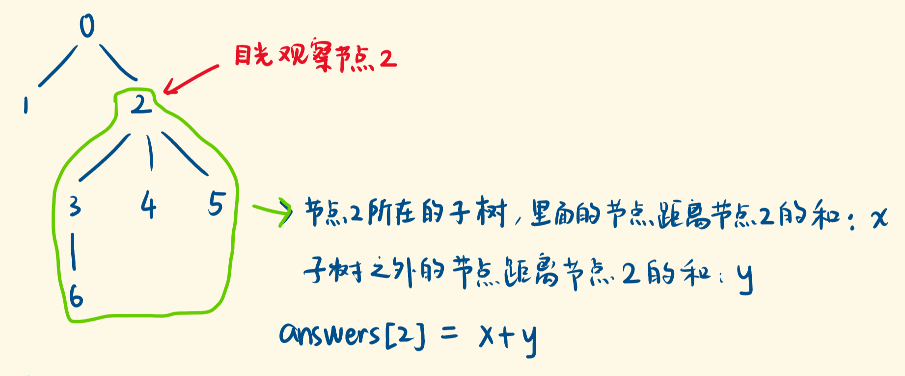
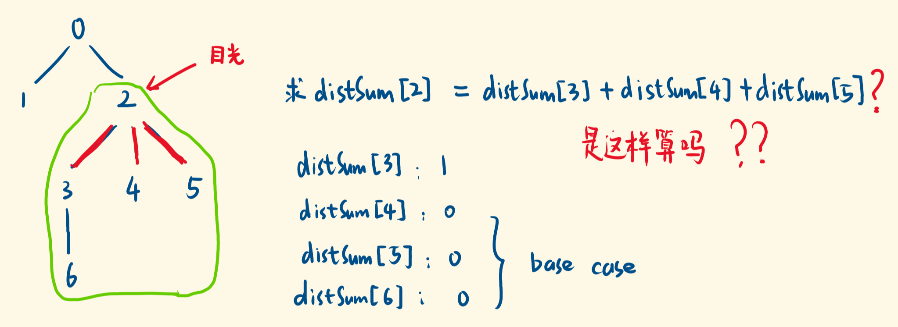
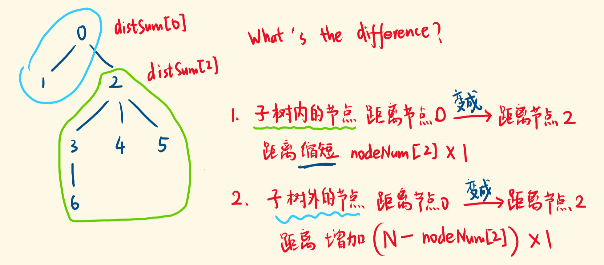

> 原文链接: https://leetcode-cn.com/problems/sum-of-distances-in-tree


## 英文原文
<div><p>There is an undirected connected tree with <code>n</code> nodes labeled from <code>0</code> to <code>n - 1</code> and <code>n - 1</code> edges.</p>

<p>You are given the integer <code>n</code> and the array <code>edges</code> where <code>edges[i] = [a<sub>i</sub>, b<sub>i</sub>]</code> indicates that there is an edge between nodes <code>a<sub>i</sub></code> and <code>b<sub>i</sub></code> in the tree.</p>

<p>Return an array <code>answer</code> of length <code>n</code> where <code>answer[i]</code> is the sum of the distances between the <code>i<sup>th</sup></code> node in the tree and all other nodes.</p>

<p>&nbsp;</p>
<p><strong>Example 1:</strong></p>

<pre>
<strong>Input:</strong> n = 6, edges = [[0,1],[0,2],[2,3],[2,4],[2,5]]
<strong>Output:</strong> [8,12,6,10,10,10]
<strong>Explanation:</strong> The tree is shown above.
We can see that dist(0,1) + dist(0,2) + dist(0,3) + dist(0,4) + dist(0,5)
equals 1 + 1 + 2 + 2 + 2 = 8.
Hence, answer[0] = 8, and so on.
</pre>

<p><strong>Example 2:</strong></p>

<pre>
<strong>Input:</strong> n = 1, edges = []
<strong>Output:</strong> [0]
</pre>

<p><strong>Example 3:</strong></p>

<pre>
<strong>Input:</strong> n = 2, edges = [[1,0]]
<strong>Output:</strong> [1,1]
</pre>

<p>&nbsp;</p>
<p><strong>Constraints:</strong></p>

<ul>
	<li><code>1 &lt;= n &lt;= 3 * 10<sup>4</sup></code></li>
	<li><code>edges.length == n - 1</code></li>
	<li><code>edges[i].length == 2</code></li>
	<li><code>0 &lt;= a<sub>i</sub>, b<sub>i</sub> &lt; n</code></li>
	<li><code>a<sub>i</sub> != b<sub>i</sub></code></li>
	<li>The given input represents a valid tree.</li>
</ul>
</div>

## 中文题目
<div><p>给定一个无向、连通的树。树中有 <code>N</code> 个标记为 <code>0...N-1</code> 的节点以及 <code>N-1</code>&nbsp;条边&nbsp;。</p>

<p>第 <code>i</code> 条边连接节点&nbsp;<code>edges[i][0]</code> 和 <code>edges[i][1]</code>&nbsp;。</p>

<p>返回一个表示节点 <code>i</code> 与其他所有节点距离之和的列表 <code>ans</code>。</p>

<p><strong>示例 1:</strong></p>

<pre>
<strong>输入: </strong>N = 6, edges = [[0,1],[0,2],[2,3],[2,4],[2,5]]
<strong>输出: </strong>[8,12,6,10,10,10]
<strong>解释: </strong>
如下为给定的树的示意图：
  0
 / \
1   2
   /|\
  3 4 5

我们可以计算出 dist(0,1) + dist(0,2) + dist(0,3) + dist(0,4) + dist(0,5) 
也就是 1 + 1 + 2 + 2 + 2 = 8。 因此，answer[0] = 8，以此类推。
</pre>

<p><strong>说明:</strong>&nbsp;<code>1 &lt;= N &lt;= 10000</code></p>
</div>

## 通过代码
<RecoDemo>
</RecoDemo>


## 高赞题解
#### 思路




如上图，其他节点与节点 2 的距离之和，可**分为两部分**：

1. 节点 2 所在的子树中的节点，与它的距离和。

2. 节点 2 所在的子树之外的节点，与它的距离和。


前者是一个子树内部的问题，可以寻求递归解决——定义`distSum[i]`：以节点`i`为根节点的子树中的节点，到节点`i`的距离和。





如上图，`distSum[2]`不是它的子节点的`distSum`简单相加，还要算上走红色路径的次数。


节点 2 到子树 3 中的节点，要走两次红色路径，因为子树 3 有两个节点。

节点 2 到子树 4 中的节点，要走一次红色路径，因为子树 4 有一个节点。

……


因此还要计算每个子树的节点个数`nodeNum[i]`。写出递归公式：


$$nodeNum[root] = ∑(nodeNum[child])+1$$

$$distSum[root] = ∑(nodeNum[child] + distSum[child])$$


递归到底部就遇到结果已知的case，随着递归的出栈，结果向上返回，就求出了每个子树的`distSum`。


底部的 base case 就是叶子节点，显然，我们需要遍历当前 root 节点的所有邻居，如果它的邻居只有它的父亲，说明它是叶子节点：`nodeNum`为 1，`distSum`为 0。


要想遍历所有的邻居，需要先构建邻接关系表：


```js

const graph = new Array(N);

for (let i = 0; i < graph.length; i++) {

    graph[i] = [];

}

for (const edge of edges) {

    const [from, to] = edge;

    graph[from].push(to);

    graph[to].push(from);

}

```

先递归压栈压到底，遇到base case，自底而上，由小子树的结果，算出大子树的结果：

```js

const postOrder = (root, parent) => {

    const neighbors = graph[root]; // 与它相连的节点们

    for (const neighbor of neighbors) {

        if (neighbor == parent) {  // 如果邻居是自己父亲，跳过。

            continue;              // 如果邻居只有自己父亲，则for循环结束，当前递归结束  

        }

        postOrder(neighbor, root); // 压栈压到底

        nodeNum[root] += nodeNum[neighbor]; // 两个递归公式

        distSum[root] += nodeNum[neighbor] + distSum[neighbor];

    }

};

```


#### ------------------------------------------ 分隔符 -------------------------------------------------

节点的`distSum`，还要加上**子树外的节点**到它的距离和，才是最后的结果。


**后者怎么求？不好求。 需要求吗？其实不需要。**


对整个树的根节点，它的`distSum`已经是对的，它的子树就是整棵树，没有子树之外的节点。


我们利用这个正确的`distSum`，自顶向下推算出它下面节点的真正`distSum`。





如图，节点`2`所在的子树的节点个数为`nodeNum[2]`，从计算`distSum[0]`变成计算`distSum[2]`：从节点 0 到这`nodeNum[2]`个节点，变成从节点 2 到这`nodeNum[2]`个节点，每个节点都少走了一步，一共少走`nodeNum[2]`步。


子树以外的节点呢，有`N-nodeNum[2]`个，从计算`distSum[0]`变成计算`distSum[2]`：从节点 0 到这`N-nodeNum[2]`个，变成从节点 2 到这`N-nodeNum[2]`个，每个节点都多走了一步，一共多走了`N-nodeNum[2]`步。


因此子节点`distSum[i]`与父节点`distSum[root]`之间的递推关系：


$$distSum[i] = distSum[root] - nodeNum[i] + (N - nodeNum[i])$$


从上往下计算，不是等到遇到底部的 base case 再计算。而是，在递归当前节点的子树之前，就更新当前节点的`distSum`，使之正确，然后用正确的`distSum`，递推出子节点的 `distSum`。


因此先处理当前节点（做计算），再递归压栈，即前序遍历：


```js

const preOrder = (root, parent) => {

    const neighbors = graph[root];

    for (const neighbor of neighbors) {

      if (neighbor == parent) {

        continue;

      }

      distSum[neighbor] = distSum[root] - nodeNum[neighbor] + (N - nodeNum[neighbor]);

      preOrder(neighbor, root);

    }

  };

```


可见，我们用了两次 DFS，前者计算出每个子树的`nodeNum`和`distSum`，后者计算出真正的`distSum`（每个节点与「其他所有节点」的距离和），注意二者的区别。

#### 最终代码

```js

const sumOfDistancesInTree = (N, edges) => {

  // 建立映射表，graph[i]：存放节点i 和 与它相连的所有节点

  const graph = new Array(N);

  for (let i = 0; i < graph.length; i++) {

    graph[i] = [];

  }

  for (const edge of edges) {

    const [from, to] = edge;

    graph[from].push(to);

    graph[to].push(from);

  }


  // distSum[i]：节点i到它所在子树的节点的距离和，后面更新为：节点i到其他所有节点的距离和

  const distSum = new Array(N).fill(0);

  // nodeNum[i]：节点i所在子树的节点个数，保底为1

  const nodeNum = new Array(N).fill(1);


  const postOrder = (root, parent) => {

    const neighbors = graph[root]; // 与它相连的节点们

    for (const neighbor of neighbors) {

      if (neighbor == parent) {    // 如果邻居是自己父亲，跳过。

        continue;                  // 如果邻居只有自己父亲，则for循环结束，当前递归结束  

      }

      postOrder(neighbor, root);   // 先压栈压到base case，再进行计算

      nodeNum[root] += nodeNum[neighbor]; // 累加计算当前root子树的节点个数

      distSum[root] += nodeNum[neighbor] + distSum[neighbor]; // 累加计算到子树中节点的距离和

    }

  };


  const preOrder = (root, parent) => {

    const neighbors = graph[root]; // 获取当前root节点的邻居

    for (const neighbor of neighbors) { // 遍历邻居

      if (neighbor == parent) {   // 如果邻居是它的父亲，跳过

        continue;                 // 如果邻居只有自己父亲，则for循环结束，当前递归结束

      }

      // 自顶而下 更新子节点们的真正的distSum

      distSum[neighbor] = distSum[root] - nodeNum[neighbor] + (N - nodeNum[neighbor]);

      // 先拿到正确的distSum，再递归压栈（进入子树求更多的distSum）

      preOrder(neighbor, root);

    }

  };


  postOrder(0, -1); // dfs的入口。因为N>=1，节点0肯定存在，就从节点0开始搜

  preOrder(0, -1);

  return distSum;

};

```

#### 复盘总结

我们复用了`distSum`数组。它先是代表：节点到它所在子树的节点的距离和。后来代表：节点到其他所有节点的距离和。


当然也可以开辟新的容器去存，毕竟有着不同的定义。但多花了点内存。


本题的突破口依然是：关注当前子树，递归解决，将目标拆分为两部分：

1. 子树内的节点与 root 的距离和

2. 子树外的节点与 root 的距离和


用递归求解前者，后者不用特地求，因为有一个已知的正确的`distSum`，找出递推关系，从上往下递推出每个节点真正的`distSum`，就像沿着一棵树在填表，这就是树形DP。


怎么确定**父子节点**`distSum`之间的递推关系？


通过比较二者的差别——节点还是这么些个节点，变的部分是什么？一部分多走了一段，剩下部分少走了一段，而且与`nodeSum`相关，而`nodeSum`在第一次 dfs 已求得。


我们其实用后序遍历、前序遍历填了三张 DP table：`nodeNum`,`innerDistSum`,`allDistSum`，三个 DP 状态。


使用后序和前序的原因前面有解释，这也是一个值得思考的点。

#### 感谢阅读，点赞更棒。希望我的真诚表述足够清晰，没有一句废话，让你不带着疑惑离开。

最后修改于：2021-10-14

## 统计信息
| 通过次数 | 提交次数 | AC比率 |
| :------: | :------: | :------: |
|    13638    |    25856    |   52.7%   |

## 提交历史
| 提交时间 | 提交结果 | 执行时间 |  内存消耗  | 语言 |
| :------: | :------: | :------: | :--------: | :--------: |


## 相似题目
|                             题目                             | 难度 |
| :----------------------------------------------------------: | :---------: |
| [在二叉树中分配硬币](https://leetcode-cn.com/problems/distribute-coins-in-binary-tree/) | 中等|
