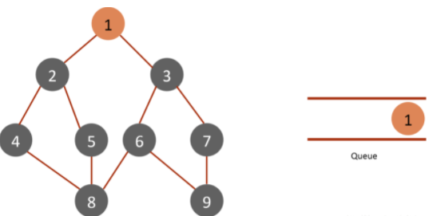
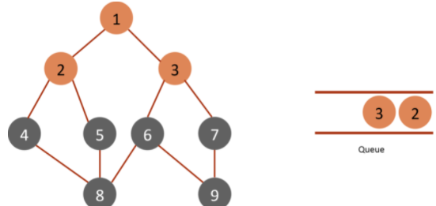
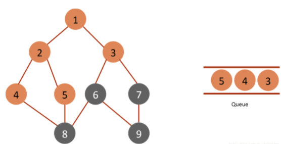
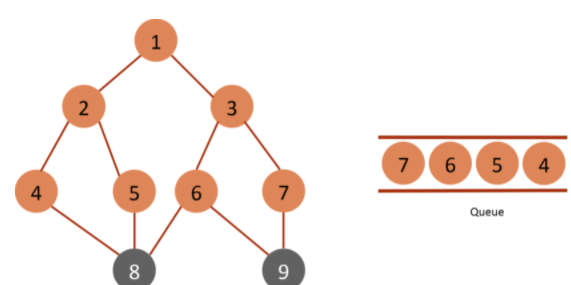
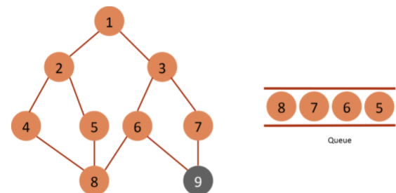

> 原文链接: https://leetcode-cn.com/problems/shortest-path-visiting-all-nodes


## 英文原文
<div><p>You have an undirected, connected graph of <code>n</code> nodes labeled from <code>0</code> to <code>n - 1</code>. You are given an array <code>graph</code> where <code>graph[i]</code> is a list of all the nodes connected with node <code>i</code> by an edge.</p>

<p>Return <em>the length of the shortest path that visits every node</em>. You may start and stop at any node, you may revisit nodes multiple times, and you may reuse edges.</p>

<p>&nbsp;</p>
<p><strong>Example 1:</strong></p>

<pre>
<strong>Input:</strong> graph = [[1,2,3],[0],[0],[0]]
<strong>Output:</strong> 4
<strong>Explanation:</strong> One possible path is [1,0,2,0,3]
</pre>

<p><strong>Example 2:</strong></p>

<pre>
<strong>Input:</strong> graph = [[1],[0,2,4],[1,3,4],[2],[1,2]]
<strong>Output:</strong> 4
<strong>Explanation:</strong> One possible path is [0,1,4,2,3]
</pre>

<p>&nbsp;</p>
<p><strong>Constraints:</strong></p>

<ul>
	<li><code>n == graph.length</code></li>
	<li><code>1 &lt;= n &lt;= 12</code></li>
	<li><code>0 &lt;= graph[i].length &lt;&nbsp;n</code></li>
	<li><code>graph[i]</code> does not contain <code>i</code>.</li>
	<li>If <code>graph[a]</code> contains <code>b</code>, then <code>graph[b]</code> contains <code>a</code>.</li>
	<li>The input graph is always connected.</li>
</ul>
</div>

## 中文题目
<div><p>存在一个由 <code>n</code> 个节点组成的无向连通图，图中的节点按从 <code>0</code> 到 <code>n - 1</code> 编号。</p>

<p>给你一个数组 <code>graph</code> 表示这个图。其中，<code>graph[i]</code> 是一个列表，由所有与节点 <code>i</code> 直接相连的节点组成。</p>

<p>返回能够访问所有节点的最短路径的长度。你可以在任一节点开始和停止，也可以多次重访节点，并且可以重用边。</p>

<p>&nbsp;</p>

<ol>
</ol>

<p><strong>示例 1：</strong></p>

<pre>
<strong>输入：</strong>graph = [[1,2,3],[0],[0],[0]]
<strong>输出：</strong>4
<strong>解释：</strong>一种可能的路径为 [1,0,2,0,3]</pre>

<p><strong>示例 2：</strong></p>

<p></p>

<pre>
<strong>输入：</strong>graph = [[1],[0,2,4],[1,3,4],[2],[1,2]]
<strong>输出：</strong>4
<strong>解释：</strong>一种可能的路径为 [0,1,4,2,3]
</pre>

<p>&nbsp;</p>

<p><strong>提示：</strong></p>

<ul>
	<li><code>n == graph.length</code></li>
	<li><code>1 &lt;= n &lt;= 12</code></li>
	<li><code>0 &lt;= graph[i].length &lt;&nbsp;n</code></li>
	<li><code>graph[i]</code> 不包含 <code>i</code></li>
	<li>如果 <code>graph[a]</code> 包含 <code>b</code> ，那么 <code>graph[b]</code> 也包含 <code>a</code></li>
	<li>输入的图总是连通图</li>
</ul>
</div>

## 通过代码
<RecoDemo>
</RecoDemo>


## 高赞题解
本题解共分为 $5$ 个部分，大家可根据自身情况选择性阅读：

1. 旅行商问题的一般形式（简要介绍，可跳过）
2. 广度优先搜索的原理，以及本题为什么可以用广度优先搜索（已经掌握 `BFS` 的朋友可以跳过）
2. 为什么要利用状态压缩，以及状态压缩是什么？（已经掌握基本状压的朋友可以跳过）
3. 基于状态压缩的广度优先搜索算法
4. 代码

---
### 1. 旅行商问题的一般形式
旅行商问题（TSP）：给定一系列城市和每对城市之间的距离，求解**访问每一座城市一次并回到起始城市的最短回路**。从图论的角度来看，该问题实质是在一个带权完全无向图中，找一个权值最小的哈密顿回路。

本题是一道类似旅行商问题，区别在于：可以重复访问某些节点，且在遍历完最后一个节点后不用回到出发点。

---

### 2. 广度优先搜索的原理，以及本题为什么可以用广度优先搜索

广度优先搜索（简称 `BFS`）算法是一种盲目搜索算法，目的是系统地检查图中所有节点，直到找到结果为止。由于广度优先搜索的扩展原则是**先生成的节点先扩展**，所以可以求得最短路径。一般而言，利用一个队列 `queue` 来存储当前已经生成的节点，每次弹出队头元素进行下一步扩展。我们看一个例子：

>例子：在以下图中寻找值为 $8$ 的节点



我们首先将起点放入队列，这是第一个生成的节点。



**开始第一轮循环，本轮队列中仅 $1$ 个元素。**

弹出队头元素 $1$，扩展，生成了 $2, 3$ 两个节点，均放入队列。

**队列中 $1$ 个元素扩展完成，本次循环结束。开始新一轮循环，本轮队列中有 $2$ 个元素**



弹出队头元素 $2$（因为上一轮先扩展的 $2$），扩展，生成了 $4, 5$ 两个节点，放入队列。



弹出队头元素 $3$，扩展生成 $6, 7$，放入队列。
**队列中 $2$ 个元素扩展完成，本次循环结束。开始新一轮循环，本轮队列中有 $4$ 个元素**



弹出队头元素 $4$，扩展生成 $8$，找到了答案，当前处在第 $3$ 轮循环，所以最短路径为 $3$。**此时本轮仍有 $3$ 个元素未被扩展，但因为已经找到了答案，所以直接退出搜索。**

---

但是 `BFS` 算法扩展的前提是，每个节点可以以任意顺序扩展，也即一个节点与所有它可以扩展的节点距离都相同。对于本题而言，需要求最短路径，且任意两个节点之间距离均为 $1$，所以可以使用 `BFS` 算法。

特别地，根据上述例子，我们需要每次记录本轮循环队列中的节点数量，以便最终判定最短路径长度；另一方面，对于已生成的节点，我们需要标记，防止重复被生成。**一般而言，为了写代码时更加方便直观，我们在扩展过程中不判断是否找到了答案，而是每次弹出队头元素时进行判断。**所以一般的 `BFS` 代码框架如下：

```C++ []
// 1.初始化队列及标记数组，存入起点
queue<int> q;
vector<bool> vis(n);

q.push(begin_node); // 存入起点，标记
vis[begin_node] = true;

// 2.开始搜索
while(1) {
    int cnt = q.size(); // 本轮需要扩展的节点个数
    if(cnt == 0) break; // 队列中已经没有元素，说明全部节点已经被扩展，退出
    
    // 3.本轮循环
    while(cnt--) {
        int cur = q.front(); // 弹出队头元素
        q.pop();

        // 找到答案，退出搜索
        if(cur == target) break;
        
        action(cur); //有些题目需要对当前元素做处理

        for(int x : cur.children) {
            if(!vis[x]) {
                q.push(x);
                vis[x] = true;
            }
        }
    }

    if(cnt != 0) {
        // 说明本轮未被扩展完，说明找到了目标元素，直接退出搜索
        break;
    }
}
```

当然，我们也可以将当前扩展的距离作为一个变量一起存入队列：

```C++ []
// 1.初始化队列及标记数组，存入起点
queue<pair<int, int>> q;
vector<bool> vis(n);

q.push({begin_node, 0}); // 存入起点，起始距离0，标记
vis[begin_node] = true;

// 2.开始搜索
while(!q.empty()) {
    auto [cur, dist] = q.front(); // 弹出队头元素
    q.pop();

    // 找到答案，返回结果
    if(cur == target) return dist;
    
    action(cur); //有些题目需要对当前元素做处理

    for(int x : cur.children) {
        if(!vis[x]) {
            q.push({x, dist + 1});
            vis[x] = true;
        }
    }
}
```

---

### 3. 为什么要利用状态压缩，以及状态压缩是什么？
本题与一般的图论题目不同的是，需要遍历完图内全部节点，且可以重复访问某些节点。所以我们需要在搜索过程中，**记录当前已经遍历了哪些节点**。如果我们利用数组来存储每个节点的状态，在传参时较为不方便，效率不高。本题数据范围 $n \leq 12$，说明可以利用状态压缩。

状态压缩也即用一个变量来表示当前状态，比较常用的方式是利用一个 $n$ 位 $k$ 进制数 $mask$ 表示当前 $n$ 个节点的所处的 $k$ 个不同状态。对于本题而言，某个节点只需要记录是否遍历过，所以利用二进制即可，由于本题数据范围 $n \leq 12$，所以不会超过 `int` 型范围。

一般而言，$mask$ 从低到高第 $i$ 位为 $0$ 表示第 $i$ 个节点还未被访问过，为 $1$ 则相反。例如，假设有 $3$ 个点，点 $1$ 遍历过，点 $2, 3$ 未遍历，则 $mask = (001)_2$；若点 $3$ 遍历过，点 $1,2$ 未遍历，则 $mask = (100)_2$。特别地，三个点均未遍历时，$mask = (000)_2 = 0$，均遍历过时，$mask = (111)_2 = 2^k - 1$

一些状态压缩的基本操作如下：

（1）访问第 $i$ 个点的状态：`state=(1 << i) & mask`
（2）更改第 $i$ 个点状态为 $1$：`mask = mask | (1 << i)`

---

### 4. 基于状态压缩的广度优先搜索算法

根据之前的介绍，本题可以通过广度优先搜索算法对图中节点进行扩展，并利用状态压缩记录节点的遍历情况。具体实现细节如下：

- `BFS` 参数：当前节点编号 `idx`，当前搜索状态 $mask$，当前扩展距离 `dist`
- `BFS` 起点：题目不限制起点，所以最开始可以将**每个点都存入队列**，对应状态为**仅该点遍历**。例如图中有 $2$ 个点时，我们分别将 第一个点及其对应的 $mask = (01)_2$，第二个点和其对应的 $mask = (10)_2$ 存入。
- `BFS` 终点：最终要求所有点均遍历，所以当 $mask = 2^n - 1$ 时搜索结束。
- `BFS` 标记： 尽管本题可以重复访问某些节点，但是在同一状态下重复访问某一节点必然是无用功。所以在实现时，利用一个二维标记数组记录某一状态下，某一节点的拓展情况，防止被重复扩展。

---
### 5. 代码
```C++ []
class Solution {
public:
    int shortestPathLength(vector<vector<int>>& graph) {
        int n = graph.size();

        // 1.初始化队列及标记数组，存入起点
        queue< tuple<int, int, int> > q; // 三个属性分别为 idx, mask, dist
        vector<vector<bool>> vis(n, vector<bool>(1 << n)); // 节点编号及当前状态
        for(int i = 0; i < n; i++) {
            q.push({i, 1 << i, 0}); // 存入起点，起始距离0，标记
            vis[i][1 << i] = true;
        }

        // 开始搜索
        while(!q.empty()) {
            auto [cur, mask, dist] = q.front(); // 弹出队头元素
            q.pop();

            // 找到答案，返回结果
            if(mask == (1 << n) - 1) return dist;

            // 扩展
            for(int x : graph[cur]) {
                int nextmask = mask | (1 << x);
                if(!vis[x][nextmask]) {
                    q.push({x, nextmask, dist + 1});
                    vis[x][nextmask] = true;
                }
            }
        }
        return 0;
    }
};
```
```Java []
class Solution {
    public int shortestPathLength(int[][] graph) {
        int n = graph.length;

        // 1.初始化队列及标记数组，存入起点
        Queue<int[]> queue = new LinkedList<int[]>(); // 三个属性分别为 idx, mask, dist
        boolean[][] vis = new boolean[n][1 << n]; // 节点编号及当前状态
        for (int i = 0; i < n; i++) {
            queue.offer(new int[]{i, 1 << i, 0}); // 存入起点，起始距离0，标记
            vis[i][1 << i] = true;
        }

        // 开始搜索
        while (!queue.isEmpty()) {
            int[] tuple = queue.poll(); // 弹出队头元素
            int idx = tuple[0], mask = tuple[1], dist = tuple[2];

            // 找到答案，返回结果
            if (mask == (1 << n) - 1) return dist;
            
            // 扩展
            for (int x : graph[idx]) {
                int next_mask = mask | (1 << x);
                if (!vis[x][next_mask]) {
                    queue.offer(new int[]{x, next_mask, dist + 1});
                    vis[x][next_mask] = true;
                }
            }
        }
        return 0;
    }
}
```
```Python3 []
class Solution:
    def shortestPathLength(self, graph: List[List[int]]) -> int:
        n = len(graph)

        # 1.初始化队列及标记数组，存入起点
        q = deque((i, 1 << i, 0) for i in range(n)) # 三个属性分别为 idx, mask, dist；存入起点，起始距离0，标记
        vis = {(i, 1 << i) for i in range(n)} # 节点编号及当前状态
        
        # 开始搜索
        while q:
            u, mask, dist = q.popleft() # 弹出队头元素
            if mask == (1 << n) - 1: # 找到答案，返回结果
                return dist
            # 扩展
            for x in graph[u]:
                nextmask = mask | (1 << x)
                if (x, nextmask) not in vis:
                    q.append((x, nextmask, dist + 1))
                    vis.add((x, nextmask))
        
        return 0
```


- 时间复杂度：$O(n^2*2^n)$

## 统计信息
| 通过次数 | 提交次数 | AC比率 |
| :------: | :------: | :------: |
|    19082    |    28103    |   67.9%   |

## 提交历史
| 提交时间 | 提交结果 | 执行时间 |  内存消耗  | 语言 |
| :------: | :------: | :------: | :--------: | :--------: |
