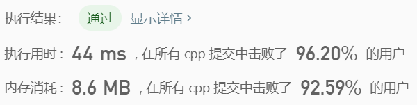

> 原文链接: https://leetcode-cn.com/problems/triples-with-bitwise-and-equal-to-zero


## 英文原文
<div><p>Given an integer array nums, return <em>the number of <strong>AND triples</strong></em>.</p>

<p>An <strong>AND triple</strong> is a triple of indices <code>(i, j, k)</code> such that:</p>

<ul>
	<li><code>0 &lt;= i &lt; nums.length</code></li>
	<li><code>0 &lt;= j &lt; nums.length</code></li>
	<li><code>0 &lt;= k &lt; nums.length</code></li>
	<li><code>nums[i] &amp; nums[j] &amp; nums[k] == 0</code>, where <code>&amp;</code> represents the bitwise-AND operator.</li>
</ul>

<p>&nbsp;</p>
<p><strong>Example 1:</strong></p>

<pre>
<strong>Input:</strong> nums = [2,1,3]
<strong>Output:</strong> 12
<strong>Explanation:</strong> We could choose the following i, j, k triples:
(i=0, j=0, k=1) : 2 &amp; 2 &amp; 1
(i=0, j=1, k=0) : 2 &amp; 1 &amp; 2
(i=0, j=1, k=1) : 2 &amp; 1 &amp; 1
(i=0, j=1, k=2) : 2 &amp; 1 &amp; 3
(i=0, j=2, k=1) : 2 &amp; 3 &amp; 1
(i=1, j=0, k=0) : 1 &amp; 2 &amp; 2
(i=1, j=0, k=1) : 1 &amp; 2 &amp; 1
(i=1, j=0, k=2) : 1 &amp; 2 &amp; 3
(i=1, j=1, k=0) : 1 &amp; 1 &amp; 2
(i=1, j=2, k=0) : 1 &amp; 3 &amp; 2
(i=2, j=0, k=1) : 3 &amp; 2 &amp; 1
(i=2, j=1, k=0) : 3 &amp; 1 &amp; 2
</pre>

<p><strong>Example 2:</strong></p>

<pre>
<strong>Input:</strong> nums = [0,0,0]
<strong>Output:</strong> 27
</pre>

<p>&nbsp;</p>
<p><strong>Constraints:</strong></p>

<ul>
	<li><code>1 &lt;= nums.length &lt;= 1000</code></li>
	<li><code>0 &lt;= nums[i] &lt; 2<sup>16</sup></code></li>
</ul>
</div>

## 中文题目
<div><p>给定一个整数数组&nbsp;<code>A</code>，找出索引为 (i, j, k) 的三元组，使得：</p>

<ul>
	<li><code>0 &lt;= i &lt; A.length</code></li>
	<li><code>0 &lt;= j &lt; A.length</code></li>
	<li><code>0 &lt;= k &lt; A.length</code></li>
	<li><code>A[i]&nbsp;&amp; A[j]&nbsp;&amp; A[k] == 0</code>，其中&nbsp;<code>&amp;</code>&nbsp;表示按位与（AND）操作符。</li>
</ul>

<p>&nbsp;</p>

<p><strong>示例：</strong></p>

<pre><strong>输入：</strong>[2,1,3]
<strong>输出：</strong>12
<strong>解释：</strong>我们可以选出如下 i, j, k 三元组：
(i=0, j=0, k=1) : 2 &amp; 2 &amp; 1
(i=0, j=1, k=0) : 2 &amp; 1 &amp; 2
(i=0, j=1, k=1) : 2 &amp; 1 &amp; 1
(i=0, j=1, k=2) : 2 &amp; 1 &amp; 3
(i=0, j=2, k=1) : 2 &amp; 3 &amp; 1
(i=1, j=0, k=0) : 1 &amp; 2 &amp; 2
(i=1, j=0, k=1) : 1 &amp; 2 &amp; 1
(i=1, j=0, k=2) : 1 &amp; 2 &amp; 3
(i=1, j=1, k=0) : 1 &amp; 1 &amp; 2
(i=1, j=2, k=0) : 1 &amp; 3 &amp; 2
(i=2, j=0, k=1) : 3 &amp; 2 &amp; 1
(i=2, j=1, k=0) : 3 &amp; 1 &amp; 2
</pre>

<p>&nbsp;</p>

<p><strong>提示：</strong></p>

<ol>
	<li><code>1 &lt;= A.length &lt;= 1000</code></li>
	<li><code>0 &lt;= A[i] &lt; 2^16</code></li>
</ol>
</div>

## 通过代码
<RecoDemo>
</RecoDemo>


## 高赞题解
高维前缀和处理出来，之后枚举前两个，最后一个直接从高维前缀和里面取出来
```
class Solution {
public:
	int w = 0;
	int N, B[1 << 16];

	int countTriplets(vector<int>& A) {
		N = A.size();
		for (auto a : A)
		{
			B[a]++;
			while ((1 << w) <= a)w++;
		}

		for (int i = 0; i<w; i++) {
			for (int j = 0; j<(1 << w); j++) {
				if (j&(1 << i)) B[j] += B[j ^ (1 << i)];
			}
		}

		int ans = 0;
		int mask = (1 << w) - 1;
		for (int i = 0; i < N; i++)
			for (int j = 0; j <= i; j++)
				ans += B[~(A[i] & A[j])&mask] << (i != j);
		return ans;
	}
};
```
快速沃尔什变换模板题，没啥好说的
```
// FWT
class Solution {
public:
	int w;
	int B[1 << 16];
	void FWTand(int *a, int opt)
	{
		int N = 1 << w;
		for (int mid = 1; mid < N; mid <<= 1)
			for (int R = mid << 1, j = 0; j < N; j += R)
				for (int k = 0; k < mid; k++)
					if (opt == 1) a[j + k] += a[j + k + mid];
					else a[j + k] -= a[j + k + mid];
	}
	int countTriplets(vector<int>& A) {
		for (auto a : A)
		{
			B[a]++;
			while ((1 << w) <= a)w++;
		}
		FWTand(B, 1);
		for (int i = 0; i<(1 << w); i++) B[i] *= B[i] * B[i];
		FWTand(B, -1);
		return B[0];
	}
};
```




## 统计信息
| 通过次数 | 提交次数 | AC比率 |
| :------: | :------: | :------: |
|    2670    |    4857    |   55.0%   |

## 提交历史
| 提交时间 | 提交结果 | 执行时间 |  内存消耗  | 语言 |
| :------: | :------: | :------: | :--------: | :--------: |
