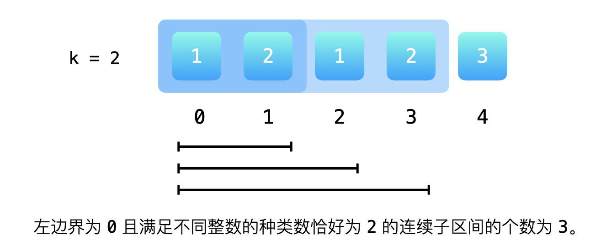
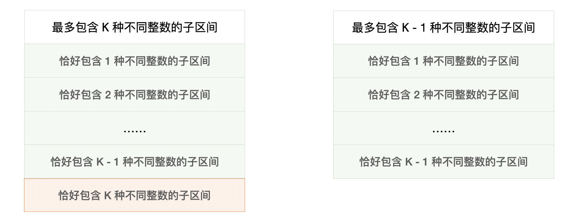

> 原文链接: https://leetcode-cn.com/problems/subarrays-with-k-different-integers


## 英文原文
<div><p>Given an integer array <code>nums</code> and an integer <code>k</code>, return <em>the number of <strong>good subarrays</strong> of </em><code>nums</code>.</p>

<p>A <strong>good array</strong> is an array where the number of different integers in that array is exactly <code>k</code>.</p>

<ul>
	<li>For example, <code>[1,2,3,1,2]</code> has <code>3</code> different integers: <code>1</code>, <code>2</code>, and <code>3</code>.</li>
</ul>

<p>A <strong>subarray</strong> is a <strong>contiguous</strong> part of an array.</p>

<p>&nbsp;</p>
<p><strong>Example 1:</strong></p>

<pre>
<strong>Input:</strong> nums = [1,2,1,2,3], k = 2
<strong>Output:</strong> 7
<strong>Explanation:</strong> Subarrays formed with exactly 2 different integers: [1,2], [2,1], [1,2], [2,3], [1,2,1], [2,1,2], [1,2,1,2]
</pre>

<p><strong>Example 2:</strong></p>

<pre>
<strong>Input:</strong> nums = [1,2,1,3,4], k = 3
<strong>Output:</strong> 3
<strong>Explanation:</strong> Subarrays formed with exactly 3 different integers: [1,2,1,3], [2,1,3], [1,3,4].
</pre>

<p>&nbsp;</p>
<p><strong>Constraints:</strong></p>

<ul>
	<li><code>1 &lt;= nums.length &lt;= 2 * 10<sup>4</sup></code></li>
	<li><code>1 &lt;= nums[i], k &lt;= nums.length</code></li>
</ul>
</div>

## 中文题目
<div><p>给定一个正整数数组 <code>A</code>，如果 <code>A</code> 的某个子数组中不同整数的个数恰好为 <code>K</code>，则称 <code>A</code> 的这个连续、不一定不同的子数组为<em>好子数组</em>。</p>

<p>（例如，<code>[1,2,3,1,2]</code> 中有 <code>3</code> 个不同的整数：<code>1</code>，<code>2</code>，以及 <code>3</code>。）</p>

<p>返回 <code>A</code> 中<em>好子数组</em>的数目。</p>

<p> </p>

<p><strong>示例 1：</strong></p>

<pre>
<strong>输入：</strong>A = [1,2,1,2,3], K = 2
<strong>输出：</strong>7
<strong>解释：</strong>恰好由 2 个不同整数组成的子数组：[1,2], [2,1], [1,2], [2,3], [1,2,1], [2,1,2], [1,2,1,2].
</pre>

<p><strong>示例 2：</strong></p>

<pre>
<strong>输入：</strong>A = [1,2,1,3,4], K = 3
<strong>输出：</strong>3
<strong>解释：</strong>恰好由 3 个不同整数组成的子数组：[1,2,1,3], [2,1,3], [1,3,4].
</pre>

<p> </p>

<p><strong>提示：</strong></p>

<ol>
	<li><code>1 <= A.length <= 20000</code></li>
	<li><code>1 <= A[i] <= A.length</code></li>
	<li><code>1 <= K <= A.length</code></li>
</ol>
</div>

## 通过代码
<RecoDemo>
</RecoDemo>


## 官方题解
### 📺 视频讲解 

>力扣君温馨小贴士：觉得视频时间长的扣友，可以在视频右下角的「设置」按钮处选择 1.5 倍速或者 2 倍速观看。


#### 最初直觉使用双指针算法遇到的问题

对于一个固定的左边界来说，满足「恰好存在 `K` 个不同整数的子区间」的右边界 **不唯一**，且形成区间。

示例 1：左边界固定的时候，恰好存在 $2$ 个不同整数的子区间为 $[1,2],[1,2,1],[1,2,1,2]$ ，总数为 $3$。其值为下标 $3 - 1 + 1$，即区间 $[1..3]$ 的长度。

{:width=500}

须要找到左边界固定的情况下，满足「恰好存在 `K` 个不同整数的子区间」最小右边界和最大右边界。对比以前我们做过的，使用双指针解决的问题的问法基本都会出现「最小」、「最大」这样的字眼。

+ [76. 最小覆盖子串](/problems/minimum-window-substring/)；
+ [209. 长度最小的子数组](/problems/minimum-size-subarray-sum/)；
+ [159. 至多包含两个不同字符的最长子串](/problems/longest-substring-with-at-most-two-distinct-characters/)；
+ [424. 替换后的最长重复字符](/problems/longest-repeating-character-replacement/)。

#### 把原问题转换成为容易求解的问题

> 友情提示：这里把 「恰好」 转换成为 「最多」须要一点求解「双指针（滑动窗口）」问题的经验。建立在熟练掌握这一类问题求解思路的基础上。

把「**恰好**」改成「**最多**」就可以使用双指针一前一后交替向右的方法完成，这是因为 **对于每一个确定的左边界，最多包含 $K$ 种不同整数的右边界是唯一确定的**，并且在左边界向右移动的过程中，右边界或者在原来的地方，或者在原来地方的右边。


而「最多存在 $K$ 个不同整数的子区间的个数」与「恰好存在 `K` 个不同整数的子区间的个数」的差恰好等于「最多存在 $K - 1$ 个不同整数的子区间的个数」。



因为原问题就转换成为求解「最多存在 $K$ 个不同整数的子区间的个数」与 「最多存在 $K - 1$ 个不同整数的子区间的个数」，它们其实是一个问题。


### 方法：双指针（滑动窗口）

实现函数 `atMostWithKDistinct(A, K)` ，表示「最多存在 $K$ 个不同整数的子区间的个数」。于是 `atMostWithKDistinct(A, K) - atMostWithKDistinct(A, K - 1)` 即为所求。

**参考代码**：

```Java []
public class Solution {

    public int subarraysWithKDistinct(int[] A, int K) {
        return atMostKDistinct(A, K) - atMostKDistinct(A, K - 1);
    }

    /**
     * @param A
     * @param K
     * @return 最多包含 K 个不同整数的子区间的个数
     */
    private int atMostKDistinct(int[] A, int K) {
        int len = A.length;
        int[] freq = new int[len + 1];

        int left = 0;
        int right = 0;
        // [left, right) 里不同整数的个数
        int count = 0;
        int res = 0;
        // [left, right) 包含不同整数的个数小于等于 K
        while (right < len) {
            if (freq[A[right]] == 0) {
                count++;
            }
            freq[A[right]]++;
            right++;

            while (count > K) {
                freq[A[left]]--;
                if (freq[A[left]] == 0) {
                    count--;
                }
                left++;
            }
            // [left, right) 区间的长度就是对结果的贡献
            res += right - left;
        }
        return res;
    }
}
```

**说明**： `res += right - left;` 这行代码的意思：

用具体的例子理解：最多包含 3 种不同整数的子区间  `[1, 3, 2, 3]` （双指针算法是在左边界固定的前提下，让右边界走到最右边），当前可以确定 `1` 开始的满足最多包含 3 种不同整数的子区间有 `[1]`、`[1, 3]`、`[1, 3, 2]`、`[1, 3, 2, 3]`。

**所有的** 左边界固定前提下，根据右边界最右的下标，计算出来的子区间的个数就是整个函数要返回的值。用右边界固定的前提下，左边界最左边的下标去计算也是完全可以的。


**复杂度分析**：

+ 时间复杂度：$O(N)$，这里 $N$ 是输入数组的长度；
+ 空间复杂度：$O(N)$，使用了常数个变量、频数数组的长度为 $N + 1$。

---

### 总结

使用双指针（滑动窗口、两个变量一前一后交替向后移动）解决的问题通常都和这个问题要问的结果有关。以我们在题解中给出的 5 道经典问题为例：

+ [3. 无重复字符的最长子串](/problems/longest-substring-without-repeating-characters/)：没有重复的子串，一定只会问「最长」，因为最短的没有重复字符的子串是只有一个字符的子串； 
+ [76. 最小覆盖子串](/problems/minimum-window-substring/)：求一个字符串的子串覆盖另一个字符串的长度一定是问「最小」，而不会问「最大」，因为最大一定是整个字符串；
+ [209. 长度最小的子数组](/problems/minimum-size-subarray-sum/)：所有元素都是正整数，且子区间里所有元素的和大于等于定值 `s` 的子区间一定是问长度「最小」，而不会问「最多」，因为最多也一定是整个数组的长度；
+ [159. 至多包含两个不同字符的最长子串](/problems/longest-substring-with-at-most-two-distinct-characters/)：最多包含两个不同字符一定是问「最长」才有意义，因为长度更长的子串可能会包含更多的字符；
+ [424. 替换后的最长重复字符](/problems/longest-repeating-character-replacement/)：替换的次数 `k` 是定值，替换以后字符全部相等的子串也一定只会问「最长」。

---

### 练习

**提示**：在做这些问题的时候，**一定要思考清楚为什么可以采用双指针（滑动窗口）算法解决如上的问题**，为什么 **左、右指针向右移动的时候可以不回头**。如果不太熟悉这一类问题思路的朋友，一定要想清楚算法为什么有效，比知道这些问题可以用双指针（滑动窗口）算法解决重要得多。

思路一般是这样：固定左边界的前提下，如果较短的区间性质是什么样的，较长的区间的性质其实我们也可以推测出来。在右边界固定的前提下，我们须要将左边界右移，如此反复。这样的算法只遍历了数组两次，不用枚举所有可能的区间，把 $O(N^2)$ 的时间复杂度降到了 $O(N)$。

+ [713. 乘积小于 K 的子数组](/problems/subarray-product-less-than-k/)；
+ [904. 水果成篮](/problems/fruit-into-baskets/) ；
+ [795. 区间子数组个数](/problems/number-of-subarrays-with-bounded-maximum/)；
+ [1358. 包含所有三种字符的子字符串数目](/problems/number-of-substrings-containing-all-three-characters/)；
+ [467. 环绕字符串中唯一的子字符串](/problems/unique-substrings-in-wraparound-string/)；
+ [340. 至多包含 K 个不同字符的最长子串](/problems/longest-substring-with-at-most-k-distinct-characters/)。


## 统计信息
| 通过次数 | 提交次数 | AC比率 |
| :------: | :------: | :------: |
|    24232    |    53326    |   45.4%   |

## 提交历史
| 提交时间 | 提交结果 | 执行时间 |  内存消耗  | 语言 |
| :------: | :------: | :------: | :--------: | :--------: |


## 相似题目
|                             题目                             | 难度 |
| :----------------------------------------------------------: | :---------: |
| [无重复字符的最长子串](https://leetcode-cn.com/problems/longest-substring-without-repeating-characters/) | 中等|
| [至多包含两个不同字符的最长子串](https://leetcode-cn.com/problems/longest-substring-with-at-most-two-distinct-characters/) | 中等|
| [至多包含 K 个不同字符的最长子串](https://leetcode-cn.com/problems/longest-substring-with-at-most-k-distinct-characters/) | 中等|
