> 原文链接: https://leetcode-cn.com/problems/minimum-number-of-k-consecutive-bit-flips


## 英文原文
<div><p>You are given a binary array <code>nums</code> and an integer <code>k</code>.</p>

<p>A <strong>k-bit flip</strong> is choosing a <strong>subarray</strong> of length <code>k</code> from <code>nums</code> and simultaneously changing every <code>0</code> in the subarray to <code>1</code>, and every <code>1</code> in the subarray to <code>0</code>.</p>

<p>Return <em>the minimum number of <strong>k-bit flips</strong> required so that there is no </em><code>0</code><em> in the array</em>. If it is not possible, return <code>-1</code>.</p>

<p>A <strong>subarray</strong> is a <strong>contiguous</strong> part of an array.</p>

<p>&nbsp;</p>
<p><strong>Example 1:</strong></p>

<pre>
<strong>Input:</strong> nums = [0,1,0], k = 1
<strong>Output:</strong> 2
<strong>Explanation:</strong> Flip nums[0], then flip nums[2].
</pre>

<p><strong>Example 2:</strong></p>

<pre>
<strong>Input:</strong> nums = [1,1,0], k = 2
<strong>Output:</strong> -1
<strong>Explanation:</strong> No matter how we flip subarrays of size 2, we cannot make the array become [1,1,1].
</pre>

<p><strong>Example 3:</strong></p>

<pre>
<strong>Input:</strong> nums = [0,0,0,1,0,1,1,0], k = 3
<strong>Output:</strong> 3
<strong>Explanation:</strong> 
Flip nums[0],nums[1],nums[2]: nums becomes [1,1,1,1,0,1,1,0]
Flip nums[4],nums[5],nums[6]: nums becomes [1,1,1,1,1,0,0,0]
Flip nums[5],nums[6],nums[7]: nums becomes [1,1,1,1,1,1,1,1]
</pre>

<p>&nbsp;</p>
<p><strong>Constraints:</strong></p>

<ul>
	<li><code>1 &lt;= nums.length &lt;= 10<sup>5</sup></code></li>
	<li><code>1 &lt;= k &lt;= nums.length</code></li>
</ul>
</div>

## 中文题目
<div><p>在仅包含 <code>0</code> 和 <code>1</code> 的数组 <code>A</code> 中，一次 <em><code>K</code> 位翻转</em>包括选择一个长度为 <code>K</code> 的（连续）子数组，同时将子数组中的每个 <code>0</code> 更改为 <code>1</code>，而每个 <code>1</code> 更改为 <code>0</code>。</p>

<p>返回所需的 <code>K</code> 位翻转的最小次数，以便数组没有值为 <code>0</code> 的元素。如果不可能，返回 <code>-1</code>。</p>

<p> </p>

<p><strong>示例 1：</strong></p>

<pre>
<strong>输入：</strong>A = [0,1,0], K = 1
<strong>输出：</strong>2
<strong>解释：</strong>先翻转 A[0]，然后翻转 A[2]。
</pre>

<p><strong>示例 2：</strong></p>

<pre>
<strong>输入：</strong>A = [1,1,0], K = 2
<strong>输出：</strong>-1
<strong>解释：</strong>无论我们怎样翻转大小为 2 的子数组，我们都不能使数组变为 [1,1,1]。
</pre>

<p><strong>示例 3：</strong></p>

<pre>
<strong>输入：</strong>A = [0,0,0,1,0,1,1,0], K = 3
<strong>输出：</strong>3
<strong>解释：</strong>
翻转 A[0],A[1],A[2]: A变成 [1,1,1,1,0,1,1,0]
翻转 A[4],A[5],A[6]: A变成 [1,1,1,1,1,0,0,0]
翻转 A[5],A[6],A[7]: A变成 [1,1,1,1,1,1,1,1]
</pre>

<p> </p>

<p><strong>提示：</strong></p>

<ol>
	<li><code>1 <= A.length <= 30000</code></li>
	<li><code>1 <= K <= A.length</code></li>
</ol>
</div>

## 通过代码
<RecoDemo>
</RecoDemo>


## 高赞题解
各位题友大家好！ 今天是 **[@负雪明烛](/u/fuxuemingzhu/)** 坚持日更的第 **25** 天。今天力扣上的每日一题是「[995. K 连续位的最小翻转次数](https://leetcode-cn.com/problems/minimum-number-of-k-consecutive-bit-flips/)」。

# 解题思路

题目大意：每次翻转长度为 K 的子数组，求最少的翻转次数使数组中所有的 0 都更改为 1。如果不能实现，则返回 -1.


- 结论 1：后面区间的翻转，不会影响前面的元素。因此可以使用贪心策略，从左到右遍历，遇到每个 0 都把 它以及后面的 $K-1$ 个元素进行翻转。
- 结论 2：$A[i]$ 翻转偶数次的结果是 $A[i]$；翻转奇数次的结果是 `A[i] ^ 1`。


## 方法一：模拟翻转（超时）


一个直观的思路是，从左到右遍历一遍，遇到数字为 0，那么翻转以该数字为起始的 K 个数字。


代码如下：

```python
class Solution(object):
    def minKBitFlips(self, A, K):
        """
        :type A: List[int]
        :type K: int
        :rtype: int
        """
        N = len(A)
        res = 0
        for i in range(N - K + 1):
            if A[i] == 1:
                continue
            for j in range(K):
                A[i + j] ^= 1
            res += 1
        for i in range(N):
            if A[i] == 0:
                return -1
        return res
```


- 时间复杂度：$O(N * K + N)$，超时。
- 空间复杂度：$O(1)$。


## 方法二：滑动窗口


上面方法超时的主要原因是我们真实地进行了翻转。根据结论二，位置 $i$ 现在的状态，和它**被**前面 $K - 1$ 个元素翻转的次数（奇偶性）有关。


我们使用**队列**模拟**滑动窗口**，该滑动窗口的含义是前面 $K - 1$ 个元素中，以哪些位置起始的 子区间 进行了翻转。该滑动窗口从左向右滑动，如果当前位置 $i$ 需要翻转，则把该位置存储到队列中。遍历到新位置 $j (j < i + K)$ 时，队列中元素的个数代表了 $i$ **被**前面 $K - 1$ 个元素翻转的次数。


- 当 $A[i]$ 为 0，如果 $i$ 位置**被**翻转了偶数次，那么翻转后仍是 0，当前元素需要翻转；
- 当 $A[i]$ 为 1，如果 $i$ 位置**被**翻转了奇数次，那么翻转后变成 0，当前元素需要翻转。


综合上面两点，我们得到一个结论，如果 `len(que) % 2 == A[i]` 时，当前元素需要翻转。

当 $i +  K > N$ 时，说明需要翻转大小为 K 的子区间，但是后面剩余的元素不到 K 个了，所以返回 -1。

## 示例

下面的动图演示了题目给出的示例三 `A = [0,0,0,1,0,1,1,0], K = 3` 的情况：


对应的 PPT 在这：

<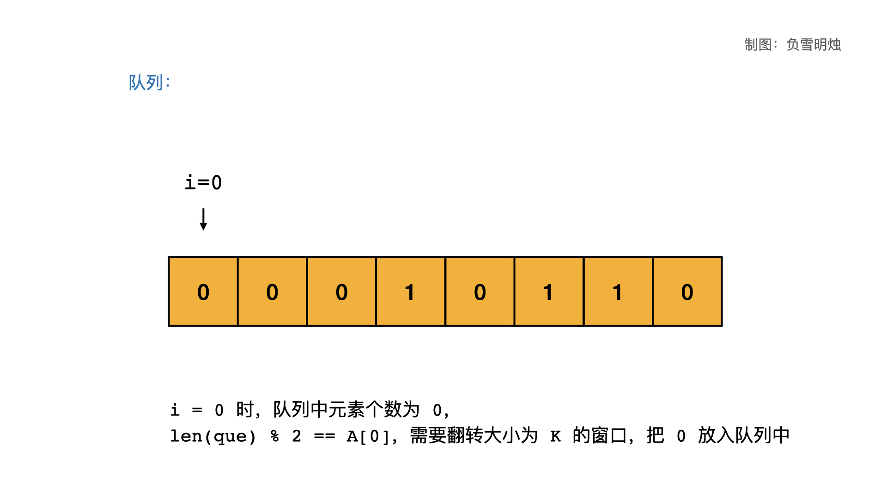,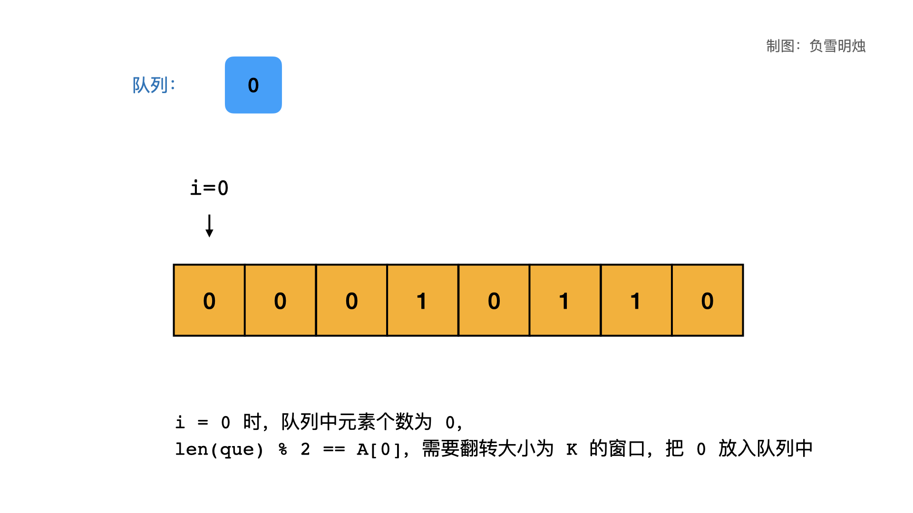,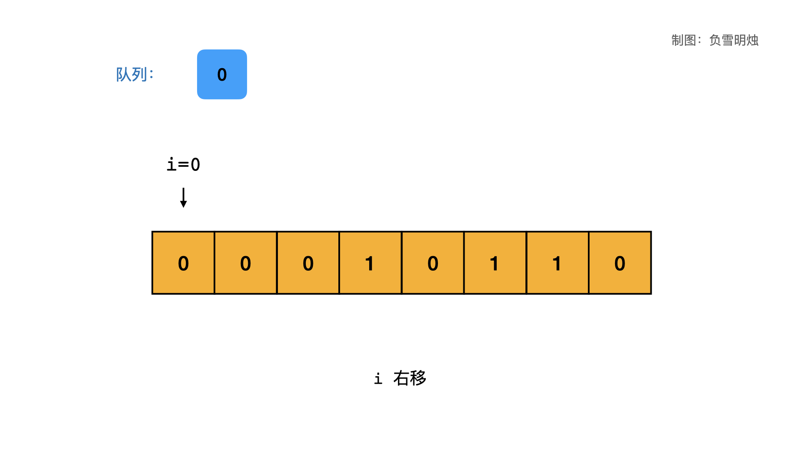,,,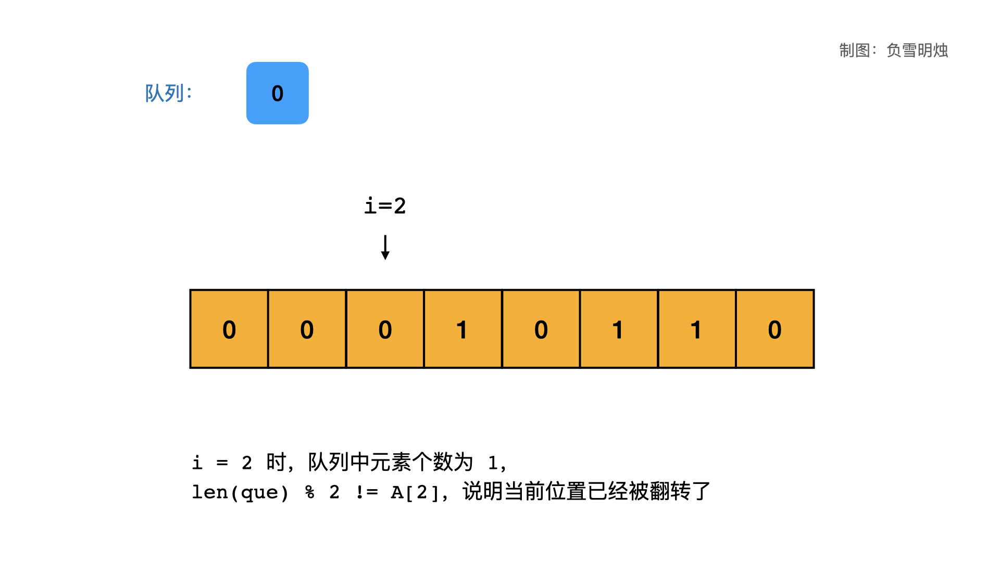,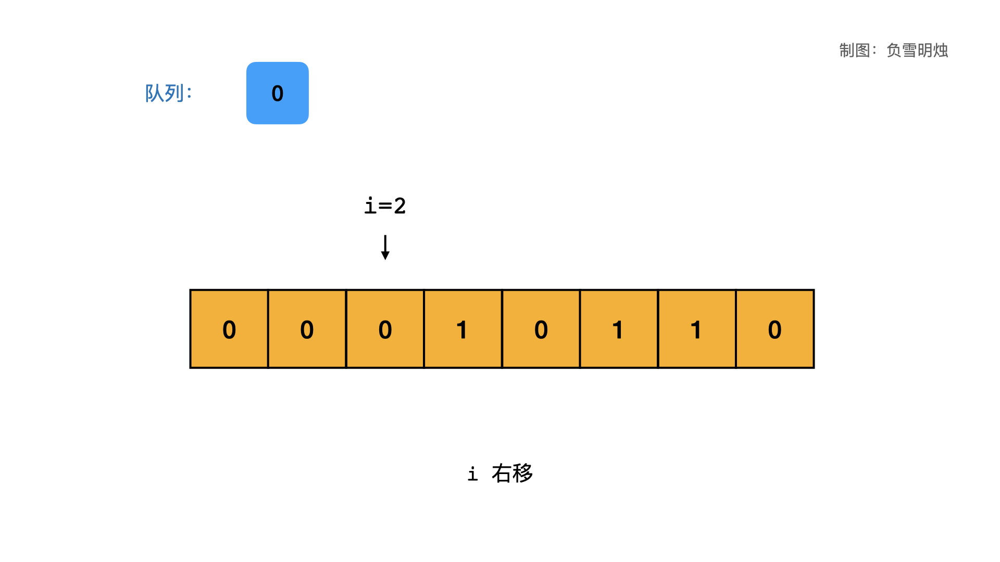,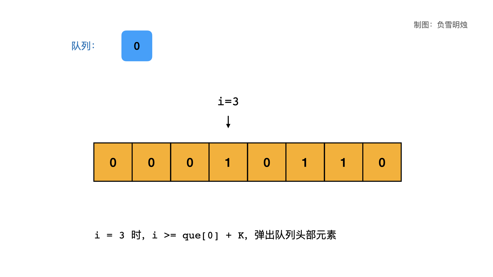,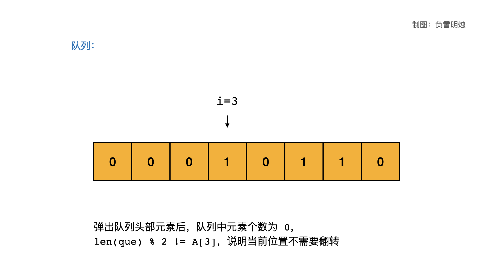,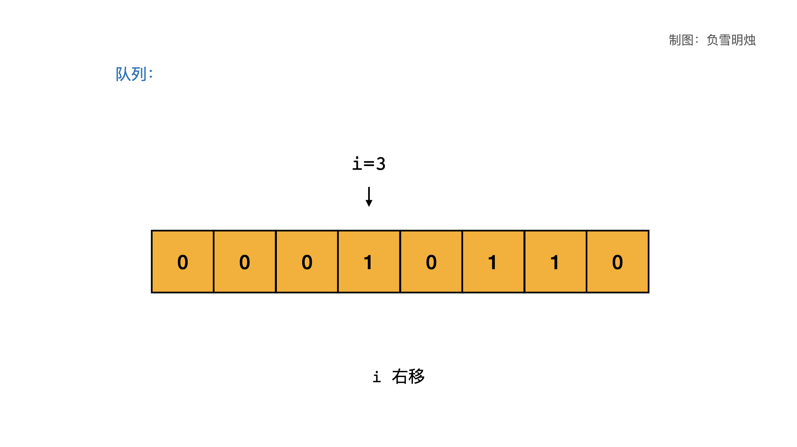,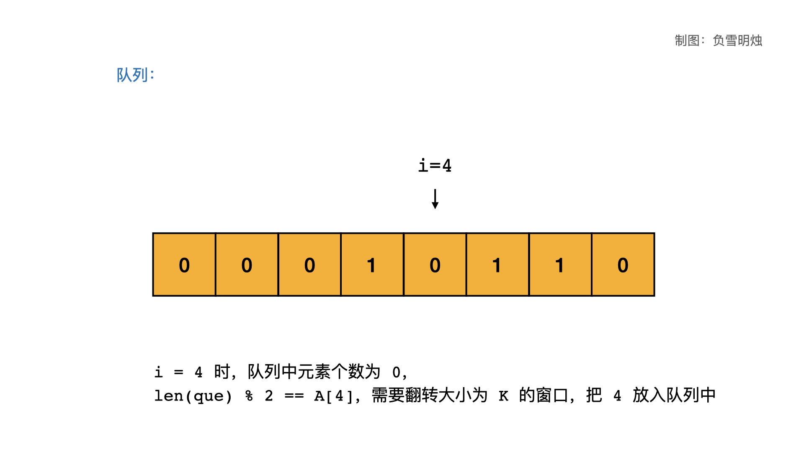,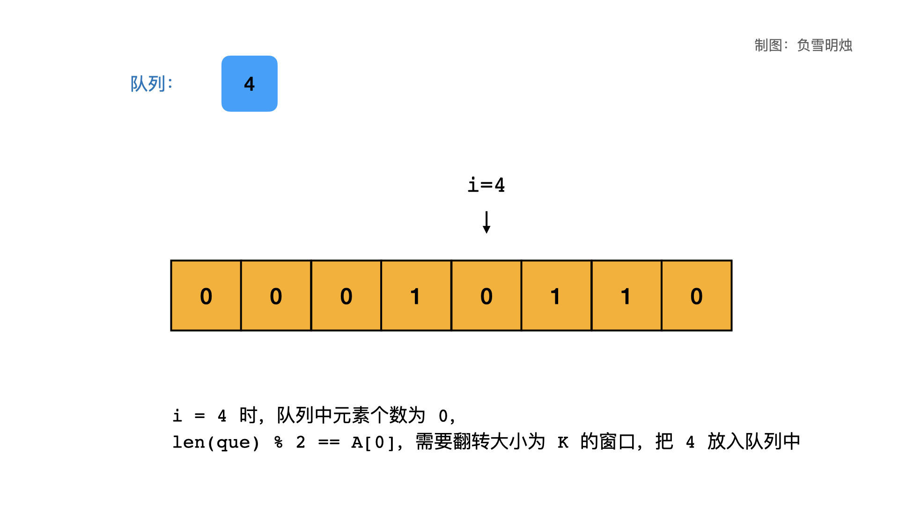,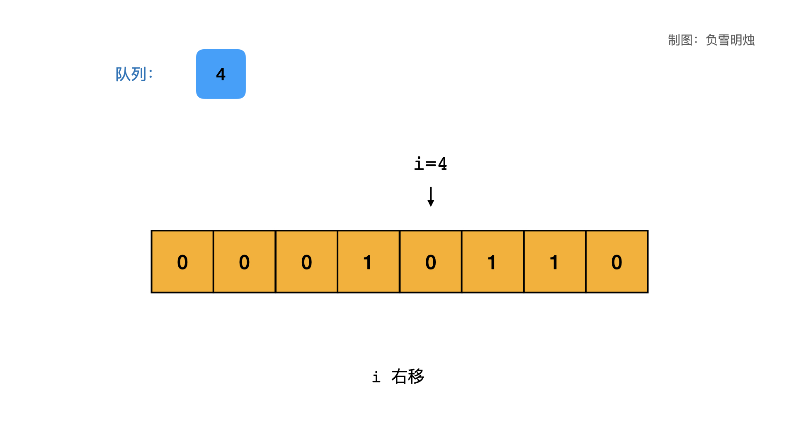,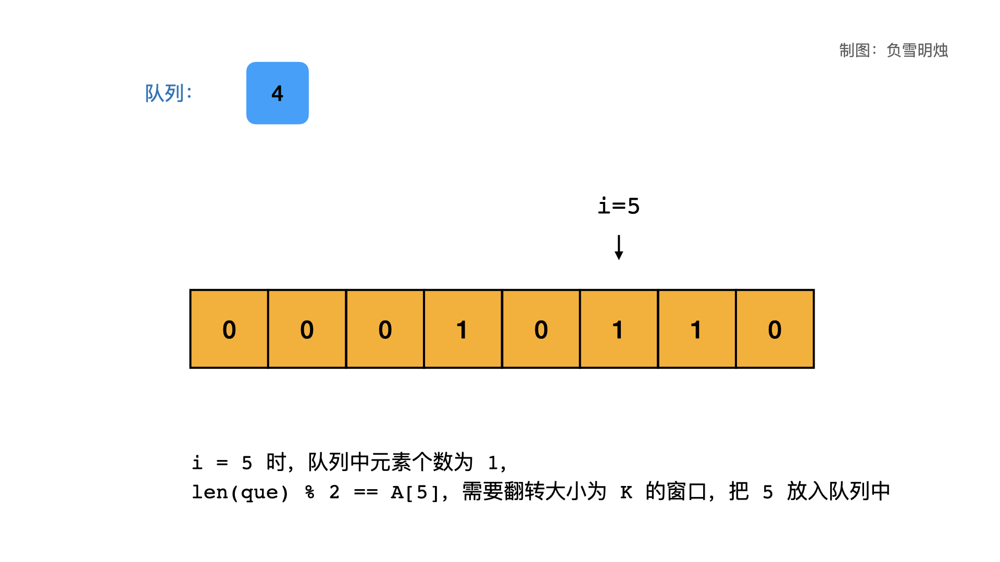,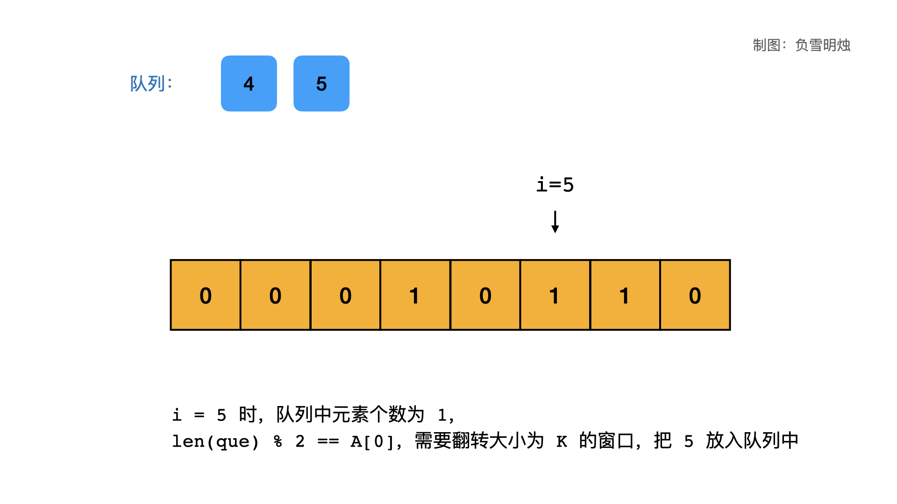,,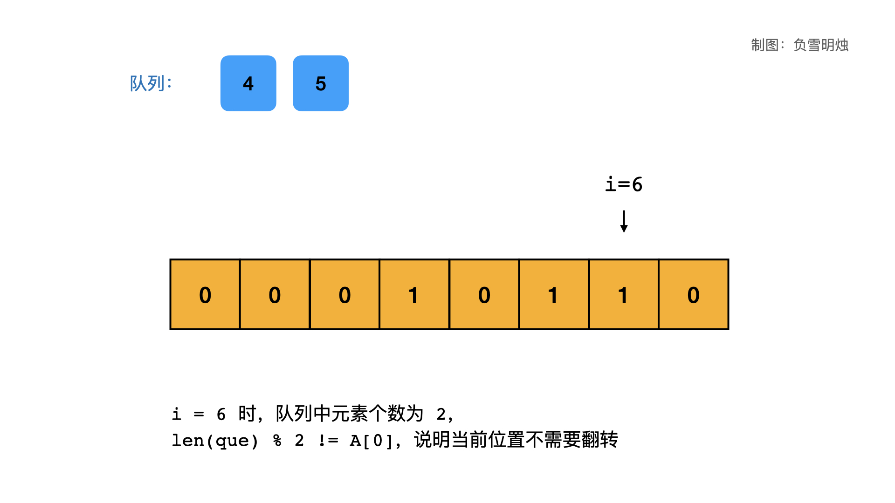,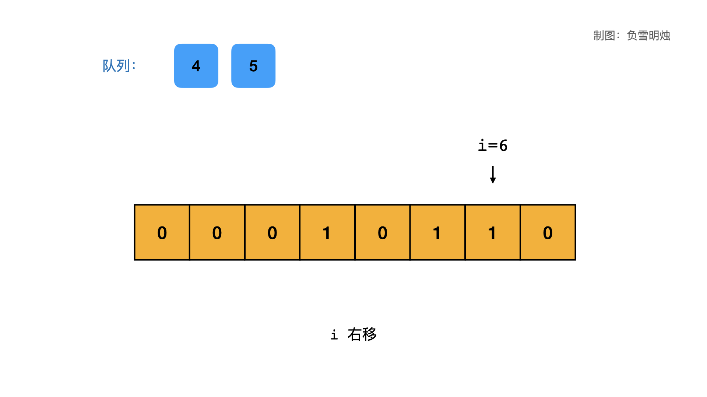,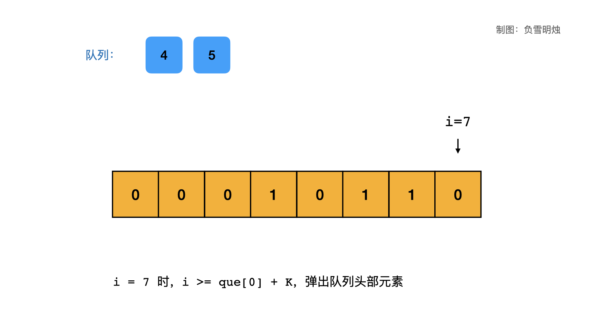,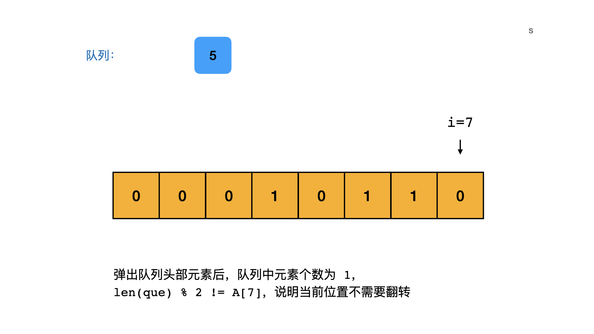>


## 代码

Python ，Java， C++ 三种代码如下：

```Python []
class Solution(object):
    def minKBitFlips(self, A, K):
        """
        :type A: List[int]
        :type K: int
        :rtype: int
        """
        N = len(A)
        que = collections.deque()
        res = 0
        for i in range(N):
            if que and i >= que[0] + K:
                que.popleft()
            if len(que) % 2 == A[i]:
                if i +  K > N: return -1
                que.append(i)
                res += 1
        return res
```
```Java []
class Solution {
    public int minKBitFlips(int[] A, int K) {
        int res = 0;
        Deque<Integer> que = new LinkedList<>();
        for (int i = 0; i < A.length; i++) {
            if (que.size() > 0 && i > que.peek() + K - 1) {
                que.removeFirst();
            }
            //1.本来是1，翻转奇数次变为0，所以需要再次翻转，放入队列
            //2.本来是0，翻转偶数次还是0，所以需要再次翻转，放入队列
            if (que.size() % 2 == A[i]) {
                if (i + K > A.length) return -1;
                que.add(i);
                res += 1;
            }
        }
        return res;
    }
}
```
```C++ []
class Solution {
public:
    int minKBitFlips(vector<int>& A, int K) {
        int N = A.size();
        queue<int> que;
        int res = 0;
        for (int i = 0; i < N; ++i) {
            if (!que.empty() && i >= que.front() + K) {
                que.pop();
            }
            if (que.size() % 2 == A[i]) {
                if (i + K > N) {
                    return -1;
                }
                que.push(i);
                res ++;
            }
        }
        return res;
    }
};
```

- 时间复杂度：$O(N)$。
- 空间复杂度：$O(K)$。


# 刷题心得


今天的题目理解着比较困难，主要是语言很难说明白，其实理解之后没有那么难。

---

OK，以上就是 [@负雪明烛](https://leetcode-cn.com/u/fuxuemingzhu/) 写的今天题解的全部内容了，如果你觉得有帮助的话，**求赞、求关注、求收藏**。如果有疑问的话，请在下面评论，我会及时解答。


**关注我**，你将不会错过我的精彩动画题解、模拟面试、组队刷题活动，进入主页 [@负雪明烛](https://leetcode-cn.com/u/fuxuemingzhu/) 右侧有刷题组织，从此刷题不再孤单。
祝大家牛年大吉！AC 多多，Offer 多多！我们明天再见！

## 统计信息
| 通过次数 | 提交次数 | AC比率 |
| :------: | :------: | :------: |
|    21864    |    40532    |   53.9%   |

## 提交历史
| 提交时间 | 提交结果 | 执行时间 |  内存消耗  | 语言 |
| :------: | :------: | :------: | :--------: | :--------: |


## 相似题目
|                             题目                             | 难度 |
| :----------------------------------------------------------: | :---------: |
| [灯泡开关](https://leetcode-cn.com/problems/bulb-switcher/) | 中等|
