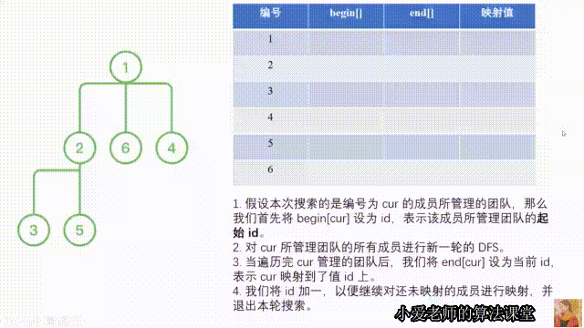

> 原文链接: https://leetcode-cn.com/problems/coin-bonus


## 中文题目
<div><p>力扣决定给一个刷题团队发<code>LeetCoin</code>作为奖励。同时，为了监控给大家发了多少<code>LeetCoin</code>，力扣有时候也会进行查询。</p>

<p>&nbsp;</p>

<p>该刷题团队的管理模式可以用一棵树表示：</p>

<ol>
	<li>团队只有一个负责人，编号为1。除了该负责人外，每个人有且仅有一个领导（负责人没有领导）；</li>
	<li>不存在循环管理的情况，如A管理B，B管理C，C管理A。</li>
</ol>

<p>&nbsp;</p>

<p>力扣想进行的操作有以下三种：</p>

<ol>
	<li>给团队的一个成员（也可以是负责人）发一定数量的<code>LeetCoin</code>；</li>
	<li>给团队的一个成员（也可以是负责人），以及他/她管理的所有人（即他/她的下属、他/她下属的下属，&hellip;&hellip;），发一定数量的<code>LeetCoin</code>；</li>
	<li>查询某一个成员（也可以是负责人），以及他/她管理的所有人被发到的<code>LeetCoin</code>之和。</li>
</ol>

<p>&nbsp;</p>

<p><strong>输入：</strong></p>

<ol>
	<li><code>N</code>表示团队成员的个数（编号为1～N，负责人为1）；</li>
	<li><code>leadership</code>是大小为<code>(N&nbsp;- 1) * 2</code>的二维数组，其中每个元素<code>[a, b]</code>代表<code>b</code>是<code>a</code>的下属；</li>
	<li><code>operations</code>是一个长度为<code>Q</code>的二维数组，代表以时间排序的操作，格式如下：
	<ol>
		<li><code>operations[i][0] = 1</code>: 代表第一种操作，<code>operations[i][1]</code>代表成员的编号，<code>operations[i][2]</code>代表<code>LeetCoin</code>的数量；</li>
		<li><code>operations[i][0] = 2</code>: 代表第二种操作，<code>operations[i][1]</code>代表成员的编号，<code>operations[i][2]</code>代表<code>LeetCoin</code>的数量；</li>
		<li><code>operations[i][0] = 3</code>: 代表第三种操作，<code>operations[i][1]</code>代表成员的编号；</li>
	</ol>
	</li>
</ol>

<p><strong>输出：</strong></p>

<p>返回一个数组，数组里是每次<strong>查询</strong>的返回值（发<code>LeetCoin</code>的操作不需要任何返回值）。由于发的<code>LeetCoin</code>很多，请把每次查询的结果模<code>1e9+7 (1000000007)</code>。</p>

<p>&nbsp;</p>

<p><strong>示例 1：</strong></p>

<pre><strong>输入：</strong>N = 6, leadership = [[1, 2], [1, 6], [2, 3], [2, 5], [1, 4]], operations = [[1, 1, 500], [2, 2, 50], [3, 1], [2, 6, 15], [3, 1]]
<strong>输出：</strong>[650, 665]
<strong>解释：</strong>团队的管理关系见下图。
第一次查询时，每个成员得到的LeetCoin的数量分别为（按编号顺序）：500, 50, 50, 0, 50, 0;
第二次查询时，每个成员得到的LeetCoin的数量分别为（按编号顺序）：500, 50, 50, 0, 50, 15.
</pre>

<p></p>

<p>&nbsp;</p>

<p><strong>限制：</strong></p>

<ol>
	<li><code>1 &lt;= N &lt;= 50000</code></li>
	<li><code>1 &lt;= Q &lt;= 50000</code></li>
	<li><code>operations[i][0] != 3 时，1 &lt;= operations[i][2]&nbsp;&lt;= 5000</code></li>
</ol>
</div>

## 通过代码
<RecoDemo>
</RecoDemo>


## 高赞题解
> 关注[小爱老师的算法课堂](https://space.bilibili.com/1716757387/)，分享高质量算法视频与文字题解

---

###  题目分析：深度优先搜索 + 树状数组

首先，本题包括几种操作（为了便于叙述，我们将对象从 `LeetCoin` 变成分数）：

1. 给某人加分
2. 给一部分人加分
3. 查询一部分人的分数之和

**操作 $1$ 可以通过两次操作 $2$ 完成**：给一部分人（包括指定的人）加分，并将这部分人中，指定的人以外的人减同样的分数。

所以，如果我们将“一部分”这个概念量化到某个数值区间上，本题相当于要求我们实现两种操作：

1. 给指定区间 $[l, r]$ 加上指令数值 $value$
2. 查询指令区间 $[l, r]$ 数值之和

所以，我们可以通过深度优先搜索，将题目给定的负责人及其管理人员**量化到数轴上一段连续的区间**；然后通过树状数组解决**区间更新和区间查询**的问题。所以在算法细节部分，我们分为**两部分**。第一部分介绍基于深度优先搜索的量化方法，第二部分介绍基于树状数组的区间处理问题。


---

### 算法细节：

#### `DFS` 解决量化问题

由于树状数组需要对连续区间进行处理，所以本部分我们要达成的目标是：

1. 将所有人的编号映射到 $[1, N]$ 的区间，其中负责人及其团队需要映射到一段连续的区间
2. 能通过负责人的编号获取得到其团队的区间 $[l, r]$。

由于本题按照一棵树的形式，表达一个团队的管理模式，所以可以利用深度优先搜索来完成这件事情。

首先，我们定义一个全局变量 `id`，用于将所有成员的编号映射到数值上。

其次，我们定义两个数组 `begin[i], end[i]` ，记录编号为 $i$ 的成员所管理团队映射到的区间 $[l, r]$。

下面我们开始 `DFS` 过程：

1. 假设本次 `DFS` 搜索的是编号为 `cur` 的成员所管理的团队，那么我们首先将 `begin[cur]` 设为 `id`，表示该成员所管理团队的**起始 `id`**。
2. 对 `cur` 所管理团队的所有成员进行新一轮的 `DFS`。
3. 当遍历完 `cur` 管理的团队后，我们将 `end[cur]` 设为当前 `id`（遍历管理团队时，`id` 会更新），表示 `cur` 映射到了值 `id` 上。
4. 我们将 `id` 加一，以便继续对还未映射的成员进行映射，并退出本轮搜索。

> 我们以本题的样例，让大家对本题的深搜过程有更清晰的了解：
>
> 我们对 $1$ 进行 DFS，并记录 begin[1] = 1，开始搜索其团队 [2, 6, 4]
>
> ​		我们对 2 进行 DFS，并记录 begin[2] = 1，开始搜索其团队 [3, 5]
>
> ​				我们对 3 进行 DFS，并记录 begin[3] = 1，开始搜索其团队 []
>
> ​				3 搜索完毕，映射到 id = 1，并记录在 end[3] = 1 中，更新 id = 2，退出搜索。
>
> ​				我们对 5 进行 DFS，并记录 begin[5] = 2，开始搜索其团队 []
>
> ​				5 搜索完毕，映射到 id = 2，并记录在 end[5] = 2 中，更新 id = 3，退出搜索。
>
> ​		2 搜索完毕，映射到 id = 3，并记录在 end[2] = 3 中，更新 id = 4，退出搜索。
>
> ​		我们对 6 进行 DFS，并记录 begin[6] = 4，开始搜索其团队 []
>
> ​		6 搜索完毕，映射到 id = 4，并记录在 end[6] = 4 中，更新 id = 5，退出搜索。
>
> ​		我们对 4 进行 DFS，并记录 begin[4] = 5，开始搜索其团队 []
>
> ​		4 搜索完毕，映射到 id = 5，并记录在 end[4] = 5 中，更新 id = 6，退出搜索。
>
> 1 搜索完毕，映射到 id = 6，并记录在 end[1] = 6 中，更新 id = 7，退出搜索。
>
> 
>
> 此时整个搜索过程完毕，我们来看一下 6 个人所对应的 begin 和 end：
>
> begin[1] = 1, end[1] = 6，表示编号为 1 的人所管理的团队映射到的区间是 [1, 6]，本身映射到 6
>
> begin[2] = 1, end[2] = 3，表示编号为 2 的人所管理的团队映射到的区间是 [1, 3]，本身映射到 3
>
> begin[3] = 1, end[3] = 1，表示编号为 3 的人所管理的团队映射到的区间是 [1, 1]，本身映射到 1
>
> begin[4] = 5, end[4] = 5，表示编号为 4 的人所管理的团队映射到的区间是 [5, 5]，本身映射到 5
>
> begin[5] = 2, end[5] = 2，表示编号为 5 的人所管理的团队映射到的区间是 [2, 2]，本身映射到 2
>
> begin[6] = 4, end[6] = 4，表示编号为 6 的人所管理的团队映射到的区间是 [4, 4]，本身映射到 4




---

#### 树状数组解决区间处理问题

如果你还不熟悉树状数组，可以看我的这篇[树状数组详解](https://mp.weixin.qq.com/s?__biz=MzkyMzI3ODgzNQ==&mid=2247483674&idx=1&sn=263595b26950ac60e5bf789839d70c9e&chksm=c1e6cd86f691449062d780b96d9af6d9590a71872ebfee980d5b045b9963714043261027c16b&token=1500097142&lang=zh_CN#rd)呀！

在本题的代码实现中，直接利用树状数组的区间处理模板即可。

---

### 代码：

```C++ []
using ll = long long;
const ll M = 1e9 + 7;

class BIT {
public:
	int n;
    vector<ll> sum;
    vector<ll> ntimessum;
   
    BIT(int _n): n(_n + 5), sum(_n + 10, 0), ntimessum(_n + 10, 0) {}
    ll lowbit(ll x) {
        return x & (-x);
    }
    
    void update(int pos, ll k) { // 在 pos 位置加上 k
        ll x = pos;
        while(pos <= n) {
            sum[pos] += k;
            ntimessum[pos] += k * (x - 1);
            pos += lowbit(pos);
        }
    }

    void update_internal(int l, int r, int k) { // 区间更新
        update(l, k);
        update(r + 1, -k);
    }
    
    ll askis(int pos) { // 区间更新 + 单点查询 
    	if(!pos) return 0;
        ll ret = 0;
        while(pos) {
            ret += sum[pos];
            pos -= lowbit(pos);
        }
        return ret;
    }
    
    ll asksi(int l, int r) { // 单点更新 + 区间查询
        if(l > r) {
            return 0;
        }
        return askis(r) - askis(l - 1);
    }
    
    ll askss(int pos) {	// 单点更新 + 单点查询
        return askis(pos) - askis(pos - 1);
    }
    
    ll askii(int pos) { // 区间更新 + 范围查询
    	if(!pos) return 0;
        ll ret = 0, x = pos;
        while(pos) {
            ret += x * sum[pos] - ntimessum[pos];
            pos -= lowbit(pos);
        }
        return ret;
	}

    ll asklr(int l, int r) { // 区间更新 + 区间查询
        return askii(r) - askii(l - 1);
    }
};

class Solution {
public:
    int id = 1;

    void dfs(int cur, vector<int>& begin, vector<int>& end, vector<vector<int>>& g) {
        begin[cur] = id;
        for(auto &child : g[cur]) dfs(child, begin, end, g);
        end[cur] = id;
        id++;
    }

    vector<int> bonus(int n, vector<vector<int>>& leadership, vector<vector<int>>& operations) {
        // 邻接表
        vector<vector<int>> g(n + 1);
        for(auto &l : leadership) g[l[0]].push_back(l[1]);

        // 深搜，构建
        vector<int> begin(n + 1), end(n + 1);
        dfs(1, begin, end, g);

        // 树状数组
        BIT *b = new BIT(n);
        vector<int> ret;
        for(auto &q : operations) {
            if(q[0] == 1) {
                b->update_internal(end[q[1]], end[q[1]], q[2]);
            } else if(q[0] == 2) {
                b->update_internal(begin[q[1]], end[q[1]], q[2]);
            } else {
                ll ans = b->asklr(begin[q[1]], end[q[1]]);
                ret.push_back((ans % M + M) % M);
            }
        }

        return ret;
    }
};
```
```Python3 []
M = int(1e9 + 7)

class BIT:
    def __init__(self, n):
        self.n = n + 5
        self.sum = [0 for _ in range(n + 10)]
        self.ntimessum = [0 for _ in range(n + 10)]
    
    def lowbit(self, x):
        return x & (-x)

    # 在 pos 位置加上 k
    def update(self, pos, k):
        x = pos
        while pos <= self.n:
            self.sum[pos] += k
            self.sum[pos] %= M
            self.ntimessum[pos] += k * (x - 1)
            self.ntimessum[pos] %= M
            pos += self.lowbit(pos)
    
    # 区间更新 + 单点查询
    def askis(self, pos):
        if not pos:
            return 0
        ret = 0
        while pos:
            ret += self.sum[pos]
            ret %= M
            pos -= lowbit(pos)
        return ret
    
    # 单点更新 + 区间查询
    def asksi(self, l, r):
        if l > r:
            return 0
        return askis(r) - askis(l - 1)
    
    # 单点更新 + 单点查询
    def askss(self, pos):
        return askis(pos) - askis(pos - 1)
    
    # 区间更新 + 区间查询
    def askii(self, pos):
        if not pos:
            return 0
        ret = 0
        x = pos
        while pos:
            ret += x * self.sum[pos] - self.ntimessum[pos]
            ret %= M
            pos -= self.lowbit(pos)
        return ret

class Solution:
    def bonus(self, n: int, leadership: List[List[int]], operations: List[List[int]]) -> List[int]:
        
        # 邻接表
        g = [[] for _ in range(n + 1)]
        begin = [0 for _ in range(n + 1)]
        end = [0 for _ in range(n + 1)]
        id = 1

        for l in leadership:
            g[l[0]].append(l[1])
        
        # 深搜
        def dfs(cur):
            nonlocal id
            begin[cur] = id
            for child in g[cur]:
                dfs(child)
            end[cur] = id
            id += 1
        dfs(1)
        
        # 树状数组
        b = BIT(n)
        ret = []
        for q in operations:
            if q[0] == 1:
                b.update(end[q[1]], q[2])
                b.update(end[q[1]] + 1, -q[2])
            elif q[0] == 2:
                b.update(begin[q[1]], q[2])
                b.update(end[q[1]] + 1, -q[2])
            else:
                ans = b.askii(end[q[1]]) - b.askii(begin[q[1]] - 1)
                ret.append((ans % M + M) % M)

        return ret
```

---

### 复杂度分析：

- 时间复杂度：$O(qnlgn)$，其中 $q$ 为查询次数，$n$ 为团队成员个数
- 空间复杂度：$O(n)$

## 统计信息
| 通过次数 | 提交次数 | AC比率 |
| :------: | :------: | :------: |
|    2125    |    10555    |   20.1%   |

## 提交历史
| 提交时间 | 提交结果 | 执行时间 |  内存消耗  | 语言 |
| :------: | :------: | :------: | :--------: | :--------: |
