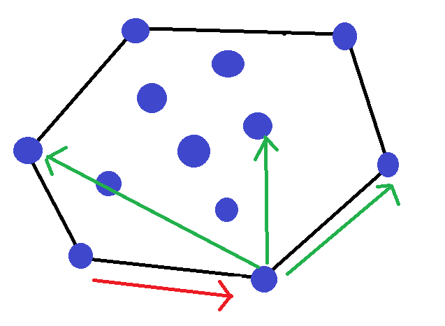

> 原文链接: https://leetcode-cn.com/problems/you-le-yuan-de-mi-gong


## 英文原文
<div></div>

## 中文题目
<div><p>小王来到了游乐园，她玩的第一个项目是模拟推销员。有一个二维平面地图，其中散布着 <code>N</code> 个推销点，编号 <code>0</code> 到 <code>N-1</code>，不存在三点共线的情况。每两点之间有一条直线相连。游戏没有规定起点和终点，但限定了每次转角的方向。首先，小王需要先选择两个点分别作为起点和终点，然后从起点开始访问剩余 <code>N-2</code> 个点恰好一次并回到终点。访问的顺序需要满足一串给定的长度为 <code>N-2</code> 由 <code>L</code> 和 <code>R</code> 组成的字符串 <code>direction</code>，表示从起点出发之后在每个顶点上转角的方向。根据这个提示，小王希望你能够帮她找到一个可行的遍历顺序，输出顺序下标（若有多个方案，输出任意一种）。可以证明这样的遍历顺序一定是存在的。</p>

<p></p>

<p>（上图：A-&gt;B-&gt;C 右转； 下图：D-&gt;E-&gt;F 左转）</p>

<p><strong>示例 1：</strong></p>

<blockquote>
<p>输入：<code>points = [[1,1],[1,4],[3,2],[2,1]], direction = "LL"</code></p>

<p>输入：<code>[0,2,1,3]</code></p>

<p>解释：[0,2,1,3] 是符合"LL"的方案之一。在 [0,2,1,3] 方案中，0-&gt;2-&gt;1 是左转方向， 2-&gt;1-&gt;3 也是左转方向 </p>
</blockquote>

<p><strong>示例 2：</strong></p>

<blockquote>
<p>输入：<code>points = [[1,3],[2,4],[3,3],[2,1]], direction = "LR"</code></p>

<p>输入：<code>[0,3,1,2]</code></p>

<p>解释：[0,3,1,2] 是符合"LR"的方案之一。在 [0,3,1,2] 方案中，0-&gt;3-&gt;1 是左转方向， 3-&gt;1-&gt;2 是右转方向</p>
</blockquote>

<p><strong>限制：</strong></p>

<ul>
	<li><code>3 &lt;= points.length &lt;= 1000 且 points[i].length == 2</code></li>
	<li><code>1 &lt;= points[i][0],points[i][1] &lt;= 10000</code></li>
	<li><code>direction.length == points.length - 2</code></li>
	<li><code>direction 只包含 "L","R"</code></li>
</ul>
</div>

## 通过代码
<RecoDemo>
</RecoDemo>


## 高赞题解
构造方法:
1. 选取一个凸包顶点作为起点.
2. 如果下一步要左(右)拐,移动到逆(顺)时针凸包上下一个顶点.

如图,如果沿着红色箭头移动到逆时针下一个点,那么下一步(绿色箭头)无论走向哪个点,都是左拐.
3. 去掉当前点并移动到下一个点时,下一个点仍在新的凸包上,因此可以回到第2步.

1'. 因为没有三点共线,横(纵)坐标最小(大)的点一定在凸包上,随便选一个即可.
2'. 如何找到逆(顺)时针方向凸包上下一个顶点?
使用叉积,以逆时针为例,如果$B$是$A$逆时针方向下一个点,那么对于所有其他点$C$都有:
$$\vec{AB}\times\vec{AC}>0.$$

复杂度为$O(n^2)$.代码中$m$为当前点,$q$为下一个点.

```C++
using LL = long long;
struct Point{
    LL x, y;
    Point operator - (const Point& p){
        return{x - p.x, y - p.y};
    }
    LL operator * (const Point &p){
        return x * p.y - y * p.x;
    }
};
class Solution {
public:
    
    vector<int> visitOrder(vector<vector<int>>& points, string direction) {
        int n = points.size();
        vector<int> ans;
        vector<int> vis(n);
        vector<Point> vp(n);
        for(int i = 0; i < n; i += 1) vp[i] = {points[i][0], points[i][1]};
        int m = 0;
        for(int i = 1; i < n; i += 1)
            if(vp[i].x < vp[m].x) m = i;
        ans.push_back(m);
        vis[m] = 1;
        for(int i = 0; i < n - 2; i += 1){
            int q = -1;
            for(int j = 0; j < n; j += 1) if(not vis[j])
                if(q == -1) q = j;
                else{
                    if(direction[i] == 'L'){
                        if((vp[q] - vp[m]) * (vp[j] - vp[m]) < 0) q = j;
                    }
                    else{
                        if((vp[q] - vp[m]) * (vp[j] - vp[m]) > 0) q = j;
                    }
                }
            m = q;
            vis[q] = 1;
            ans.push_back(m);
        }
        for(int i = 0; i < n; i += 1) if(not vis[i]) ans.push_back(i);
        return ans;
    }
};
```


## 统计信息
| 通过次数 | 提交次数 | AC比率 |
| :------: | :------: | :------: |
|    909    |    1567    |   58.0%   |

## 提交历史
| 提交时间 | 提交结果 | 执行时间 |  内存消耗  | 语言 |
| :------: | :------: | :------: | :--------: | :--------: |
