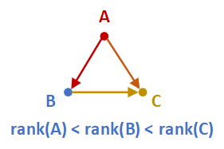
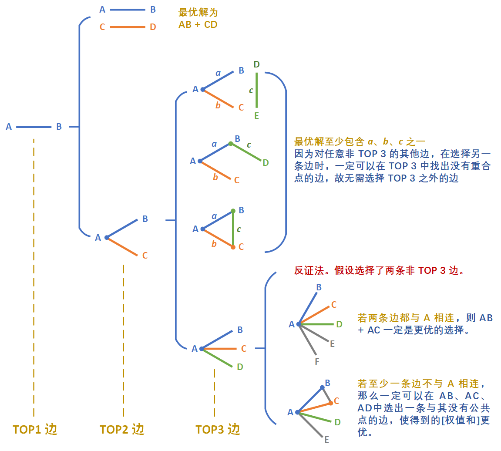

> 原文链接: https://leetcode-cn.com/problems/you-le-yuan-de-you-lan-ji-hua


## 英文原文
<div></div>

## 中文题目
<div><p>又到了一年一度的春游时间，小吴计划去游乐场游玩 1 天，游乐场总共有 <code>N</code> 个游乐项目，编号从 <code>0</code> 到 <code>N-1</code>。小吴给每个游乐项目定义了一个非负整数值 <code>value[i]</code> 表示自己的喜爱值。两个游乐项目之间会有双向路径相连，整个游乐场总共有 <code>M</code> 条双向路径，保存在二维数组&nbsp;<code>edges</code>中。 小吴计划选择一个游乐项目 <code>A</code> 作为这一天游玩的重点项目。上午小吴准备游玩重点项目 <code>A</code> 以及与项目 <code>A</code> 相邻的两个项目 <code>B</code>、<code>C</code> （项目<code>A</code>、<code>B</code>与<code>C</code>要求是不同的项目，且项目<code>B</code>与项目<code>C</code>要求相邻），并返回 <code>A</code> ，即存在一条 <code>A-B-C-A</code> 的路径。 下午，小吴决定再游玩重点项目 <code>A</code>以及与<code>A</code>相邻的两个项目 <code>B&#39;</code>、<code>C&#39;</code>，（项目<code>A</code>、<code>B&#39;</code>与<code>C&#39;</code>要求是不同的项目，且项目<code>B&#39;</code>与项目<code>C&#39;</code>要求相邻），并返回 <code>A</code> ，即存在一条 <code>A-B&#39;-C&#39;-A</code> 的路径。下午游玩项目 <code>B&#39;</code>、<code>C&#39;</code> 可与上午游玩项目<code>B</code>、<code>C</code>存在重复项目。 小吴希望提前安排好游玩路径，使得喜爱值之和最大。请你返回满足游玩路径选取条件的最大喜爱值之和，如果没有这样的路径，返回 <code>0</code>。 注意：一天中重复游玩同一个项目并不能重复增加喜爱值了。例如：上下午游玩路径分别是 <code>A-B-C-A</code>与<code>A-C-D-A</code> 那么只能获得 <code>value[A] + value[B] + value[C] + value[D]</code> 的总和。</p>

<p><strong>示例 1：</strong></p>

<blockquote>
<p>输入：<code>edges = [[0,1],[1,2],[0,2]], value = [1,2,3]</code></p>

<p>输出：<code>6</code></p>

<p>解释：喜爱值之和最高的方案之一是 0-&gt;1-&gt;2-&gt;0 与 0-&gt;2-&gt;1-&gt;0 。重复游玩同一点不重复计入喜爱值，返回1+2+3=6</p>
</blockquote>

<p><strong>示例 2：</strong></p>

<blockquote>
<p>输入：<code>edges = [[0,2],[2,1]], value = [1,2,5]</code></p>

<p>输出：<code>0</code></p>

<p>解释：无满足要求的游玩路径，返回 0</p>
</blockquote>

<p><strong>示例 3：</strong></p>

<blockquote>
<p>输入：<code>edges = [[0,1],[0,2],[0,3],[0,4],[0,5],[1,3],[2,4],[2,5],[3,4],[3,5],[4,5]], value = [7,8,6,8,9,7]</code></p>

<p>输出：<code>39</code></p>

<p>解释：喜爱值之和最高的方案之一是 3-&gt;0-&gt;1-&gt;3 与 3-&gt;4-&gt;5-&gt;3 。喜爱值最高为 7+8+8+9+7=39</p>
</blockquote>

<p><strong>限制：</strong></p>

<ul>
	<li><code>3 &lt;= value.length &lt;= 10000</code></li>
	<li><code>1 &lt;=&nbsp;edges.length &lt;= 10000</code></li>
	<li><code>0 &lt;= edges[i][0],edges[i][1] &lt;&nbsp;value.length</code></li>
	<li><code>0 &lt;= value[i] &lt;= 10000</code></li>
	<li><code>edges中没有重复的边</code></li>
	<li><code>edges[i][0] != edges[i][1]</code></li>
</ul>
</div>

## 通过代码
<RecoDemo>
</RecoDemo>


## 高赞题解
#### 首先感谢题解中各位大佬的点拨
### 解题思路
题意可以等价为，对任意点 $A$，找出两个经过 $A$ 三元环（三角形）$ABC$ 和 $AB'C'$，使得其经过的点的权值最大。
那么，我们的思路可以分为两部分：
1. 找出图中所有的三元环，并将三元环按照顶点归类。
2. 枚举顶点。对于所有连接到该顶点的三元环，找出其中的两个，使其覆盖的权值最大。
### 第一步：找出所有的三元环

#### 暴力法
暴力寻找三元环的方法为：
1. 枚举边。
2. 对于边的顶点 1，找出所有与其直接相连的点，并标记。
3. 对于边的顶点 2，检查所有与其直接相连的点，如果该点被标记，则找到了一个三元环。

这样，若总共有 $N$ 个点，$M$ 条边，由于每个点最多有 $N - 1$ 条边，故总的时间复杂度为 $O(MN)$，当 $M$,$N$ 都很大（$10^4$）时，会超时。
#### 改进的暴力法
我们可以稍微改进一下暴力法，以减小其时间复杂度。
首先，我们可以为每条边设定一个方向，让它从度数低的点（即连边较少的点）指向度数高的点。如果两个点的度数相同，则从序号小的点指向序号大的点。
然后，再应用上述暴力法，即可找出所有的三元环，但是时间复杂度降低到 $O(M\sqrt{M})$。

**证明**：我们将证明两个结论。
1. **该法可以找出所有的不重复的三元环。**
**证**：我们可以规定一个关于节点的 **排序**。排序原则为：度数小的点排名在前；若度数相同，序号小的点排名在前。记任一节点 $X$ 的排名为 $rank(X)$。当我们按照上述方法将无向图有向化之后，原图中连接 $X$ 和 $Y$ 的无向边，现在变为从 $rank$ 值小的点指向 $rank$ 值大的点的有向边，即若 $rank(X) < rank(Y)$，则 $X → Y$；反之 $X ← Y$。
假设图中存在三元环（三角形）$ABC$，不妨设 $rank(A) < rank(B) < rank(C)$。则在有向图中，其边的指向如下图所示：

图中，$C$ 的 $rank$ 最大，因此其入度为 $2$。当我们枚举边 $AB$ 时，由于 $A,B$ 都有边指向 $C$，故可找到三元环 $ABC$。但是，当我们枚举边 $AC$ 和边 $BC$ 时，是找不出三元环 $ABC$ 的，因为没有两条边同时指向 $B$ （或 $A$）。
综上所述，图中所有不重复的三元环都会被找到，并且只会被找到 $1$ 次。
2. **该法的时间复杂度为 $O(M\sqrt{M})$**。
**证**：在原无向图中，度数高于 $\sqrt{M}$ 的点最多有 $2\sqrt{M}$ 个（否则整个图中会有超过 $M$ 条边，与题设矛盾）。而经过有向化，度数低的点只能指向度数高的点，因此无论一个点在无向图中的度数是否高于 $\sqrt{M}$，经过有向化后，其 **连出** 的边数（出度）都不会大于 $2\sqrt{M}$ 条。
在算法执行过程中，需要枚举 $M$ 条边，而由于每个顶点连出的边数不大于 $2\sqrt{M}$，故枚举一条边最多需要花费 $2\sqrt{M} + 2\sqrt{M}$ 的时间，总的时间复杂度为 $O(4M\sqrt{M}) = O(M\sqrt{M})$。

### 第二步：找出覆盖权值最大的两个三角形
我们可以枚举顶点 $V$，然后遍历所有与其相连的三元环 $VAB$，并找出能使无重复权值和最大的两个。
这样，由于 $V$ 是固定的，问题转化为：**在边的集合 $S$ 中，选择两条边，使无重复的点权之和最大**。
设 $S$ 中元素的个数为 $K$。暴力枚举的方式的复杂度为 $O(K^2)$。
#### 贪心猜想 + 证明
有人可能想到贪心。
- 比如说，我们直接选权值和最大的两条边。
- 当两条边之间没有重复点时，这样做是可以的。但若有重复点，可能会有其他的互不重复的两条边更优。
- 这应当怎么办？可以继续尝试贪心，举个例子，选取权值和第三大的边。我们发现，如果第三大的边与第一大的边没有重复，则结果至少是 第三大的边的权值和 + 第一大的边的权值和，因此可以排除所有的包含 第四大的边、第五大的边...等等的解，其不会更优。
- 换句话说，**我们可以根据贪心思想，尽可能地缩小解的搜索范围**。

**通过贪心思想 + 一定的推理，我们可以证明一个猜想：最优解至少包含权值和前三大的边之一**。证明见下图。

搜索范围被大大减小，复杂度也因此降低为 $O(3K)$ = $O(K)$。

#### 剪枝
记权值第 $i$ 大的边 $i$ 的权值和为 $W(i)$。边按照权值递减排序。
- 我们首先搜索权值和第 $1$ 大的边 $1$，与其他边结合后的权值和。如果搜索到边 $i$ 时，发现其与第一大的边之间没有重复点，那么剩下的边就都不用搜索了，
因为结果不会比 $W(1) + W(i)$ 更优。
- 另外，当我们继续寻找与权值第 $2$ 大的边 $2$ 结合的边时，也不用搜索边 $i$ 及其之后的边了，
因为 $W(2) + W(i+k)(k>=0) \leq W(1) + W(i)$。

### 代码实现
用时 420 ~ 440ms，100%
```cpp
class Solution {
public:
    int maxWeight(vector<vector<int>>& E, vector<int>& W) {
        int N = W.size(), M = E.size(), cnts[N];
       
        // 对边按权值和排序，以便之后对每个点，直接获得按权值和排序的边
        sort(E.begin(), E.end(), [&](vector<int>& a, vector<int>& b) {
            return W[a[0]] + W[a[1]] > W[b[0]] + W[b[1]];
        });

        // 统计各个点的度数（出边数量）
        memset(cnts, 0, sizeof(cnts));
        for(auto v : E) 
            ++cnts[v[0]], ++cnts[v[1]];

        // 将无向图重建为有向图
        vector<pair<int,int>> G[N];
        for(int i = 0; i < M; ++i) {
            if(cnts[E[i][0]] < cnts[E[i][1]] || (cnts[E[i][0]] == cnts[E[i][1]] && E[i][0] < E[i][1]))
                G[E[i][0]].push_back({E[i][1], i});
            else
                G[E[i][1]].push_back({E[i][0], i});
        }

        // 求所有的三元环，并按边归类
        vector<int> nodes[M];
        int vis[N], idxs[N];
        memset(vis, 0xff, sizeof(vis));
        for(int i = 0; i < M; ++i) {
            for(pair<int, int> &ne : G[E[i][0]])
                vis[ne.first] = i, idxs[ne.first] = ne.second;
            for(pair<int, int> &ne : G[E[i][1]]) {
                if(vis[ne.first] == i) {
                    nodes[ne.second].push_back(E[i][0]);
                    nodes[idxs[ne.first]].push_back(E[i][1]);
                    nodes[i].push_back(ne.first);
                }
            }
        }

        // 将三元环按顶点归类，每个顶点自动获得按权值和排序的边
        vector<int> C[N];
        for(int i = 0; i < M; ++i)
            for(int n : nodes[i])
                C[n].push_back(i);
        
        // 求出结果
        int res = 0;
        for(int i = 0; i < N; ++i) {
            int bound = (int)C[i].size() - 1;
            for(int a = 0; a < min(3, (int)C[i].size()) && bound >= a; ++a) {
                for(int b = a; b <= bound; ++b) {
                    int cur = W[i] + W[E[C[i][a]][0]] + W[E[C[i][a]][1]], cnt = 0;
                    if(E[C[i][b]][0] != E[C[i][a]][0] && E[C[i][b]][0] != E[C[i][a]][1])
                        cur += W[E[C[i][b]][0]], ++cnt;
                    if(E[C[i][b]][1] != E[C[i][a]][0] && E[C[i][b]][1] != E[C[i][a]][1])
                        cur += W[E[C[i][b]][1]], ++cnt;
                    res = max(res, cur);
                    if(cnt == 2) {
                        bound = b-1;
                        break;
                    }
                }
            }
        }
        return res;
    }
};
```

## 统计信息
| 通过次数 | 提交次数 | AC比率 |
| :------: | :------: | :------: |
|    655    |    2105    |   31.1%   |

## 提交历史
| 提交时间 | 提交结果 | 执行时间 |  内存消耗  | 语言 |
| :------: | :------: | :------: | :--------: | :--------: |
