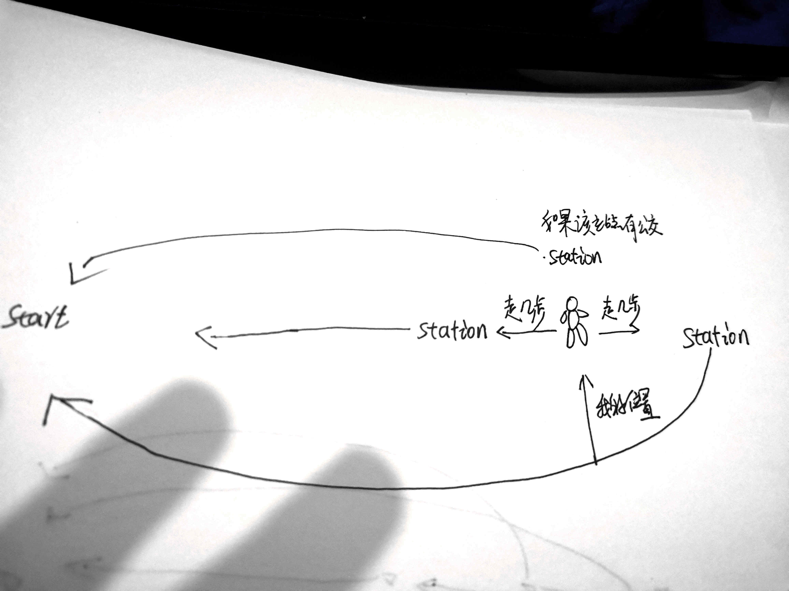

> 原文链接: https://leetcode-cn.com/problems/meChtZ


## 英文原文
<div></div>

## 中文题目
<div>小扣打算去秋日市集，由于游客较多，小扣的移动速度受到了人流影响：
- 小扣从 `x` 号站点移动至 `x + 1` 号站点需要花费的时间为 `inc`；
- 小扣从 `x` 号站点移动至 `x - 1` 号站点需要花费的时间为 `dec`。

现有 `m` 辆公交车，编号为 `0` 到 `m-1`。小扣也可以通过搭乘编号为 `i` 的公交车，从 `x` 号站点移动至 `jump[i]*x` 号站点，耗时仅为 `cost[i]`。小扣可以搭乘任意编号的公交车且搭乘公交次数不限。

假定小扣起始站点记作 `0`，秋日市集站点记作 `target`，请返回小扣抵达秋日市集最少需要花费多少时间。由于数字较大，最终答案需要对 1000000007 (1e9 + 7) 取模。

注意：小扣可在移动过程中到达编号大于 `target` 的站点。

**示例 1：**
>输入：`target = 31, inc =  5, dec = 3, jump = [6], cost = [10]`
>
>输出：`33`
>
>解释：
>小扣步行至 1 号站点，花费时间为 5；
>小扣从 1 号站台搭乘 0 号公交至 6 * 1 = 6 站台，花费时间为 10；
>小扣从 6 号站台步行至 5 号站台，花费时间为 3；
>小扣从 5 号站台搭乘 0 号公交至 6 * 5 = 30 站台，花费时间为 10；
>小扣从 30 号站台步行至 31 号站台，花费时间为 5；
>最终小扣花费总时间为 33。


**示例 2：**
>输入：`target = 612, inc =  4, dec = 5, jump = [3,6,8,11,5,10,4], cost = [4,7,6,3,7,6,4]`
>
>输出：`26`
>
>解释：
>小扣步行至 1 号站点，花费时间为 4；
>小扣从 1 号站台搭乘 0 号公交至 3 * 1 = 3 站台，花费时间为 4；
>小扣从 3 号站台搭乘 3 号公交至 11 * 3 = 33 站台，花费时间为 3；
>小扣从 33 号站台步行至 34 站台，花费时间为 4；
>小扣从 34 号站台搭乘 0 号公交至 3 * 34 = 102 站台，花费时间为 4；
>小扣从 102 号站台搭乘 1 号公交至 6 * 102 = 612 站台，花费时间为 7； 
>最终小扣花费总时间为 26。


**提示：**
- `1 <= target <= 10^9`
- `1 <= jump.length, cost.length <= 10`
- `2 <= jump[i] <= 10^6`
- `1 <= inc, dec, cost[i] <= 10^6`</div>

## 通过代码
<RecoDemo>
</RecoDemo>


## 高赞题解
### 解题思路
此处撰写解题思路

具体想法就是，我从终点倒推回去，我能当前站点如何前往起点有四种方式
1，直接从当前站走回起点站
2，假如恰好当前站能坐快速公交，那就坐公交去下一站再递归
3，当前站没有快速公交，我往前走几步到达公交站点坐快速公交去下一站再递归，相当于取余不为0
4，当前站没有快速公交，我往后走几步到达公交站坐快速公交去下一站在递归，跟3类似

这四种情况取最小值就是当前站前往起点的最小代价
具体看代码



### 代码

```python
class Solution(object):
    def busRapidTransit(self, target, inc, dec, jump, cost):
        """
        :type target: int
        :type inc: int
        :type dec: int
        :type jump: List[int]
        :type cost: List[int]
        :rtype: int
        """
        #自底向上记忆化递推   
        memo = dict() #记忆字典
        def findroute(cur_target):  
            if cur_target==0:     #当前站点已经是0了返回0代价
                return 0
            if cur_target in memo:
                return memo[cur_target]
            mincost = cur_target*inc  #最小代价初始化为直接回终点站，我相信这种情况应该存在

            for i,val in enumerate(jump): #遍历附近的公交站点
                if cur_target>1:#至少得大于1，不然我自己走了还坐个屁公交
                    if cur_target%val==0: #当前站能够坐公交
                        mincost =min(mincost,cost[i]+findroute(cur_target//val)) #递归下一站
                    else:
                        bias = cur_target%val #当前站不能做公交看看需要走几步到达公交站  
                        if cur_target-bias>0: #往前走几步如果没到终点，就该坐公交，递归下一站
                            mincost=min(mincost,bias*inc+cost[i]+findroute(cur_target//val))

                        mincost = min(mincost,(val-bias)*dec+cost[i]+findroute(cur_target//val+1))#往后走几步坐公交递归下一站
            memo[cur_target]=mincost
            return mincost

        return findroute(target)%(1000000007)
```

## 统计信息
| 通过次数 | 提交次数 | AC比率 |
| :------: | :------: | :------: |
|    1865    |    5892    |   31.7%   |

## 提交历史
| 提交时间 | 提交结果 | 执行时间 |  内存消耗  | 语言 |
| :------: | :------: | :------: | :--------: | :--------: |
