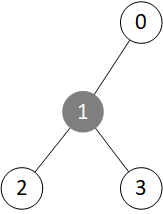
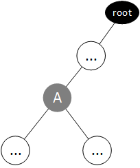
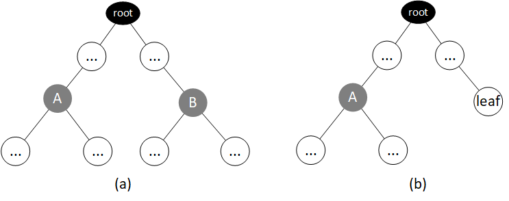
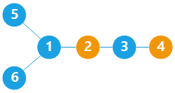
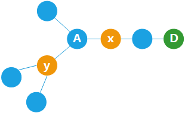
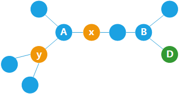
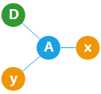

> 原文链接: https://leetcode-cn.com/problems/hSRGyL


## 英文原文
<div></div>

## 中文题目
<div>小扣参加的秋日市集景区共有 $N$ 个景点，景点编号为 $1$~$N$。景点内设有 $N-1$ 条双向道路，使所有景点形成了一个二叉树结构，根结点记为 `root`，景点编号即为节点值。

由于秋日市集景区的结构特殊，游客很容易迷路，主办方决定在景区的若干个景点设置导航装置，按照所在景点编号升序排列后定义装置编号为 1 ~ M。导航装置向游客发送数据，数据内容为列表 `[游客与装置 1 的相对距离,游客与装置 2 的相对距离,...,游客与装置 M 的相对距离]`。由于游客根据导航装置发送的信息来确认位置，因此主办方需保证游客在每个景点接收的数据信息皆不相同。请返回主办方最少需要设置多少个导航装置。

**示例 1：**
>输入：`root = [1,2,null,3,4]`
>
>输出：`2`
>
>解释：在景点 1、3 或景点 1、4 或景点 3、4 设置导航装置。
>
>{:height="250px"}



**示例 2：**
>输入：`root = [1,2,3,4]`
>
>输出：`1`
>
>解释：在景点 3、4 设置导航装置皆可。
>
>{:height="200px"}



**提示：**
- `2 <= N <= 50000`
- 二叉树的非空节点值为 `1~N` 的一个排列。
</div>

## 通过代码
<RecoDemo>
</RecoDemo>


## 高赞题解
### 解题思路

#### 算法思路
观察一个 “三叉节点”（既有父节点又有两个子节点的节点），如下图中的节点 $1$：

我们发现，如果只在节点 $0$ 部署装置，则无法区分 $2$、$3$；如果在节点 $2$ 部署装置，则无法区分 $0$、$3$；如果在节点 $3$ 部署装置，则无法区分 $0$、$2$。（部署在节点 $1$ 更不行，三个都区分不了）
也就是说，一个“三叉节点” 的 $3$ 个 “子树” （把父节点也算上）中，至少有 $2$ 个有导航装置。

有了这个结论，我们看看是否能用万能的 dfs 来解题。但很快就有一个问题，当 dfs 到某个节点时，我们并不知道其 父节点 那个子树是否有导航装置。

那么怎么办呢？可以 先假设父节点方向 有 导航装置，然后进行 dfs。

定义函数 $\texttt{dfs(node)}$ 的返回值：节点 $\texttt{node}$ 所在的子树中，是否 放置了 导航装置。dfs 时：

- 如果一个节点是叶子节点（或者 $\texttt{null}$），则我们先暂时不放导航装置，返回 $0$。

- 如果一个节点是“三叉节点”（拥有左、右两个子节点和父节点），且左、右两个子节点都 没有 导航装置（dfs 返回 $0$），那么我们 必须 在左右两个子树中，至少一个放置导航装置（至于放到哪个子树，我们不关心），答案 $+1$。然后函数返回 $1$，表明该节点的子树中，放置了导航装置。

- 如果 dfs 时，发现 $\texttt{dfs(left)}$ 或 $\texttt{dfs(right)}$ 返回 $1$ 时，则证明左子树或者右子树中，至少有 $1$ 个有导航装置，那么再加上 父节点方向 的导航装置（根据假设），有两个够用了，于是不用增加答案。但是函数仍然返回 $1$，代表该节点的子树中，放置了导航装置。

我们还可以发现：
- 如果一个节点 $\texttt{node}$（及其下方的子树）不是一条链（包含三叉节点），则 $\texttt{dfs(node)}$ 一定返回 $1$；
- 反之，$\texttt{dfs(node)}$ 一定返回 $0$，并且 $\texttt{dfs(node)}$ 不会增加答案。

好了，不要忘了我们之前假设 父节点方向 有导航装置。那么当 dfs 结束后，还需要重新检查一番。

如果根节点是一个 “叶子” 节点（即只有 左/右 一棵子树），那么我们需要检测 离根节点最近的 三叉节点（下图中的节点 $A$）：
- 如果该三叉节点 $A$ 的左右两棵子树中，都包含导航装置，则节点 $A$ 无需在父节点方向上增加导航装置。此外，节点 $A$ 的左子树的节点的父节点方向（也就是外部）也有导航装置（在节点 $A$ 的右子树中），右子树同理，故无需增加答案。
- 否则，需要再在根节点上加一个导航装置。


如果根节点有两棵子树，则分三种情况：
- 如果根节点的两棵子树都包含三叉节点（此时 $\texttt{dfs(l)}$ 和 $\texttt{dfs(r)}$ 都会返回 $1$），如下图中的 $(a)$ 情况，则节点 $A$ 和 节点 $B$ 下方的子树中都会放置导航装置，因此节点 $A$ （及其子节点）的父节点方向有导航装置（在根节点的另一棵子树中）；节点 $B$ 同理，因此无需增加答案。
- 如果根节点的两棵子树之一包含三叉节点（此时 $\texttt{dfs(l)}$ 和 $\texttt{dfs(r)}$ 只有一个返回 $1$），另一棵子树是一条链，如下图中的 $(b)$ 情况，我们注意到，这种情况和 “根节点只有 $1$ 棵子树” 的情况并没有本质不同（因为节点 $A$ 的父节点方向的形状都是一条链，都没有放导航装置），故判断逻辑也是一样的：判断距离根节点最近的三叉节点 $A$ 的左右两棵子树中是否都有导航装置。
- 如果根节点的两棵子树都是一条链（此时 $\texttt{dfs(l)}$ 和 $\texttt{dfs(r)}$ 都返回 $0$），则整棵树是一条链，因此总共需要 $1$ 个导航装置；而此时因为 $\texttt{dfs(l)}$ 和 $\texttt{dfs(r)}$ 都不会增加答案，故最后也需要给答案 $+1$。



代码中 变量 $\texttt{s}$ 就记录了距根节点最近的三叉节点 是否 子树都含有导航装置。

$\texttt{s}$ 的初值设为 $1$，因为如果树是一条链，则 $\texttt{s}$ 的值不会改变，而这种情况最终答案还是要 $+1$ 的。

#### 代码
```cpp
class Solution {
public:
    int res = 0, s = 1;
    int dfs(TreeNode* root) {
        if(!root) {
            return 0;
        }
        int l = dfs(root->left), r = dfs(root->right);
        if(root->left && root->right) {
            res += !l && !r;
            s = !(l && r);
            return 1;
        }
        return l || r;
    }
    int navigation(TreeNode* root) {
        int l = dfs(root->left), r = dfs(root->right);
        return res + ((l && r)? 0 : s);
    }
};
```
时间、空间复杂度：$O(N)$。

#### 想要证明的往下看

**证明：如果树不是一条链，在最优化导航装置的位置的前提下，能够区分树中所有节点的 充分必要条件 是：所有三叉节点的 $3$ 个子树中，至少有 $2$ 个子树中有导航装置。**
（如果树是一条链，则需要 $1$ 个导航装置）


**一、充分性。** 我们任取两个节点。有 $2$ 种可能的情况：
1. 两个节点在同一路径上（这意味着两个节点之间没有三叉节点）， 举例如图所示，选取了节点 $2$ 和节点 $4$。

三叉节点 $1$ 至少有两个子树中有装置， $5$ 和 $6$ 上至少有一个。而 $5$ 或 $6$ 上的装置都能区分节点 $2$ 和 $4$。

2. 如果两个节点不在同一条链上，那它们一定位于某一三叉节点的不同子树中。这样，其中一个节点所在的子树中一定含有导航装置。我们设这个节点为节点 $x$，另一个节点为节点 $y$，导航装置在节点 $D$ 上。具体也分两种情况。
情形一：节点 $x$ 所在的子树是一条链，不包含三叉节点，如下图所示，节点 $x$ 在三叉节点 $A$ 的子树中。

此时，将导航装置 $D$ 放在 $x$ 所在叶子节点，则 $D$ 与 $x$，$y$ 的距离一定不同。
情形二：节点 $x$ 所在的子树不是一条链，意味着它还有子树，如下图所示。

此时，三叉节点 $B$ 右侧的两个子树中至少有一个包含导航装置。而这个导航装置距离 $x$ 一定比 $y$ 更近。

3. 综上所述，我们证明了：如果每个三叉节点的 $3$ 个子树中，至少有 $2$ 个中有装置，**则存在一种方案，使任何两点都能够得到区分**。

**二、必要性。** 如果某三叉节点只有 $0$ 个或 $1$ 个子树中包含导航装置，则一定存在两点不能被区分，如下图中的 $x$ 和 $y$。


## 统计信息
| 通过次数 | 提交次数 | AC比率 |
| :------: | :------: | :------: |
|    582    |    1713    |   34.0%   |

## 提交历史
| 提交时间 | 提交结果 | 执行时间 |  内存消耗  | 语言 |
| :------: | :------: | :------: | :--------: | :--------: |
