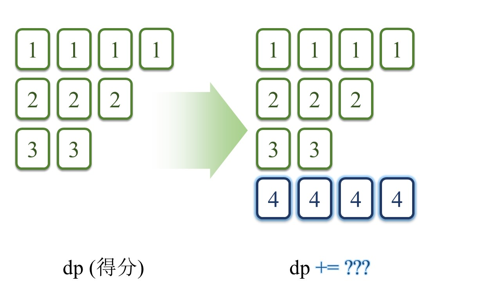

> 原文链接: https://leetcode-cn.com/problems/Up5XYM


## 英文原文
<div></div>

## 中文题目
<div>麻将的游戏规则中，共有两种方式凑成「一组牌」：
- 顺子：三张牌面数字连续的麻将，例如 [4,5,6]
- 刻子：三张牌面数字相同的麻将，例如 [10,10,10]

给定若干数字作为麻将牌的数值（记作一维数组 `tiles`），请返回所给 `tiles` 最多可组成的牌组数。

注意：凑成牌组时，每张牌仅能使用一次。

**示例 1：**
>输入：`tiles = [2,2,2,3,4]`
>
>输出：`1`
>
>解释：最多可以组合出 [2,2,2] 或者 [2,3,4] 其中一组牌。

**示例 2：**
>输入：`tiles = [2,2,2,3,4,1,3]`
>
>输出：`2`
>
>解释：最多可以组合出 [1,2,3] 与 [2,3,4] 两组牌。

**提示：**
- `1 <= tiles.length <= 10^5`
- `1 <= tiles[i] <= 10^9`</div>

## 通过代码
<RecoDemo>
</RecoDemo>


## 高赞题解
原作者：[@lucifer1004](/u/lucifer1004/)
原回答：[【DP】为什么每种牌最多留4张？](https://leetcode-cn.com/problems/Up5XYM/solution/dp-wei-shi-yao-mei-chong-pai-zui-duo-liu-mun5/)


## 第一步：整理牌序
首先，将 `tiles` 变为 `map<int, int>`。其中，**键**是**点数**, 而**值**是对应的**牌数**，C++中的`map`是按照**键**从小到大排列的。


```cpp
map<int, int> count;
for (auto tile : tiles)
    count[tile]++;
```

接下来，我们的指针会跟随**点数** `[tile]` 移动，动规数组也会随着 `[tile]` 更新。

## 第二步：状态矩阵

动规的目标毫无疑问：已知之前所有牌面最高得分（记为`dp`），当指针随着**点数**增加时，我们要根据新增加的牌来更新最高得分（记为`dp`）。

例如，在下面这副牌中，假设现在我们遍历到 `[tile] = 4`，我们需要根据`4`的牌数来更新得分。即

`dp += 新增得分`



新增加的得分有两部分：

1. `4`和**之前两张牌**组成的**顺子**得分，
2. `4`自己组成的**刻子**得分。

仔细分析我们发现，有两种不同的情况。  

- **情况1**
之前组成了两副顺子，留下来 1 张 `[2]` 和 0 张 `[3]`，无法和 `[4]` 一起组成新的顺子。因此，新增加的 `[4]` 只带来了 1 分新得分：[4] 的刻子得分。


- **情况2**
之前组成了一副顺子和一副刻子，留下来 2 张 `[2]` 和 1 张 `[3]`，能够 `[4]` 一起组成新的顺子。另外，剩下的 `[4]` 也能组成一副刻子 。因此，新增加的 `[4]` 最多能带来 2 分：一分顺子， 一分刻子。


仔细分析这两种情况：我们发现：  

**影响新增得分的只有`[2]`和`[3]`的剩余牌数，也就是`[tile-2]`和`[tile-1]`的剩余牌数。**  

因此，我们的`dp`应该是一个二维数组，`dp[cnt_2][cnt_1]` 表示：在预留 `cnt_2` 张 `[tile-2]` 和 `cnt_1` 张 `[tile-1]` 的前提下，`[tile]` 之前的牌能组成的牌组数。

## 第三步：压缩状态空间

如果我们把预留数量的所有可能性都列出来，`dp`的大小将有$O(n^2)$。因此，我们考虑**限制预留的牌数**。

预留的牌仅用于跟下两张牌组成顺子，故应考虑**限制顺子的数量**。如下图所示，当相同顺子的数量大于等于3时，我们可以把**每3副顺子换成3副对应的刻子。**


那么，相同顺子的数量`<=2`副。

如下图所示，为`[5]`预留的牌，在未来遍历到`[6]`时，可组成顺子`([4], [5], [6])`；在未来遍历到`[7]`时，可组成顺子`([5], [6], [7])`。


每种顺子不超过2副。因此，我们预留的牌，也不超过4张。

`dp`的空间就压缩到了`dp[0~4][0~4]`，即$O(5^2)$（因为还要考虑一张都不留的情况）。

## 第三步：状态转移方程

根据前面的分析，我们知道，每一步的分数由三部分组成：
1. 之前赚的分数；
2. `[tile-2]`、`[tile-1]`和`[tile]`组成的顺子得分；
3. `[tile]`自己组成的刻子得分。

注意到，我们当前的 `[tile]` 也不要一次性用完，也要考虑留下几张跟后面的牌组成顺子。

那么，我们应该怎么规划**顺子得分**、**刻子得分**和**预留的牌数**呢？我们通过遍历的方式把所有的可能性罗列出来。

<,,,,,,,,,,>

#### 罗列顺子的所有可能性

首先，我们把顺子数量从0开始罗列。  
正如前文所述，我们预留了`cnt_2`张`[tile-2]` 和 `cnt_1`张`[tile-1]`，而现在我们有 `cnt`张新增加的`[tile]`牌。  
组成的顺子数量，不能超过 `cnt_2`、`cnt_1`、`cnt` 的任何一个。

```cpp
for (int shunzi = 0; shunzi <= min(cnt_2, min(cnt_1, cnt)); ++shunzi) {
    ...
```

对于下一个点数而言，`[new_tile-2]` 就是当前的 `[tile-1]`，我们用`new_2` 代表预留的 `[new_tile-2]` 的牌数，这个牌数就是`[tile-1]`的牌数减去顺子数量。

例如，在下面这张图中，下一个点数`[new_tile]`是`5`，`new_1`是预留的`[4]`的数量，`new_2`就是剩下的`[3]`的数量。原来我们有 3 张`[3]`，顺子用掉 2 张，就还剩 1 张。


```cpp
    int new_2 = cnt_1 - shunzi;
```

#### 罗列预留牌数的所有可能性

同样的，我们把当前预留的牌数从0开始罗列。  
对于下一张牌而言，当前的牌面自然是 `[new_tile-1]` 了，所以我们用 `new_1` 代表预留的 `[new_tile-1]` 的牌数，预留的牌数自然不能超过`[tile]`的牌数减去顺子用掉的数量。

```cpp
    for (int new_1 = 0; new_1 <= cnt - shunzi; ++new_1) {
        ...
```

那么，自然地，去掉了顺子数量和预留牌数之后，剩下的 `[tile]` 的数量全部组成刻子，它的得分是：`(cnt - shunzi - new_1) / 3`。

综上所述，新的得分是三者相加，即
```cpp

        int new_score = dp[cnt_2][cnt_1] + shunzi + (cnt - shunzi - new_1) / 3;
```

## 第四步：找到最高分

全部遍历完成后，我们搜索并返回dp的最大值：  

```cpp
int ans = 0;
for (int cnt_2 = 0; cnt_2 < 5; ++cnt_2)
    for (int cnt_1 = 0; cnt_1 < 5; ++cnt_1)
        ans = max(ans, dp[cnt_2][cnt_1]);
return ans;
```


## 最终程序

本程序改编自@lucifer1004 的解答。更改了变量命名，使之更容易被理解。如有错误请指正。

```cpp
class Solution {
public:
    int maxGroupNumber(vector<int>& tiles) {
        map<int, int> count;  // [点数, 对应的牌数]，C++中的map是按照key(点数)从小到大排列的。
        for (auto tile : tiles)
            count[tile]++;

        // dp[x][y] 表示
        // 在预留x张 [tile-2] 和y张 [tile-1] 的前提下，
        // [tile] 之前的牌能组成的牌组数
        vector<vector<int>> dp(5, vector<int>(5, -1));
        dp[0][0] = 0;
        int prev_tile = 0; // 前一张牌的点数
        for (auto [tile, cnt] : count) { // [tile表示当前点数, cnt表示对应的牌数]
            // 如果上一张牌和这张牌没法连起来
            // 意味着无论之前留几张牌，都无法和tile一起组成顺子，因此，只保留dp[0][0]的情形。
            if (prev_tile != tile - 1) {     
                // dp[0][0] 表示，之前留下的 “tile-2点的牌数” 和 “tile-1点的牌数” 都为0
                int dp00 = dp[0][0];
                // dp[x][y] == -1 表示，之前没有 “留下x张[tile-2]点的和y张[tile-1]点” 的情况
                dp = vector<vector<int>>(5, vector<int>(5, -1));
                dp[0][0] = dp00;
            }
            // 新的dp数组
            vector<vector<int>> new_dp(5, vector<int>(5, -1));
            
            for (int cnt_2 = 0; cnt_2 < 5; ++cnt_2) // [tile-2] 的牌数
                for (int cnt_1 = 0; cnt_1 < 5; ++cnt_1) { // [tile-1] 的牌数
                    // 如果之前没有留下这么多张牌
                    if (dp[cnt_2][cnt_1] < 0)
                        continue;

                    // 顺子数量不能超过[tile-2]、[tile-1]、[tile]的牌数
                    for (int shunzi = 0; shunzi <= min(cnt_2, min(cnt_1, cnt)); ++shunzi) {
                        int new_2 = cnt_1 - shunzi; // 对于下一个点数 new_tile = tile + 1 而言，
                                                    // [new_tile - 2] 就是当前的 [tile - 1]
                                                    // new_2 代表预留的 [new_tile - 2] 的牌数
                                                    // 也就是当前的 [tile - 1] 的牌数 - 顺子数量
                        // 同理，对于下一个点数 [new_tile] 而言，new_1 代表预留的 [new_tile - 1] 的牌数，
                        // 也就是预留的 [tile] 的数量。
                        // 预留的数量不超过四张，也不超过 ( [tile]的牌数 - 顺子数量 )
                        for (int new_1 = 0; new_1 <= min(4, cnt - shunzi); ++new_1) {
                            // 新的牌组数等于以下三者相加：
                            // 1. dp数组保存的，留下 cnt_2 张 [tile-2] 和 cnt_1 张 [tile-1] 的前提下，tile-1 之前的牌面能凑出来的牌组数
                            // 2. 顺子数量
                            // 3. [tile] 组成的刻子数量 = ( [tile] - 顺子数量 - 留下备用的牌 ) / 3
                            int new_score = dp[cnt_2][cnt_1] + shunzi + (cnt - shunzi - new_1) / 3;
                            new_dp[new_2][new_1] = max(new_dp[new_2][new_1], new_score);
                        }
                    }
                }
            
            // 将new_dp数组赋值给dp数组
            dp = move(new_dp);
            // 将当前tile记录都上一个tile中
            prev_tile = tile;
        }
        
        // 找到并返回dp的最大值
        int ans = 0;
        for (int cnt_2 = 0; cnt_2 < 5; ++cnt_2)
            for (int cnt_1 = 0; cnt_1 < 5; ++cnt_1)
                ans = max(ans, dp[cnt_2][cnt_1]);
        
        return ans;
    }
};
```

顺带分享一道类似问题：  

[546. 移除盒子 | 题解](https://leetcode-cn.com/problems/remove-boxes/solution/guan-fang-fang-fa-2ji-yi-hua-sou-suo-dong-hua-tu-j/)

## 统计信息
| 通过次数 | 提交次数 | AC比率 |
| :------: | :------: | :------: |
|    836    |    3118    |   26.8%   |

## 提交历史
| 提交时间 | 提交结果 | 执行时间 |  内存消耗  | 语言 |
| :------: | :------: | :------: | :--------: | :--------: |
