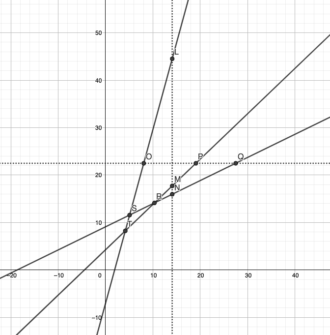

> 原文链接: https://leetcode-cn.com/problems/zui-xiao-ju-xing-mian-ji


## 英文原文
<div></div>

## 中文题目
<div>二维平面上有 $N$ 条直线，形式为 `y = kx + b`，其中 `k`、`b`为整数 且 `k > 0`。所有直线以 `[k,b]` 的形式存于二维数组 `lines` 中，不存在重合的两条直线。两两直线之间可能存在一个交点，最多会有 $C_N^2$ 个交点。我们用一个平行于坐标轴的矩形覆盖所有的交点，请问这个矩形最小面积是多少。若直线之间无交点、仅有一个交点或所有交点均在同一条平行坐标轴的直线上，则返回0。

注意：返回结果是浮点数，与标准答案 **绝对误差或相对误差** 在 10^-4 以内的结果都被视为正确结果


**示例 1：**
> 输入：`lines = [[2,3],[3,0],[4,1]]`
>
> 输出：`48.00000`
>
> 解释：三条直线的三个交点为 (3, 9) (1, 5) 和 (-1, -3)。最小覆盖矩形左下角为 (-1, -3) 右上角为 (3,9)，面积为 48


**示例 2：**
> 输入：`lines = [[1,1],[2,3]]`
>
> 输出：`0.00000`
>
> 解释：仅有一个交点 (-2，-1）


**限制：**
+ `1 <= lines.length <= 10^5 且 lines[i].length == 2`
+ `1 <= lines[0] <= 10000`
+ `-10000 <= lines[1] <= 10000`
+ `与标准答案绝对误差或相对误差在 10^-4 以内的结果都被视为正确结果`</div>

## 通过代码
<RecoDemo>
</RecoDemo>


## 高赞题解
### 解题思路



容易看出，我们只需要找到最上方的交点、最下方的交点、最左边的交点以及最右边的交点，就可以确定最后的矩形。那么，原问题就变为求出这四个交点的位置。

我们以上图为例来进行分析。

首先考虑找最右边的交点。

显然，当$x\rightarrow\infty$时，直线的顺序从下到上满足斜率递增，同斜率的情况下满足截距递增。当我们逐渐向左移动时，这样的规律一直会保持到最右边的交点，也即点R处。之后，无论我们怎么向左移动，都不会恢复到这一顺序。

也即，我们利用直线之间的上下顺序，将整个空间分成了左右两部分。右半边的顺序与$x\rightarrow\infty$的顺序一致；而左半边的顺序与$x\rightarrow\infty$不一致。从而，我们就可以对$x$进行二分查找，确定点R的横坐标。

最左边的交点可以以类似的方法求出。

下面考虑最上面的交点。

当$y\rightarrow\infty$时，直线的顺序从左到右满足斜率递减，同斜率的情况下截距递减。当我们逐渐向下移动时，这样的规律一直保持到最上方的交点，也即点R处。因此，我们可以对$y$进行二分查找，确定点R的纵坐标。

最下方的交点可以以类似的方法求出。

注意在二分检验的时候，我们并不需要对所有的值进行排序，而只需要按照极限情况下的顺序依次计算，判断是否有不满足顺序关系的相邻元素对即可。

总时间复杂度为$\mathcal{O}(N\log N+NT)$。这里$T$是二分查找的最大次数。

### 代码

```cpp
const int T = 50;
const double inf = 1e9;

class Solution {
public:
    double minRecSize(vector<vector<int>>& lines) {
        int n = lines.size();
        if (n == 1)
            return 0.0;
        
        double rl = -inf, rr = inf;
        int t = T;
        sort(lines.begin(), lines.end(), [](vector<int> &a, vector<int> &b){
            return a[0] < b[0] || (a[0] == b[0] && a[1] < b[1]); 
        });
        while (t--) {
            double mid = (rl + rr) * 0.5;
            bool conflict = false;
            for (int i = 0; i < n - 1; ++i) {
                double a = (double)lines[i][0] * mid + lines[i][1];
                double b = (double)lines[i + 1][0] * mid + lines[i + 1][1];
                if (a - b > 1e-8) {
                    conflict = true;
                    break;
                }
            }
            if (conflict)
                rl = mid;
            else
                rr = mid;
        }
        
        t = T;
        double ll = -inf, lr = inf;
        sort(lines.begin(), lines.end(), [](vector<int> &a, vector<int> &b){
            return a[0] > b[0] || (a[0] == b[0] && a[1] < b[1]); 
        });
        while (t--) {
            double mid = (ll + lr) * 0.5;
            bool conflict = false;
            for (int i = 0; i < n - 1; ++i) {
                double a = (double)lines[i][0] * mid + lines[i][1];
                double b = (double)lines[i + 1][0] * mid + lines[i + 1][1];
                if (a - b > 1e-8) {
                    conflict = true;
                    break;
                }
            }
            if (conflict)
                lr = mid;
            else
                ll = mid;
        }
        
        t = T;
        double ul = -inf, ur = inf;
        sort(lines.begin(), lines.end(), [](vector<int> &a, vector<int> &b){
            return a[0] > b[0] || (a[0] == b[0] && a[1] > b[1]); 
        });
        while (t--) {
            double mid = (ul + ur) * 0.5;
            bool conflict = false;
            for (int i = 0; i < n - 1; ++i) {
                double a = (mid - lines[i][1]) / lines[i][0];
                double b = (mid - lines[i + 1][1]) / lines[i + 1][0];
                if (a - b > 1e-8) {
                    conflict = true;
                    break;
                }
            }
            if (conflict)
                ul = mid;
            else
                ur = mid;
        }
        
        t = T;
        double dl = -inf, dr = inf;
        sort(lines.begin(), lines.end(), [](vector<int> &a, vector<int> &b){
            return a[0] < b[0] || (a[0] == b[0] && a[1] > b[1]); 
        });
        while (t--) {
            double mid = (dl + dr) * 0.5;
            bool conflict = false;
            for (int i = 0; i < n - 1; ++i) {
                double a = (mid - lines[i][1]) / lines[i][0];
                double b = (mid - lines[i + 1][1]) / lines[i + 1][0];
                if (a - b > 1e-8) {
                    conflict = true;
                    break;
                }
            }
            if (conflict)
                dr = mid;
            else
                dl = mid;
        }
        
        if (ll - rr > 1e-8)
            return 0.0;
        
        return (rr - ll) * (ur - dl);
    }
};
```

## 统计信息
| 通过次数 | 提交次数 | AC比率 |
| :------: | :------: | :------: |
|    842    |    4206    |   20.0%   |

## 提交历史
| 提交时间 | 提交结果 | 执行时间 |  内存消耗  | 语言 |
| :------: | :------: | :------: | :--------: | :--------: |
