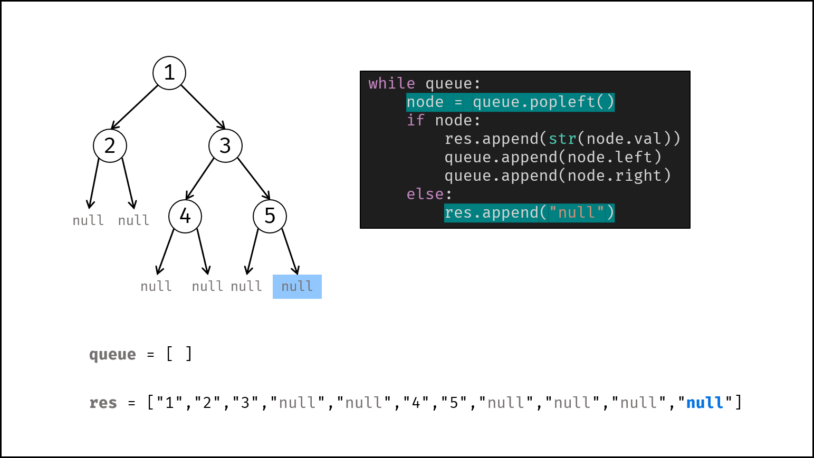

> 原文链接: https://leetcode-cn.com/problems/xu-lie-hua-er-cha-shu-lcof


## 中文题目
<div><p>请实现两个函数，分别用来序列化和反序列化二叉树。</p>

<p>你需要设计一个算法来实现二叉树的序列化与反序列化。这里不限定你的序列 / 反序列化算法执行逻辑，你只需要保证一个二叉树可以被序列化为一个字符串并且将这个字符串反序列化为原始的树结构。</p>

<p><strong>提示：</strong>输入输出格式与 LeetCode 目前使用的方式一致，详情请参阅&nbsp;<a href="https://support.leetcode-cn.com/hc/kb/article/1194353/">LeetCode 序列化二叉树的格式</a>。你并非必须采取这种方式，你也可以采用其他的方法解决这个问题。</p>

<p>&nbsp;</p>

<p><strong>示例：</strong></p>

<pre>
<strong>输入：</strong>root = [1,2,3,null,null,4,5]
<strong>输出：</strong>[1,2,3,null,null,4,5]
</pre>

<p>&nbsp;</p>

<p>注意：本题与主站 297 题相同：<a href="https://leetcode-cn.com/problems/serialize-and-deserialize-binary-tree/">https://leetcode-cn.com/problems/serialize-and-deserialize-binary-tree/</a></p>
</div>

## 通过代码
<RecoDemo>
</RecoDemo>


## 高赞题解
### 解题思路：
通常使用的前序、中序、后序、层序遍历记录的二叉树的信息不完整，即唯一的输出序列可能对应着多种二叉树可能性。题目要求的 序列化 和 反序列化 是 **可逆操作** 。因此，序列化的字符串应携带 **完整的二叉树信息** 。

> 观察题目示例，序列化的字符串实际上是二叉树的 “层序遍历”（BFS）结果，本文也采用层序遍历。

为完整表示二叉树，考虑将叶节点下的 `null` 也记录。在此基础上，对于列表中任意某节点 `node` ，其左子节点 `node.left` 和右子节点 `node.right` 在序列中的位置都是 **唯一确定** 的。如下图所示：

{:width=550}

上图规律可总结为下表：

| `node.val`      | `node` 的索引  | `node.left` 的索引  | `node.right` 的索引  |
| :-------------: | :---------------: | :--------------------: | :---------------------: |
| $1$             |        $0$        |          $1$           |           $2$           |
| $2$             |        $1$        |          $3$           |           $4$           |
| $3$             |        $2$        |          $5$           |           $6$           |
| $4$             |        $5$        |          $7$           |           $8$           |
| $5$             |        $6$        |          $9$           |          $10$           |

设 $m$ 为列表区间 $[0, n]$ 中的 `null` 节点个数，则可总结出根节点、左子节点、右子节点的列表索引的递推公式：

| `node.val`       | `node` 的列表索引 | `node.left` 的列表索引 | `node.right` 的列表索引 |
| :--------------: | :---------------: | :--------------------: | :---------------------: |
| $\ne$ `null`       |        $n$        |      $2(n-m) + 1$      |      $2(n-m) + 2$       |
| $=$ `null`         |        $n$        |           无           |            无           |

**序列化** 使用层序遍历实现。**反序列化** 通过以上递推公式反推各节点在序列中的索引，进而实现。

#### 序列化 Serialize ：

借助队列，对二叉树做层序遍历，并将越过叶节点的 `null` 也打印出来。

##### 算法流程：

1. **特例处理：** 若 `root` 为空，则直接返回空列表 `"[]"` ；
2. **初始化：** 队列 `queue` （包含根节点 `root` ）；序列化列表 `res` ；
3. **层序遍历：** 当 `queue` 为空时跳出；
   1. 节点出队，记为 `node` ；
   2. 若 `node` 不为空：① 打印字符串 `node.val` ，② 将左、右子节点加入 `queue` ；
   3. 否则（若 `node` 为空）：打印字符串 `"null"` ；
4. **返回值：** 拼接列表，用 `','` 隔开，首尾添加中括号；

##### 复杂度分析：

- **时间复杂度 $O(N)$ ：** $N$ 为二叉树的节点数，层序遍历需要访问所有节点，最差情况下需要访问 $N + 1$ 个 `null` ，总体复杂度为 $O(2N + 1) = O(N)$ 。
- **空间复杂度 $O(N)$ ：** 最差情况下，队列 `queue` 同时存储 $\frac{N + 1}{2}$ 个节点（或 $N+1$ 个 `null` ），使用 $O(N)$ ；列表 `res` 使用 $O(N)$ 。

<,,,,,,,,,,,,>

#### 反序列化 Deserialize ：

基于本文开始推出的 `node` , `node.left` , `node.right` 在序列化列表中的位置关系，可实现反序列化。

利用队列按层构建二叉树，借助一个指针 `i` 指向节点 `node` 的左、右子节点，每构建一个 `node` 的左、右子节点，指针 `i` 就向右移动 $1$ 位。

##### 算法流程：

1. **特例处理：** 若 `data` 为空，直接返回 `null` ；
2. **初始化：** 序列化列表 `vals` （先去掉首尾中括号，再用逗号隔开），指针 `i = 1` ，根节点 `root` （值为 `vals[0]` ），队列 `queue`（包含 `root` ）；
3. **按层构建：** 当 `queue` 为空时跳出；
   1. 节点出队，记为 `node` ；
   2. 构建 `node` 的左子节点：`node.left` 的值为 `vals[i]` ，并将 `node.left` 入队；
   3. 执行 `i += 1` ；
   4. 构建 `node` 的右子节点：`node.left` 的值为 `vals[i]` ，并将 `node.left` 入队；
   5. 执行 `i += 1` ；
4. **返回值：** 返回根节点 `root` 即可；

##### 复杂度分析：

- **时间复杂度 $O(N)$ ：** $N$ 为二叉树的节点数，按层构建二叉树需要遍历整个 $vals$ ，其长度最大为 $2N+1$ 。
- **空间复杂度 $O(N)$ ：** 最差情况下，队列 `queue` 同时存储 $\frac{N + 1}{2}$ 个节点，因此使用 $O(N)$ 额外空间。

<,,,,,,,,,,,,,,,,>

#### 代码：

```Python []
class Codec:
    def serialize(self, root):
        if not root: return "[]"
        queue = collections.deque()
        queue.append(root)
        res = []
        while queue:
            node = queue.popleft()
            if node:
                res.append(str(node.val))
                queue.append(node.left)
                queue.append(node.right)
            else: res.append("null")
        return '[' + ','.join(res) + ']'

    def deserialize(self, data):
        if data == "[]": return
        vals, i = data[1:-1].split(','), 1
        root = TreeNode(int(vals[0]))
        queue = collections.deque()
        queue.append(root)
        while queue:
            node = queue.popleft()
            if vals[i] != "null":
                node.left = TreeNode(int(vals[i]))
                queue.append(node.left)
            i += 1
            if vals[i] != "null":
                node.right = TreeNode(int(vals[i]))
                queue.append(node.right)
            i += 1
        return root
```

```Java []
public class Codec {
    public String serialize(TreeNode root) {
        if(root == null) return "[]";
        StringBuilder res = new StringBuilder("[");
        Queue<TreeNode> queue = new LinkedList<>() {{ add(root); }};
        while(!queue.isEmpty()) {
            TreeNode node = queue.poll();
            if(node != null) {
                res.append(node.val + ",");
                queue.add(node.left);
                queue.add(node.right);
            }
            else res.append("null,");
        }
        res.deleteCharAt(res.length() - 1);
        res.append("]");
        return res.toString();
    }

    public TreeNode deserialize(String data) {
        if(data.equals("[]")) return null;
        String[] vals = data.substring(1, data.length() - 1).split(",");
        TreeNode root = new TreeNode(Integer.parseInt(vals[0]));
        Queue<TreeNode> queue = new LinkedList<>() {{ add(root); }};
        int i = 1;
        while(!queue.isEmpty()) {
            TreeNode node = queue.poll();
            if(!vals[i].equals("null")) {
                node.left = new TreeNode(Integer.parseInt(vals[i]));
                queue.add(node.left);
            }
            i++;
            if(!vals[i].equals("null")) {
                node.right = new TreeNode(Integer.parseInt(vals[i]));
                queue.add(node.right);
            }
            i++;
        }
        return root;
    }
}
```

## 统计信息
| 通过次数 | 提交次数 | AC比率 |
| :------: | :------: | :------: |
|    82047    |    145946    |   56.2%   |

## 提交历史
| 提交时间 | 提交结果 | 执行时间 |  内存消耗  | 语言 |
| :------: | :------: | :------: | :--------: | :--------: |
