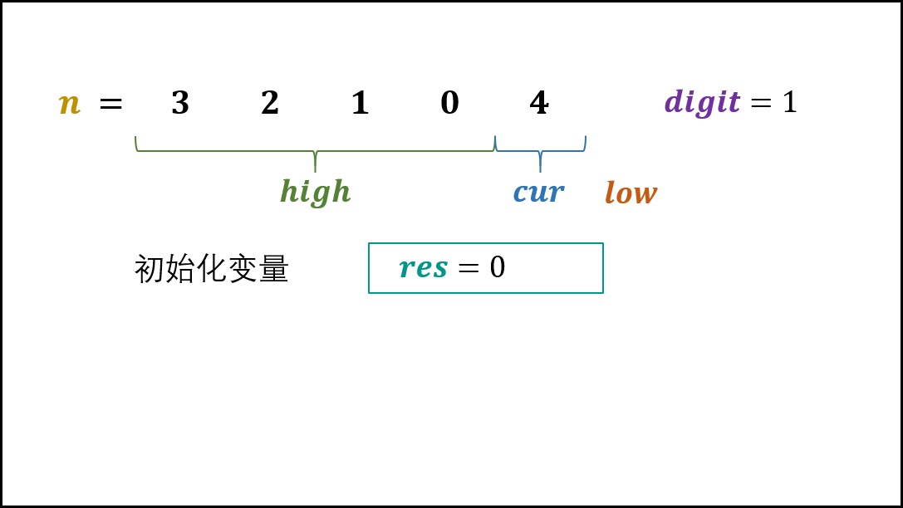
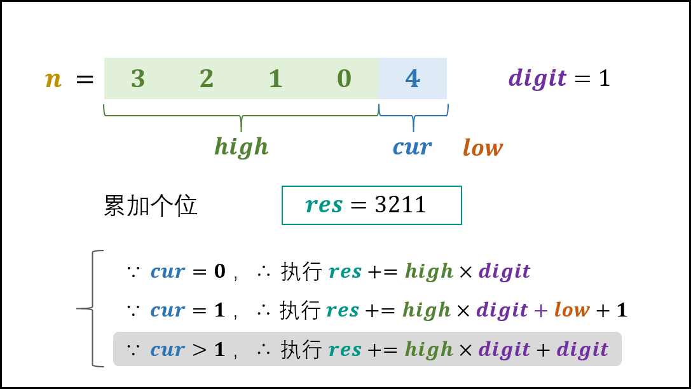
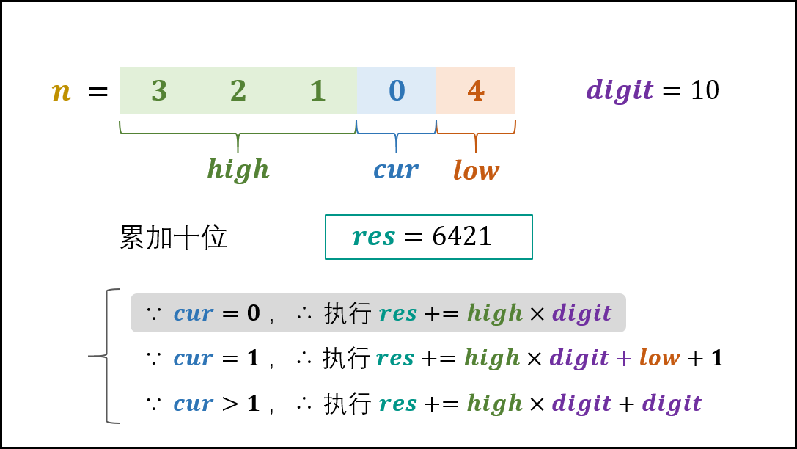
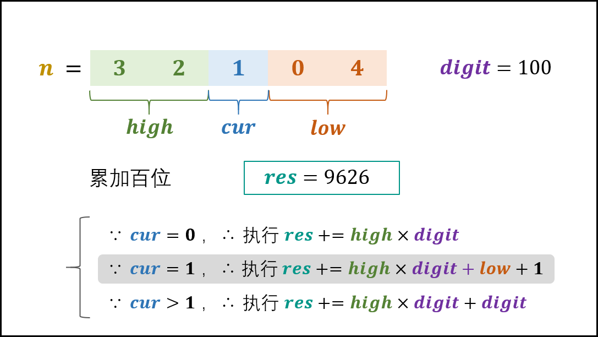
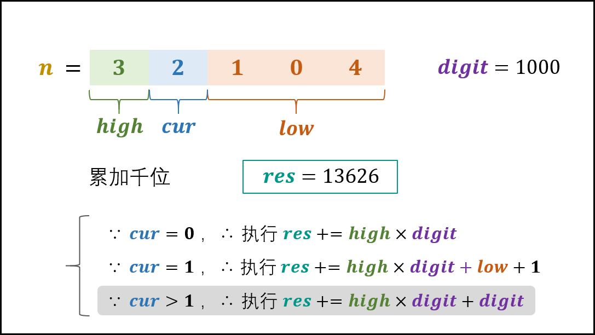
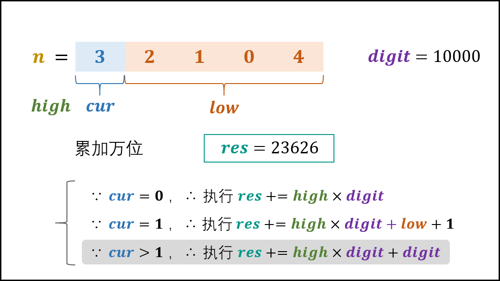
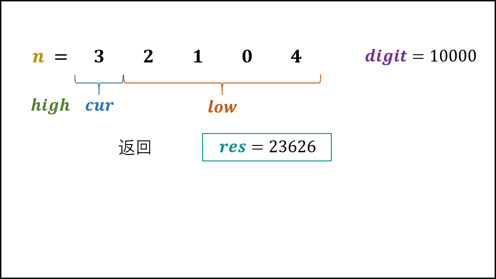

> 原文链接: https://leetcode-cn.com/problems/1nzheng-shu-zhong-1chu-xian-de-ci-shu-lcof


## 中文题目
<div><p>输入一个整数 <code>n</code> ，求1～n这n个整数的十进制表示中1出现的次数。</p>

<p>例如，输入12，1～12这些整数中包含1 的数字有1、10、11和12，1一共出现了5次。</p>

<p> </p>

<p><strong>示例 1：</strong></p>

<pre>
<strong>输入：</strong>n = 12
<strong>输出：</strong>5
</pre>

<p><strong>示例 2：</strong></p>

<pre>
<strong>输入：</strong>n = 13
<strong>输出：</strong>6</pre>

<p> </p>

<p><strong>限制：</strong></p>

<ul>
	<li><code>1 <= n < 2^31</code></li>
</ul>

<p>注意：本题与主站 233 题相同：<a href="https://leetcode-cn.com/problems/number-of-digit-one/">https://leetcode-cn.com/problems/number-of-digit-one/</a></p>
</div>

## 通过代码
<RecoDemo>
</RecoDemo>


## 高赞题解
#### 解题思路：

将 $1$ ~ $n$ 的个位、十位、百位、...的 $1$ 出现次数相加，即为 $1$ 出现的总次数。

设数字 $n$ 是个 $x$ 位数，记 $n$ 的第 $i$ 位为 $n_i$ ，则可将 $n$ 写为 $n_{x} n_{x-1} \cdots n_{2} n_{1}$ ：

- 称 " $n_i$ " 为 **当前位** ，记为 $cur$ ，
- 将 " $n_{i-1} n_{i-2} \cdots n_{2} n_{1}$ " 称为 **低位** ，记为 $low$ ；
- 将 " $n_{x} n_{x-1} \cdots n_{i+2} n_{i+1}$ " 称为 **高位** ，记为 $high$ 。
- 将 $10^i$ 称为 **位因子** ，记为 $digit$ 。

##### 某位中 $1$ 出现次数的计算方法：

根据当前位 $cur$ 值的不同，分为以下三种情况：

1. 当 **$cur = 0$ 时：** 此位 $1$ 的出现次数只由高位 $high$ 决定，计算公式为：

$$
high \times digit
$$

> 如下图所示，以 $n = 2304$ 为例，求 $digit = 10$ （即十位）的 $1$ 出现次数。

{:width=400}

2. 当 **$cur = 1$ 时：** 此位 $1$ 的出现次数由高位 $high$ 和低位 $low$ 决定，计算公式为：

$$
high \times digit + low + 1
$$

> 如下图所示，以 $n = 2314$ 为例，求 $digit = 10$ （即十位）的 $1$ 出现次数。

{:width=400}

3. 当 **$cur = 2, 3, \cdots, 9$ 时：** 此位 $1$ 的出现次数只由高位 $high$ 决定，计算公式为：

$$
(high + 1) \times digit
$$

> 如下图所示，以 $n = 2324$ 为例，求 $digit = 10$ （即十位）的 $1$ 出现次数。

{:width=400}

##### 变量递推公式：

设计按照 “个位、十位、...” 的顺序计算，则 $high / cur / low / digit$ 应初始化为：

```python
high = n // 10
cur = n % 10
low = 0
digit = 1 # 个位
```

因此，从个位到最高位的变量递推公式为：

```python
while high != 0 or cur != 0: # 当 high 和 cur 同时为 0 时，说明已经越过最高位，因此跳出
   low += cur * digit # 将 cur 加入 low ，组成下轮 low
   cur = high % 10 # 下轮 cur 是本轮 high 的最低位
   high //= 10 # 将本轮 high 最低位删除，得到下轮 high
   digit *= 10 # 位因子每轮 × 10
```

##### 复杂度分析：

- **时间复杂度 $O(\log n)$ ：** 循环内的计算操作使用 $O(1)$ 时间；循环次数为数字 $n$ 的位数，即 $\log_{10}{n}$ ，因此循环使用 $O(\log n)$ 时间。
- **空间复杂度 $O(1)$ ：** 几个变量使用常数大小的额外空间。

<,,,,,,>

##### 代码：

```python []
class Solution:
    def countDigitOne(self, n: int) -> int:
        digit, res = 1, 0
        high, cur, low = n // 10, n % 10, 0
        while high != 0 or cur != 0:
            if cur == 0: res += high * digit
            elif cur == 1: res += high * digit + low + 1
            else: res += (high + 1) * digit
            low += cur * digit
            cur = high % 10
            high //= 10
            digit *= 10
        return res
```

```java []
class Solution {
    public int countDigitOne(int n) {
        int digit = 1, res = 0;
        int high = n / 10, cur = n % 10, low = 0;
        while(high != 0 || cur != 0) {
            if(cur == 0) res += high * digit;
            else if(cur == 1) res += high * digit + low + 1;
            else res += (high + 1) * digit;
            low += cur * digit;
            cur = high % 10;
            high /= 10;
            digit *= 10;
        }
        return res;
    }
}
```

## 统计信息
| 通过次数 | 提交次数 | AC比率 |
| :------: | :------: | :------: |
|    52093    |    106637    |   48.9%   |

## 提交历史
| 提交时间 | 提交结果 | 执行时间 |  内存消耗  | 语言 |
| :------: | :------: | :------: | :--------: | :--------: |
